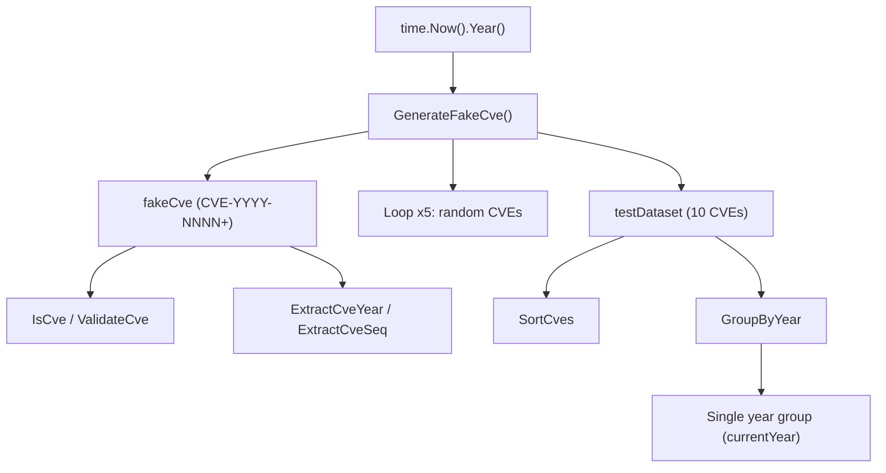

# Example: GenerateFakeCve

:::tip 📂 View Source
[`examples/18_generate_fake_cve/main.go`](https://github.com/scagogogo/cve-skills/blob/main/examples/18_generate_fake_cve/main.go) — open the full runnable example on GitHub.
:::

Produce random, format-valid CVE identifiers on demand with `cve.GenerateFakeCve`. The generated value carries the current year and a random sequence number, making it ideal for fixtures, unit tests, and demo datasets.

:::tip 🎯 Learning objectives
- Understand what `cve.GenerateFakeCve` returns and why the year always matches the current year
- Verify a generated CVE with `IsCve`, `ValidateCve`, `ExtractCveYear`, and `ExtractCveSeq`
- Build a random test dataset and apply `SortCves` and `GroupByYear` to it
:::

## Scenario

A developer is writing unit tests for a vulnerability dashboard and needs realistic-looking CVE identifiers that are guaranteed to be syntactically valid but do not collide with real advisories. Hand-crafting CVEs is error-prone, and reusing real IDs can trigger false positives in upstream correlation engines. `cve.GenerateFakeCve` solves this by returning a fresh `CVE-<currentYear>-<randomSeq>` on every call, which passes format and validation checks while staying clearly synthetic.

## Full code

```go
package main

import (
	"fmt"
	"time"

	"github.com/scagogogo/cve-skills"
)

func main() {
	fmt.Println("生成随机CVE编号示例")

	// 获取当前年份
	currentYear := time.Now().Year()
	fmt.Printf("当前年份: %d\n\n", currentYear)

	// 生成一个随机CVE
	fakeCve := cve.GenerateFakeCve()
	fmt.Printf("生成的随机CVE: %s\n", fakeCve)

	// 验证生成的CVE
	fmt.Printf("验证生成的CVE:\n")
	fmt.Printf("- 是否符合CVE格式: %v\n", cve.IsCve(fakeCve))
	fmt.Printf("- 是否有效的CVE: %v\n", cve.ValidateCve(fakeCve))

	// 提取并检查年份和序列号
	year := cve.ExtractCveYear(fakeCve)
	seq := cve.ExtractCveSeq(fakeCve)

	fmt.Printf("- 年份: %s (应该是当前年份 %d)\n", year, currentYear)
	fmt.Printf("- 序列号: %s (应该是一个5位以上的随机数)\n\n", seq)

	// 生成多个随机CVE以展示随机性
	fmt.Println("生成多个随机CVE:")

	count := 5
	for i := 0; i < count; i++ {
		id := cve.GenerateFakeCve()
		fmt.Printf("[%d] %s\n", i+1, id)
	}

	// 应用场景示例
	fmt.Println("\n应用场景示例 - 使用随机CVE进行测试:")
	fmt.Println("1. 创建测试数据集:")

	testDataset := make([]string, 10)
	for i := range testDataset {
		testDataset[i] = cve.GenerateFakeCve()
	}

	for i, id := range testDataset {
		fmt.Printf("  [%d] %s\n", i+1, id)
	}

	fmt.Println("\n2. 对测试数据集执行排序操作:")
	sortedData := cve.SortCves(testDataset)

	for i, id := range sortedData {
		fmt.Printf("  [%d] %s\n", i+1, id)
	}

	fmt.Println("\n3. 按年份分组 (所有CVE应该在同一组):")
	groupedData := cve.GroupByYear(testDataset)

	for year, ids := range groupedData {
		fmt.Printf("  %s年的CVE (%d个): %v\n", year, len(ids), ids)
	}
}
```

## How to run

```bash
cd examples/18_generate_fake_cve && go run main.go
```

## Expected output

The year reflects the current year and the sequence numbers are randomly generated, so the exact values differ on every run. The structure below is representative.

```text
生成随机CVE编号示例
当前年份: 2026

生成的随机CVE: CVE-2026-12345
验证生成的CVE:
- 是否符合CVE格式: true
- 是否有效的CVE: true
- 年份: 2026 (应该是当前年份 2026)
- 序列号: 12345 (应该是一个5位以上的随机数)

生成多个随机CVE:
[1] CVE-2026-67890
[2] CVE-2026-23456
[3] CVE-2026-98765
[4] CVE-2026-34567
[5] CVE-2026-76543

应用场景示例 - 使用随机CVE进行测试:
1. 创建测试数据集:
  [1] CVE-2026-11111
  [2] CVE-2026-22222
  [3] CVE-2026-33333
  [4] CVE-2026-44444
  [5] CVE-2026-55555
  [6] CVE-2026-66666
  [7] CVE-2026-77777
  [8] CVE-2026-88888
  [9] CVE-2026-99999
  [10] CVE-2026-10101

2. 对测试数据集执行排序操作:
  [1] CVE-2026-10101
  [2] CVE-2026-11111
  [3] CVE-2026-22222
  [4] CVE-2026-33333
  [5] CVE-2026-44444
  [6] CVE-2026-55555
  [7] CVE-2026-66666
  [8] CVE-2026-77777
  [9] CVE-2026-88888
  [10] CVE-2026-99999

3. 按年份分组 (所有CVE应该在同一组):
  2026年的CVE (10个): [CVE-2026-11111 CVE-2026-22222 CVE-2026-33333 CVE-2026-44444 CVE-2026-55555 CVE-2026-66666 CVE-2026-77777 CVE-2026-88888 CVE-2026-99999 CVE-2026-10101]
```

## Code walkthrough

The example opens by printing a title and reading the current year with `time.Now().Year()`. This `currentYear` value is used later as the expected year when verifying the generated CVE.

- 📋 **Generate one fake CVE** — `cve.GenerateFakeCve()` returns a string of the form `CVE-<currentYear>-<randomSeq>`. The year segment always tracks the real current year, while the sequence segment is randomized.
- ▶️ **Verify the result** — `cve.IsCve(fakeCve)` checks the raw `CVE-YYYY-NNNN+` format, and `cve.ValidateCve(fakeCve)` applies the stricter validity rules. Both return `true` for a generated value.
- 💡 **Extract year and sequence** — `cve.ExtractCveYear(fakeCve)` and `cve.ExtractCveSeq(fakeCve)` pull the two segments back out, confirming that the year matches `currentYear` and that the sequence is a five-or-more-digit random number.
- 🔗 **Demonstrate randomness** — a loop calls `GenerateFakeCve` five times so the reader can see that each call yields a different sequence number.
- 📋 **Build a test dataset** — a 10-element slice is filled with freshly generated CVEs, then printed.
- ▶️ **Sort and group** — `cve.SortCves(testDataset)` reorders the slice by year and then by sequence, and `cve.GroupByYear(testDataset)` buckets the entries by year. Because every generated CVE shares the current year, `GroupByYear` produces a single group containing all ten items.



## Related functions

- [GenerateFakeCve](/api/functions/generate-fake-cve) — the function used in this example
- [GenerateCve](/api/functions/generate-cve) — generate a CVE for an explicit year and sequence
- [IsCve](/api/functions/is-cve) — check the raw CVE format
- [ValidateCve](/api/functions/validate-cve) — apply stricter validity rules
- [ExtractCveYear](/api/functions/extract-cve-year) — extract the year segment as a string
- [ExtractCveSeq](/api/functions/extract-cve-seq) — extract the sequence segment as a string
- [SortCves](/api/functions/sort-cves) — sort CVEs by year and sequence
- [GroupByYear](/api/functions/group-by-year) — bucket CVEs by year

## Extensions

- 🎯 Generate 100 fake CVEs and use `RemoveDuplicateCves` to confirm whether any collisions occur.
- 🎯 Mix fake CVEs from the current year with a few hand-written historical CVEs, then sort and group to see how `GroupByYear` separates the years.
- 🎯 Use `GenerateCve` with an explicit past year to build a fixture that does not depend on the system clock, then validate it with `ValidateCve`.
