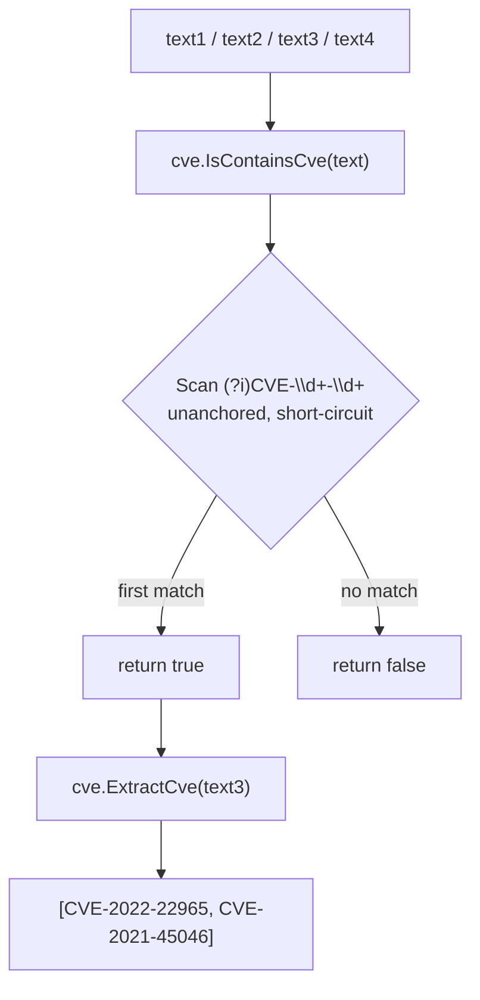

# Example: IsContainsCve (report)

:::tip 📂 View Source
[`examples/19_is_contains_cve/main.go`](https://github.com/scagogogo/cve-skills/blob/main/examples/19_is_contains_cve/main.go) — open the full runnable example on GitHub.
:::

Quickly decide whether a free-form text contains at least one CVE identifier with `cve.IsContainsCve`. It scans the whole string with a case-insensitive regex and returns a boolean, making it ideal for pre-filtering reports, logs, and advisories before running the heavier `ExtractCve` extraction.

:::tip 🎯 Learning objectives
- Understand what `cve.IsContainsCve` returns and why it detects CVEs embedded anywhere in prose
- Verify case-insensitive and non-standard formats such as `cve-2022-1234` and `CVE2023-5678`
- Contrast `IsContainsCve` (presence only) with `ExtractCve` (returns the matched CVE slice)
:::

## Scenario

A security analyst receives a stream of advisory emails, threat-intel reports, and changelogs. Most of them do not mention any CVE at all, and running the full extraction pipeline on every document is wasteful. The analyst needs a cheap pre-filter: a function that answers "does this text mention any CVE?" in a single boolean. `cve.IsContainsCve` does exactly that — it scans the text with a pre-compiled regex and short-circuits on the first match, so the analyst only invokes `cve.ExtractCve` when there is something worth extracting.

## Full code

```go
package main

import (
	"fmt"

	"github.com/scagogogo/cve-skills"
)

func main() {
	fmt.Println("检测文本中是否包含CVE示例")
	// 预期输出:
	// 检测文本中是否包含CVE示例

	// 包含CVE的文本示例
	text1 := "这是一个包含CVE-2021-44228漏洞的文本。"
	fmt.Printf("文本1: %s\n", text1)
	containsCve1 := cve.IsContainsCve(text1)
	fmt.Printf("检测结果: %v\n", containsCve1)
	// 预期输出:
	// 文本1: 这是一个包含CVE-2021-44228漏洞的文本。
	// 检测结果: true

	// 不包含CVE的文本示例
	text2 := "这是一个不包含任何CVE编号的普通文本。"
	fmt.Printf("\n文本2: %s\n", text2)
	containsCve2 := cve.IsContainsCve(text2)
	fmt.Printf("检测结果: %v\n", containsCve2)
	// 预期输出:
	// 文本2: 这是一个不包含任何CVE编号的普通文本。
	// 检测结果: false

	// 包含多个CVE的文本示例
	text3 := "这个文本包含多个CVE：CVE-2022-22965和CVE-2021-45046。"
	fmt.Printf("\n文本3: %s\n", text3)
	containsCve3 := cve.IsContainsCve(text3)
	fmt.Printf("检测结果: %v\n", containsCve3)
	// 预期输出:
	// 文本3: 这个文本包含多个CVE：CVE-2022-22965和CVE-2021-45046。
	// 检测结果: true

	// 包含不规范CVE格式的文本示例
	text4 := "这个文本包含不规范格式的cve-2022-1234和CVE2023-5678。"
	fmt.Printf("\n文本4: %s\n", text4)
	containsCve4 := cve.IsContainsCve(text4)
	fmt.Printf("检测结果: %v\n", containsCve4)
	// 预期输出:
	// 文本4: 这个文本包含不规范格式的cve-2022-1234和CVE2023-5678。
	// 检测结果: true

	// 提取文本中的所有CVE
	fmt.Printf("\n提取文本3中的所有CVE:\n")
	cves := cve.ExtractCve(text3)
	for i, id := range cves {
		fmt.Printf("[%d] %s\n", i+1, id)
	}
	// 预期输出:
	// 提取文本3中的所有CVE:
	// [1] CVE-2022-22965
	// [2] CVE-2021-45046

	// 应用场景示例
	fmt.Println("\n应用场景示例:")
	fmt.Println("1. 安全公告分析：自动扫描安全公告中提到的CVE")
	fmt.Println("2. 漏洞跟踪：从各种文档中提取CVE进行追踪管理")
	fmt.Println("3. 威胁情报分析：检测威胁情报报告中的CVE编号")
	// 预期输出:
	// 应用场景示例:
	// 1. 安全公告分析：自动扫描安全公告中提到的CVE
	// 2. 漏洞跟踪：从各种文档中提取CVE进行追踪管理
	// 3. 威胁情报分析：检测威胁情报报告中的CVE编号

	// 与ExtractCve的区别
	fmt.Println("\n与ExtractCve的区别:")
	fmt.Println("1. IsContainsCve - 仅检测是否存在，返回布尔值")
	fmt.Println("2. ExtractCve - 提取所有CVE并返回标准格式的CVE切片")
	// 预期输出:
	// 与ExtractCve的区别:
	// 1. IsContainsCve - 仅检测是否存在，返回布尔值
	// 2. ExtractCve - 提取所有CVE并返回标准格式的CVE切片
}
```

## How to run

```bash
cd examples/19_is_contains_cve && go run main.go
```

## Expected output

```text
检测文本中是否包含CVE示例
文本1: 这是一个包含CVE-2021-44228漏洞的文本。
检测结果: true

文本2: 这是一个不包含任何CVE编号的普通文本。
检测结果: false

文本3: 这个文本包含多个CVE：CVE-2022-22965和CVE-2021-45046。
检测结果: true

文本4: 这个文本包含不规范格式的cve-2022-1234和CVE2023-5678。
检测结果: true

提取文本3中的所有CVE:
[1] CVE-2022-22965
[2] CVE-2021-45046

应用场景示例:
1. 安全公告分析：自动扫描安全公告中提到的CVE
2. 漏洞跟踪：从各种文档中提取CVE进行追踪管理
3. 威胁情报分析：检测威胁情报报告中的CVE编号

与ExtractCve的区别:
1. IsContainsCve - 仅检测是否存在，返回布尔值
2. ExtractCve - 提取所有CVE并返回标准格式的CVE切片
```

## Code walkthrough

The example opens by printing a title, then walks through four text samples that exercise the detector from different angles.

- 📋 **Text 1 — embedded CVE** — `text1` contains `CVE-2021-44228` inside surrounding Chinese prose. `cve.IsContainsCve(text1)` returns `true` because the regex is unanchored and scans the whole string.
- ▶️ **Text 2 — no CVE** — `text2` mentions the word "CVE" but never forms a `CVE-YYYY-NNNN` identifier. The pattern requires digits after both the year and the dash, so the result is `false`.
- 💡 **Text 3 — multiple CVEs** — `text3` mentions two CVEs (`CVE-2022-22965` and `CVE-2021-45046`). `IsContainsCve` still returns a single `true`; it short-circuits on the first match and does not count occurrences.
- 🔗 **Text 4 — non-standard formats** — `text4` uses lowercase `cve-2022-1234` and the missing-dash form `CVE2023-5678`. Both are detected (`true`), confirming the case-insensitive and lenient matching behavior.
- 📋 **Extract the CVEs** — `cve.ExtractCve(text3)` returns the two canonical CVE strings from `text3`, printed with a 1-based index. This is the natural follow-up once `IsContainsCve` confirms presence.
- ▶️ **Use cases and contrast** — the closing `fmt.Println` blocks summarize three real-world scenarios (advisory analysis, vulnerability tracking, threat-intel) and contrast `IsContainsCve` (boolean presence) with `ExtractCve` (returns the matched slice).



## Related functions

- [IsContainsCve](/api/functions/is-contains-cve) — the function used in this example
- [ExtractCve](/api/functions/extract-cve) — extract all CVEs from text as a canonical slice
- [IsCve](/api/functions/is-cve) — require the entire string to be a single CVE
- [ExtractFirstCve](/api/functions/extract-first-cve) — extract the first CVE from text
- [ExtractLastCve](/api/functions/extract-last-cve) — extract the last CVE from text
- [ValidateCve](/api/functions/validate-cve) — full validation (format + year range + positive sequence)

## Extensions

- 🎯 Build a pre-filter pipeline: call `IsContainsCve` on a list of documents and only run `ExtractCve` on those that return `true`, then compare the total cost against extracting every document.
- 🎯 Feed `text4` into `ExtractCve` and inspect whether the lowercase and missing-dash matches are normalized to the canonical `CVE-YYYY-NNNN` form.
- 🎯 Combine `IsContainsCve` with `ValidateCve`: detect a CVE in a report, extract it, and validate the year range and sequence to separate realistic IDs from malformed matches.
