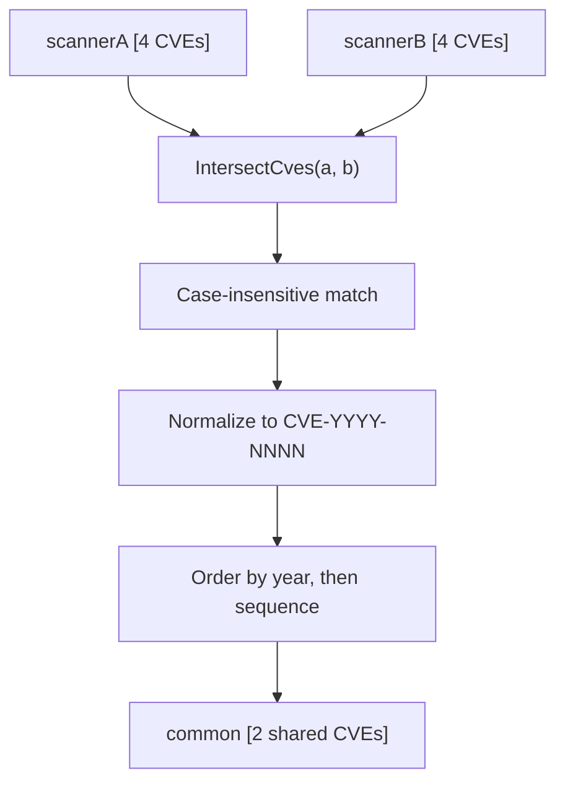

# Example: IntersectCves

:::tip 📂 View Source
[`examples/20_intersect_cves/main.go`](https://github.com/scagogogo/cve-skills/blob/main/examples/20_intersect_cves/main.go) — open the full runnable example on GitHub.
:::

Compute the CVE identifiers that two scanners both found with `cve.IntersectCves`. Comparison is case-insensitive, and the returned identifiers are normalized to the canonical `CVE-YYYY-NNNN` form and ordered by year then sequence.

:::tip 🎯 Learning objectives
- Understand the signature and behavior of `cve.IntersectCves`
- See how mixed-case identifiers are matched and returned in canonical form
- Build a "common findings" view across two vulnerability scans
:::

## Scenario

A security operations center runs two independent scanners against the same asset. Each produces a list of CVE identifiers, and the team needs the shortest path to the vulnerabilities both tools agree on — those are the highest-confidence items to remediate first. The two lists use inconsistent casing (`cve-`, `Cve-`, `CVE-`), so a naive string comparison would miss matches. `cve.IntersectCves` compares case-insensitively and returns the overlap as a clean, canonical, sorted slice.

## Full code

```go
package main

import (
	"fmt"

	"github.com/scagogogo/cve-skills"
)

func main() {
	fmt.Println("=== CVE 交集运算 (Intersection) ===")

	scannerA := []string{"CVE-2022-1111", "CVE-2022-2222", "CVE-2022-3333", "CVE-2022-4444"}
	scannerB := []string{"CVE-2022-2222", "CVE-2022-3333", "CVE-2022-5555", "CVE-2022-6666"}

	fmt.Println("扫描器A发现的CVE:", scannerA)
	fmt.Println("扫描器B发现的CVE:", scannerB)

	common := cve.IntersectCves(scannerA, scannerB)
	fmt.Printf("\n共同发现的CVE (交集): %v\n", common)
	fmt.Printf("共同发现数量: %d\n", len(common))

	fmt.Println("\n--- 大小写不敏感示例 ---")
	list1 := []string{"cve-2022-1111", "CVE-2022-2222", "Cve-2022-3333"}
	list2 := []string{"CVE-2022-1111", "cve-2022-3333", "CVE-2022-4444"}
	fmt.Println("列表1:", list1)
	fmt.Println("列表2:", list2)
	fmt.Printf("交集: %v\n", cve.IntersectCves(list1, list2))

	fmt.Println("\n--- 空列表场景 ---")
	fmt.Printf("空列表交集: %v\n", cve.IntersectCves([]string{}, []string{"CVE-2022-1111"}))
}
```

## How to run

```bash
cd examples/20_intersect_cves && go run main.go
```

## Expected output

```text
=== CVE 交集运算 (Intersection) ===
扫描器A发现的CVE: [CVE-2022-1111 CVE-2022-2222 CVE-2022-3333 CVE-2022-4444]
扫描器B发现的CVE: [CVE-2022-2222 CVE-2022-3333 CVE-2022-5555 CVE-2022-6666]

共同发现的CVE (交集): [CVE-2022-2222 CVE-2022-3333]
共同发现数量: 2

--- 大小写不敏感示例 ---
列表1: [cve-2022-1111 CVE-2022-2222 Cve-2022-3333]
列表2: [CVE-2022-1111 cve-2022-3333 CVE-2022-4444]
交集: [CVE-2022-1111 CVE-2022-3333]

--- 空列表场景 ---
空列表交集: []
```

## Code walkthrough

The example walks through three scenarios: a clean overlap of two scanner outputs, a case-insensitive match, and an empty-input edge case.

- 📋 **Two scanner lists** — `scannerA` and `scannerB` are printed first so the raw inputs are visible. They share `CVE-2022-2222` and `CVE-2022-3333`, while each also carries unique entries the other lacks.
- ▶️ **Compute the overlap** — `cve.IntersectCves(scannerA, scannerB)` returns only the identifiers present in both lists. The result is normalized to `CVE-YYYY-NNNN` and ordered by year then sequence, so `len(common)` is a reliable count of shared findings.
- 💡 **Case-insensitive match** — `list1` and `list2` deliberately mix `cve-`, `Cve-`, and `CVE-` prefixes. `CVE-2022-1111` appears as `cve-2022-1111` in one list and `CVE-2022-1111` in the other, yet it is still matched and returned in canonical form.
- 🔗 **Empty-input safety** — passing an empty slice as the first argument returns an empty result rather than panicking, so the function is safe to call even when a scanner reports nothing.



## Related functions

- [IntersectCves](/api/functions/intersect-cves) — the function used in this example
- [UnionCves](/api/functions/union-cves) — merge two CVE lists into a deduplicated set
- [DiffCves](/api/functions/diff-cves) — return CVEs present in one list but not the other
- [RemoveDuplicateCves](/api/functions/remove-duplicate-cves) — deduplicate a single CVE list
- [SortCves](/api/functions/sort-cves) — order a CVE list by year then sequence

## Extensions

- 🎯 Combine `IntersectCves` with `DiffCves` to split a scan into "both agree" and "only scanner A" buckets for triage.
- 🎯 Feed the intersection into `GroupByYear` to render a year-grouped view of the shared findings.
- 🎯 Add duplicate entries to one list and verify that `IntersectCves` still returns each shared CVE exactly once.
