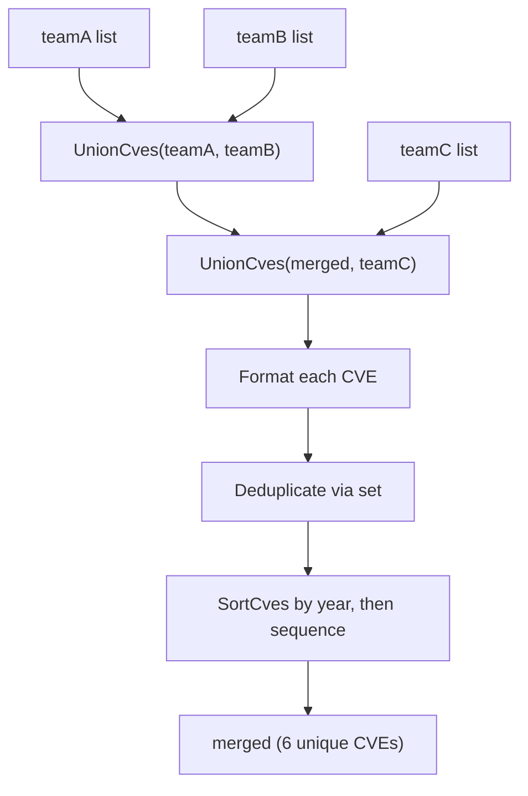

# Example: UnionCves

:::tip 📂 View Source
[`examples/21_union_cves/main.go`](https://github.com/scagogogo/cve-skills/blob/main/examples/21_union_cves/main.go) — open the full runnable example on GitHub.
:::

Merge CVE lists from multiple sources into a single deduplicated, sorted slice with `cve.UnionCves`. Each call normalizes every identifier to the canonical `CVE-YYYY-NNNN` form, so the union is both deduplicated and ordered by year then sequence.

:::tip 🎯 Learning objectives
- Understand the signature and behavior of `cve.UnionCves`
- See how a lowercase prefix and repeated identifiers are normalized away in one pass
- Build a single consolidated vulnerability view from several team feeds
:::

## Scenario

Three security teams each maintain their own CVE list for the same product. Team A, Team B, and Team C have overlapping entries — for example `CVE-2023-1003` appears in both A and B, while `CVE-2023-1004` and `CVE-2023-1005` appear in both B and C. Before publishing a consolidated advisory, the team needs every list merged into one set of unique identifiers, formatted to the canonical form, and sorted chronologically. `UnionCves` does the formatting, deduplication, and sorting in a single call.

## Full code

```go
package main

import (
	"fmt"

	"github.com/scagogogo/cve-skills"
)

func main() {
	fmt.Println("=== CVE 并集运算 (Union) ===")

	teamA := []string{"CVE-2023-1001", "CVE-2023-1002", "CVE-2023-1003"}
	teamB := []string{"CVE-2023-1003", "CVE-2023-1004", "CVE-2023-1005"}
	teamC := []string{"CVE-2023-1004", "CVE-2023-1005", "CVE-2023-1006"}

	fmt.Println("团队A的CVE:", teamA)
	fmt.Println("团队B的CVE:", teamB)
	fmt.Println("团队C的CVE:", teamC)

	merged := cve.UnionCves(teamA, teamB)
	merged = cve.UnionCves(merged, teamC)
	fmt.Printf("\n全部团队的CVE (并集): %v\n", merged)
	fmt.Printf("总唯一CVE数量: %d\n", len(merged))

	fmt.Println("\n--- 去重效果 ---")
	withDups := []string{"CVE-2022-1111", "cve-2022-1111", "CVE-2022-1111", "CVE-2022-2222"}
	unique := cve.UnionCves(withDups, []string{})
	fmt.Printf("原始 (含重复): %v\n", withDups)
	fmt.Printf("并集 (去重后): %v\n", unique)
}
```

## How to run

```bash
cd examples/21_union_cves && go run main.go
```

## Expected output

```text
=== CVE 并集运算 (Union) ===
团队A的CVE: [CVE-2023-1001 CVE-2023-1002 CVE-2023-1003]
团队B的CVE: [CVE-2023-1003 CVE-2023-1004 CVE-2023-1005]
团队C的CVE: [CVE-2023-1004 CVE-2023-1005 CVE-2023-1006]

全部团队的CVE (并集): [CVE-2023-1001 CVE-2023-1002 CVE-2023-1003 CVE-2023-1004 CVE-2023-1005 CVE-2023-1006]
总唯一CVE数量: 6

--- 去重效果 ---
原始 (含重复): [CVE-2022-1111 cve-2022-1111 CVE-2022-1111 CVE-2022-2222]
并集 (去重后): [CVE-2022-1111 CVE-2022-2222]
```

## Code walkthrough

The example starts from three team lists that overlap on purpose, then demonstrates how `UnionCves` collapses duplicates into a canonical, sorted set.

- 📋 **Three team feeds** — `teamA`, `teamB`, and `teamC` are printed first so the raw input is visible. `CVE-2023-1003` is shared by A and B, while `CVE-2023-1004` and `CVE-2023-1005` are shared by B and C.
- ▶️ **Two-step merge** — `cve.UnionCves(teamA, teamB)` produces the union of A and B, then `cve.UnionCves(merged, teamC)` folds in C. Each call formats every identifier, deduplicates via an internal set, and sorts the result with `SortCves`, so the final slice contains six unique identifiers ordered by year then sequence.
- 💡 **Unique count** — `len(merged)` confirms the deduplication: three lists of three (nine entries in total) collapse to six unique CVEs.
- 🔗 **Deduplication demo** — the second block feeds `UnionCves` a list with a lowercase `cve-2022-1111` and two copies of `CVE-2022-1111` against an empty second list. Because `UnionCves` formats every entry before comparing, the lowercase variant is normalized to `CVE-2022-1111` and treated as a duplicate, leaving two unique entries.



## Related functions

- [UnionCves](/api/functions/union-cves) — the function used in this example
- [DiffCves](/api/functions/diff-cves) — return CVEs present in one list but not another
- [IntersectCves](/api/functions/intersect-cves) — return CVEs common to both lists
- [RemoveDuplicateCves](/api/functions/remove-duplicate-cves) — deduplicate a single list without merging
- [SortCves](/api/functions/sort-cves) — order a list by year then sequence, used internally by UnionCves

## Extensions

- 🎯 Replace the second call with a single `UnionCves` over all three lists by chaining, and compare the result with the two-step version.
- 🎯 Mix in an invalid string such as `"CVE-2023-99"` (too few digits) and observe how `UnionCves` formats and places it after normalization.
- 🎯 Pair `UnionCves` with `DiffCves` to find which CVEs appear in `teamC` but are missing from the A∪B union.
