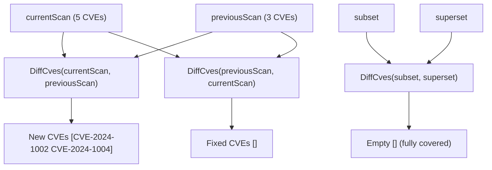

# Example: DiffCves

:::tip 📂 View Source
[`examples/22_diff_cves/main.go`](https://github.com/scagogogo/cve-skills/blob/main/examples/22_diff_cves/main.go) — open the full runnable example on GitHub.
:::

Find which CVEs appear in one scan but not another with `cve.DiffCves`. Given two lists, it returns the identifiers present in the first list and absent from the second, so a forward difference exposes newly surfaced vulnerabilities and a reversed difference exposes the ones that have been fixed.

:::tip 🎯 Learning objectives
- Understand the signature and behavior of `cve.DiffCves`
- Use a forward and a reversed difference to detect newly added and newly fixed CVEs between two scans
- Reason about the empty-result case when one list is fully covered by the other
:::

## Scenario

A security team runs a vulnerability scan every week. This week's scan returned five CVEs, while last week's scan returned three of them. To brief the remediation team, the analyst needs two things: the CVEs that are new this week (present now, absent before), and the CVEs that dropped out (present before, absent now) because they were patched. `DiffCves(current, previous)` yields the new arrivals, and swapping the arguments yields the fixed ones. The example also checks a fully-covered case, where every entry of the first list already exists in the second, so the difference is empty.

## Full code

```go
package main

import (
	"fmt"

	"github.com/scagogogo/cve-skills"
)

func main() {
	fmt.Println("=== CVE Difference (DiffCves) ===")

	currentScan := []string{"CVE-2024-1001", "CVE-2024-1002", "CVE-2024-1003", "CVE-2024-1004", "CVE-2024-1005"}
	previousScan := []string{"CVE-2024-1001", "CVE-2024-1003", "CVE-2024-1005"}

	fmt.Println("Current scan:", currentScan)
	fmt.Println("Previous scan:", previousScan)

	newCves := cve.DiffCves(currentScan, previousScan)
	fmt.Printf("\nNewly surfaced CVEs (difference): %v\n", newCves)
	fmt.Printf("New count: %d\n", len(newCves))

	fixedCves := cve.DiffCves(previousScan, currentScan)
	fmt.Printf("\nFixed CVEs (reversed difference): %v\n", fixedCves)

	fmt.Println("\n--- Fully covered case ---")
	subset := []string{"CVE-2022-1111", "CVE-2022-2222"}
	superset := []string{"CVE-2022-1111", "CVE-2022-2222", "CVE-2022-3333"}
	fmt.Printf("Difference result: %v\n", cve.DiffCves(subset, superset))
}
```

## How to run

```bash
cd examples/22_diff_cves && go run main.go
```

## Expected output

```text
=== CVE Difference (DiffCves) ===
Current scan: [CVE-2024-1001 CVE-2024-1002 CVE-2024-1003 CVE-2024-1004 CVE-2024-1005]
Previous scan: [CVE-2024-1001 CVE-2024-1003 CVE-2024-1005]

Newly surfaced CVEs (difference): [CVE-2024-1002 CVE-2024-1004]
New count: 2

Fixed CVEs (reversed difference): []

--- Fully covered case ---
Difference result: []
```

## Code walkthrough

The example pairs two weekly scans, then proves the empty-result edge case on a fully-covered list.

- 📋 **Two weekly scans** — `currentScan` holds five CVEs and `previousScan` holds three of them (`CVE-2024-1001`, `CVE-2024-1003`, `CVE-2024-1005`). Both are printed so the raw input is visible before differencing.
- ▶️ **Forward difference (new arrivals)** — `cve.DiffCves(currentScan, previousScan)` returns the CVEs present in `currentScan` but absent from `previousScan`, namely `CVE-2024-1002` and `CVE-2024-1004`. `len(newCves)` reports two new entries, the exact set the analyst needs to triage this week.
- 💡 **Reversed difference (fixed)** — swapping the arguments, `cve.DiffCves(previousScan, currentScan)`, returns the CVEs present last week but gone this week. Every previous CVE still appears in the current scan, so the result is an empty slice — nothing was dropped, which means no regressions or silent removals between the two scans.
- 🔗 **Fully covered case** — `subset` (`CVE-2022-1111`, `CVE-2022-2222`) is entirely contained in `superset` (which adds `CVE-2022-3333`). `cve.DiffCves(subset, superset)` therefore yields `[]`, confirming that a difference is empty whenever the first list is a subset of the second.



## Related functions

- [DiffCves](/api/functions/diff-cves) — the function used in this example
- [IntersectCves](/api/functions/intersect-cves) — return CVEs common to both lists
- [UnionCves](/api/functions/union-cves) — merge lists with deduplication and sorting
- [RemoveDuplicateCves](/api/functions/remove-duplicate-cves) — deduplicate a single list
- [SortCves](/api/functions/sort-cves) — order a list by year then sequence

## Extensions

- 🎯 Add a CVE to `previousScan` that is no longer in `currentScan` (for example `CVE-2024-9999`) and confirm it appears in the reversed-difference output.
- 🎯 Feed `DiffCves` a list whose entries are out of order, and observe whether the returned difference preserves a stable order.
- 🎯 Combine `DiffCves` with `IntersectCves` to split `currentScan` into three buckets: new, fixed, and unchanged.
