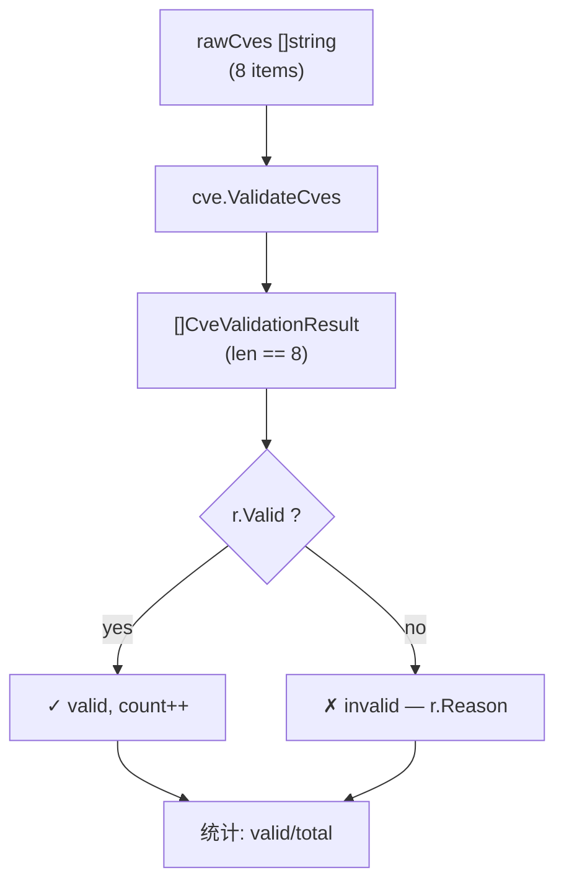

# Example: ValidateCves

:::tip 📂 View Source
[`examples/23_validate_cves/main.go`](https://github.com/scagogogo/cve-skills/blob/main/examples/23_validate_cves/main.go) — open the full runnable example on GitHub.
:::

Validate a whole batch of CVE identifiers in one call and get a per-item reason for every failure.

:::tip 🎯 Learning objectives
- Use `ValidateCves` to check many CVEs at once instead of looping `ValidateCve` yourself.
- Read the `CveValidationResult` struct to drive a valid/invalid report with reasons.
- Recognize the three failure classes the batch validator surfaces: bad format, out-of-range year, and non-positive sequence number.
:::

## Scenario

You are cleaning up a CSV export from an asset-inventory system. The "CVE" column is a free-text field that operators have been filling in for years, and it shows it: a few entries are real CVEs, a few are lowercased, one is a 1998 entry that predates the CVE program, one quotes a year that has not happened yet, one has letters in the sequence slot, and one even came in with leading and trailing whitespace. You need to split this column into "safe to query" and "needs a human to look", and you want the rejected rows to carry a short reason so the operator knows what to fix. `ValidateCves` takes the whole slice in one shot and returns a `[]CveValidationResult` whose `Valid` and `Reason` fields give you exactly that report.

## Complete code

```go
package main

import (
	"fmt"

	"github.com/scagogogo/cve-skills"
)

func main() {
	fmt.Println("=== 批量CVE验证 ===")

	rawCves := []string{
		"CVE-2022-1234",
		"cve-2023-5678",
		"CVE-1998-1234",
		"not-a-cve",
		"CVE-2099-9999",
		"CVE-2022-ABCD",
		"CVE-2022-0",
		" CVE-2024-8888 ",
	}

	fmt.Println("验证以下CVE:")
	results := cve.ValidateCves(rawCves)

	validCount := 0
	for _, r := range results {
		if r.Valid {
			fmt.Printf("  ✓ %-25s 有效\n", r.Cve)
			validCount++
		} else {
			fmt.Printf("  ✗ %-25s 无效 — %s\n", r.Cve, r.Reason)
		}
	}

	fmt.Printf("\n统计: %d/%d 有效\n", validCount, len(rawCves))
}
```

## How to run

```bash
cd examples/23_validate_cves && go run main.go
```

## Expected output

The output depends on the year the program runs. With `currentYear = 2026`:

```text
=== 批量CVE验证 ===
验证以下CVE:
  ✓ CVE-2022-1234             有效
  ✓ cve-2023-5678             有效
  ✗ CVE-1998-1234             无效 — year 1998 is before 1999
  ✗ not-a-cve                 无效 — invalid CVE format
  ✗ CVE-2099-9999             无效 — year 2099 is after current year 2026
  ✗ CVE-2022-ABCD             无效 — invalid CVE format
  ✗ CVE-2022-0                无效 — sequence number must be positive
  ✓  CVE-2024-8888            有效

统计: 3/8 有效
```

## Code walkthrough

The program builds one slice of eight raw strings — a deliberate mix of clean, lowercased, out-of-range, malformed, and whitespace-padded entries — and hands the whole slice to `cve.ValidateCves` in a single call. It then walks the returned `[]CveValidationResult`, branching on `r.Valid`: valid items are printed with a `✓` and counted, invalid items are printed with a `✗` plus `r.Reason`. A final summary line reports `validCount/len(rawCves)`.

- ▶️ **Batch call.** `results := cve.ValidateCves(rawCves)` replaces a hand-rolled `for` loop calling `ValidateCve`. The returned slice is the same length as the input, so `results[i]` corresponds to `rawCves[i]` — there is no reordering and no items are dropped.
- 📋 **Per-item reporting.** Each `CveValidationResult` carries the original `Cve` string, a `Valid` bool, and a `Reason` string that is empty when the item is valid. The `✗` branch prints `r.Reason` so every rejection comes with a concrete cause: bad format, year before 1999, year after the current year, or a sequence number that is not a positive integer.
- 💡 **Reason taxonomy.** The eight inputs cover every failure mode the validator can produce. `CVE-1998-1234` triggers `year 1998 is before 1999`. `not-a-cve` and `CVE-2022-ABCD` both fail the format check with `invalid CVE format`. `CVE-2099-9999` hits the upper bound with `year 2099 is after current year 2026`. `CVE-2022-0` passes format and year but fails the sequence rule with `sequence number must be positive`. The two lowercased and whitespace-padded entries are accepted because the validator normalizes case and trims surrounding whitespace before checking.



## Related functions

- [ValidateCves](/api/functions/validate-cves) — the batch validator demonstrated on this page.
- [ValidateCve](/api/functions/validate-cve) — the single-string validator that `ValidateCves` calls under the hood.
- [FilterValidCves](/api/functions/filter-valid-cves) — convenience wrapper that returns only the valid strings, dropping the reasons.

## Exercises

- 💡 Replace the `rawCves` slice with identifiers read from a CSV file and write a second CSV that keeps only the rejected rows together with their `Reason`.
- 💡 Add a duplicate entry (e.g. `CVE-2022-1234` twice) and confirm that `ValidateCves` validates both independently — deduplication is the caller's responsibility, not the validator's.
- 💡 Compare `ValidateCves` against a loop of `ValidateCve` and a separate loop of `IsCve`, then note which failure reasons only the full validator can surface.
