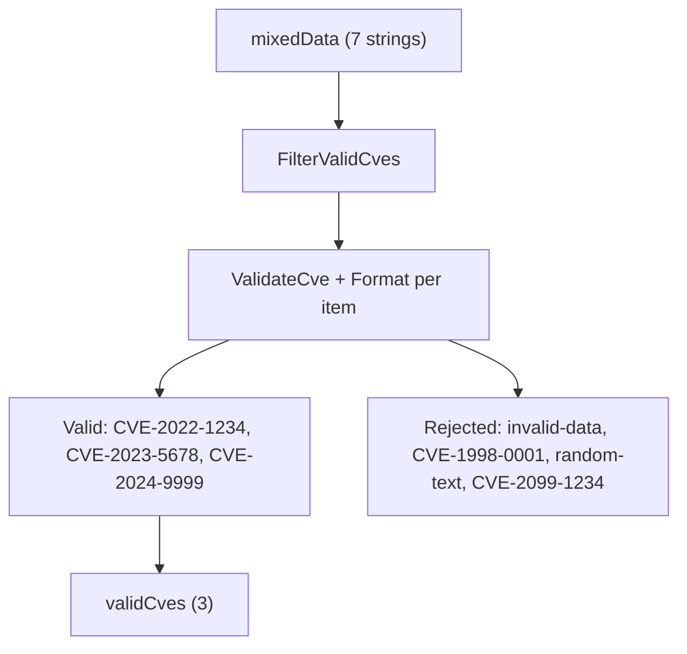

# Example: FilterValidCves

:::tip 📂 View Source
[`examples/24_filter_valid_cves/main.go`](https://github.com/scagogogo/cve-skills/blob/main/examples/24_filter_valid_cves/main.go) — open the full runnable example on GitHub.
:::

Strip a noisy mixed list down to just the genuine CVE identifiers with `cve.FilterValidCves`. This is the simplest one-call way to clean any user-supplied or feed-derived dataset before further processing.

:::tip 🎯 Learning objectives
- Understand the signature and behavior of `cve.FilterValidCves`
- See how format, year range, and sequence number rules work together to reject invalid entries
- Compare bulk filtering (`FilterValidCves`) with per-item checking (`ValidateCve`)
:::

## Scenario

A vulnerability ingestion pipeline receives a raw batch of strings from tickets, spreadsheets, and external feeds. The batch mixes well-formed CVE IDs with junk text, out-of-range years (1998 is too early, 2099 is in the future), and lowercased identifiers. Before persisting the data, the pipeline needs to keep only the identifiers that are genuine CVEs and normalize their casing. `FilterValidCves` walks the slice once, validates each entry, and returns a clean list of uppercased CVE IDs.

## Full code

```go
package main

import (
	"fmt"

	"github.com/scagogogo/cve-skills"
)

func main() {
	fmt.Println("=== 过滤有效CVE ===")

	mixedData := []string{
		"CVE-2022-1234",
		"invalid-data",
		"cve-2023-5678",
		"CVE-1998-0001",
		"CVE-2024-9999",
		"random-text",
		"CVE-2099-1234",
	}

	fmt.Println("混合数据:", mixedData)

	validCves := cve.FilterValidCves(mixedData)
	fmt.Printf("\n有效CVE: %v\n", validCves)
	fmt.Printf("有效数量: %d / %d\n", len(validCves), len(mixedData))

	fmt.Println("\n--- 与 ValidateCve 对比 ---")
	for _, item := range mixedData {
		status := "✗"
		if cve.ValidateCve(item) {
			status = "✓"
		}
		fmt.Printf("  %s %s\n", status, item)
	}
}
```

## How to run

```bash
cd examples/24_filter_valid_cves && go run main.go
```

## Expected output

```text
=== 过滤有效CVE ===
混合数据: [CVE-2022-1234 invalid-data cve-2023-5678 CVE-1998-0001 CVE-2024-9999 random-text CVE-2099-1234]

有效CVE: [CVE-2022-1234 CVE-2023-5678 CVE-2024-9999]
有效数量: 3 / 7

--- 与 ValidateCve 对比 ---
  ✓ CVE-2022-1234
  ✗ invalid-data
  ✓ cve-2023-5678
  ✗ CVE-1998-0001
  ✓ CVE-2024-9999
  ✗ random-text
  ✗ CVE-2099-1234
```

## Code walkthrough

The example builds a `mixedData` slice of seven strings that intentionally exercise every rejection branch of the validator, then filters it and prints a per-item verdict.

- 📋 **Build the noisy input** — `mixedData` mixes valid IDs (`CVE-2022-1234`), junk text (`invalid-data`, `random-text`), a lowercased ID (`cve-2023-5678`), an out-of-range early year (`CVE-1998-0001`, before the 1999 floor), and a future year (`CVE-2099-1234`, past the current year).
- ▶️ **Filter in one call** — `cve.FilterValidCves(mixedData)` iterates the slice, keeps each entry that passes `ValidateCve`, and runs it through `Format`, so `cve-2023-5678` comes back normalized as `CVE-2023-5678`. The result is printed together with the count `3 / 7`.
- 💡 **Why entries are rejected** — `ValidateCve` requires the `CVE-YYYY-NNNNN` shape, a year between `1999` and the current year, and a positive integer sequence. `CVE-1998-0001` fails the year floor, `CVE-2099-1234` fails the year ceiling, and the non-CVE strings fail the format check.
- 🔗 **Compare with `ValidateCve`** — the closing loop calls `cve.ValidateCve(item)` on each original entry and prints `✓` or `✗`, mirroring the filter decision so you can see the two functions agree item by item.



## Related functions

- [FilterValidCves](/api/functions/filter-valid-cves) — the function used in this example
- [ValidateCve](/api/functions/validate-cve) — single-item validation used for the comparison loop
- [IsCve](/api/functions/is-cve) — format-only check that `ValidateCve` builds on
- [Format](/api/functions/format) — normalizes casing and trims whitespace on each kept entry
- [FilterCvesByYear](/api/functions/filter-cves-by-year) — narrow a valid list further by year

## Extensions

- 🎯 Add a duplicate entry such as `"cve-2022-1234"` to `mixedData` and observe whether duplicates survive the filter.
- 🎯 Replace `FilterValidCves` with `ValidateCves` to also get the rejection reason for each invalid item.
- 🎯 Chain `FilterValidCves` with `SortCves` to return a clean, ordered list ready for display.
