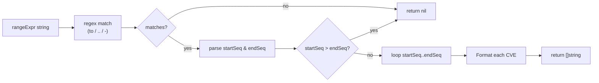

# Example: ParseCveRange

:::tip 📂 View Source
[`examples/25_parse_cve_range/main.go`](https://github.com/scagogogo/cve-skills/blob/main/examples/25_parse_cve_range/main.go) — open the full runnable example on GitHub.
:::

Expand a CVE range expression into the full list of CVE identifiers it covers with `cve.ParseCveRange`. This is the easiest way to turn a range written in an advisory into an explicit, iterable slice for batch processing.

:::tip 🎯 Learning objectives
- Understand the signature and behavior of `cve.ParseCveRange`
- Learn the three supported range notations: `to`, `..`, and `-`
- Handle invalid inputs (empty string, single CVE, reversed range) safely
:::

## Scenario

A security operations center ingests advisories from multiple vendors. Each vendor writes CVE ranges differently — some use `CVE-2022-1000 to CVE-2022-1005`, some use the compact `CVE-2022-2000..2003`, and others use `CVE-2022-3000-3002`. Before the team can scan, deduplicate, or report on these advisories, every range must be expanded into the explicit list of CVE identifiers it covers. `ParseCveRange` accepts any of the three notations and returns a canonical `[]string`, normalizing heterogeneous advisory data into one consistent form.

## Full code

```go
package main

import (
	"fmt"

	"github.com/scagogogo/cve-skills"
)

func main() {
	fmt.Println("=== CVE 范围解析 ===")

	fmt.Println("--- 使用 'to' 关键字 ---")
	range1 := "CVE-2022-1000 to CVE-2022-1005"
	result1 := cve.ParseCveRange(range1)
	fmt.Printf("输入: %s\n", range1)
	fmt.Printf("输出: %v\n", result1)

	fmt.Println("\n--- 使用 '..' 双点号 ---")
	range2 := "CVE-2022-2000..2003"
	result2 := cve.ParseCveRange(range2)
	fmt.Printf("输入: %s\n", range2)
	fmt.Printf("输出: %v\n", result2)

	fmt.Println("\n--- 使用 '-' 连字符 ---")
	range3 := "CVE-2022-3000-3002"
	result3 := cve.ParseCveRange(range3)
	fmt.Printf("输入: %s\n", range3)
	fmt.Printf("输出: %v\n", result3)

	fmt.Println("\n--- 无效输入处理 ---")
	fmt.Printf("空字符串: %v\n", cve.ParseCveRange(""))
	fmt.Printf("单CVE格式: %v\n", cve.ParseCveRange("CVE-2022-12345"))
	fmt.Printf("反向范围: %v\n", cve.ParseCveRange("CVE-2022-1005..1000"))

	fmt.Println("\n--- 实际应用: 统计范围内CVE总数 ---")
	securityBulletin := "CVE-2023-5000 to CVE-2023-5999"
	affectedCves := cve.ParseCveRange(securityBulletin)
	fmt.Printf("安全公告: %s\n", securityBulletin)
	fmt.Printf("受影响CVE总数: %d\n", len(affectedCves))
	if len(affectedCves) > 0 {
		fmt.Printf("范围: %s 到 %s\n", affectedCves[0], affectedCves[len(affectedCves)-1])
	}
}
```

## How to run

```bash
cd examples/25_parse_cve_range && go run main.go
```

## Expected output

```text
=== CVE 范围解析 ===
--- 使用 'to' 关键字 ---
输入: CVE-2022-1000 to CVE-2022-1005
输出: [CVE-2022-1000 CVE-2022-1001 CVE-2022-1002 CVE-2022-1003 CVE-2022-1004 CVE-2022-1005]

--- 使用 '..' 双点号 ---
输入: CVE-2022-2000..2003
输出: [CVE-2022-2000 CVE-2022-2001 CVE-2022-2002 CVE-2022-2003]

--- 使用 '-' 连字符 ---
输入: CVE-2022-3000-3002
输出: [CVE-2022-3000 CVE-2022-3001 CVE-2022-3002]

--- 无效输入处理 ---
空字符串: []
单CVE格式: []
反向范围: []

--- 实际应用: 统计范围内CVE总数 ---
安全公告: CVE-2023-5000 to CVE-2023-5999
受影响CVE总数: 1000
范围: CVE-2023-5000 到 CVE-2023-5999
```

## Code walkthrough

The example walks through five blocks:

- ▶️ **`to` keyword notation** — `"CVE-2022-1000 to CVE-2022-1005"` uses the verbose `to CVE-YYYY-NNNNN` form. The function returns six identifiers, inclusive of both endpoints.
- ▶️ **`..` double-dot notation** — `"CVE-2022-2000..2003"` shares the year and start sequence on the left and only repeats the trailing end sequence on the right. Four identifiers are returned.
- ▶️ **`-` hyphen notation** — `"CVE-2022-3000-3002"` separates start and end with a hyphen. Three identifiers are returned.
- 💡 **Invalid input handling** — three edge cases all return `nil` (printed as `[]`): an empty string, a single CVE that does not express a range, and a reversed range where the start sequence is greater than the end sequence.
- 🔗 **Real-world usage** — `"CVE-2023-5000 to CVE-2023-5999"` is expanded, then `len(affectedCves)` reports the total count (1000) and the first/last elements delimit the span.

Internally, `ParseCveRange` matches the expression against a single regex with three alternative endings (one each for `to`, `..`, and `-`), extracts the start and end sequence numbers, rejects reversed ranges (`startSeq > endSeq`), then builds the result by calling `Format` on each generated identifier so every CVE is normalized to canonical form.



## Functions involved

- [ParseCveRange](/api/functions/parse-cve-range) — parse a range expression into a slice of CVE identifiers
- [Format](/api/functions/format) — called internally to normalize each generated identifier

## Extension exercises

- 📋 Wrap `ParseCveRange` with `FilterValidCves` to drop any identifier that fails validation, then report how many were kept.
- 📋 Convert the returned slice into a `map[string]bool` lookup set and use `IntersectCves` to find which advisory CVEs also appear in your local asset database.
- 📋 Build a CLI flag that accepts a range expression and prints one CVE per line, piping the output into a downstream scanner script.
