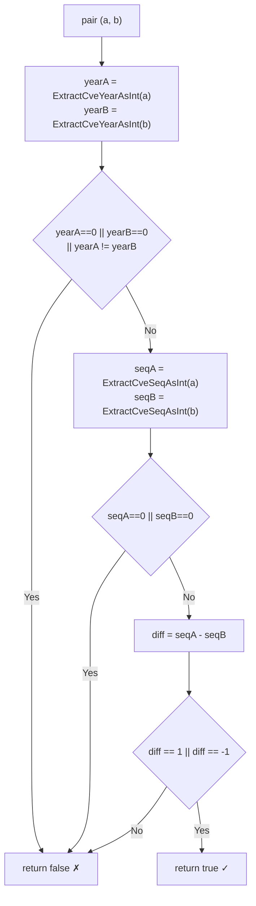

# Example: IsCvesConsecutive

:::tip 📂 View Source
[`examples/26_is_cves_consecutive/main.go`](https://github.com/scagogogo/cve-skills/blob/main/examples/26_is_cves_consecutive/main.go) — open the full runnable example on GitHub.
:::

Check whether two CVE identifiers are adjacent with `cve.IsCvesConsecutive`. It returns `true` only when both CVEs share the same year and their sequence numbers differ by exactly 1, so you can decide whether a pair can be merged into a single range expression.

:::tip 🎯 Learning objectives
- Understand the signature and adjacency rule of `cve.IsCvesConsecutive`
- See how same-year, sequence-gap, cross-year, reversed, and identical pairs are judged
- Apply the pairwise check to scan a sorted CVE list for mergeable adjacent identifiers
:::

## Scenario

A vulnerability analyst is cleaning up a CVE inventory and wants to collapse runs of adjacent identifiers into compact range expressions such as `CVE-2022-1001->1003`. Two CVEs are mergeable only when they sit in the same year and their sequence numbers differ by exactly 1, so the analyst reaches for `IsCvesConsecutive`: it extracts the year of each side, rejects different years, then extracts the sequence numbers and returns `true` only when the difference is `1` or `-1`. The check is order-independent, so a reversed pair still reads as consecutive. The example first walks through five representative pairs and then scans a CVE list pairwise to find which neighbors can be merged.

## Full code

```go
package main

import (
	"fmt"

	"github.com/scagogogo/cve-skills"
)

func main() {
	fmt.Println("=== CVE 连续性判断 ===")

	pairs := []struct {
		a, b string
	}{
		{"CVE-2022-12345", "CVE-2022-12346"},
		{"CVE-2022-12345", "CVE-2022-12347"},
		{"CVE-2022-12345", "CVE-2023-12345"},
		{"CVE-2022-12346", "CVE-2022-12345"},
		{"CVE-2022-12345", "CVE-2022-12345"},
	}

	for _, p := range pairs {
		consecutive := cve.IsCvesConsecutive(p.a, p.b)
		mark := "✗"
		if consecutive {
			mark = "✓"
		}
		fmt.Printf("  %s %s <-> %s: 连续=%v\n", mark, p.a, p.b, consecutive)
	}

	fmt.Println("\n--- 检测可合并列表 ---")
	cveList := []string{
		"CVE-2022-1001", "CVE-2022-1002", "CVE-2022-1003",
		"CVE-2022-2001", "CVE-2022-2003",
	}
	fmt.Println("CVE列表:", cveList)

	for i := 0; i < len(cveList)-1; i++ {
		if cve.IsCvesConsecutive(cveList[i], cveList[i+1]) {
			fmt.Printf("  %s 和 %s 连续\n", cveList[i], cveList[i+1])
		} else {
			fmt.Printf("  %s 和 %s 不连续\n", cveList[i], cveList[i+1])
		}
	}
}
```

## How to run

```bash
cd examples/26_is_cves_consecutive && go run main.go
```

## Expected output

```text
=== CVE 连续性判断 ===
  ✓ CVE-2022-12345 <-> CVE-2022-12346: 连续=true
  ✗ CVE-2022-12345 <-> CVE-2022-12347: 连续=false
  ✗ CVE-2022-12345 <-> CVE-2023-12345: 连续=false
  ✓ CVE-2022-12346 <-> CVE-2022-12345: 连续=true
  ✗ CVE-2022-12345 <-> CVE-2022-12345: 连续=false

--- 检测可合并列表 ---
CVE列表: [CVE-2022-1001 CVE-2022-1002 CVE-2022-1003 CVE-2022-2001 CVE-2022-2003]
  CVE-2022-1001 和 CVE-2022-1002 连续
  CVE-2022-1002 和 CVE-2022-1003 连续
  CVE-2022-1003 和 CVE-2022-2001 不连续
  CVE-2022-2001 和 CVE-2022-2003 不连续
```

## Code walkthrough

The example first judges five representative pairs, then scans a CVE list pairwise to find mergeable neighbors.

- 📋 **Same year, sequence diff = 1** — `CVE-2022-12345` vs `CVE-2022-12346`: the years match and the sequence numbers differ by exactly 1, so the result is `true` and the row is marked `✓`.
- ▶️ **Sequence gap too large** — `CVE-2022-12345` vs `CVE-2022-12347`: the years still match, but the sequence difference is 2, which falls outside the `1` / `-1` window, so the result is `false`.
- 💡 **Cross year** — `CVE-2022-12345` vs `CVE-2023-12345`: the years differ, so the function short-circuits at the year check and returns `false` without comparing sequences.
- 🔗 **Reversed order** — `CVE-2022-12346` vs `CVE-2022-12345`: swapping the arguments flips the sequence difference to `-1`, which still counts as consecutive, confirming the check is symmetric.
- 🎯 **Identical pair** — `CVE-2022-12345` vs `CVE-2022-12345`: the sequence difference is 0, so equality is not adjacency and the result is `false`.
- 🔗 **List scan** — the loop walks `cveList` pairwise; `1001->1002` and `1002->1003` are consecutive, while `1003->2001` breaks on the year and `2001->2003` breaks on the sequence gap.



## Related functions

- [IsCvesConsecutive](/api/functions/is-cves-consecutive) — the function used in this example
- [ExtractCveYearAsInt](/api/functions/extract-cve-year-as-int) — extract the year of a CVE as an integer
- [ExtractCveSeqAsInt](/api/functions/extract-cve-seq-as-int) — extract the sequence of a CVE as an integer
- [ParseCveRange](/api/functions/parse-cve-range) — expand a range expression into all CVEs in the interval
- [SortCves](/api/functions/sort-cves) — sort a CVE slice so adjacent identifiers line up before the scan

## Extensions

- 🎯 Sort the list with `SortCves` before the pairwise scan and confirm that adjacent identifiers now line up, turning more neighbors into consecutive pairs.
- 🎯 Feed an unparseable string such as `"not-a-cve"` as one operand and observe that it short-circuits to `false` instead of panicking.
- 🎯 Collect every consecutive pair in a run and use `ParseCveRange` to collapse `CVE-2022-1001->1003` into a single range expression.
