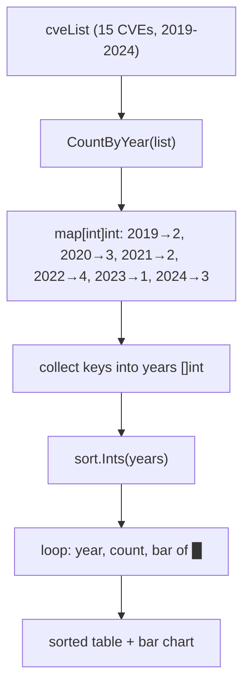

# Example: CountByYear

:::tip 📂 View Source
[`examples/27_count_by_year/main.go`](https://github.com/scagogogo/cve-skills/blob/main/examples/27_count_by_year/main.go) — open the full runnable example on GitHub.
:::

Tally CVEs by their year with `cve.CountByYear` and render the distribution as a sorted table with an ASCII bar chart. The quickest way to turn a raw CVE list into a year-by-year trend view.

:::tip 🎯 Learning objectives
- Understand the signature and return value of `cve.CountByYear` (a `map[int]int`)
- Learn how to sort map keys for deterministic ordered output
- Build a year-distribution report with a simple bar chart for trend analysis
:::

## Scenario

A security operations center exports a raw feed of CVE identifiers collected throughout the year from multiple scanners. For the quarterly review they need to visualize how vulnerabilities distribute across years — not just a total count, but a per-year breakdown that makes spikes (for example a surge in 2022) immediately visible. `CountByYear` reduces the list to a `map[int]int` of year to count; sorting the keys and drawing a bar per count turns that map into a readable trend report.

## Full code

```go
package main

import (
	"fmt"
	"sort"

	"github.com/scagogogo/cve-skills"
)

func main() {
	fmt.Println("=== 按年份统计CVE ===")

	cveList := []string{
		"CVE-2019-1001", "CVE-2019-1002",
		"CVE-2020-1001", "CVE-2020-1002", "CVE-2020-1003",
		"CVE-2021-1001", "CVE-2021-1002",
		"CVE-2022-1001", "CVE-2022-1002", "CVE-2022-1003", "CVE-2022-1004",
		"CVE-2023-1001",
		"CVE-2024-1001", "CVE-2024-1002", "CVE-2024-1003",
	}

	counts := cve.CountByYear(cveList)

	var years []int
	for y := range counts {
		years = append(years, y)
	}
	sort.Ints(years)

	fmt.Println("年份分布:")
	fmt.Println("年份    | 数量 | 柱状图")
	fmt.Println("--------|------|------")
	for _, year := range years {
		count := counts[year]
		bar := ""
		for i := 0; i < count; i++ {
			bar += "█"
		}
		fmt.Printf("%d    | %4d | %s\n", year, count, bar)
	}

	fmt.Printf("\n总年份跨度: %d 年\n", len(counts))
	fmt.Printf("总计CVE: %d\n", len(cveList))
}
```

## How to run

```bash
cd examples/27_count_by_year && go run main.go
```

## Expected output

```text
=== 按年份统计CVE ===
年份分布:
年份    | 数量 | 柱状图
--------|------|------
2019    |    2 | ██
2020    |    3 | ███
2021    |    2 | ██
2022    |    4 | ████
2023    |    1 | █
2024    |    3 | ███

总年份跨度: 6 年
总计CVE: 15
```

## Code walkthrough

The example builds a `cveList` of 15 CVEs spanning 2019 to 2024, with the count per year deliberately uneven (2022 is the peak with 4, 2023 the trough with 1) so the bar chart shows a visible shape.

- 📋 **Build the source list** — `cveList` mixes six years with varying densities. All entries are valid CVE identifiers, so every one is counted.
- ▶️ **Count by year** — `cve.CountByYear(cveList)` walks the slice, extracts each year via `ExtractCveYearAsInt`, and returns a `map[int]int` of year to count. Malformed entries (year not greater than 0) are silently skipped.
- 💡 **Sort the keys** — Go map iteration order is randomized, so the keys are collected into a `years` slice and sorted with `sort.Ints` to produce deterministic, chronological output.
- 🔗 **Render the table and bar chart** — for each sorted year the loop reads `counts[year]`, builds a `bar` string of `█` characters whose length equals the count, and prints a row with `fmt.Printf("%d    | %4d | %s\n", year, count, bar)`. The `%4d` right-aligns the count to a width of 4.
- 📋 **Summarize** — `len(counts)` gives the year span (number of distinct years), and `len(cveList)` gives the total CVE count, printed at the end as a sanity check.



## Related functions

- [CountByYear](/api/functions/count-by-year) — the function used in this example
- [ExtractCveYearAsInt](/api/functions/extract-cve-year-as-int) — the year extractor that powers the counting
- [GroupByYear](/api/functions/group-by-year) — group CVEs by year instead of just counting
- [FilterCvesByYear](/api/functions/filter-cves-by-year) — narrow the list to a single year before counting
- [FilterCvesByYearRange](/api/functions/filter-cves-by-year-range) — narrow the list to a range of years before counting

## Extensions

- 🎯 Add a malformed string (for example `"CVE-2021-abc"` or `"not-a-cve"`) to `cveList` and confirm it is skipped — the total CVE count stays 15 while the per-year counts are unchanged.
- 🎯 Replace the single bar character with a scaled bar (for example one `█` per 5 CVEs) so a very large list still fits on screen.
- 🎯 Combine `CountByYear` with `FilterCvesByYearRange` to count only CVEs from 2020–2022 and compare the year span and total against the full list.
