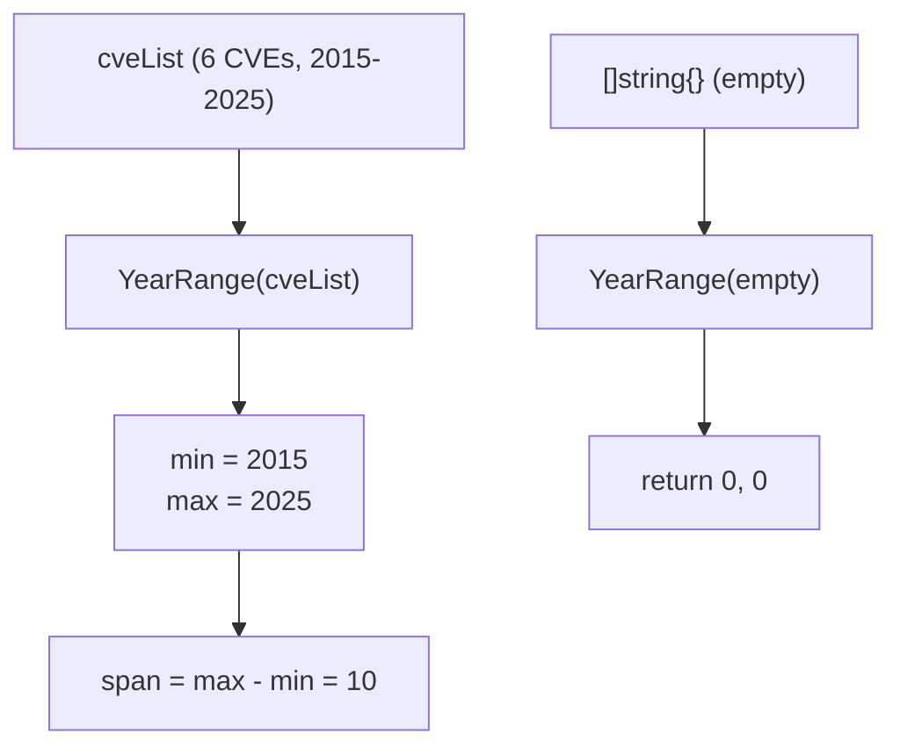

# Example: YearRange

:::tip 📂 View Source
[`examples/28_year_range/main.go`](https://github.com/scagogogo/cve-skills/blob/main/examples/28_year_range/main.go) — open the full runnable example on GitHub.
:::

Scan a CVE list with `cve.YearRange` to get its earliest and latest year in a single call. This is the quickest way to describe the time span a dataset covers for reports, dashboards, or sanity checks.

:::tip 🎯 Learning objectives
- Understand the signature and behavior of `cve.YearRange`
- Learn how the minimum and maximum year are computed from a mixed CVE list
- Handle the empty-list edge case and interpret the `0, 0` "no data" sentinel
:::

## Scenario

A security team needs to caption a CVE dataset for an annual report with a line like "CVEs span from 2015 to 2025". Instead of sorting the list and reading the first and last entries, they call `YearRange` once to obtain both boundaries in O(n) time. The function also exposes the empty-list behavior, so the team can guard dashboards against inputs that carry no valid CVE.

## Full code

```go
package main

import (
	"fmt"

	"github.com/scagogogo/cve-skills"
)

func main() {
	fmt.Println("=== CVE 年份范围 ===")

	cveList := []string{
		"CVE-2015-1001",
		"CVE-2018-2001",
		"CVE-2020-3001",
		"CVE-2022-4001",
		"CVE-2024-5001",
		"CVE-2025-6001",
	}

	minYear, maxYear := cve.YearRange(cveList)
	fmt.Println("CVE列表:", cveList)
	fmt.Printf("\n年份范围: %d - %d\n", minYear, maxYear)
	fmt.Printf("时间跨度: %d 年\n", maxYear-minYear)

	fmt.Println("\n--- 边界情况 ---")
	minE, maxE := cve.YearRange([]string{})
	fmt.Printf("空列表: min=%d, max=%d\n", minE, maxE)
}
```

## How to run

```bash
cd examples/28_year_range && go run main.go
```

## Expected output

```text
=== CVE 年份范围 ===
CVE列表: [CVE-2015-1001 CVE-2018-2001 CVE-2020-3001 CVE-2022-4001 CVE-2024-5001 CVE-2025-6001]

年份范围: 2015 - 2025
时间跨度: 10 年

--- 边界情况 ---
空列表: min=0, max=0
```

## Code walkthrough

The example builds a `cveList` of six CVEs spanning 2015 to 2025, then probes both the normal and empty-list paths.

- 📋 **Build the source list** — `cveList` mixes years deliberately (2015, 2018, 2020, 2022, 2024, 2025) so the range has real boundaries to discover. `fmt.Println("CVE列表:", cveList)` prints the whole slice in Go's default `[a b c]` form.
- ▶️ **Compute the range** — `minYear, maxYear := cve.YearRange(cveList)` walks the slice once, extracting each year via `ExtractCveYearAsInt` and tightening `min`/`max` as it goes. For this input it returns `2015` and `2025`.
- 💡 **Derive the span** — `maxYear-minYear` is computed by the caller, not the function, so `YearRange` stays a pure boundary finder. Here the span is `10` years.
- 🔗 **Edge case** — `cve.YearRange([]string{})` short-circuits on the empty slice and returns `0, 0`, the documented "no data" sentinel that lets callers branch without an extra length check.



## Related functions

- [YearRange](/api/functions/year-range) — the function used in this example
- [CountByYear](/api/functions/count-by-year) — break the span down per year instead of just the boundaries
- [ExtractCveYearAsInt](/api/functions/extract-cve-year-as-int) — the year extractor used internally
- [SortCves](/api/functions/sort-cves) — order CVEs chronologically within the span
- [GetRecentCves](/api/functions/get-recent-cves) — pull the most recent CVEs by year

## Extensions

- 🎯 Add a non-CVE string (for example `"not-a-cve"`) to `cveList` and confirm the range stays `2015 - 2025`, since invalid entries are skipped.
- 🎯 Replace the empty slice with an all-invalid slice like `[]string{"garbage", ""}` and verify it still returns `0, 0`.
- 🎯 Combine `YearRange` with `CountByYear` to first get the boundaries, then count CVEs in each year between `min` and `max`.
