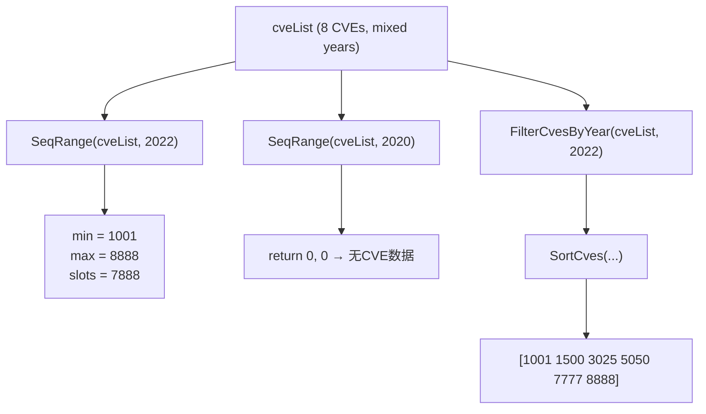

# Example: SeqRange

:::tip 📂 View Source
[`examples/29_seq_range/main.go`](https://github.com/scagogogo/cve-skills/blob/main/examples/29_seq_range/main.go) — open the full runnable example on GitHub.
:::

Use `cve.SeqRange` to find the smallest and largest sequence numbers among CVEs that share a given year. It is the fastest way to bound the "ID slot" a year occupies in a dataset, handy for gap analysis, allocation planning, and per-year sanity checks.

:::tip 🎯 Learning objectives
- Understand the signature and behavior of `cve.SeqRange(cveList, year)`
- Learn how the per-year min/max sequence is computed and what the `0, 0` sentinel means
- Combine `SeqRange` with `FilterCvesByYear` and `SortCves` for a focused year view
:::

## Scenario

A vulnerability analyst maintains a feed that munges CVEs from many years into one list. For the 2022 slice they want to know "how wide does the sequence range run, and how many ID slots does that cover?" — a quick proxy for how sparsely or densely the year was assigned. Instead of filtering, sorting, and reading endpoints by hand, they loop over a few target years and call `SeqRange` once per year. Years with no entries return `0, 0`, so the loop can branch on missing data without an extra length check. They then drill into 2022 specifically: filter, sort, and print to see the actual IDs that fill that range.

## Full code

```go
package main

import (
	"fmt"

	"github.com/scagogogo/cve-skills"
)

func main() {
	fmt.Println("=== CVE 序列号范围 ===")

	cveList := []string{
		"CVE-2022-1001", "CVE-2022-5050", "CVE-2022-3025",
		"CVE-2022-8888", "CVE-2022-1500", "CVE-2021-9999",
		"CVE-2023-1234", "CVE-2022-7777",
	}

	targetYears := []int{2022, 2021, 2023, 2020}

	for _, year := range targetYears {
		minSeq, maxSeq := cve.SeqRange(cveList, year)
		if minSeq == 0 && maxSeq == 0 {
			fmt.Printf("%d 年: 无CVE数据\n", year)
		} else {
			fmt.Printf("%d 年: 序列号范围 %d - %d (共 %d 个可能位置)\n",
				year, minSeq, maxSeq, maxSeq-minSeq+1)
		}
	}

	fmt.Println("\n--- 列出2022年所有CVE ---")
	cves2022 := cve.FilterCvesByYear(cveList, 2022)
	sorted := cve.SortCves(cves2022)
	fmt.Println(sorted)
}
```

## How to run

```bash
cd examples/29_seq_range && go run main.go
```

## Expected output

```text
=== CVE 序列号范围 ===
2022 年: 序列号范围 1001 - 8888 (共 7888 个可能位置)
2021 年: 序列号范围 9999 - 9999 (共 1 个可能位置)
2023 年: 序列号范围 1234 - 1234 (共 1 个可能位置)
2020 年: 无CVE数据

--- 列出2022年所有CVE ---
[CVE-2022-1001 CVE-2022-1500 CVE-2022-3025 CVE-2022-5050 CVE-2022-7777 CVE-2022-8888]
```

## Code walkthrough

The example seeds a `cveList` mixing 2022, 2021, and 2023 entries, then probes four target years and drills into 2022.

- 📋 **Build the source list** — `cveList` holds eight CVEs. Six belong to 2022 (1001, 5050, 3025, 8888, 1500, 7777) so 2022 has a real spread to measure; 2021 and 2023 each contribute one entry, and 2020 is intentionally absent to exercise the no-data path.
- ▶️ **Probe each target year** — `targetYears := []int{2022, 2021, 2023, 2020}` drives the loop. `minSeq, maxSeq := cve.SeqRange(cveList, year)` walks the slice once, keeping only CVEs whose `ExtractCveYearAsInt` equals `year` and whose `ExtractCveSeqAsInt` is greater than zero, tightening `min`/`max` as it goes.
- 💡 **Interpret the sentinel** — when no CVE matches the year, `SeqRange` returns `0, 0`. The `if minSeq == 0 && maxSeq == 0` branch prints "无CVE数据"; otherwise it reports the range and the count of covered slots, `maxSeq-minSeq+1`, computed by the caller.
- 🔗 **Drill into 2022** — `cves2022 := cve.FilterCvesByYear(cveList, 2022)` narrows the list to the six 2022 IDs, `sorted := cve.SortCves(cves2022)` orders them ascending by sequence, and `fmt.Println(sorted)` prints Go's default `[a b c]` form, confirming which IDs fill the 1001–8888 range.



## Related functions

- [SeqRange](/api/functions/seq-range) — the function used in this example
- [FilterCvesByYear](/api/functions/filter-cves-by-year) — narrow the list to one year before inspecting it
- [SortCves](/api/functions/sort-cves) — order CVEs ascending within the year
- [ExtractCveSeqAsInt](/api/functions/extract-cve-seq-as-int) — the sequence extractor used internally
- [YearRange](/api/functions/year-range) — the year-boundary counterpart of this function

## Extensions

- 🎯 Add a 2022 CVE with a deliberately huge sequence (for example `CVE-2022-999999`) and confirm the slot count grows accordingly while `min` stays at 1001.
- 🎯 Insert an invalid 2022 entry like `CVE-2022-0000` (sequence 0) and verify `SeqRange` skips it, since `seq <= 0` entries are ignored.
- 🎯 Wrap the loop body in a helper that returns both the slot count and the sorted slice, so each target year reports its range and the IDs that fill it in one call.
