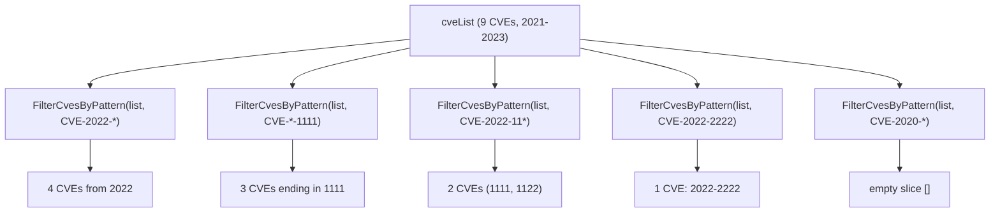

# Example: FilterCvesByPattern

:::tip 📂 View Source
[`examples/30_filter_by_pattern/main.go`](https://github.com/scagogogo/cve-skills/blob/main/examples/30_filter_by_pattern/main.go) — open the full runnable example on GitHub.
:::

Use `cve.FilterCvesByPattern` to narrow a CVE list with a glob-style pattern. A single `*` wildcard can match the year, the sequence number, or any prefix, making it ideal for ad-hoc queries such as "all CVEs from 2022" or "every CVE ending in 1111".

:::tip 🎯 Learning objectives
- Understand the signature and glob semantics of `cve.FilterCvesByPattern`
- Learn how the `*` wildcard matches the year, sequence, and prefix segments
- Build pattern-based CVE queries for triage and investigation workflows
:::

## Scenario

A SOC analyst is reviewing a spreadsheet of nine CVE identifiers spanning 2021 to 2023. During triage they need several sliced views: every CVE from 2022, every CVE whose sequence ends in `1111`, every CVE starting with `CVE-2022-11`, one exact identifier, and a year that has no matches at all. Instead of writing a regex by hand, the analyst passes a glob pattern with a single `*` to `FilterCvesByPattern` and gets back the matching slice each time.

## Full code

```go
package main

import (
	"fmt"

	"github.com/scagogogo/cve-skills"
)

func main() {
	fmt.Println("=== 通配符模式匹配 CVE ===")

	cveList := []string{
		"CVE-2021-1111", "CVE-2021-2222",
		"CVE-2022-1111", "CVE-2022-1122", "CVE-2022-2222", "CVE-2022-3333",
		"CVE-2023-1111", "CVE-2023-2222", "CVE-2023-3333",
	}

	fmt.Printf("CVE列表 (共 %d 个):\n", len(cveList))
	fmt.Println("  ", cveList)

	fmt.Println("\n--- 按年份筛选: CVE-2022-* ---")
	fmt.Println("  ", cve.FilterCvesByPattern(cveList, "CVE-2022-*"))

	fmt.Println("\n--- 按序列号筛选: CVE-*-1111 ---")
	fmt.Println("  ", cve.FilterCvesByPattern(cveList, "CVE-*-1111"))

	fmt.Println("\n--- 前缀匹配: CVE-2022-11* ---")
	fmt.Println("  ", cve.FilterCvesByPattern(cveList, "CVE-2022-11*"))

	fmt.Println("\n--- 精确匹配: CVE-2022-2222 ---")
	fmt.Println("  ", cve.FilterCvesByPattern(cveList, "CVE-2022-2222"))

	fmt.Println("\n--- 无匹配: CVE-2020-* ---")
	fmt.Println("  ", cve.FilterCvesByPattern(cveList, "CVE-2020-*"))
}
```

## How to run

```bash
cd examples/30_filter_by_pattern && go run main.go
```

## Expected output

```text
=== 通配符模式匹配 CVE ===
CVE列表 (共 9 个):
   [CVE-2021-1111 CVE-2021-2222 CVE-2022-1111 CVE-2022-1122 CVE-2022-2222 CVE-2022-3333 CVE-2023-1111 CVE-2023-2222 CVE-2023-3333]

--- 按年份筛选: CVE-2022-* ---
   [CVE-2022-1111 CVE-2022-1122 CVE-2022-2222 CVE-2022-3333]

--- 按序列号筛选: CVE-*-1111 ---
   [CVE-2021-1111 CVE-2022-1111 CVE-2023-1111]

--- 前缀匹配: CVE-2022-11* ---
   [CVE-2022-1111 CVE-2022-1122]

--- 精确匹配: CVE-2022-2222 ---
   [CVE-2022-2222]

--- 无匹配: CVE-2020-* ---
   []
```

## Code walkthrough

The example builds a `cveList` of nine CVE identifiers spanning 2021, 2022, and 2023, then runs five pattern queries against it.

- 📋 **Build the source list** — `cveList` is grouped by year (two for 2021, four for 2022, three for 2023) and printed with `fmt.Printf` showing the count so the filtered results can be checked at a glance.
- ▶️ **Year wildcard `CVE-2022-*`** — the `*` swallows the sequence segment, returning all four 2022 CVEs in their original order.
- ▶️ **Sequence wildcard `CVE-*-1111`** — the `*` sits in the year slot, so every CVE ending in `1111` across all three years is matched.
- ▶️ **Prefix wildcard `CVE-2022-11*`** — the `*` matches any trailing digits, returning both `CVE-2022-1111` and `CVE-2022-1122`.
- 💡 **Exact and no-match cases** — a pattern without `*` (`CVE-2022-2222`) acts as an exact match returning a single-element slice, while `CVE-2020-*` matches nothing and returns an empty slice `[]`.



## Related functions

- [FilterCvesByPattern](/api/functions/filter-cves-by-pattern) — the function used in this example
- [FilterCvesByYear](/api/functions/filter-cves-by-year) — filter by an exact year instead of a glob
- [FilterCvesByYearRange](/api/functions/filter-cves-by-year-range) — filter by a range of years
- [FilterValidCves](/api/functions/filter-valid-cves) — keep only valid CVE identifiers
- [ExtractCve](/api/functions/extract-cve) — extract CVE identifiers from free text

## Extensions

- 🎯 Use the pattern `CVE-2022-*2` to match only 2022 CVEs whose sequence ends in `2`, and verify the result against the source list.
- 🎯 Add a non-CVE string (for example `"CVE-2022-2222-xxx"`) to `cveList` and confirm it is dropped from every pattern result.
- 🎯 Chain `FilterCvesByPattern` with `SortCves` to return the 2022 cohort sorted in descending order.
