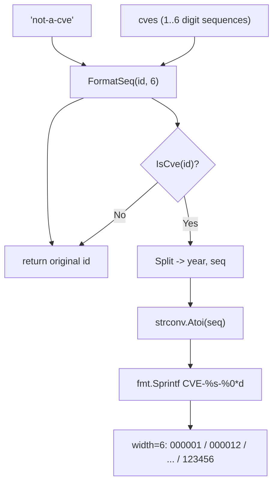

# Example: FormatSeq

:::tip 📂 View Source
[`examples/31_format_seq/main.go`](https://github.com/scagogogo/cve-skills/blob/main/examples/31_format_seq/main.go) — open the full runnable example on GitHub.
:::

Use `cve.FormatSeq` to zero-pad a CVE's sequence number to a fixed width, turning identifiers of uneven length such as `CVE-2022-1` and `CVE-2022-123456` into uniformly wide forms like `CVE-2022-000001` and `CVE-2022-123456`. It is the standard tool for normalizing CVEs before display, storage, or column-aligned printing.

:::tip 🎯 Learning objectives
- Understand the signature and behavior of `cve.FormatSeq(cve, width)`
- See how `%0*d` zero-pads short sequences while leaving longer sequences untouched
- Learn how invalid input is handled (returned unchanged, not errored)
:::

## Scenario

A vulnerability analyst ingests CVEs from several feeds into one dataset. Some feeds emit short sequence numbers (`CVE-2022-1`, `CVE-2022-12`), others emit the full-width form (`CVE-2022-123456`). When they print a tabular report, the ID column is ragged and hard to scan, and lexical sort no longer matches numeric sort because `CVE-2022-12` lexically precedes `CVE-2022-123456`. Before storage and reporting, they normalize every ID with `FormatSeq(id, 6)` so all sequences occupy six digits. They also probe a single CVE at several widths to confirm the padding rule, and feed in an obviously invalid string to confirm it comes back untouched.

## Full code

```go
package main

import (
	"fmt"

	"github.com/scagogogo/cve-skills"
)

func main() {
	fmt.Println("=== CVE 序列号格式化 ===")

	cves := []string{
		"CVE-2022-1",
		"CVE-2022-12",
		"CVE-2022-123",
		"CVE-2022-1234",
		"CVE-2022-12345",
		"CVE-2022-123456",
	}

	fmt.Println("宽度为 6 的格式化效果:")
	fmt.Println("原始            | 格式化后")
	fmt.Println("----------------|---------")
	for _, id := range cves {
		formatted := cve.FormatSeq(id, 6)
		fmt.Printf("%-16s| %s\n", id, formatted)
	}

	fmt.Println("\n--- 不同宽度效果 (CVE-2022-123) ---")
	for _, width := range []int{4, 5, 6, 8} {
		fmt.Printf("  宽度 %d: %s\n", width, cve.FormatSeq("CVE-2022-123", width))
	}

	fmt.Println("\n--- 无效输入 ---")
	fmt.Printf("  'not-a-cve' -> %s\n", cve.FormatSeq("not-a-cve", 6))
}
```

## How to run

```bash
cd examples/31_format_seq && go run main.go
```

## Expected output

```text
=== CVE 序列号格式化 ===
宽度为 6 的格式化效果:
原始            | 格式化后
----------------|---------
CVE-2022-1      | CVE-2022-000001
CVE-2022-12     | CVE-2022-000012
CVE-2022-123    | CVE-2022-000123
CVE-2022-1234   | CVE-2022-001234
CVE-2022-12345  | CVE-2022-012345
CVE-2022-123456 | CVE-2022-123456

--- 不同宽度效果 (CVE-2022-123) ---
  宽度 4: CVE-2022-0123
  宽度 5: CVE-2022-00123
  宽度 6: CVE-2022-000123
  宽度 8: CVE-2022-00000123

--- 无效输入 ---
  'not-a-cve' -> not-a-cve
```

## Code walkthrough

The example seeds six CVEs whose sequence numbers range from one to six digits, then formats them at width 6, probes one CVE at four widths, and finishes with an invalid input.

- 📋 **Build the source list** — `cves` holds `CVE-2022-1` through `CVE-2022-123456`, so every sequence length from 1 to 6 digits is represented. Width 6 is exactly the natural length of the longest entry, which lets us see both zero-padding (shorter sequences) and the no-truncation rule (the 6-digit entry stays as-is).
- ▶️ **Format at fixed width** — the loop calls `formatted := cve.FormatSeq(id, 6)` for each ID. Internally the function validates with `IsCve`, splits into year and sequence via `Split`, parses the sequence with `strconv.Atoi`, and reassembles with `fmt.Sprintf("CVE-%s-%0*d", year, width, seqInt)`. The `%0*d` verb left-pads with zeros up to exactly `width` digits but never truncates a longer sequence, so `CVE-2022-123456` is returned unchanged.
- 💡 **Probe several widths** — `for _, width := range []int{4, 5, 6, 8}` runs `FormatSeq("CVE-2022-123", width)`. Width 4 yields `0123`, width 5 yields `00123`, width 6 yields `000123`, and width 8 yields `00000123`, confirming the pad grows the digit count to `width` while the year prefix and `CVE-` header stay fixed.
- 🔗 **Handle invalid input** — `cve.FormatSeq("not-a-cve", 6)` fails the `IsCve` check at the top of the function and returns the original string unchanged. Callers that need strict validation should pre-check with `IsCve` or `ValidateCve` rather than relying on the formatted output.



## Related functions

- [FormatSeq](/api/functions/format-seq) — the function used in this example
- [Format](/api/functions/format) — trim and upper-case only, no zero-padding
- [Split](/api/functions/split) — split a CVE into year and sequence, used internally
- [IsCve](/api/functions/is-cve) — the format check that gates padding
- [ValidateCve](/api/functions/validate-cve) — full validation (format + year range + positive sequence)

## Extensions

- 🎯 Pass a sequence wider than `width`, for example `cve.FormatSeq("CVE-2022-1234567", 4)`, and confirm the 7-digit sequence is returned unchanged because `%0*d` never truncates.
- 🎯 Feed in lowercase or whitespace-padded input such as `" cve-2022-7 "` and verify `FormatSeq` still returns `CVE-2022-000007`, because `Split` internally normalizes case and trims surrounding spaces.
- 🎯 Pre-normalize a mixed list with `FormatSeq(id, 6)` and then `SortCves` it, checking that lexical order now matches numeric order within the fixed width.
