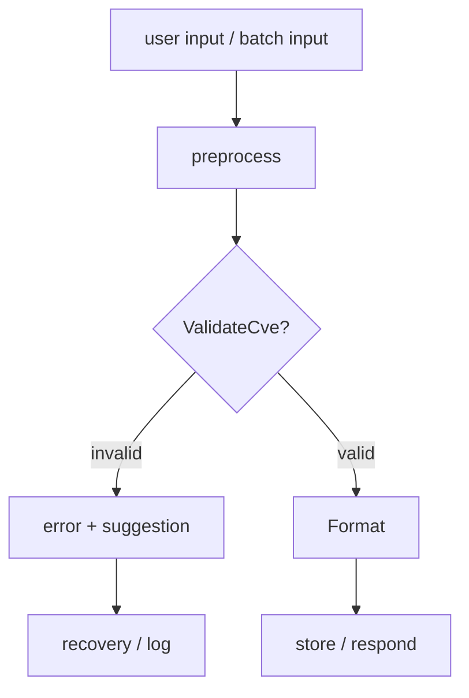

# CVE Validation Processing

This example demonstrates how to use CVE Utils to implement a robust CVE validation and processing system, including user input validation, batch data processing, error handling, and performance optimization best practices.

## Scenario Description

As a web application or API developer, you need to:
- Validate user-input CVE formats
- Handle various exceptions and errors
- Implement high-performance batch validation
- Provide friendly error messages and suggestions
- Ensure system stability and reliability

The end-to-end flow from raw input to a processed result:



## Complete Example

### 1. CVE Validator

```go
package main

import (
    "fmt"
    "strings"
    "time"
    "github.com/scagogogo/cve-skills"
)

// ValidationResult validation result
type ValidationResult struct {
    IsValid     bool      `json:"is_valid"`
    CVE         string    `json:"cve,omitempty"`
    ErrorType   string    `json:"error_type,omitempty"`
    ErrorMsg    string    `json:"error_message,omitempty"`
    Suggestions []string  `json:"suggestions,omitempty"`
    ProcessTime time.Duration `json:"process_time_ns"`
}

// CVEValidator CVE validator
type CVEValidator struct {
    strictMode        bool
    maxYearOffset     int
    enableSuggestions bool
}

func NewCVEValidator() *CVEValidator {
    return &CVEValidator{
        strictMode:        false,
        maxYearOffset:     10,
        enableSuggestions: true,
    }
}

// SetStrictMode enable/disable strict validation mode
func (v *CVEValidator) SetStrictMode(enabled bool) *CVEValidator {
    v.strictMode = enabled
    return v
}

// SetMaxYearOffset set maximum year offset for validation
func (v *CVEValidator) SetMaxYearOffset(years int) *CVEValidator {
    v.maxYearOffset = years
    return v
}

// SetSuggestions enable/disable error suggestions
func (v *CVEValidator) SetSuggestions(enabled bool) *CVEValidator {
    v.enableSuggestions = enabled
    return v
}

// ValidateInput validate single CVE input
func (v *CVEValidator) ValidateInput(input string) ValidationResult {
    start := time.Now()
    result := ValidationResult{
        ProcessTime: 0,
    }

    defer func() {
        result.ProcessTime = time.Since(start)
    }()

    // Remove leading/trailing spaces
    trimmed := strings.TrimSpace(input)
    if trimmed == "" {
        result.ErrorType = "empty_input"
        result.ErrorMsg = "Input cannot be empty"
        if v.enableSuggestions {
            result.Suggestions = []string{
                "Please provide a CVE identifier",
                "Example: CVE-2022-12345",
            }
        }
        return result
    }

    // Format CVE
    formatted := cve.Format(trimmed)

    // Basic format validation
    if !cve.IsCve(formatted) {
        result.ErrorType = "invalid_format"
        result.ErrorMsg = fmt.Sprintf("Invalid CVE format: %s", input)
        if v.enableSuggestions {
            result.Suggestions = v.generateFormatSuggestions(input)
        }
        return result
    }

    // Comprehensive validation in strict mode
    if v.strictMode {
        if !cve.ValidateCve(formatted) {
            result.ErrorType = "validation_failed"
            result.ErrorMsg = fmt.Sprintf("CVE validation failed: %s", formatted)
            if v.enableSuggestions {
                result.Suggestions = v.generateValidationSuggestions(formatted)
            }
            return result
        }

        // Year range validation
        year := cve.ExtractCveYearAsInt(formatted)
        currentYear := time.Now().Year()
        if year > currentYear+v.maxYearOffset {
            result.ErrorType = "future_year"
            result.ErrorMsg = fmt.Sprintf("CVE year %d is too far in the future", year)
            return result
        }
    }

    // Validation successful
    result.IsValid = true
    result.CVE = formatted
    return result
}

// generateFormatSuggestions generate format correction suggestions
func (v *CVEValidator) generateFormatSuggestions(input string) []string {
    if !v.enableSuggestions {
        return nil
    }

    var suggestions []string

    // Check if CVE prefix is missing
    if strings.Contains(input, "-") && !strings.HasPrefix(strings.ToUpper(input), "CVE-") {
        suggestions = append(suggestions, "Try adding 'CVE-' prefix: CVE-"+input)
    }

    // Check for common format errors
    if strings.Contains(input, "/") {
        fixed := strings.ReplaceAll(input, "/", "-")
        suggestions = append(suggestions, "Try replacing '/' with '-': "+fixed)
    }

    // Check for spaces
    if strings.Contains(input, " ") {
        fixed := strings.ReplaceAll(input, " ", "-")
        suggestions = append(suggestions, "Try replacing spaces with '-': "+fixed)
    }

    // Provide standard format example
    suggestions = append(suggestions, "Standard format example: CVE-2022-12345")

    return suggestions
}

// generateValidationSuggestions generate validation suggestions
func (v *CVEValidator) generateValidationSuggestions(cveId string) []string {
    if !v.enableSuggestions {
        return nil
    }

    var suggestions []string

    year := cve.ExtractCveYearAsInt(cveId)
    seq := cve.ExtractCveSeqAsInt(cveId)

    currentYear := time.Now().Year()

    if year < 1999 {
        suggestions = append(suggestions, "Year cannot be earlier than 1999")
    }

    if year > currentYear {
        suggestions = append(suggestions, fmt.Sprintf("Year cannot be later than current year %d", currentYear))
    }

    if seq <= 0 {
        suggestions = append(suggestions, "Sequence number must be a positive integer")
    }

    return suggestions
}
```

### 2. Batch Validation Handler

```go
// BatchProcessor batch handler
type BatchProcessor struct {
    validator      *CVEValidator
    maxBatchSize   int
    maxConcurrency int
}

func NewBatchProcessor(validator *CVEValidator) *BatchProcessor {
    return &BatchProcessor{
        validator:      validator,
        maxBatchSize:   10000,
        maxConcurrency: 10,
    }
}

// BatchValidationResult batch validation result
type BatchValidationResult struct {
    TotalCount   int                `json:"total_count"`
    ValidCount   int                `json:"valid_count"`
    InvalidCount int                `json:"invalid_count"`
    ProcessTime  time.Duration      `json:"process_time_ns"`
    ValidCVEs    []string           `json:"valid_cves"`
    InvalidCVEs  []ValidationResult `json:"invalid_cves"`
    ErrorSummary map[string]int     `json:"error_summary"`
}

// ValidateBatch batch validation
func (bp *BatchProcessor) ValidateBatch(inputs []string) BatchValidationResult {
    start := time.Now()

    result := BatchValidationResult{
        TotalCount:   len(inputs),
        ValidCVEs:    make([]string, 0),
        InvalidCVEs:  make([]ValidationResult, 0),
        ErrorSummary: make(map[string]int),
    }

    // Check batch size limit
    if len(inputs) > bp.maxBatchSize {
        // Process in batches
        return bp.processBatchesSequentially(inputs)
    }

    // Concurrent processing
    if len(inputs) > 100 && bp.maxConcurrency > 1 {
        return bp.processBatchesConcurrently(inputs)
    }

    // Sequential processing
    for _, input := range inputs {
        validationResult := bp.validator.ValidateInput(input)

        if validationResult.IsValid {
            result.ValidCount++
            result.ValidCVEs = append(result.ValidCVEs, validationResult.CVE)
        } else {
            result.InvalidCount++
            result.InvalidCVEs = append(result.InvalidCVEs, validationResult)
            result.ErrorSummary[validationResult.ErrorType]++
        }
    }

    result.ProcessTime = time.Since(start)
    return result
}

// processBatchesConcurrently process batches concurrently
func (bp *BatchProcessor) processBatchesConcurrently(inputs []string) BatchValidationResult {
    start := time.Now()

    // Create worker channels
    inputChan := make(chan string, len(inputs))
    resultChan := make(chan ValidationResult, len(inputs))

    // Start worker goroutines
    for i := 0; i < bp.maxConcurrency; i++ {
        go func() {
            for input := range inputChan {
                result := bp.validator.ValidateInput(input)
                resultChan <- result
            }
        }()
    }

    // Send input data
    for _, input := range inputs {
        inputChan <- input
    }
    close(inputChan)

    // Collect results
    result := BatchValidationResult{
        TotalCount:   len(inputs),
        ValidCVEs:    make([]string, 0),
        InvalidCVEs:  make([]ValidationResult, 0),
        ErrorSummary: make(map[string]int),
    }

    for i := 0; i < len(inputs); i++ {
        validationResult := <-resultChan

        if validationResult.IsValid {
            result.ValidCount++
            result.ValidCVEs = append(result.ValidCVEs, validationResult.CVE)
        } else {
            result.InvalidCount++
            result.InvalidCVEs = append(result.InvalidCVEs, validationResult)
            result.ErrorSummary[validationResult.ErrorType]++
        }
    }

    result.ProcessTime = time.Since(start)
    return result
}

// processBatchesSequentially process batches sequentially
func (bp *BatchProcessor) processBatchesSequentially(inputs []string) BatchValidationResult {
    start := time.Now()

    result := BatchValidationResult{
        TotalCount:   len(inputs),
        ValidCVEs:    make([]string, 0),
        InvalidCVEs:  make([]ValidationResult, 0),
        ErrorSummary: make(map[string]int),
    }

    // Process in batches
    for i := 0; i < len(inputs); i += bp.maxBatchSize {
        end := i + bp.maxBatchSize
        if end > len(inputs) {
            end = len(inputs)
        }

        batch := inputs[i:end]
        batchResult := bp.ValidateBatch(batch)

        // Merge results
        result.ValidCount += batchResult.ValidCount
        result.InvalidCount += batchResult.InvalidCount
        result.ValidCVEs = append(result.ValidCVEs, batchResult.ValidCVEs...)
        result.InvalidCVEs = append(result.InvalidCVEs, batchResult.InvalidCVEs...)

        for errorType, count := range batchResult.ErrorSummary {
            result.ErrorSummary[errorType] += count
        }

        fmt.Printf("Processed batch %d-%d (%d/%d)\n", i+1, end, end, len(inputs))
    }

    result.ProcessTime = time.Since(start)
    return result
}
```

### 3. Error Handling and Recovery

```go
// ErrorHandler error handler
type ErrorHandler struct {
    maxRetries    int
    retryDelay    time.Duration
    enableLogging bool
}

func NewErrorHandler() *ErrorHandler {
    return &ErrorHandler{
        maxRetries:    3,
        retryDelay:    100 * time.Millisecond,
        enableLogging: true,
    }
}

// ProcessWithRetry process with retry
func (eh *ErrorHandler) ProcessWithRetry(input string, validator *CVEValidator) ValidationResult {
    var lastResult ValidationResult

    for attempt := 0; attempt <= eh.maxRetries; attempt++ {
        // Attempt to process
        result := eh.safeValidate(input, validator)

        // If successful or a clear format error, return immediately
        if result.IsValid || result.ErrorType == "invalid_format" || result.ErrorType == "empty_input" {
            return result
        }

        lastResult = result

        // Log retry
        if eh.enableLogging && attempt < eh.maxRetries {
            fmt.Printf("Validation failed, retry %d: %s (error: %s)\n",
                attempt+1, input, result.ErrorMsg)
        }

        // Wait then retry
        if attempt < eh.maxRetries {
            time.Sleep(eh.retryDelay)
        }
    }

    // All retries failed
    lastResult.ErrorMsg = fmt.Sprintf("Still failing after %d retries: %s",
        eh.maxRetries, lastResult.ErrorMsg)

    return lastResult
}

// safeValidate safe validation function
func (eh *ErrorHandler) safeValidate(input string, validator *CVEValidator) (result ValidationResult) {
    defer func() {
        if r := recover(); r != nil {
            result = ValidationResult{
                IsValid:   false,
                ErrorType: "panic_error",
                ErrorMsg:  fmt.Sprintf("Exception during validation: %v", r),
            }

            if eh.enableLogging {
                fmt.Printf("Validation exception: %v, input: %s\n", r, input)
            }
        }
    }()

    return validator.ValidateInput(input)
}

// RecoverableProcessor recoverable processor
type RecoverableProcessor struct {
    validator    *CVEValidator
    errorHandler *ErrorHandler
    failureLog   []FailureRecord
}

type FailureRecord struct {
    Input     string    `json:"input"`
    Error     string    `json:"error"`
    Timestamp time.Time `json:"timestamp"`
    Attempts  int       `json:"attempts"`
}

func NewRecoverableProcessor() *RecoverableProcessor {
    return &RecoverableProcessor{
        validator:    NewCVEValidator(),
        errorHandler: NewErrorHandler(),
        failureLog:   make([]FailureRecord, 0),
    }
}

// ProcessWithRecovery process with recovery
func (rp *RecoverableProcessor) ProcessWithRecovery(inputs []string) BatchValidationResult {
    result := BatchValidationResult{
        TotalCount:   len(inputs),
        ValidCVEs:    make([]string, 0),
        InvalidCVEs:  make([]ValidationResult, 0),
        ErrorSummary: make(map[string]int),
    }

    start := time.Now()

    for _, input := range inputs {
        validationResult := rp.errorHandler.ProcessWithRetry(input, rp.validator)

        if validationResult.IsValid {
            result.ValidCount++
            result.ValidCVEs = append(result.ValidCVEs, validationResult.CVE)
        } else {
            result.InvalidCount++
            result.InvalidCVEs = append(result.InvalidCVEs, validationResult)
            result.ErrorSummary[validationResult.ErrorType]++

            // Record failure
            rp.failureLog = append(rp.failureLog, FailureRecord{
                Input:     input,
                Error:     validationResult.ErrorMsg,
                Timestamp: time.Now(),
                Attempts:  rp.errorHandler.maxRetries + 1,
            })
        }
    }

    result.ProcessTime = time.Since(start)
    return result
}

// GetFailureReport get failure report
func (rp *RecoverableProcessor) GetFailureReport() map[string]interface{} {
    errorTypes := make(map[string]int)
    for _, failure := range rp.failureLog {
        // Simple error classification
        if strings.Contains(failure.Error, "format") {
            errorTypes["FORMAT_ERRORS"]++
        } else if strings.Contains(failure.Error, "year") {
            errorTypes["YEAR_ERRORS"]++
        } else if strings.Contains(failure.Error, "exception") {
            errorTypes["SYSTEM_ERRORS"]++
        } else {
            errorTypes["OTHER_ERRORS"]++
        }
    }

    return map[string]interface{}{
        "total_failures":     len(rp.failureLog),
        "error_distribution": errorTypes,
        "recent_failures":    rp.getRecentFailures(10),
        "failure_rate":       rp.calculateFailureRate(),
    }
}

func (rp *RecoverableProcessor) getRecentFailures(limit int) []FailureRecord {
    if len(rp.failureLog) <= limit {
        return rp.failureLog
    }
    return rp.failureLog[len(rp.failureLog)-limit:]
}

func (rp *RecoverableProcessor) calculateFailureRate() float64 {
    if len(rp.failureLog) == 0 {
        return 0.0
    }

    // Compute failure rate over the last hour
    oneHourAgo := time.Now().Add(-time.Hour)
    recentFailures := 0

    for _, failure := range rp.failureLog {
        if failure.Timestamp.After(oneHourAgo) {
            recentFailures++
        }
    }

    return float64(recentFailures) / float64(len(rp.failureLog)) * 100
}
```

### 4. Performance Optimization

```go
// PerformanceOptimizer performance optimizer
type PerformanceOptimizer struct {
    cache         map[string]ValidationResult
    cacheSize     int
    cacheHits     int
    cacheMisses   int
    enableCache   bool
    enableMetrics bool
}

func NewPerformanceOptimizer() *PerformanceOptimizer {
    return &PerformanceOptimizer{
        cache:         make(map[string]ValidationResult),
        cacheSize:     10000,
        enableCache:   true,
        enableMetrics: true,
    }
}

// OptimizedValidate optimized validation function
func (po *PerformanceOptimizer) OptimizedValidate(input string, validator *CVEValidator) ValidationResult {
    // Cache lookup
    if po.enableCache {
        if cached, exists := po.cache[input]; exists {
            po.cacheHits++
            return cached
        }
        po.cacheMisses++
    }

    // Perform validation
    result := validator.ValidateInput(input)

    // Cache result
    if po.enableCache && len(po.cache) < po.cacheSize {
        po.cache[input] = result
    }

    return result
}

// GetCacheStats get cache statistics
func (po *PerformanceOptimizer) GetCacheStats() map[string]interface{} {
    total := po.cacheHits + po.cacheMisses
    hitRate := 0.0
    if total > 0 {
        hitRate = float64(po.cacheHits) / float64(total) * 100
    }

    return map[string]interface{}{
        "cache_size":     len(po.cache),
        "cache_hits":     po.cacheHits,
        "cache_misses":   po.cacheMisses,
        "hit_rate":       hitRate,
        "max_cache_size": po.cacheSize,
    }
}

// ClearCache clear the cache
func (po *PerformanceOptimizer) ClearCache() {
    po.cache = make(map[string]ValidationResult)
    po.cacheHits = 0
    po.cacheMisses = 0
}

// BenchmarkValidator performance benchmark
func BenchmarkValidator(validator *CVEValidator, testData []string, iterations int) {
    fmt.Printf("Starting benchmark: %d iterations, %d test samples\n", iterations, len(testData))

    start := time.Now()
    totalProcessed := 0

    for i := 0; i < iterations; i++ {
        for _, input := range testData {
            validator.ValidateInput(input)
            totalProcessed++
        }
    }

    duration := time.Since(start)
    avgTime := duration / time.Duration(totalProcessed)
    throughput := float64(totalProcessed) / duration.Seconds()

    fmt.Printf("Benchmark results:\n")
    fmt.Printf("  Total processed: %d\n", totalProcessed)
    fmt.Printf("  Total time: %v\n", duration)
    fmt.Printf("  Avg time: %v\n", avgTime)
    fmt.Printf("  Throughput: %.2f ops/sec\n", throughput)
}
```

### 5. Main Program Example

```go
func main() {
    fmt.Println("=== CVE Validation Processing System ===")

    // 1. Basic validation example
    fmt.Println("\n1. Basic validation example")
    validator := NewCVEValidator()

    testInputs := []string{
        "CVE-2022-12345",        // valid
        " cve-2021-44228 ",      // valid (needs formatting)
        "2022-12345",            // invalid (missing prefix)
        "CVE-2022-ABC",          // invalid (sequence is not a number)
        "",                      // invalid (empty input)
        "CVE/2022/12345",        // invalid (wrong separator)
    }

    for _, input := range testInputs {
        result := validator.ValidateInput(input)
        fmt.Printf("Input: %-20s -> ", fmt.Sprintf("'%s'", input))
        if result.IsValid {
            fmt.Printf("✅ Valid: %s\n", result.CVE)
        } else {
            fmt.Printf("❌ Invalid: %s\n", result.ErrorMsg)
            if len(result.Suggestions) > 0 {
                fmt.Printf("    Suggestion: %s\n", result.Suggestions[0])
            }
        }
    }

    // 2. Batch validation example
    fmt.Println("\n2. Batch validation example")
    batchProcessor := NewBatchProcessor(validator)

    largeBatch := []string{
        "CVE-2021-44228", "CVE-2022-12345", "CVE-2023-1234",
        "invalid-cve", "CVE-2024-5678", "2022-9999",
        "CVE-2020-1111", "cve-2021-2222", "",
    }

    batchResult := batchProcessor.ValidateBatch(largeBatch)

    fmt.Printf("Batch validation results:\n")
    fmt.Printf("  Total: %d\n", batchResult.TotalCount)
    fmt.Printf("  Valid: %d (%.1f%%)\n", batchResult.ValidCount,
        float64(batchResult.ValidCount)/float64(batchResult.TotalCount)*100)
    fmt.Printf("  Invalid: %d (%.1f%%)\n", batchResult.InvalidCount,
        float64(batchResult.InvalidCount)/float64(batchResult.TotalCount)*100)
    fmt.Printf("  Process time: %v\n", batchResult.ProcessTime)

    fmt.Printf("  Error distribution:\n")
    for errorType, count := range batchResult.ErrorSummary {
        fmt.Printf("    %s: %d\n", errorType, count)
    }

    // 3. Error handling and recovery example
    fmt.Println("\n3. Error handling and recovery example")
    recoverable := NewRecoverableProcessor()

    problematicInputs := []string{
        "CVE-2022-12345",
        "invalid-format",
        "CVE-1960-12345",  // year too early
        "CVE-2099-12345",  // year too late
    }

    recoveryResult := recoverable.ProcessWithRecovery(problematicInputs)
    fmt.Printf("Recovery result: %d valid, %d invalid\n",
        recoveryResult.ValidCount, recoveryResult.InvalidCount)

    failureReport := recoverable.GetFailureReport()
    fmt.Printf("Failure report: %v\n", failureReport)

    // 4. Performance optimization example
    fmt.Println("\n4. Performance optimization example")
    optimizer := NewPerformanceOptimizer()

    // Test cache effect
    testData := []string{"CVE-2022-12345", "CVE-2021-44228", "CVE-2023-1234"}

    // First validation (cache miss)
    for _, input := range testData {
        optimizer.OptimizedValidate(input, validator)
    }

    // Second validation (cache hit)
    for _, input := range testData {
        optimizer.OptimizedValidate(input, validator)
    }

    cacheStats := optimizer.GetCacheStats()
    fmt.Printf("Cache stats: %v\n", cacheStats)

    // 5. Performance benchmark
    fmt.Println("\n5. Performance benchmark")
    benchmarkData := []string{
        "CVE-2022-12345", "CVE-2021-44228", "CVE-2023-1234",
        "CVE-2020-1111", "CVE-2024-5678",
    }

    BenchmarkValidator(validator, benchmarkData, 1000)

    fmt.Println("\n=== Validation processing system demo complete ===")
}
```

## Web API Integration Example

```go
// HTTP handler example
func handleCVEValidation(w http.ResponseWriter, r *http.Request) {
    validator := NewCVEValidator()
    validator.SetStrictMode(true)

    cveInput := r.URL.Query().Get("cve")
    if cveInput == "" {
        http.Error(w, "Missing CVE parameter", http.StatusBadRequest)
        return
    }

    result := validator.ValidateInput(cveInput)

    w.Header().Set("Content-Type", "application/json")
    if result.IsValid {
        w.WriteHeader(http.StatusOK)
    } else {
        w.WriteHeader(http.StatusBadRequest)
    }

    json.NewEncoder(w).Encode(result)
}

// Batch validation API
func handleBatchValidation(w http.ResponseWriter, r *http.Request) {
    var request struct {
        CVEs []string `json:"cves"`
    }

    if err := json.NewDecoder(r.Body).Decode(&request); err != nil {
        http.Error(w, "Invalid JSON format", http.StatusBadRequest)
        return
    }

    validator := NewCVEValidator()
    processor := NewBatchProcessor(validator)

    result := processor.ValidateBatch(request.CVEs)

    w.Header().Set("Content-Type", "application/json")
    json.NewEncoder(w).Encode(result)
}
```

## Best Practices

1. **Layered validation**: Perform basic format checks first, then detailed validation
2. **Cache optimization**: Cache repeatedly validated CVEs
3. **Error recovery**: Implement retry mechanisms and graceful degradation
4. **Performance monitoring**: Monitor validation performance and error rates
5. **User-friendly**: Provide clear error messages and fix suggestions

This example demonstrates how to build a robust, high-performance CVE validation system suitable for a variety of production environments.

