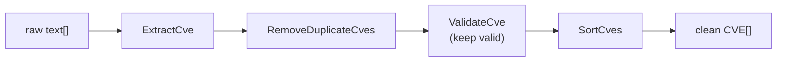

# Examples

This section provides examples of CVE Utils in real-world scenarios, helping you understand how to apply these features in actual projects.

## Examples Overview

### 📊 [Vulnerability Report Analysis](/examples/vulnerability-analysis)

Learn how to extract and analyze CVE information from security bulletins, vulnerability reports, and documents:

- Extract all CVEs from text
- Analyze vulnerability distribution by year
- Generate statistical reports
- Identify vulnerability trends

**Suitable for**: security teams, vulnerability research, compliance audits

### 🗄️ [Vulnerability Database Management](/examples/vulnerability-management)

Learn how to manage and maintain a large CVE database:

- Data import and cleaning
- Deduplication and validation
- Filter and group by condition
- Data export and backup

**Suitable for**: security product development, vulnerability database maintenance, threat intelligence

### ✅ [CVE Validation Processing](/examples/cve-validation)

Master best practices for CVE validation and processing:

- User input validation
- Batch data validation
- Error handling and recovery
- Performance optimization tips

**Suitable for**: web application development, API development, data processing systems

## Quick Start Examples

### Basic Text Processing

```go
package main

import (
    "fmt"
    "github.com/scagogogo/cve-skills"
)

func main() {
    // Sample text
    text := `
    Security Advisory 2024-001

    This update fixes the following critical vulnerabilities:
    - CVE-2021-44228 (Log4Shell)
    - CVE-2022-12345 (custom component)
    - cve-2023-1234 (third-party library)

    Please update to the latest version immediately.
    `

    // Extract all CVEs
    cves := cve.ExtractCve(text)
    fmt.Printf("Found %d CVEs: %v\n", len(cves), cves)

    // Group by year
    grouped := cve.GroupByYear(cves)
    fmt.Println("Grouped by year:")
    for year, yearCves := range grouped {
        fmt.Printf("  %s: %v\n", year, yearCves)
    }
}
```

### Data Cleaning Pipeline

A typical cleaning pipeline extracts, dedups, validates, and sorts raw text into a clean CVE set:



```go
func cleanCveData(rawData []string) []string {
    fmt.Println("=== CVE Data Cleaning Pipeline ===")

    // 1. Extract all possible CVEs
    var allCves []string
    for _, text := range rawData {
        extracted := cve.ExtractCve(text)
        allCves = append(allCves, extracted...)
    }
    fmt.Printf("Step 1 - Extract: %d CVEs\n", len(allCves))

    // 2. Deduplicate
    unique := cve.RemoveDuplicateCves(allCves)
    fmt.Printf("Step 2 - Dedup: %d CVEs\n", len(unique))

    // 3. Validate
    var valid []string
    for _, cveId := range unique {
        if cve.ValidateCve(cveId) {
            valid = append(valid, cveId)
        }
    }
    fmt.Printf("Step 3 - Validate: %d valid CVEs\n", len(valid))

    // 4. Sort
    sorted := cve.SortCves(valid)
    fmt.Printf("Step 4 - Sort: complete\n")

    return sorted
}
```

### Statistical Analysis

```go
func analyzeCveStatistics(cveList []string) {
    fmt.Println("=== CVE Statistical Analysis ===")

    // Basic statistics
    total := len(cveList)
    fmt.Printf("Total: %d CVEs\n", total)

    // Year distribution
    grouped := cve.GroupByYear(cveList)
    fmt.Printf("Years covered: %d\n", len(grouped))

    // Recent trends
    recent1 := cve.GetRecentCves(cveList, 1)
    recent2 := cve.GetRecentCves(cveList, 2)
    recent3 := cve.GetRecentCves(cveList, 3)

    fmt.Printf("Last 1 year: %d\n", len(recent1))
    fmt.Printf("Last 2 years: %d\n", len(recent2))
    fmt.Printf("Last 3 years: %d\n", len(recent3))

    // Detailed year distribution
    fmt.Println("\nYear distribution:")
    for year, cves := range grouped {
        percentage := float64(len(cves)) / float64(total) * 100
        fmt.Printf("  %s: %d (%.1f%%)\n", year, len(cves), percentage)
    }
}
```

## Common Usage Patterns

### 1. Input Validation Pattern

```go
func validateUserInput(input string) (string, error) {
    // Check basic format
    if !cve.IsCve(input) {
        return "", fmt.Errorf("invalid CVE format: %s", input)
    }

    // Format
    formatted := cve.Format(input)

    // Comprehensive validation
    if !cve.ValidateCve(formatted) {
        return "", fmt.Errorf("CVE validation failed: %s", formatted)
    }

    return formatted, nil
}
```

### 2. Batch Processing Pattern

```go
func processBatch(cveList []string) (processed []string, errors []string) {
    for _, cveId := range cveList {
        if validated, err := validateUserInput(cveId); err == nil {
            processed = append(processed, validated)
        } else {
            errors = append(errors, fmt.Sprintf("%s: %v", cveId, err))
        }
    }
    return
}
```

### 3. Conditional Filtering Pattern

```go
func filterByConditions(cveList []string, conditions map[string]interface{}) []string {
    result := cveList

    // Filter by year
    if year, ok := conditions["year"].(int); ok {
        result = cve.FilterCvesByYear(result, year)
    }

    // Filter by year range
    if startYear, ok := conditions["start_year"].(int); ok {
        if endYear, ok := conditions["end_year"].(int); ok {
            result = cve.FilterCvesByYearRange(result, startYear, endYear)
        }
    }

    // Filter by recent years
    if recentYears, ok := conditions["recent_years"].(int); ok {
        result = cve.GetRecentCves(result, recentYears)
    }

    return result
}
```

### 4. Report Generation Pattern

```go
type CveReport struct {
    TotalCount   int
    YearGroups   map[string][]string
    RecentTrends map[string]int
    TopYears     []string
}

func generateReport(cveList []string) *CveReport {
    report := &CveReport{
        TotalCount:   len(cveList),
        YearGroups:   cve.GroupByYear(cveList),
        RecentTrends: make(map[string]int),
    }

    // Compute recent years trend
    for i := 1; i <= 5; i++ {
        recent := cve.GetRecentCves(cveList, i)
        report.RecentTrends[fmt.Sprintf("recent_%d", i)] = len(recent)
    }

    // Find the years with the most CVEs
    maxCount := 0
    for year, cves := range report.YearGroups {
        if len(cves) > maxCount {
            maxCount = len(cves)
            report.TopYears = []string{year}
        } else if len(cves) == maxCount {
            report.TopYears = append(report.TopYears, year)
        }
    }

    return report
}
```

## Performance Optimization Examples

### Large Dataset Processing

```go
func processLargeDataset(cveList []string) {
    fmt.Printf("Processing large dataset: %d CVEs\n", len(cveList))

    start := time.Now()

    // Parallel validation
    validChan := make(chan string, 100)
    var wg sync.WaitGroup

    // Start validation goroutines
    for i := 0; i < 10; i++ {
        wg.Add(1)
        go func() {
            defer wg.Done()
            for cveId := range validChan {
                if cve.ValidateCve(cveId) {
                    // process valid CVE
                }
            }
        }()
    }

    // Send data
    go func() {
        for _, cveId := range cveList {
            validChan <- cveId
        }
        close(validChan)
    }()

    wg.Wait()

    duration := time.Since(start)
    fmt.Printf("Processing complete, took: %v\n", duration)
}
```

### Memory Optimization

```go
func memoryEfficientProcessing(cveList []string) {
    // Pre-allocate slice capacity
    result := make([]string, 0, len(cveList))

    // Use a map for dedup, avoiding repeated allocations
    seen := make(map[string]bool, len(cveList))

    for _, cveId := range cveList {
        formatted := cve.Format(cveId)
        if !seen[formatted] && cve.ValidateCve(formatted) {
            seen[formatted] = true
            result = append(result, formatted)
        }
    }

    // Release the map memory
    seen = nil

    return result
}
```

## Error Handling Examples

### Robust Error Handling

```go
func robustCveProcessing(input string) (result []string, err error) {
    defer func() {
        if r := recover(); r != nil {
            err = fmt.Errorf("error during processing: %v", r)
        }
    }()

    // Check input
    if input == "" {
        return nil, fmt.Errorf("input cannot be empty")
    }

    // Try to extract CVEs
    cves := cve.ExtractCve(input)
    if len(cves) == 0 {
        return nil, fmt.Errorf("no valid CVE found")
    }

    // Validate each CVE
    var valid []string
    var errors []string

    for _, cveId := range cves {
        if cve.ValidateCve(cveId) {
            valid = append(valid, cveId)
        } else {
            errors = append(errors, cveId)
        }
    }

    if len(valid) == 0 {
        return nil, fmt.Errorf("all CVEs are invalid: %v", errors)
    }

    if len(errors) > 0 {
        fmt.Printf("Warning: found %d invalid CVEs: %v\n", len(errors), errors)
    }

    return valid, nil
}
```

## Integration Examples

### Web API Integration

```go
func handleCveValidation(w http.ResponseWriter, r *http.Request) {
    cveId := r.URL.Query().Get("cve")

    if cveId == "" {
        http.Error(w, "Missing CVE parameter", http.StatusBadRequest)
        return
    }

    // Validate the CVE
    if !cve.ValidateCve(cveId) {
        http.Error(w, "Invalid CVE format", http.StatusBadRequest)
        return
    }

    // Extract information
    year := cve.ExtractCveYear(cveId)
    seq := cve.ExtractCveSeq(cveId)

    response := map[string]interface{}{
        "valid":     true,
        "formatted": cve.Format(cveId),
        "year":      year,
        "sequence":  seq,
    }

    w.Header().Set("Content-Type", "application/json")
    json.NewEncoder(w).Encode(response)
}
```

### Database Integration

```go
func saveCvesToDatabase(db *sql.DB, cveList []string) error {
    // Prepare a batch insert statement
    stmt, err := db.Prepare("INSERT INTO cves (cve_id, year, sequence) VALUES (?, ?, ?)")
    if err != nil {
        return err
    }
    defer stmt.Close()

    // Begin a transaction
    tx, err := db.Begin()
    if err != nil {
        return err
    }
    defer tx.Rollback()

    // Batch insert
    for _, cveId := range cveList {
        if cve.ValidateCve(cveId) {
            year := cve.ExtractCveYearAsInt(cveId)
            seq := cve.ExtractCveSeqAsInt(cveId)

            _, err := tx.Stmt(stmt).Exec(cve.Format(cveId), year, seq)
            if err != nil {
                return err
            }
        }
    }

    return tx.Commit()
}
```

## Next Steps

Dive deeper into the specific example that interests you:

- [Vulnerability Report Analysis](/examples/vulnerability-analysis) - learn how to analyze security reports and documents
- [Vulnerability Database Management](/examples/vulnerability-management) - learn management techniques for large databases
- [CVE Validation Processing](/examples/cve-validation) - master best practices for validation and error handling

Or check the [API Reference](/api/) for detailed documentation of all available functions.
