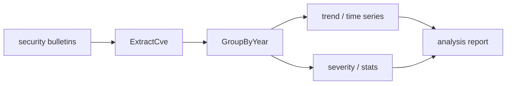

# Vulnerability Report Analysis

This example demonstrates how to use CVE Utils to analyze security bulletins, vulnerability reports, and related documents — extracting valuable vulnerability information and generating analysis reports.

## Scenario Description

As a security team member, you need to:
- Extract CVE information from various security bulletins
- Analyze the time distribution and trends of vulnerabilities
- Generate statistical reports for management reference
- Identify vulnerabilities that need priority handling

The analysis pipeline turns raw bulletins into a structured report:



## Complete Example

### 1. Security Bulletin Analyzer

```go
package main

import (
    "fmt"
    "sort"
    "strings"
    "time"
    "github.com/scagogogo/cve-skills"
)

// SecurityBulletin represents a security bulletin
type SecurityBulletin struct {
    ID          string
    Title       string
    Content     string
    PublishDate time.Time
    Source      string
}

// VulnerabilityAnalyzer vulnerability analyzer
type VulnerabilityAnalyzer struct {
    bulletins []SecurityBulletin
}

func NewVulnerabilityAnalyzer() *VulnerabilityAnalyzer {
    return &VulnerabilityAnalyzer{
        bulletins: make([]SecurityBulletin, 0),
    }
}

func (va *VulnerabilityAnalyzer) AddBulletin(bulletin SecurityBulletin) {
    va.bulletins = append(va.bulletins, bulletin)
}

// AnalyzeAllBulletins analyze all bulletins
func (va *VulnerabilityAnalyzer) AnalyzeAllBulletins() *AnalysisReport {
    fmt.Println("=== Starting security bulletin analysis ===")

    var allCves []string
    bulletinCves := make(map[string][]string)

    // Extract CVEs from each bulletin
    for _, bulletin := range va.bulletins {
        cves := va.extractCvesFromBulletin(bulletin)
        allCves = append(allCves, cves...)
        bulletinCves[bulletin.ID] = cves

        fmt.Printf("Bulletin %s: found %d CVEs\n", bulletin.ID, len(cves))
    }

    // Data cleaning
    cleanedCves := va.cleanCveData(allCves)

    // Generate the analysis report
    report := va.generateAnalysisReport(cleanedCves, bulletinCves)

    return report
}

// extractCvesFromBulletin extract CVEs from a bulletin
func (va *VulnerabilityAnalyzer) extractCvesFromBulletin(bulletin SecurityBulletin) []string {
    // Merge title and content for analysis
    fullText := bulletin.Title + "\n" + bulletin.Content

    // Check whether it contains a CVE
    if !cve.IsContainsCve(fullText) {
        return []string{}
    }

    // Extract all CVEs
    cves := cve.ExtractCve(fullText)

    // Validate each CVE
    var validCves []string
    for _, cveId := range cves {
        if cve.ValidateCve(cveId) {
            validCves = append(validCves, cveId)
        } else {
            fmt.Printf("Warning: invalid CVE %s found in bulletin %s\n", cveId, bulletin.ID)
        }
    }

    return validCves
}

// cleanCveData clean CVE data
func (va *VulnerabilityAnalyzer) cleanCveData(rawCves []string) []string {
    fmt.Printf("Data cleaning: %d raw CVEs\n", len(rawCves))

    // Deduplicate
    unique := cve.RemoveDuplicateCves(rawCves)
    fmt.Printf("After dedup: %d CVEs\n", len(unique))

    // Sort
    sorted := cve.SortCves(unique)
    fmt.Printf("Sorting complete\n")

    return sorted
}
```

### 2. Analysis Report Generation

```go
// AnalysisReport analysis report structure
type AnalysisReport struct {
    TotalCves        int
    UniqueCves       int
    YearDistribution map[string]int
    RecentTrends     map[int]int
    TopYears         []string
    CriticalFindings []string
    Summary          string
}

// generateAnalysisReport generate the analysis report
func (va *VulnerabilityAnalyzer) generateAnalysisReport(cves []string, bulletinCves map[string][]string) *AnalysisReport {
    report := &AnalysisReport{
        UniqueCves:       len(cves),
        YearDistribution: make(map[string]int),
        RecentTrends:     make(map[int]int),
        CriticalFindings: make([]string, 0),
    }

    // Count total CVEs (including duplicates)
    totalCount := 0
    for _, bulletinCveList := range bulletinCves {
        totalCount += len(bulletinCveList)
    }
    report.TotalCves = totalCount

    // Year distribution analysis
    grouped := cve.GroupByYear(cves)
    for year, yearCves := range grouped {
        report.YearDistribution[year] = len(yearCves)
    }

    // Recent years trend
    for i := 1; i <= 5; i++ {
        recent := cve.GetRecentCves(cves, i)
        report.RecentTrends[i] = len(recent)
    }

    // Find the years with the most CVEs
    report.TopYears = va.findTopYears(report.YearDistribution)

    // Critical findings
    report.CriticalFindings = va.identifyCriticalFindings(cves, grouped)

    // Generate summary
    report.Summary = va.generateSummary(report)

    return report
}

// findTopYears find the years with the most CVEs
func (va *VulnerabilityAnalyzer) findTopYears(yearDist map[string]int) []string {
    maxCount := 0
    var topYears []string

    for year, count := range yearDist {
        if count > maxCount {
            maxCount = count
            topYears = []string{year}
        } else if count == maxCount {
            topYears = append(topYears, year)
        }
    }

    sort.Strings(topYears)
    return topYears
}

// identifyCriticalFindings identify critical findings
func (va *VulnerabilityAnalyzer) identifyCriticalFindings(cves []string, grouped map[string][]string) []string {
    var findings []string

    // Check for a large number of recent vulnerabilities
    currentYear := time.Now().Year()
    thisYearCves := cve.FilterCvesByYear(cves, currentYear)
    if len(thisYearCves) > 10 {
        findings = append(findings, fmt.Sprintf("%d vulnerabilities found this year, need priority attention", len(thisYearCves)))
    }

    // Check for anomalous years
    avgPerYear := float64(len(cves)) / float64(len(grouped))
    for year, yearCves := range grouped {
        if float64(len(yearCves)) > avgPerYear*1.5 {
            findings = append(findings, fmt.Sprintf("Anomalously high vulnerability count in %s: %d", year, len(yearCves)))
        }
    }

    // Check recent trend
    recent1 := cve.GetRecentCves(cves, 1)
    recent2 := cve.GetRecentCves(cves, 2)
    if len(recent1) > len(recent2)/2 {
        findings = append(findings, "Vulnerabilities grew rapidly over the last year, recommend strengthening security defenses")
    }

    return findings
}

// generateSummary generate summary
func (va *VulnerabilityAnalyzer) generateSummary(report *AnalysisReport) string {
    var summary strings.Builder

    summary.WriteString(fmt.Sprintf("This analysis processed %d CVEs (%d after dedup).",
        report.TotalCves, report.UniqueCves))

    if len(report.YearDistribution) > 0 {
        summary.WriteString(fmt.Sprintf(" Vulnerabilities span %d years,", len(report.YearDistribution)))

        if len(report.TopYears) > 0 {
            summary.WriteString(fmt.Sprintf(" with %s having the most.",
                strings.Join(report.TopYears, ", ")))
        }
    }

    if len(report.CriticalFindings) > 0 {
        summary.WriteString(" The following critical issues need attention.")
    }

    return summary.String()
}
```

### 3. Report Output and Visualization

```go
// PrintReport print the analysis report
func (va *VulnerabilityAnalyzer) PrintReport(report *AnalysisReport) {
    fmt.Println("\n" + strings.Repeat("=", 50))
    fmt.Println("           Vulnerability Analysis Report")
    fmt.Println(strings.Repeat("=", 50))

    // Basic statistics
    fmt.Printf("Total CVEs: %d\n", report.TotalCves)
    fmt.Printf("Unique CVEs: %d\n", report.UniqueCves)
    fmt.Printf("Duplicate rate: %.1f%%\n",
        float64(report.TotalCves-report.UniqueCves)/float64(report.TotalCves)*100)

    // Year distribution
    fmt.Println("\nYear distribution:")
    years := make([]string, 0, len(report.YearDistribution))
    for year := range report.YearDistribution {
        years = append(years, year)
    }
    sort.Strings(years)

    for _, year := range years {
        count := report.YearDistribution[year]
        percentage := float64(count) / float64(report.UniqueCves) * 100
        bar := strings.Repeat("█", count/2) // simple bar chart
        fmt.Printf("  %s: %3d (%5.1f%%) %s\n", year, count, percentage, bar)
    }

    // Recent trend
    fmt.Println("\nRecent trend:")
    for i := 1; i <= 5; i++ {
        count := report.RecentTrends[i]
        fmt.Printf("  Last %d years: %d\n", i, count)
    }

    // Critical findings
    if len(report.CriticalFindings) > 0 {
        fmt.Println("\nCritical findings:")
        for i, finding := range report.CriticalFindings {
            fmt.Printf("  %d. %s\n", i+1, finding)
        }
    }

    // Summary
    fmt.Println("\nSummary:")
    fmt.Printf("  %s\n", report.Summary)

    fmt.Println(strings.Repeat("=", 50))
}

// ExportToCSV export to CSV format
func (va *VulnerabilityAnalyzer) ExportToCSV(cves []string, filename string) error {
    file, err := os.Create(filename)
    if err != nil {
        return err
    }
    defer file.Close()

    writer := csv.NewWriter(file)
    defer writer.Flush()

    // Write header row
    headers := []string{"CVE", "Year", "Sequence", "Age_Years"}
    writer.Write(headers)

    currentYear := time.Now().Year()

    // Write data rows
    for _, cveId := range cves {
        year := cve.ExtractCveYearAsInt(cveId)
        seq := cve.ExtractCveSeqAsInt(cveId)
        age := currentYear - year

        record := []string{
            cveId,
            fmt.Sprintf("%d", year),
            fmt.Sprintf("%d", seq),
            fmt.Sprintf("%d", age),
        }
        writer.Write(record)
    }

    return nil
}
```

### 4. Main Program Example

```go
func main() {
    // Create the analyzer
    analyzer := NewVulnerabilityAnalyzer()

    // Add sample security bulletins
    bulletins := []SecurityBulletin{
        {
            ID:    "SEC-2024-001",
            Title: "Critical security update - fixes multiple high-risk vulnerabilities",
            Content: `
            This update fixes the following critical vulnerabilities:
            1. CVE-2021-44228 - Apache Log4j remote code execution
            2. CVE-2022-12345 - custom component privilege escalation
            3. CVE-2023-1234 - third-party library information disclosure

            All users are advised to update to the latest version immediately.
            `,
            PublishDate: time.Now().AddDate(0, -1, 0),
            Source:      "Internal security team",
        },
        {
            ID:    "SEC-2024-002",
            Title: "Emergency security patch",
            Content: `
            New zero-day vulnerabilities discovered:
            - CVE-2024-5678 - core component remote code execution
            - cve-2024-9999 - authentication bypass

            Also fixes the previously reported CVE-2023-1234.
            `,
            PublishDate: time.Now().AddDate(0, 0, -7),
            Source:      "External security researcher",
        },
        {
            ID:    "SEC-2024-003",
            Title: "Monthly security update",
            Content: `
            Vulnerabilities fixed this month include:
            CVE-2022-11111, CVE-2022-22222, CVE-2023-33333
            plus several low-severity vulnerabilities CVE-2024-1111 to CVE-2024-1115.
            `,
            PublishDate: time.Now().AddDate(0, 0, -15),
            Source:      "Product security team",
        },
    }

    // Add bulletins to the analyzer
    for _, bulletin := range bulletins {
        analyzer.AddBulletin(bulletin)
    }

    // Run the analysis
    report := analyzer.AnalyzeAllBulletins()

    // Print the report
    analyzer.PrintReport(report)

    // Export data
    allCves := []string{}
    for _, bulletin := range bulletins {
        cves := analyzer.extractCvesFromBulletin(bulletin)
        allCves = append(allCves, cves...)
    }

    cleanedCves := analyzer.cleanCveData(allCves)

    if err := analyzer.ExportToCSV(cleanedCves, "vulnerability_analysis.csv"); err != nil {
        fmt.Printf("CSV export failed: %v\n", err)
    } else {
        fmt.Println("Data exported to vulnerability_analysis.csv")
    }
}
```

## Advanced Analysis

### 1. Time Series Analysis

```go
func (va *VulnerabilityAnalyzer) analyzeTimeSeries(cves []string) {
    fmt.Println("\n=== Time Series Analysis ===")

    grouped := cve.GroupByYear(cves)

    // Sort by year
    years := make([]string, 0, len(grouped))
    for year := range grouped {
        years = append(years, year)
    }
    sort.Strings(years)

    // Compute yearly growth rate
    fmt.Println("Yearly growth rate:")
    for i := 1; i < len(years); i++ {
        prevYear := years[i-1]
        currYear := years[i]

        prevCount := len(grouped[prevYear])
        currCount := len(grouped[currYear])

        if prevCount > 0 {
            growthRate := float64(currCount-prevCount) / float64(prevCount) * 100
            fmt.Printf("  %s -> %s: %+.1f%% (%d -> %d)\n",
                prevYear, currYear, growthRate, prevCount, currCount)
        }
    }

    // Moving average
    if len(years) >= 3 {
        fmt.Println("\n3-year moving average:")
        for i := 2; i < len(years); i++ {
            sum := 0
            for j := i - 2; j <= i; j++ {
                sum += len(grouped[years[j]])
            }
            avg := float64(sum) / 3.0
            fmt.Printf("  %s: %.1f\n", years[i], avg)
        }
    }
}
```

### 2. Severity Assessment

```go
func (va *VulnerabilityAnalyzer) assessSeverity(cves []string) map[string]string {
    severity := make(map[string]string)

    for _, cveId := range cves {
        year := cve.ExtractCveYearAsInt(cveId)
        seq := cve.ExtractCveSeqAsInt(cveId)

        // Simple severity assessment logic (in practice, query a CVSS database)
        currentYear := time.Now().Year()
        age := currentYear - year

        if age <= 1 && seq > 10000 {
            severity[cveId] = "Critical"
        } else if age <= 2 && seq > 5000 {
            severity[cveId] = "High"
        } else if age <= 3 {
            severity[cveId] = "Medium"
        } else {
            severity[cveId] = "Low"
        }
    }

    return severity
}
```

### 3. Correlation Analysis

```go
func (va *VulnerabilityAnalyzer) analyzeCorrelations(bulletinCves map[string][]string) {
    fmt.Println("\n=== Correlation Analysis ===")

    // Find CVEs that frequently appear together
    cooccurrence := make(map[string]map[string]int)

    for _, cves := range bulletinCves {
        for i, cveA := range cves {
            if cooccurrence[cveA] == nil {
                cooccurrence[cveA] = make(map[string]int)
            }

            for j, cveB := range cves {
                if i != j {
                    cooccurrence[cveA][cveB]++
                }
            }
        }
    }

    // Output high-correlation CVE pairs
    fmt.Println("High-correlation CVE pairs:")
    for cveA, related := range cooccurrence {
        for cveB, count := range related {
            if count >= 2 && cveA < cveB { // avoid duplicate output
                fmt.Printf("  %s <-> %s: co-occur %d times\n", cveA, cveB, count)
            }
        }
    }
}
```

## Use Cases

### 1. Daily Security Team Analysis

```bash
# Run the analyzer
go run vulnerability_analyzer.go

# View the generated report
cat vulnerability_analysis.csv
```

### 2. Automated Integration

```go
// Periodic analysis task
func scheduleAnalysis() {
    ticker := time.NewTicker(24 * time.Hour) // run once a day
    defer ticker.Stop()

    for {
        select {
        case <-ticker.C:
            analyzer := NewVulnerabilityAnalyzer()
            // Load the latest bulletins from a data source
            // analyzer.LoadFromDatabase()

            report := analyzer.AnalyzeAllBulletins()

            // Send the report
            // sendReportToTeam(report)
        }
    }
}
```

### 3. Integration with Other Systems

```go
// Integrate with a threat intelligence system
func enrichWithThreatIntel(cves []string) map[string]ThreatInfo {
    threatInfo := make(map[string]ThreatInfo)

    for _, cveId := range cves {
        // Query the threat intelligence database
        info := queryThreatIntelligence(cveId)
        threatInfo[cveId] = info
    }

    return threatInfo
}
```

## Best Practices

1. **Data validation**: Always validate the format of extracted CVEs
2. **Error handling**: Handle invalid data with appropriate error handling
3. **Performance optimization**: Use batch processing for large datasets
4. **Report format**: Provide multiple output formats (console, CSV, JSON)
5. **Automation**: Integrate into CI/CD pipelines for periodic analysis

This example demonstrates how to use CVE Utils to build a complete vulnerability analysis system that you can extend and customize as needed.
