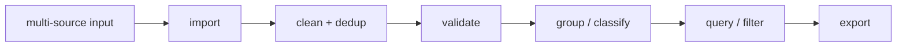

# Vulnerability Database Management

This example demonstrates how to use CVE Utils to manage a large vulnerability database, covering the full data management workflow: import, cleaning, validation, classification, and export.

## Scenario Description

As a security product developer or vulnerability database maintainer, you need to:
- Import CVE data from multiple data sources
- Clean and validate data quality
- Classify and organize data by various criteria
- Provide efficient query and export functionality
- Maintain data consistency and integrity

The full data management lifecycle:



## Complete Example

### 1. Vulnerability Database Manager

```go
package main

import (
    "encoding/json"
    "fmt"
    "os"
    "sort"
    "strings"
    "time"
    "github.com/scagogogo/cve-skills"
)

// VulnerabilityRecord vulnerability record structure
type VulnerabilityRecord struct {
    CVE         string    `json:"cve"`
    Year        int       `json:"year"`
    Sequence    int       `json:"sequence"`
    Title       string    `json:"title,omitempty"`
    Description string    `json:"description,omitempty"`
    Severity    string    `json:"severity,omitempty"`
    Source      string    `json:"source,omitempty"`
    ImportDate  time.Time `json:"import_date"`
    LastUpdate  time.Time `json:"last_update"`
}

// VulnerabilityDatabase vulnerability database manager
type VulnerabilityDatabase struct {
    records    map[string]*VulnerabilityRecord
    sources    map[string]int // source statistics
    statistics DatabaseStats
}

// DatabaseStats database statistics
type DatabaseStats struct {
    TotalRecords      int
    ValidRecords      int
    InvalidRecords    int
    YearDistribution  map[string]int
    SourceDistribution map[string]int
    LastUpdate        time.Time
}

func NewVulnerabilityDatabase() *VulnerabilityDatabase {
    return &VulnerabilityDatabase{
        records: make(map[string]*VulnerabilityRecord),
        sources: make(map[string]int),
        statistics: DatabaseStats{
            YearDistribution:   make(map[string]int),
            SourceDistribution: make(map[string]int),
        },
    }
}

// ImportFromCSV import data from a CSV file
func (vdb *VulnerabilityDatabase) ImportFromCSV(filename string) error {
    fmt.Printf("Importing from CSV file: %s\n", filename)

    file, err := os.Open(filename)
    if err != nil {
        return fmt.Errorf("cannot open file: %v", err)
    }
    defer file.Close()

    reader := csv.NewReader(file)
    records, err := reader.ReadAll()
    if err != nil {
        return fmt.Errorf("failed to read CSV: %v", err)
    }

    imported := 0
    skipped := 0

    // Skip the header row
    for i, record := range records[1:] {
        if len(record) < 2 {
            skipped++
            continue
        }

        cveId := strings.TrimSpace(record[0])
        source := "CSV Import"
        if len(record) > 2 {
            source = strings.TrimSpace(record[2])
        }

        if vdb.AddRecord(cveId, "", "", "", source) {
            imported++
        } else {
            skipped++
        }

        if (i+1)%1000 == 0 {
            fmt.Printf("Processed %d records...\n", i+1)
        }
    }

    fmt.Printf("Import complete: %d succeeded, %d skipped\n", imported, skipped)
    return nil
}

// ImportFromText extract and import CVEs from text
func (vdb *VulnerabilityDatabase) ImportFromText(text, source string) int {
    cves := cve.ExtractCve(text)
    imported := 0

    for _, cveId := range cves {
        if vdb.AddRecord(cveId, "", "", "", source) {
            imported++
        }
    }

    return imported
}

// AddRecord add a vulnerability record
func (vdb *VulnerabilityDatabase) AddRecord(cveId, title, description, severity, source string) bool {
    // Validate CVE format
    if !cve.ValidateCve(cveId) {
        return false
    }

    // Format the CVE
    formattedCve := cve.Format(cveId)

    // Check whether it already exists
    if existing, exists := vdb.records[formattedCve]; exists {
        // Update the existing record
        existing.LastUpdate = time.Now()
        if title != "" {
            existing.Title = title
        }
        if description != "" {
            existing.Description = description
        }
        if severity != "" {
            existing.Severity = severity
        }
        return true
    }

    // Create a new record
    record := &VulnerabilityRecord{
        CVE:         formattedCve,
        Year:        cve.ExtractCveYearAsInt(formattedCve),
        Sequence:    cve.ExtractCveSeqAsInt(formattedCve),
        Title:       title,
        Description: description,
        Severity:    severity,
        Source:      source,
        ImportDate:  time.Now(),
        LastUpdate:  time.Now(),
    }

    vdb.records[formattedCve] = record
    vdb.sources[source]++

    return true
}

// CleanDatabase clean the database
func (vdb *VulnerabilityDatabase) CleanDatabase() *CleaningReport {
    fmt.Println("Starting database cleaning...")

    report := &CleaningReport{
        StartTime: time.Now(),
    }

    var toRemove []string

    for cveId, record := range vdb.records {
        // Validate CVE format
        if !cve.ValidateCve(cveId) {
            toRemove = append(toRemove, cveId)
            report.InvalidCves = append(report.InvalidCves, cveId)
            continue
        }

        // Check year reasonableness
        if !cve.IsCveYearOk(cveId, 10) {
            toRemove = append(toRemove, cveId)
            report.InvalidYears = append(report.InvalidYears, cveId)
            continue
        }

        // Validate record integrity
        if record.Year != cve.ExtractCveYearAsInt(cveId) ||
           record.Sequence != cve.ExtractCveSeqAsInt(cveId) {
            // Repair the record
            record.Year = cve.ExtractCveYearAsInt(cveId)
            record.Sequence = cve.ExtractCveSeqAsInt(cveId)
            record.LastUpdate = time.Now()
            report.FixedRecords = append(report.FixedRecords, cveId)
        }
    }

    // Remove invalid records
    for _, cveId := range toRemove {
        delete(vdb.records, cveId)
    }

    report.EndTime = time.Now()
    report.RemovedCount = len(toRemove)
    report.TotalProcessed = len(vdb.records) + len(toRemove)

    fmt.Printf("Cleaning complete: processed %d records, removed %d invalid, repaired %d records\n",
        report.TotalProcessed, report.RemovedCount, len(report.FixedRecords))

    return report
}

// CleaningReport cleaning report
type CleaningReport struct {
    StartTime      time.Time
    EndTime        time.Time
    TotalProcessed int
    RemovedCount   int
    InvalidCves    []string
    InvalidYears   []string
    FixedRecords   []string
}
```

### 2. Query and Filter

```go
// QueryOptions query options
type QueryOptions struct {
    Year        *int
    StartYear   *int
    EndYear     *int
    RecentYears *int
    Source      string
    Severity    string
    Keyword     string
    Limit       int
    Offset      int
}

// Query query vulnerability records
func (vdb *VulnerabilityDatabase) Query(options QueryOptions) []*VulnerabilityRecord {
    var results []*VulnerabilityRecord

    // Get all CVE IDs
    var cveIds []string
    for cveId := range vdb.records {
        cveIds = append(cveIds, cveId)
    }

    // Filter by year
    if options.Year != nil {
        cveIds = cve.FilterCvesByYear(cveIds, *options.Year)
    } else if options.StartYear != nil && options.EndYear != nil {
        cveIds = cve.FilterCvesByYearRange(cveIds, *options.StartYear, *options.EndYear)
    } else if options.RecentYears != nil {
        cveIds = cve.GetRecentCves(cveIds, *options.RecentYears)
    }

    // Apply other filters
    for _, cveId := range cveIds {
        record := vdb.records[cveId]

        // Filter by source
        if options.Source != "" && record.Source != options.Source {
            continue
        }

        // Filter by severity
        if options.Severity != "" && record.Severity != options.Severity {
            continue
        }

        // Filter by keyword
        if options.Keyword != "" {
            keyword := strings.ToLower(options.Keyword)
            if !strings.Contains(strings.ToLower(record.Title), keyword) &&
               !strings.Contains(strings.ToLower(record.Description), keyword) {
                continue
            }
        }

        results = append(results, record)
    }

    // Sort
    sort.Slice(results, func(i, j int) bool {
        return cve.CompareCves(results[i].CVE, results[j].CVE) < 0
    })

    // Paginate
    if options.Offset > 0 && options.Offset < len(results) {
        results = results[options.Offset:]
    }

    if options.Limit > 0 && options.Limit < len(results) {
        results = results[:options.Limit]
    }

    return results
}

// GetStatistics get database statistics
func (vdb *VulnerabilityDatabase) GetStatistics() DatabaseStats {
    stats := DatabaseStats{
        TotalRecords:       len(vdb.records),
        YearDistribution:   make(map[string]int),
        SourceDistribution: make(map[string]int),
        LastUpdate:         time.Now(),
    }

    // Tally year distribution
    var cveIds []string
    for cveId := range vdb.records {
        cveIds = append(cveIds, cveId)
    }

    grouped := cve.GroupByYear(cveIds)
    for year, yearCves := range grouped {
        stats.YearDistribution[year] = len(yearCves)
    }

    // Tally source distribution
    for source, count := range vdb.sources {
        stats.SourceDistribution[source] = count
    }

    // Count valid/invalid records
    validCount := 0
    for cveId := range vdb.records {
        if cve.ValidateCve(cveId) {
            validCount++
        }
    }

    stats.ValidRecords = validCount
    stats.InvalidRecords = stats.TotalRecords - validCount

    vdb.statistics = stats
    return stats
}

// PrintStatistics print statistics
func (vdb *VulnerabilityDatabase) PrintStatistics() {
    stats := vdb.GetStatistics()

    fmt.Println("\n" + strings.Repeat("=", 50))
    fmt.Println("           Database Statistics")
    fmt.Println(strings.Repeat("=", 50))

    fmt.Printf("Total records: %d\n", stats.TotalRecords)
    fmt.Printf("Valid records: %d (%.1f%%)\n",
        stats.ValidRecords,
        float64(stats.ValidRecords)/float64(stats.TotalRecords)*100)
    fmt.Printf("Invalid records: %d (%.1f%%)\n",
        stats.InvalidRecords,
        float64(stats.InvalidRecords)/float64(stats.TotalRecords)*100)

    // Year distribution
    fmt.Println("\nYear distribution (Top 10):")
    type yearCount struct {
        year  string
        count int
    }

    var yearCounts []yearCount
    for year, count := range stats.YearDistribution {
        yearCounts = append(yearCounts, yearCount{year, count})
    }

    sort.Slice(yearCounts, func(i, j int) bool {
        return yearCounts[i].count > yearCounts[j].count
    })

    for i, yc := range yearCounts {
        if i >= 10 {
            break
        }
        percentage := float64(yc.count) / float64(stats.TotalRecords) * 100
        fmt.Printf("  %s: %5d (%5.1f%%)\n", yc.year, yc.count, percentage)
    }

    // Source distribution
    fmt.Println("\nSource distribution:")
    for source, count := range stats.SourceDistribution {
        percentage := float64(count) / float64(stats.TotalRecords) * 100
        fmt.Printf("  %-20s: %5d (%5.1f%%)\n", source, count, percentage)
    }

    fmt.Printf("\nLast update: %s\n", stats.LastUpdate.Format("2006-01-02 15:04:05"))
    fmt.Println(strings.Repeat("=", 50))
}
```

### 3. Data Export

```go
// ExportToJSON export to JSON format
func (vdb *VulnerabilityDatabase) ExportToJSON(filename string, options QueryOptions) error {
    records := vdb.Query(options)

    file, err := os.Create(filename)
    if err != nil {
        return err
    }
    defer file.Close()

    encoder := json.NewEncoder(file)
    encoder.SetIndent("", "  ")

    exportData := map[string]interface{}{
        "export_time":   time.Now(),
        "total_records": len(records),
        "query_options": options,
        "records":       records,
    }

    return encoder.Encode(exportData)
}

// ExportToCSV export to CSV format
func (vdb *VulnerabilityDatabase) ExportToCSV(filename string, options QueryOptions) error {
    records := vdb.Query(options)

    file, err := os.Create(filename)
    if err != nil {
        return err
    }
    defer file.Close()

    writer := csv.NewWriter(file)
    defer writer.Flush()

    // Write header row
    headers := []string{
        "CVE", "Year", "Sequence", "Title", "Description",
        "Severity", "Source", "Import_Date", "Last_Update",
    }
    writer.Write(headers)

    // Write data rows
    for _, record := range records {
        row := []string{
            record.CVE,
            fmt.Sprintf("%d", record.Year),
            fmt.Sprintf("%d", record.Sequence),
            record.Title,
            record.Description,
            record.Severity,
            record.Source,
            record.ImportDate.Format("2006-01-02 15:04:05"),
            record.LastUpdate.Format("2006-01-02 15:04:05"),
        }
        writer.Write(row)
    }

    return nil
}

// BackupDatabase back up the database
func (vdb *VulnerabilityDatabase) BackupDatabase(backupDir string) error {
    timestamp := time.Now().Format("20060102_150405")

    // Create backup directory
    if err := os.MkdirAll(backupDir, 0755); err != nil {
        return err
    }

    // Back up full data
    fullBackupFile := filepath.Join(backupDir, fmt.Sprintf("full_backup_%s.json", timestamp))
    if err := vdb.ExportToJSON(fullBackupFile, QueryOptions{}); err != nil {
        return fmt.Errorf("full backup failed: %v", err)
    }

    // Back up statistics
    statsFile := filepath.Join(backupDir, fmt.Sprintf("statistics_%s.json", timestamp))
    stats := vdb.GetStatistics()

    file, err := os.Create(statsFile)
    if err != nil {
        return err
    }
    defer file.Close()

    encoder := json.NewEncoder(file)
    encoder.SetIndent("", "  ")
    if err := encoder.Encode(stats); err != nil {
        return fmt.Errorf("statistics backup failed: %v", err)
    }

    fmt.Printf("Backup complete:\n")
    fmt.Printf("  Full data: %s\n", fullBackupFile)
    fmt.Printf("  Statistics: %s\n", statsFile)

    return nil
}
```

### 4. Main Program Example

```go
func main() {
    // Create the database manager
    vdb := NewVulnerabilityDatabase()

    fmt.Println("=== CVE Vulnerability Database Management System ===")

    // Simulate importing from multiple data sources
    fmt.Println("\n1. Data import phase")

    // Import from text
    securityBulletins := []string{
        "Security advisory: critical vulnerabilities CVE-2021-44228, CVE-2022-12345 found",
        "Update fixes CVE-2023-1234 and cve-2023-5678",
        "Emergency patch: CVE-2024-1111 to CVE-2024-1115",
    }

    for i, bulletin := range securityBulletins {
        source := fmt.Sprintf("Security Bulletin %d", i+1)
        imported := vdb.ImportFromText(bulletin, source)
        fmt.Printf("Imported %d CVEs from %s\n", imported, source)
    }

    // Manually add some records
    testRecords := []struct {
        cve, title, severity string
    }{
        {"CVE-2021-44228", "Apache Log4j RCE", "Critical"},
        {"CVE-2022-12345", "Custom Component Privilege Escalation", "High"},
        {"CVE-2023-1234", "Third-party Library Information Disclosure", "Medium"},
        {"CVE-2024-5678", "Zero-day Vulnerability", "Critical"},
    }

    for _, record := range testRecords {
        vdb.AddRecord(record.cve, record.title, "", record.severity, "Manual Entry")
    }

    fmt.Printf("Manually added %d detailed records\n", len(testRecords))

    // 2. Data cleaning
    fmt.Println("\n2. Data cleaning phase")
    cleaningReport := vdb.CleanDatabase()

    if len(cleaningReport.FixedRecords) > 0 {
        fmt.Printf("Repaired records: %v\n", cleaningReport.FixedRecords)
    }

    // 3. Statistical analysis
    fmt.Println("\n3. Statistical analysis phase")
    vdb.PrintStatistics()

    // 4. Query examples
    fmt.Println("\n4. Query examples")

    // Query CVEs from the last 2 years
    recentOptions := QueryOptions{RecentYears: &[]int{2}[0]}
    recentCves := vdb.Query(recentOptions)
    fmt.Printf("CVEs from the last 2 years (%d): ", len(recentCves))
    for _, record := range recentCves {
        fmt.Printf("%s ", record.CVE)
    }
    fmt.Println()

    // Query critical vulnerabilities
    criticalOptions := QueryOptions{Severity: "Critical"}
    criticalCves := vdb.Query(criticalOptions)
    fmt.Printf("Critical vulnerabilities (%d): ", len(criticalCves))
    for _, record := range criticalCves {
        fmt.Printf("%s ", record.CVE)
    }
    fmt.Println()

    // 5. Data export
    fmt.Println("\n5. Data export phase")

    // Export all data as JSON
    if err := vdb.ExportToJSON("all_vulnerabilities.json", QueryOptions{}); err != nil {
        fmt.Printf("JSON export failed: %v\n", err)
    } else {
        fmt.Println("Exported all data to all_vulnerabilities.json")
    }

    // Export recent data as CSV
    if err := vdb.ExportToCSV("recent_vulnerabilities.csv", recentOptions); err != nil {
        fmt.Printf("CSV export failed: %v\n", err)
    } else {
        fmt.Println("Exported recent data to recent_vulnerabilities.csv")
    }

    // 6. Data backup
    fmt.Println("\n6. Data backup phase")
    if err := vdb.BackupDatabase("./backups"); err != nil {
        fmt.Printf("Backup failed: %v\n", err)
    }

    fmt.Println("\n=== Management workflow complete ===")
}
```

## Advanced Features

### 1. Data Sync

```go
func (vdb *VulnerabilityDatabase) SyncWithRemote(remoteURL string) error {
    // Sync data from a remote source
    resp, err := http.Get(remoteURL)
    if err != nil {
        return err
    }
    defer resp.Body.Close()

    var remoteData []VulnerabilityRecord
    if err := json.NewDecoder(resp.Body).Decode(&remoteData); err != nil {
        return err
    }

    syncCount := 0
    for _, record := range remoteData {
        if vdb.AddRecord(record.CVE, record.Title, record.Description,
                         record.Severity, "Remote Sync") {
            syncCount++
        }
    }

    fmt.Printf("Sync complete: %d records\n", syncCount)
    return nil
}
```

### 2. Data Validation

```go
func (vdb *VulnerabilityDatabase) ValidateDatabase() []ValidationError {
    var errors []ValidationError

    for cveId, record := range vdb.records {
        // Validate CVE format
        if !cve.ValidateCve(cveId) {
            errors = append(errors, ValidationError{
                CVE:     cveId,
                Type:    "FORMAT_ERROR",
                Message: "Invalid CVE format",
            })
        }

        // Validate year consistency
        if record.Year != cve.ExtractCveYearAsInt(cveId) {
            errors = append(errors, ValidationError{
                CVE:     cveId,
                Type:    "YEAR_MISMATCH",
                Message: "Year field does not match CVE",
            })
        }

        // Validate sequence consistency
        if record.Sequence != cve.ExtractCveSeqAsInt(cveId) {
            errors = append(errors, ValidationError{
                CVE:     cveId,
                Type:    "SEQUENCE_MISMATCH",
                Message: "Sequence field does not match CVE",
            })
        }
    }

    return errors
}

type ValidationError struct {
    CVE     string
    Type    string
    Message string
}
```

### 3. Performance Monitoring

```go
func (vdb *VulnerabilityDatabase) GetPerformanceMetrics() PerformanceMetrics {
    start := time.Now()

    // Test query performance
    queryStart := time.Now()
    vdb.Query(QueryOptions{Limit: 1000})
    queryDuration := time.Since(queryStart)

    // Test statistics performance
    statsStart := time.Now()
    vdb.GetStatistics()
    statsDuration := time.Since(statsStart)

    return PerformanceMetrics{
        TotalRecords:    len(vdb.records),
        QueryTime:       queryDuration,
        StatisticsTime:  statsDuration,
        MemoryUsage:     getMemoryUsage(),
        LastMeasurement: time.Now(),
    }
}

type PerformanceMetrics struct {
    TotalRecords    int
    QueryTime       time.Duration
    StatisticsTime  time.Duration
    MemoryUsage     uint64
    LastMeasurement time.Time
}
```

## Best Practices

1. **Regular cleaning**: Schedule periodic tasks to clean data
2. **Incremental import**: Use incremental import for large datasets
3. **Index optimization**: Build indexes for commonly queried fields
4. **Backup strategy**: Implement regular backups and version control
5. **Monitoring and alerting**: Monitor data quality and system performance

This example demonstrates how to build a complete vulnerability database management system that you can extend with more features as needed.
