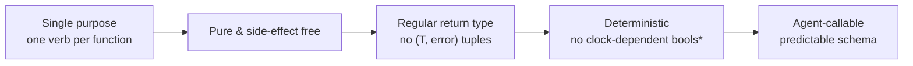
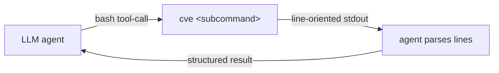
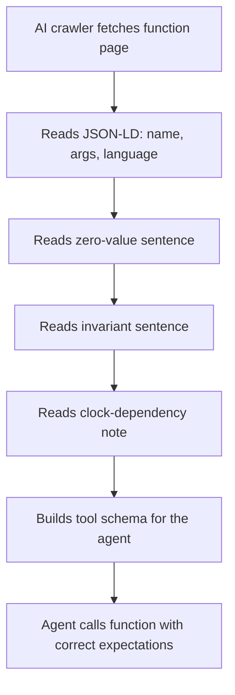
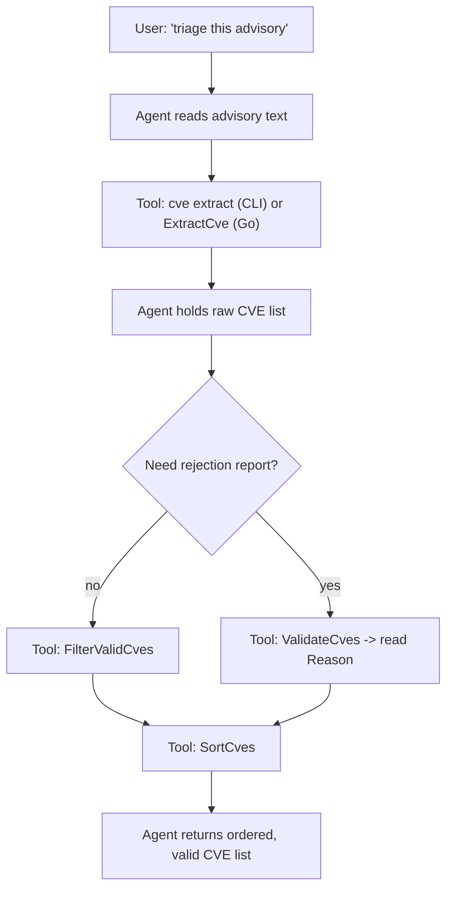
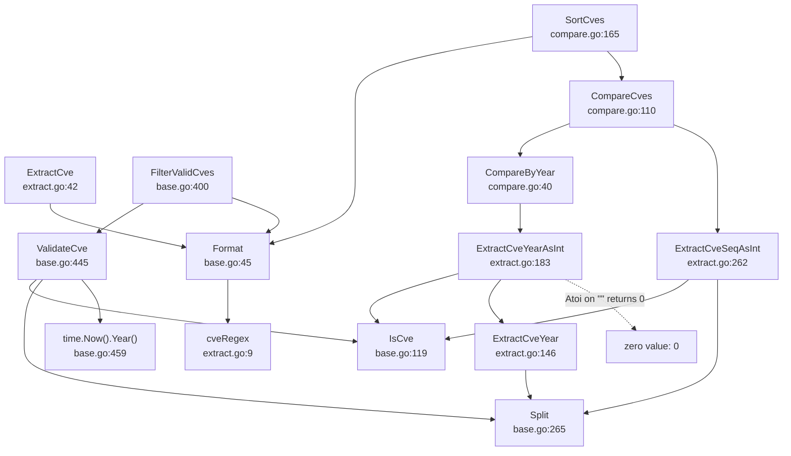

# AI Agent Integration

The `cve` package is built **AI First**: every public function has a single-purpose signature, a regular return type, and no hidden side effects, so a language model can call it reliably without reading the source. The same design carries over to the `cve` CLI, whose line-oriented stdout is meant to be parsed by an agent loop. This page explains how the library's shape makes it friendly to LLM tool-use, how to expose function semantics to AI crawlers, and how to chain `ExtractCve` + `FilterValidCves` into an end-to-end vulnerability extraction pipeline.

:::tip Who should read this
Engineers wiring CVE processing into an LLM agent, RAG pipeline, or autonomous triage workflow. You should already know the package's [basic usage](/guide/basic-usage); this page focuses on the *machine-facing* properties of the API rather than the human-facing ones.
:::

## Why an AI First API shape

An LLM tool-call is only as reliable as the function it wraps. The model must infer the argument types, the return shape, and the failure mode from a short signature and a docstring — anything ambiguous becomes a guessing game that degrades with scale. The `cve` package was authored with that constraint in mind, so every entry point obeys four invariants:



`*` The one clock-aware family is the year-bound check — `ValidateCve`, `ValidateCves`, `IsCveYearOk`, and `IsCveYearOkWithCutoff` all consult `time.Now().Year()`. That is intentional (CVE years are bounded by the current calendar year), and an agent should treat it as a deliberate, documented rule rather than a surprise.

| Invariant | What it means for an agent | Where it shows up |
| --- | --- | --- |
| Single purpose | The function name is the verb; no flags toggle unrelated behavior | `ExtractCve`, `SortCves`, `DiffCves` |
| Pure & side-effect free | Calling twice with the same input gives the same output; no I/O, no globals mutated | All public functions except `GenerateFakeCve` (random) |
| Regular return type | Returns a `string`, `[]string`, `bool`, or `int` — never `(value, error)` | Every public function |
| Deterministic | A boolean today is a boolean tomorrow | All except the year-bound family noted above |

The "no `(T, error)` tuples" rule is the most consequential. Functions that *could* fail (parsing a year, compiling a wildcard) handle the failure internally by returning a safe zero value (`""`, `0`, `false`, `nil`) instead of bubbling an error. An agent therefore never has to branch on `err != nil` — it can chain calls directly.

```go
// No error handling needed: ExtractCveYear returns "" for a non-CVE,
// strconv.Atoi returns 0 for a non-numeric year. The pipeline just keeps going.
year := cve.ExtractCveYearAsInt("not-a-cve") // -> 0
if year >= 1999 {
    // skipped safely, no crash, no error to surface to the LLM
}
```

🤖 For a tool-calling agent this is gold: the JSON schema of every wrapper is `{ input: string, output: string | string[] | boolean | integer }` with no optional error field, so the model can plan a chain without reserving a fallback branch for every step.

## Function signatures a model can trust

Because every public function follows the invariants above, an agent's tool definitions collapse to a few shapes. The table below maps each public function to the schema an LLM would advertise; note how none of them carry an error channel.

| Function | Signature | Agent schema (input → output) | Notes for the model |
| --- | --- | --- | --- |
| `Format` | `(cve string) string` | `string → string` | Idempotent; safe to call on already-formatted input |
| `IsCve` | `(text string) bool` | `string → boolean` | Format only; tolerates surrounding whitespace |
| `ValidateCve` | `(cve string) bool` | `string → boolean` | Adds year + sequence rules |
| `ValidateCves` | `(cveSlice []string) []CveValidationResult` | `string[] → object[]` | Each object has `cve`, `valid`, `reason` |
| `FilterValidCves` | `(cveSlice []string) []string` | `string[] → string[]` | Drops invalids silently, normalizes survivors |
| `ExtractCve` | `(text string) []string` | `string → string[]` | Returns `[]` (never `nil`-as-error) when none found |
| `ExtractFirstCve` | `(text string) string` | `string → string` | Returns `""` when none found |
| `CompareCves` | `(cveA, cveB string) int` | `string, string → integer` | `-1` / `0` / `1` |
| `SortCves` | `(cveSlice []string) []string` | `string[] → string[]` | Does not mutate input; returns a new slice |
| `GenerateCve` | `(year, seq int) string` | `integer, integer → string` | No validity check on the inputs |

⚠️ The one function an agent must not present as deterministic is `GenerateFakeCve() string`: its sequence number is derived from `time.Now().Nanosecond()`, so two calls in the same nanosecond can collide. It exists for test fixtures and placeholder data, not for generating real identifiers — flag this in the tool description so the model does not propose it for actual CVE assignment.

The deterministic-but-clock-aware family deserves a special note in any tool description you generate:

```text
ValidateCve(cve): returns true when the CVE is format-valid AND its year is
in [1999, currentYear] AND its sequence is a positive integer. The upper
bound depends on the system clock, so a CVE that is invalid today may
become valid next year. Do not cache the boolean across year boundaries.
```

⚡ Telling the model *why* a result can change over time is far more useful than hiding the clock dependency — it lets the agent decide when to re-evaluate rather than trusting a stale answer.

## The CLI as an LLM-callable surface

Not every agent runtime can load a Go shared library. The `cve` CLI exposes the same functions over a stable, line-oriented stdout that any shell-invoking agent can consume. Each subcommand prints one result per line with no headers, no color, and no progress noise — exactly the shape a `bash` tool-call wants.



The extract subcommands are the cleanest example. `cve extract` reads text from arguments or stdin and prints every CVE it finds, one per line — so an agent can pipe arbitrary advisory text in and get a clean list out:

```bash
# Agent feeds advisory text via stdin, reads CVEs line by line
echo "Affected by CVE-2021-44228 and CVE-2022-12345, see CVE-2021-45046" \
  | cve extract
# CVE-2021-44228
# CVE-2021-45046
# CVE-2022-12345
```

The batch-validation commands return a richer, still-line-oriented format that an agent can split on the `✓` / `✗` markers:

```bash
cve validate-batch "CVE-2022-12345,not-a-cve,CVE-1998-1"
# ✓ CVE-2022-12345
# ✗ not-a-cve — invalid CVE format
# ✗ CVE-1998-1 — year 1998 is before 1999
```

| CLI command | Wraps | Output shape an agent should expect |
| --- | --- | --- |
| `cve extract [text...]` | `ExtractCve` | One CVE per line; empty output means none found |
| `cve extract first` / `last` | `ExtractFirstCve` / `ExtractLastCve` | Single line, empty string when none |
| `cve extract year` / `seq` / `split` | `ExtractCveYear` / `ExtractCveSeq` / `Split` | `split` uses a TAB between year and seq |
| `cve validate-batch <list>` | `ValidateCves` | `✓ <cve>` or `✗ <cve> — <reason>` per line |
| `cve filter-valid <list>` | `FilterValidCves` | One normalized CVE per line, invalids dropped |

📌 Two properties make this surface agent-friendly. First, **positional arguments plus stdin fallback**: the agent can pass a short string as an argument and a long document through a pipe, with no flag parsing required. Second, **exit codes are meaningful** — the extract commands exit `1` when no input is given, so an agent can detect "nothing to do" without parsing output.

## JSON-LD and machine-readable metadata

For an AI crawler (a search agent, a documentation indexer, or a RAG ingestion bot) to *understand* what a function does, the page describing it must carry structured metadata, not just prose. The documentation site annotates each function page with JSON-LD describing the function as a `SoftwareSourceCode` / `APIReference` entity, so a crawler can extract the name, signature, and purpose without re-reading the markdown.

The recommended JSON-LD block for a function page looks like this (placed in the page's front matter or head):

```json
{
  "@context": "https://schema.org",
  "@type": "SoftwareSourceCode",
  "name": "ExtractCve",
  "description": "Extract all CVE identifiers from arbitrary text and normalize them to uppercase.",
  "programmingLanguage": "Go",
  "codeSampleType": "full",
  "targetProduct": {
    "@type": "SoftwareApplication",
    "name": "cve-skills"
  },
  "argument":
    [
      { "@type": "PropertyValue", "name": "text", "description": "The text to scan for CVE identifiers." }
    ]
}
```

| Field | Why a crawler cares |
| --- | --- |
| `@type: SoftwareSourceCode` | Signals this is callable code, not a tutorial — the crawler indexes it as an API surface |
| `name` + `programmingLanguage` | Lets the agent disambiguate `ExtractCve` from identically named functions in other libraries |
| `argument` | Gives the model the parameter name and purpose without scraping the prose |
| `targetProduct` | Binds the function to the `cve-skills` package so a multi-library agent can route calls correctly |

🧩 Pair this with a stable URL scheme and the agent has everything it needs to call the function by reference: the page at `/api/functions/extract-cve` is both human documentation and a machine-fetchable capability descriptor. When the agent encounters an unknown function name in generated code, it can `GET` that URL, read the JSON-LD, and decide whether the call is well-formed.

## Helping AI crawlers grasp function semantics

Structured metadata tells a crawler *what* a function is; the surrounding prose must tell it *how the function behaves*. Three documentation conventions keep an LLM from misusing the API:

1. **State the zero value.** Every "may fail" function should document what it returns on bad input, in plain text near the signature. `ExtractCve` returns an empty slice (not `nil`, not an error); `ExtractFirstCve` returns `""`; `ExtractCveYearAsInt` returns `0`. An agent that knows the zero value can short-circuit safely.
2. **State the invariants.** "Does not mutate the input", "returns a new slice", "result is upper-cased and trimmed" — these are the promises an agent relies on when chaining. `SortCves` and `FilterValidCves` both guarantee normalization; `DiffCves` / `IntersectCves` / `UnionCves` all guarantee de-duplication and sorting.
3. **State the clock dependency.** The year-bound family is the only non-deterministic surface, and it must be called out in the same sentence as the rule, so the model does not memoize a `ValidateCve` result across a year boundary.



📖 A useful self-check: read each function page as if you were compiling a JSON tool schema from it alone. If you cannot derive the argument type, the return type, the zero value on failure, and whether the result is stable across calls, the page is incomplete for an AI reader — even if it reads fine for a human.

## Building a vulnerability extraction pipeline

The canonical AI workflow on a security advisory is: take raw text, pull every CVE-looking token out of it, discard the ones that are not real CVEs, and hand the clean list to downstream logic (storage, deduplication, triage). The `cve` package maps onto this pipeline one function per stage:

```mermaid
flowchart LR
    T["Raw advisory text"] --> X["ExtractCve"]
    X -->|"["CVE-...", "cve-...", "CVE-1998-1"]"| V["FilterValidCves"]
    V -->|"normalized + valid only"| S["SortCves"]
    S -->|"ordered, deduped"| D["Store / triage / RAG"]
```

Each arrow is a single function call with no error handling in between, because every stage returns a safe zero value on empty or bad input:

```go
package main

import (
    "fmt"

    "github.com/scagogogo/cve"
)

func main() {
    advisory := `
        The vendor patched CVE-2021-44228 (Log4Shell) alongside CVE-2021-45046.
        A legacy notice still references cve-1998-1234, which predates the
        CVE program's 1999 start and should be dropped. See also CVE-2022-12345.
    `

    // Stage 1: extract every token that looks like a CVE.
    raw := cve.ExtractCve(advisory)
    // ["CVE-2021-44228", "CVE-2021-45046", "CVE-1998-1234", "CVE-2022-12345"]

    // Stage 2: keep only valid ones (format + year + sequence), normalized.
    clean := cve.FilterValidCves(raw)
    // ["CVE-2021-44228", "CVE-2021-45046", "CVE-2022-12345"]
    //   -- CVE-1998-1234 dropped: year 1998 < 1999

    // Stage 3: sort for stable downstream storage.
    ordered := cve.SortCves(clean)
    // ["CVE-2021-44228", "CVE-2021-45046", "CVE-2022-12345"]

    for _, id := range ordered {
        fmt.Println(id)
    }
}
```

Note three properties that make this pipeline robust inside an agent loop:

- **Idempotent stages.** Running `FilterValidCves` on already-clean input is a no-op (everything passes), so the pipeline is safe to retry or re-run on partial results.
- **Order-independent survivors.** `FilterValidCves` normalizes case and whitespace, so whether the advisory wrote `CVE-2021-44228` or `cve-2021-44228` does not matter — the stored identifier is the same.
- **Lossless reporting when you need it.** If the agent must *explain* why `CVE-1998-1234` was dropped (for an audit log), swap stage 2 for `ValidateCves` and read the `Reason` field — the rest of the pipeline stays the same.

| Stage | Function | Drops anything? | Explains drops? | Normalizes? |
| :-: | --- | :-: | :-: | :-: |
| 1 | `ExtractCve` | No — keeps every token matching the regex | No | Yes (upper-cases) |
| 2 | `FilterValidCves` | Yes — invalid CVEs are removed | No | Yes (upper-case + trim) |
| 2' | `ValidateCves` (alt) | No — keeps all, tags each | Yes — `Reason` per row | No (preserves original) |
| 3 | `SortCves` | No | No | Yes (upper-case + trim) |

🤖 The choice between `FilterValidCves` and `ValidateCves` at stage 2 is the only branching decision an agent needs to make: *do I need the clean list, or do I need the rejection report?* Encode that single decision in the agent's prompt and the rest of the pipeline is a straight chain.

## End-to-end agent loop sketch

Putting the pieces together, a minimal agent loop that ingests an advisory and returns a triaged, de-duplicated CVE list looks like this:



The same loop works whether the agent invokes the Go functions directly (via a tool wrapper) or shells out to the CLI — the semantics are identical, only the calling convention differs. That symmetry is the point of the AI First design: the model can learn the package once and apply it through whichever surface its runtime exposes.

## Summary

- The `cve` package is AI First: single-purpose, pure, regular return types, and (almost) deterministic — the only clock-aware surface is the year-bound family, and it is documented as such.
- Every public function returns a safe zero value on bad input instead of an error, so an agent can chain calls without reserving a fallback branch per step.
- The `cve` CLI mirrors the library over line-oriented stdout, giving shell-invoking agents the same capabilities with no parsing ambiguity.
- Annotating function pages with JSON-LD lets AI crawlers extract name, signature, and purpose as structured data, turning docs into machine-fetchable capability descriptors.
- A vulnerability extraction pipeline is a straight chain — `ExtractCve` → `FilterValidCves` → `SortCves` — with a single optional branch to `ValidateCves` when a rejection report is needed.

## Visual Reference

Two diagrams complement the pipeline sketch above: an ASCII decision tree showing how an input token flows through the validation layers, and a mermaid graph showing the runtime call graph between the public entry points and the internal helpers they delegate to.

The first diagram traces a single token from raw advisory text through to a stored CVE, showing which function rejects it at each layer. Note that `ExtractCve` never rejects a regex match — the filtering happens downstream in `FilterValidCves` / `ValidateCves`, which is why the pipeline can swap stage 2 without touching stage 1.

```text
                    raw advisory text
                          |
                          v
              +-----------------------+
              | ExtractCve            |
              | regex: (?i)(CVE-      |
              |   \d+-\d+)  extract.go:9
              +-----------------------+
                          |
              matched token (upper-cased)
                          |
              +-----------------------+
              | IsCve (format only)   |
              | regex: ^\s*CVE-       |
              |  \d+-\d+\s*$ base.go:14
              +-----------------------+
                 |                  |
              pass               fail
                 |                  |
                 v                  v
        +-----------------+   rejected:
        | year in         |   "invalid CVE format"
        | [1999, now]     |
        | base.go:459     |
        +-----------------+
           |            |
        pass          fail
           |            |
           v            v
   +---------------+  rejected:
   | seq > 0       |  "year ... before 1999"
   | base.go:459   |  or "... after current year"
   +---------------+
      |          |
   pass       fail
      |          |
      v          v
  stored CVE  rejected:
              "sequence number
               must be positive"
```

The second diagram shows the internal delegation graph: which public functions call which other public or package-level functions. This matters for an agent author because the *determinism* and *clock-awareness* of a function propagates to everything that calls it — `SortCves` calls `CompareCves`, which calls `CompareByYear`, which calls `ExtractCveYearAsInt`, so the year-extraction zero-value behavior is what makes `SortCves` safe on garbage input.



## Deep Dive

Five implementation details that the surface-level API tables do not make explicit, but that an agent author or documentation indexer should know:

1. **`ExtractCve` returns `nil` when nothing matches, not a pre-allocated empty slice.** `cveRegex.FindAllString(text, -1)` (extract.go:43) returns `nil` when there are zero matches, and `ExtractCve` does not wrap it. In Go, `nil` and `[]string{}` are equal under `len()` and `range`, and both serialize to `[]` in JSON — so the pipeline contract "returns `[]`, never an error" still holds. But an agent wrapper that does `reflect.DeepEqual(got, []string{})` to assert "empty result" will get `false`; use `len(got) == 0` instead.

2. **`SortCves` does *not* de-duplicate.** Despite the pipeline arrow reading "ordered, deduped", `SortCves` (compare.go:165-176) copies, formats, and `sort.Slice`s the input — it never touches a set. De-duplication lives only in `RemoveDuplicateCves`, `IntersectCves`, `UnionCves`, and `DiffCves`, all of which build a `map[string]struct{}`. If an advisory mentions the same CVE twice and you want a set, call `RemoveDuplicateCves` after `SortCves`, or route through `UnionCves(list, nil)` which de-dupes *and* sorts in one pass (filter.go:284-305).

3. **`CompareByYear` returns a raw delta, not `{-1,0,1}`.** `CompareCves` normalizes to `-1/0/1` (compare.go:110-128), but `CompareByYear` (compare.go:40-42) returns `yearA - yearB` verbatim — so `CompareByYear("CVE-2020-1", "CVE-2024-1")` is `-4`, not `-1`. An agent that switches between the two and assumes a ternary return will mis-rank. `SubByYear` is an alias for `CompareByYear`, so it carries the same delta-not-ternary contract.

4. **The year-bound family reads `time.Now()` on every call, with no caching.** `ValidateCve` (base.go:459), `IsCveYearOkWithCutoff` (base.go:231-234), and `GetRecentCves` (filter.go:187-190) each invoke `time.Now().Year()` directly. There is no package-level "current year" snapshot, so the family is correct across a New Year boundary at the cost of a (negligible) syscall per call. The practical consequence for an agent: do not memoize a `ValidateCve` boolean across a year rollover, and do not assume two calls in the same request share a cached year — the upper bound can change between them if the clock advances.

5. **`GenerateFakeCve`'s randomness is nanosecond-mod, not crypto-grade.** The sequence is `10000 + time.Now().Nanosecond()%90000` (generate.go:100-104), yielding a value in `[10000, 99999]`. Because it derives from `Nanosecond()` (one billion-state range) modulo `90000`, collisions within the same nanosecond are certain, and the distribution is biased by the modulus. It is fine for test fixtures and placeholder data, but an agent must not present it as a unique-ID generator — flag this in the tool description exactly as the table earlier in this page recommends.

## Further reading

- [ExtractCve](/api/functions/extract-cve) — the entry point of the extraction pipeline
- [FilterValidCves](/api/functions/filter-valid-cves) — normalized-survivor filter used at stage 2
- [ValidateCves](/api/functions/validate-cves) — batch validation with a `Reason` chain, the reporting alternative to `FilterValidCves`
- [SortCves](/api/functions/sort-cves) — ordering helper that closes the pipeline
- [Validation Strategy](/guide/validation-strategy) — the layered relationship between the four validation entry points
- [Basic Usage](/guide/basic-usage) — human-facing introduction to the package
