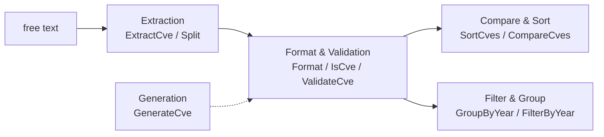
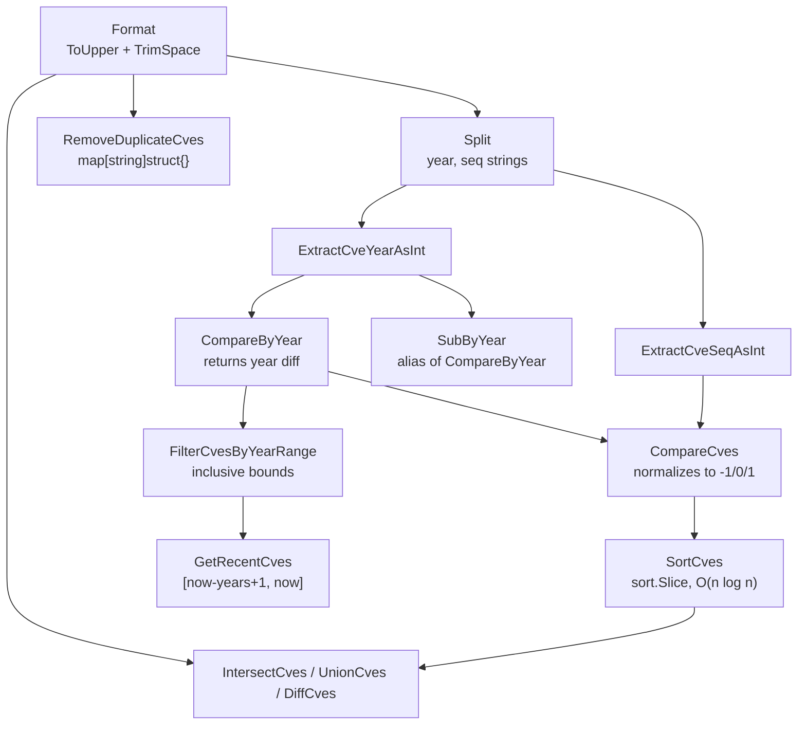

# Basic Usage

This guide provides detailed instructions on the basic usage methods and best practices of CVE Utils.

## Import Package

First, import CVE Utils in your Go code:

```go
import "github.com/scagogogo/cve-skills"
```

## Core Concepts

### CVE Format Specification

CVE identifiers follow this format:
- Format: `CVE-YYYY-NNNN`
- `CVE`: Fixed prefix (case insensitive)
- `YYYY`: 4-digit year (1999 to present)
- `NNNN`: Sequence number (at least 4 digits)

Examples of valid CVEs:
- `CVE-2022-12345`
- `CVE-2021-44228`
- `CVE-2023-1234`

### Function Categories

CVE Utils organizes its functions into five categories by purpose:

1. **Format & Validation**: CVE format standardization and validity checking
2. **Extraction**: Extract CVE information from text
3. **Compare & Sort**: Compare and sort CVEs
4. **Filter & Group**: Filter and group CVEs by condition
5. **Generation**: Create new CVE identifiers

The five categories and how data flows between them:



## Basic Operations

### 1. Format CVE

The `Format` function converts a CVE to the standard uppercase format:

```go
package main

import (
    "fmt"
    "github.com/scagogogo/cve-skills"
)

func main() {
    // Various input formats
    inputs := []string{
        " cve-2022-12345 ",  // with spaces
        "CVE-2022-12345",    // already standard format
        "cVe-2022-12345",    // mixed case
    }

    for _, input := range inputs {
        formatted := cve.Format(input)
        fmt.Printf("'%s' -> '%s'\n", input, formatted)
    }
}
```

Output:
```text
' cve-2022-12345 ' -> 'CVE-2022-12345'
'CVE-2022-12345' -> 'CVE-2022-12345'
'cVe-2022-12345' -> 'CVE-2022-12345'
```

### 2. Validate CVE

#### Basic Format Validation

```go
func validateExamples() {
    testCases := []string{
        "CVE-2022-12345",           // valid
        " CVE-2022-12345 ",         // valid (has spaces)
        "text containing CVE-2022-12345",   // invalid (contains other text)
        "2022-12345",               // invalid (missing prefix)
        "CVE-2022-ABC",             // invalid (sequence is not a number)
    }

    for _, testCase := range testCases {
        isValid := cve.IsCve(testCase)
        fmt.Printf("'%s' -> %t\n", testCase, isValid)
    }
}
```

#### Check Whether Text Contains a CVE

```go
func containsExamples() {
    texts := []string{
        "System affected by CVE-2022-12345",
        "This text contains no CVE",
        "Multiple vulnerabilities: CVE-2021-1111 and CVE-2022-2222",
    }

    for _, text := range texts {
        contains := cve.IsContainsCve(text)
        fmt.Printf("'%s' -> %t\n", text, contains)
    }
}
```

#### Comprehensive Validation

```go
func comprehensiveValidation() {
    testCases := []string{
        "CVE-2022-12345",  // valid
        "CVE-1969-12345",  // invalid (year too early)
        "CVE-2099-12345",  // invalid (year too late)
        "CVE-2022-0",      // invalid (sequence is 0)
    }

    for _, testCase := range testCases {
        isValid := cve.ValidateCve(testCase)
        fmt.Printf("'%s' -> %t\n", testCase, isValid)
    }
}
```

### 3. Extract CVE from Text

#### Extract All CVEs

```go
func extractAllExample() {
    text := `
    Security advisory: the system is affected by multiple vulnerabilities
    - CVE-2021-44228 (Log4j)
    - cve-2022-12345 (custom component)
    - CVE-2023-1234 (third-party library)
    Please update your patches as soon as possible.
    `

    cves := cve.ExtractCve(text)
    fmt.Printf("Extracted CVEs (%d): %v\n", len(cves), cves)
    // Output: Extracted CVEs (3): [CVE-2021-44228 CVE-2022-12345 CVE-2023-1234]
}
```

#### Extract the First and Last CVE

```go
func extractFirstLastExample() {
    text := "Vulnerabilities include CVE-2021-1111, CVE-2022-2222 and CVE-2023-3333"

    first := cve.ExtractFirstCve(text)
    last := cve.ExtractLastCve(text)

    fmt.Printf("First CVE: %s\n", first)  // CVE-2021-1111
    fmt.Printf("Last CVE: %s\n", last)    // CVE-2023-3333
}
```

### 4. Decompose CVE

#### Split Year and Sequence

```go
func splitExample() {
    cveId := "CVE-2022-12345"

    year, seq := cve.Split(cveId)
    fmt.Printf("CVE: %s\n", cveId)
    fmt.Printf("Year: %s\n", year)      // 2022
    fmt.Printf("Sequence: %s\n", seq)   // 12345

    // Get integer types
    yearInt := cve.ExtractCveYearAsInt(cveId)
    seqInt := cve.ExtractCveSeqAsInt(cveId)
    fmt.Printf("Year (int): %d\n", yearInt)    // 2022
    fmt.Printf("Sequence (int): %d\n", seqInt) // 12345
}
```

### 5. Compare and Sort

#### Compare Two CVEs

```go
func compareExample() {
    cveA := "CVE-2020-1111"
    cveB := "CVE-2022-2222"

    // Compare by year
    yearComp := cve.CompareByYear(cveA, cveB)
    fmt.Printf("Year compare %s vs %s: %d\n", cveA, cveB, yearComp) // -2

    // Full comparison
    fullComp := cve.CompareCves(cveA, cveB)
    fmt.Printf("Full compare %s vs %s: %d\n", cveA, cveB, fullComp) // -1

    // Year difference
    yearDiff := cve.SubByYear(cveB, cveA)
    fmt.Printf("Year difference: %d\n", yearDiff) // 2
}
```

#### Sort a CVE List

```go
func sortExample() {
    cveList := []string{
        "CVE-2022-2222",
        "cve-2020-1111",  // lowercase
        "CVE-2022-1111",
        "CVE-2021-3333",
    }

    fmt.Printf("Original list: %v\n", cveList)

    sorted := cve.SortCves(cveList)
    fmt.Printf("Sorted: %v\n", sorted)
    // Output: [CVE-2020-1111 CVE-2021-3333 CVE-2022-1111 CVE-2022-2222]
}
```

### 6. Filter and Group

#### Filter by Year

```go
func filterExample() {
    cveList := []string{
        "CVE-2020-1111",
        "CVE-2021-2222",
        "CVE-2021-3333",
        "CVE-2022-4444",
    }

    // Filter CVEs from 2021
    cves2021 := cve.FilterCvesByYear(cveList, 2021)
    fmt.Printf("2021 CVEs: %v\n", cves2021)
    // Output: [CVE-2021-2222 CVE-2021-3333]

    // Filter by year range
    recentCves := cve.FilterCvesByYearRange(cveList, 2021, 2022)
    fmt.Printf("2021-2022 CVEs: %v\n", recentCves)
    // Output: [CVE-2021-2222 CVE-2021-3333 CVE-2022-4444]

    // Get CVEs from the last 2 years
    recent := cve.GetRecentCves(cveList, 2)
    fmt.Printf("Last 2 years CVEs: %v\n", recent)
}
```

#### Group by Year

```go
func groupExample() {
    cveList := []string{
        "CVE-2021-1111",
        "CVE-2022-2222",
        "CVE-2021-3333",
        "CVE-2022-4444",
    }

    grouped := cve.GroupByYear(cveList)
    fmt.Println("Grouped by year:")
    for year, cves := range grouped {
        fmt.Printf("  %s: %v\n", year, cves)
    }
    // Output:
    // 2021: [CVE-2021-1111 CVE-2021-3333]
    // 2022: [CVE-2022-2222 CVE-2022-4444]
}
```

#### Remove Duplicates

```go
func deduplicateExample() {
    cveList := []string{
        "CVE-2022-1111",
        "cve-2022-1111",  // duplicate (different case)
        "CVE-2022-2222",
        "CVE-2022-1111",  // duplicate
    }

    fmt.Printf("Original list (%d): %v\n", len(cveList), cveList)

    unique := cve.RemoveDuplicateCves(cveList)
    fmt.Printf("After dedup (%d): %v\n", len(unique), unique)
    // Output: After dedup (2): [CVE-2022-1111 CVE-2022-2222]
}
```

### 7. Generate CVE

```go
func generateExample() {
    // Generate a new CVE identifier
    newCve := cve.GenerateCve(2024, 12345)
    fmt.Printf("Generated CVE: %s\n", newCve) // CVE-2024-12345

    // Batch generation
    for i := 1; i <= 5; i++ {
        cveId := cve.GenerateCve(2024, i)
        fmt.Printf("CVE #%d: %s\n", i, cveId)
    }
}
```

## Real-World Example

### Process a Security Report

```go
func processSecurityReport(reportText string) {
    fmt.Println("=== Security Report Analysis ===")

    // 1. Check whether it contains a CVE
    if !cve.IsContainsCve(reportText) {
        fmt.Println("No CVE found in report")
        return
    }

    // 2. Extract all CVEs
    allCves := cve.ExtractCve(reportText)
    fmt.Printf("Found %d CVEs: %v\n", len(allCves), allCves)

    // 3. Deduplicate and sort
    uniqueCves := cve.RemoveDuplicateCves(allCves)
    sortedCves := cve.SortCves(uniqueCves)
    fmt.Printf("After dedup and sort: %v\n", sortedCves)

    // 4. Group by year
    grouped := cve.GroupByYear(sortedCves)
    fmt.Println("Grouped by year:")
    for year, cves := range grouped {
        fmt.Printf("  %s: %d - %v\n", year, len(cves), cves)
    }

    // 5. Analyze recent vulnerabilities
    recentCves := cve.GetRecentCves(sortedCves, 2)
    fmt.Printf("Vulnerabilities from the last 2 years: %v\n", recentCves)
}

// Usage
reportText := `
Security Advisory 2024-001
The system is affected by the following vulnerabilities:
- CVE-2021-44228 (Log4Shell)
- CVE-2022-12345 (custom component)
- cve-2021-44228 (duplicate)
- CVE-2023-1234 (third-party library)
Update immediately.
`

processSecurityReport(reportText)
```

## Best Practices

### 1. Error Handling

```go
func safeProcessing(input string) {
    // CVE Utils functions handle invalid input gracefully

    // Invalid input returns an empty string
    seq := cve.ExtractCveSeq("invalid")
    if seq == "" {
        fmt.Println("Cannot extract sequence")
    }

    // Invalid input returns 0
    year := cve.ExtractCveYearAsInt("invalid")
    if year == 0 {
        fmt.Println("Cannot extract year")
    }

    // Validate before processing
    if cve.ValidateCve(input) {
        // Safe to process
        year, seq := cve.Split(input)
        fmt.Printf("Year: %s, Sequence: %s\n", year, seq)
    } else {
        fmt.Printf("Invalid CVE: %s\n", input)
    }
}
```

### 2. Performance Optimization

```go
func efficientProcessing(largeCveList []string) {
    // For large datasets, batch processing is recommended

    // Dedup and sort in one pass
    unique := cve.RemoveDuplicateCves(largeCveList)
    sorted := cve.SortCves(unique)

    // Avoid repeated calls to the format function
    // Good approach:
    formatted := make([]string, len(largeCveList))
    for i, cveId := range largeCveList {
        formatted[i] = cve.Format(cveId)
    }

    // Avoid:
    // for _, cveId := range largeCveList {
    //     cve.Format(cveId) // called every time
    // }
}
```

### 3. Data Validation

```go
func validateInput(userInput string) error {
    // Check basic format first
    if !cve.IsCve(userInput) {
        return fmt.Errorf("invalid CVE format: %s", userInput)
    }

    // Then comprehensive validation
    if !cve.ValidateCve(userInput) {
        return fmt.Errorf("CVE validation failed: %s", userInput)
    }

    return nil
}
```

## Visual Reference

The pipeline below traces a raw advisory string as it is normalized, validated, decomposed, and finally reduced to a sorted, grouped report. Each box names the concrete function involved, and the side branches show where validation and decomposition plug into the main flow.

```text
+---------------+     +------------------+     +-------------------+     +------------------+
| raw advisory  | --> | ExtractCve       | --> | Format (ToUpper + | --> | RemoveDuplicate  |
| "see CVE-2022 |     | cveRegex capture |     |  TrimSpace) per   |     | Cves (map dedup, |
|  -12345 ..."  |     | (?i)(CVE-\d+-\d+) |    |  match            |     |  keep first)     |
+---------------+     +------------------+     +-------------------+     +------------------+
                                                                                        |
                                                                                        v
+---------------------+     +-------------------+     +------------------+     +------------+
| GroupByYear         | <-- | SortCves          | <-- | ValidateCve gate | <-- | ExtractCve |
| map[year][]string   |     | sort.Slice +      |     | year in [1999,   |     | Year/Seq   |
| (O(n), order =      |     | CompareCves       |     |  now]; seq > 0   |     | Split()    |
|  insertion order)   |     | (O(n log n))      |     +-------------------+     +------------+
+---------------------+     +-------------------+
```

A second view shows how the comparison and set-operation functions build on top of the same `ExtractCveYearAsInt` / `ExtractCveSeqAsInt` primitives, and how `GetRecentCves` delegates to the year-range filter.



## Deep Dive

- **Two regexes, two semantics.** `base.go` declares `exactCveRegex` with `^\s*CVE-\d+-\d+\s*$` anchors so `IsCve` only accepts a string that *is* a CVE (plus surrounding whitespace), while `containsCveRegex` drops the anchors (`(?i)CVE-\d+-\d+`) so `IsContainsCve` can scan prose. `extract.go` adds a third pattern, `cveRegex` = `(?i)(CVE-\d+-\d+)`, identical in spirit but wrapped in a capture group so `FindAllString` returns just the CVE substrings — which is why `ExtractCve` then formats each match in place rather than re-scanning the original text.

- **`CompareByYear` vs `CompareCves` return values.** `CompareByYear` (compare.go:41) returns the *raw* year difference (`ExtractCveYearAsInt(a) - ExtractCveYearAsInt(b)`), so `CVE-2020-1111` vs `CVE-2022-2222` yields `-2`, not `-1`. `CompareCves` (compare.go:110) reuses that diff only to decide sign, then collapses it to `-1/0/1` and falls through to `ExtractCveSeqAsInt` when years tie. This is why the basic-usage sample prints `-2` for the year comparison but `-1` for the full comparison on the same pair.

- **Validation is time-sensitive.** `ValidateCve` (base.go:459) rejects any year outside `[1999, time.Now().Year()]` and requires `seqInt > 0`, so `CVE-2022-0` fails on the sequence rule while `CVE-2099-12345` fails on the upper-bound rule — the outcome depends on the system clock at call time. `IsCveYearOkWithCutoff` relaxes the upper bound with a `cutoff` offset (`year <= time.Now().Year()+cutoff`) for pre-reserved or future CVE IDs; `IsCveYearOk` is just that helper with `cutoff == 0`.

- **Dedup, intersect, union, and diff share one idiom.** All four set functions in `filter.go` (`RemoveDuplicateCves`, `IntersectCves`, `UnionCves`, `DiffCves`) route every element through `Format` and key a `map[string]struct{}` by the uppercased CVE, so `cve-2022-1111` and `CVE-2022-1111` always collapse to one entry. `RemoveDuplicateCves` preserves first-occurrence order; the three set operations return `SortCves(result)` so callers get a stable, year-then-sequence ordering for free.

- **`GenerateCve` deliberately skips validation.** Per its own doc comment (generate.go:42-43), `GenerateCve` does *not* check whether the year is post-1999 or the sequence is positive — it simply runs `Format(fmt.Sprintf("CVE-%d-%d", year, seq))`. This makes it usable for constructing historical, test, or deliberately out-of-range IDs; pair it with `ValidateCve` when you need to guarantee the result is realistic. `GenerateFakeCve` leans on this: it picks `10000 + time.Now().Nanosecond()%90000` as the sequence (generate.go:102), so the output is random-ish but never validated.

## Next Steps

Now that you have mastered the basics of CVE Utils, you can:

1. Read the [API Reference](/api/) for detailed function documentation
2. Browse [Examples](/examples/) for more real-world scenarios
3. Refer to the specific API category docs:
   - [Format & Validation](/api/format-validate)
   - [Extraction](/api/extract)
   - [Compare & Sort](/api/compare-sort)
   - [Filter & Group](/api/filter-group)
   - [Generation](/api/generate)
