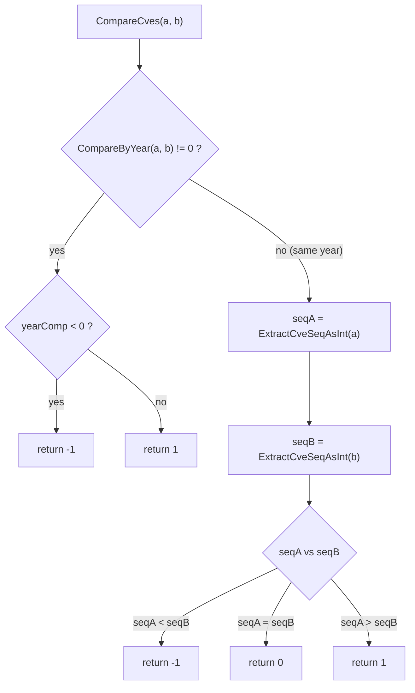
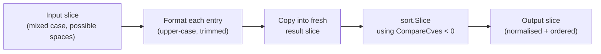
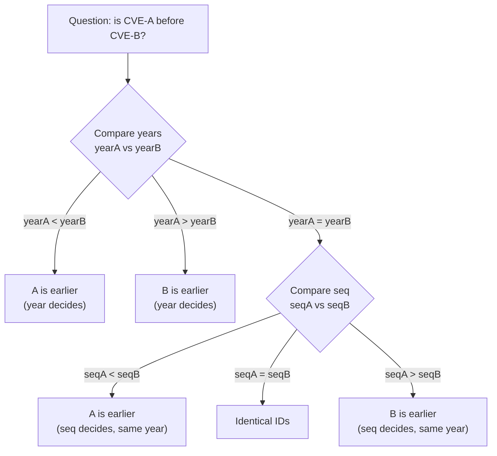
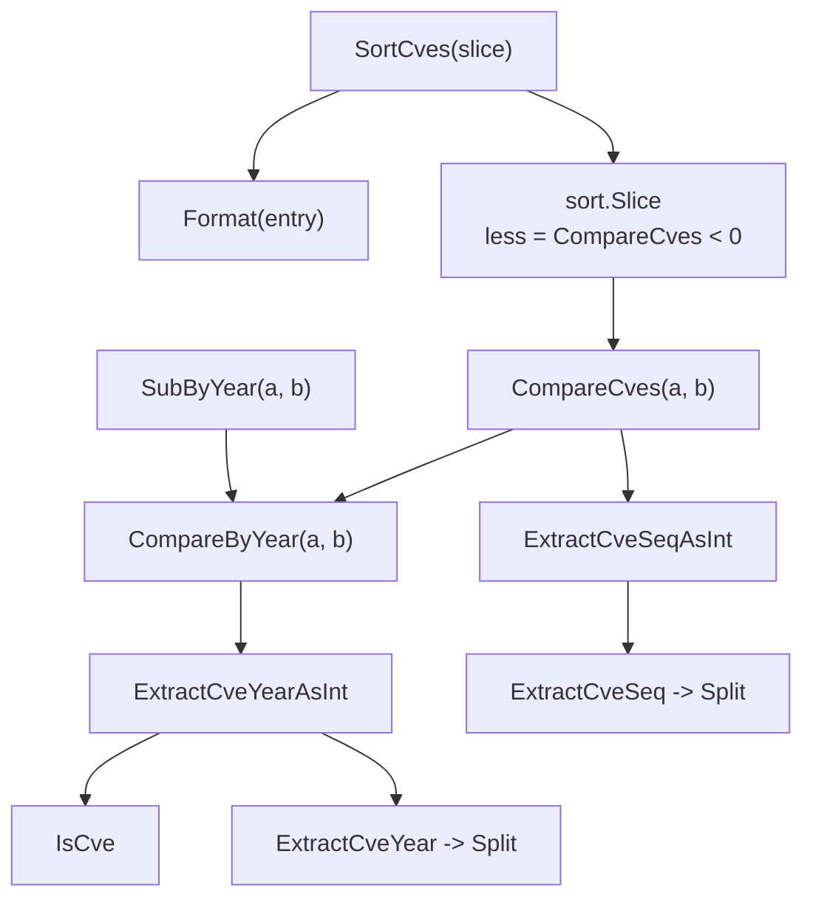

# Comparison & Ordering

The `cve` package offers two comparison primitives with deliberately different return shapes, a stable sort that normalises formatting, and a year-difference alias. Together they cover every ordering scenario you are likely to need: full chronological sorting, year-only bucketing, and measuring the gap between two identifiers. This page walks through `compare.go` function by function, explains why the two comparators diverge in design, and shows how `SortCves` layers them into a single O(n log n) call.

:::tip Who this is for
You already know how to call `ExtractCve` or `Format` and want to understand the ordering semantics — when to reach for `CompareByYear` versus `CompareCves`, what `SortCves` does to your input on the way out, and why year is compared before sequence number.
:::

## Two comparators, two contracts

The package exposes two comparison functions that look interchangeable but return fundamentally different values. Picking the wrong one is the most common source of ordering bugs in CVE pipelines, so the distinction is worth stating precisely.

`CompareByYear(cveA, cveB string) int` returns the **arithmetic difference** of the two years:

```go
func CompareByYear(cveA, cveB string) int {
    return ExtractCveYearAsInt(cveA) - ExtractCveYearAsInt(cveB)
}
```

The return value is `yearA - yearB`, not a sign-normalised tri-state. For `CVE-2020-1111` versus `CVE-2022-2222` it returns `-2`, which happens to encode both the direction *and* the magnitude of the gap. `CompareCves(cveA, cveB string) int`, by contrast, returns a strict **tri-state** of `-1`, `0`, or `1`:

```go
func CompareCves(cveA, cveB string) int {
    yearComp := CompareByYear(cveA, cveB)
    if yearComp != 0 {
        if yearComp < 0 {
            return -1
        }
        return 1
    }
    seqA := ExtractCveSeqAsInt(cveA)
    seqB := ExtractCveSeqAsInt(cveB)
    if seqA < seqB {
        return -1
    } else if seqA > seqB {
        return 1
    }
    return 0
}
```

The table below captures the contract difference at a glance.

| Aspect | `CompareByYear` | `CompareCves` |
|---|---|---|
| Return shape | `yearA - yearB` (any int) | `-1` / `0` / `1` only |
| Compared fields | Year only | Year, then sequence number |
| Magnitude meaningful? | Yes — the value is the year gap | No — only the sign matters |
| Tie-break on seq | No (same year → `0`) | Yes |
| Typical use | Bucketing, gap measurement | Total ordering, sorting |

### Why the shapes diverge

The split is intentional. `CompareByYear` is a **measurement** primitive: callers ask "how many years apart are these two?" and a bare subtraction answers that in one instruction. `CompareCves` is a **comparator** primitive in the `sort.Interface` sense: it must satisfy the trichotomy law (exactly one of `a < b`, `a == b`, `a > b` holds) and callers only ever branch on the sign. Returning `2` or `-7` from a comparator would be legal for `sort.Slice` but surprising to humans reading the call site, so the implementation normalises to `-1/0/1`.



Notice that `CompareCves` reuses `CompareByYear` internally rather than re-implementing the year logic. That keeps the year-extraction contract in exactly one place — `ExtractCveYearAsInt` — so any future change to year parsing propagates automatically.

## SortCves: O(n log n) with stable formatting

`SortCves(cveSlice []string) []string` is the workhorse for ordering a list of identifiers. It does three things in order: allocate a fresh result slice, normalise every entry with `Format`, and sort using `CompareCves` as the less-than predicate.

```go
func SortCves(cveSlice []string) []string {
    result := make([]string, len(cveSlice))
    for i, cve := range cveSlice {
        result[i] = Format(cve)
    }
    sort.Slice(result, func(i, j int) bool {
        return CompareCves(result[i], result[j]) < 0
    })
    return result
}
```

Three properties are worth calling out because they shape how you can use the result.

**Time complexity is O(n log n).** The dominant cost is `sort.Slice`, which is an introselect-style hybrid sort with O(n log n) average and worst-case behaviour. The preceding `Format` pass is O(n) and does not change the asymptotic bound.

**Space complexity is O(n).** A brand-new slice is allocated with `make([]string, len(cveSlice))`; the input is never mutated. You can hand `SortCves` a slice backing shared memory without worrying about aliasing.

**Formatting is normalised before sorting.** Because `Format` upper-cases and trims, `"cve-2022-2222"` and `" CVE-2022-1111 "` both land in the result as clean `CVE-YYYY-NNNNN` strings, and the comparator then sees identical case so its regex-based extraction in `IsCve`/`Split` behaves consistently. The example from the source doc comment makes this concrete:

```go
input := []string{"cve-2022-2222", "CVE-2022-1111"}
// SortCves returns ["CVE-2022-1111", "CVE-2022-2222"]
// Note that both entries are now upper-case even though
// the first input was lower-case.
```



One subtlety: `sort.Slice` is **not** stable. If two entries are equal under `CompareCves` (same year, same sequence number) their relative order in the output is not guaranteed to match the input. In practice equal CVE IDs are duplicates and order between them is irrelevant, but if you need stable ordering for equal-but-distinct inputs you would reach for `sort.SliceStable` in your own caller code rather than `SortCves`.

## Why year before sequence number

Both `CompareCves` and `SortCves` compare the year first and only fall through to the sequence number when the years are equal. This ordering is not arbitrary — it mirrors how CVE IDs are assigned in the real world.

A CVE identifier is `CVE-YYYY-NNNNN`. The year is the **reservation bucket**: the MITRE CVE program allocates IDs inside a year, and a year boundary almost always means a later publication date. The sequence number is only meaningful **within** a year — `CVE-2022-99999` tells you nothing about whether it came before or after `CVE-2023-00001` unless you first compare the years. Comparing sequence numbers across different years would produce a syntactically sorted but chronologically wrong order.



The same logic is why `CompareByYear` alone returns `0` for two IDs from the same year regardless of sequence number — it is a coarse comparator on purpose, designed for bucketing and gap measurement, not total ordering.

## SubByYear: a measurement alias

`SubByYear(cveA, cveB string) int` is a thin alias that delegates directly to `CompareByYear`:

```go
func SubByYear(cveA, cveB string) int {
    return CompareByYear(cveA, cveB)
}
```

The behaviour is byte-for-byte identical to `CompareByYear`. The reason the package keeps both names is **readability at the call site**. `CompareByYear` reads naturally when you are sorting or branching (`if CompareByYear(a, b) < 0`), while `SubByYear` reads naturally when you are doing arithmetic on the gap (`yearsBetween := SubByYear(a, b)`). Same implementation, two vocabularies.

```go
// These two lines are exactly equivalent:
diff := cve.CompareByYear("CVE-2023-1111", "CVE-2020-2222")
diff := cve.SubByYear("CVE-2023-1111", "CVE-2020-2222")
// diff == 3 in both cases
```

Treat `SubByYear` as the preferred name whenever the return value is consumed as a quantity rather than a sign.

## Handling of invalid input

All four functions degrade gracefully on malformed input rather than panicking, because they lean on `ExtractCveYearAsInt` and `ExtractCveSeqAsInt`. Both extractors return `0` when `IsCve` fails or the numeric parse errors out, which means an invalid CVE is treated as year `0` / sequence `0` for comparison purposes.

| Input shape | Year extracted | Seq extracted | Effect in `CompareCves` |
|---|---|---|---|
| `CVE-2022-12345` | `2022` | `12345` | Normal comparison |
| `not-a-cve` | `0` | `0` | Sorted before every valid ID |
| `CVE-2022-ABC` | `2022` | `0` | Year tie-break normal, seq `0` |
| empty string `""` | `0` | `0` | Treated as year `0` |

This is a deliberate "fail soft" choice: a noisy input list with some junk entries still produces a deterministic, usable ordering instead of aborting the sort. If you need to reject invalid entries outright, filter with `FilterValidCves` or `ValidateCves` **before** calling `SortCves`.

## Putting it together: a chronologically ordered report

A common real-world task is: extract every CVE from a free-text advisory, deduplicate, sort chronologically, and report the year span. Each step maps onto one function from this page.

```go
package main

import (
    "fmt"

    "github.com/scagogogo/cve"
)

func main() {
    advisory := "Affected: cve-2022-2222, CVE-2020-1111, CVE-2022-1111, CVE-2021-44228"

    // 1. Extract every CVE mentioned in the text.
    ids := cve.ExtractCve(advisory)

    // 2. Sort chronologically. SortCves normalises formatting
    //    (upper-case, trimmed) and orders by year then sequence.
    sorted := cve.SortCves(ids)
    fmt.Println(sorted)
    // [CVE-2020-1111 CVE-2021-44228 CVE-2022-1111 CVE-2022-2222]

    // 3. Measure the year span between oldest and newest.
    if len(sorted) >= 2 {
        span := cve.SubByYear(sorted[len(sorted)-1], sorted[0])
        fmt.Printf("spans %d years\n", span)
        // spans 2 years
    }

    // 4. Total-order check between two specific IDs.
    fmt.Println(cve.CompareCves("CVE-2022-1111", "CVE-2022-2222"))
    // -1  (same year, smaller sequence number)
}
```

The pipeline reads top-to-bottom as the intent: extract, order, measure, compare. No step needs to know how the year is parsed or how the sort is implemented — those details stay encapsulated in `compare.go` and `extract.go`.

## Summary

- 📌 `CompareByYear` returns the raw year difference `yearA - yearB`; `CompareCves` returns a strict `-1/0/1` tri-state. Pick by whether you need magnitude or sign.
- 🧩 `CompareCves` compares year first, then sequence number, reusing `CompareByYear` for the first leg.
- ⚡ `SortCves` is O(n log n) time and O(n) space, never mutates its input, and normalises every entry with `Format` before sorting.
- 🤖 The year-before-sequence rule mirrors CVE reservation semantics: the year is the bucket, the sequence number is only meaningful within a year.
- 🛠️ `SubByYear` is a readability alias for `CompareByYear` — identical behaviour, preferred when the return value is used as a quantity.
- ⚠️ Invalid input fails soft: malformed CVEs are treated as year `0` / seq `0`. Filter first if you need strict rejection.
- ✅ For a chronologically ordered report, chain `ExtractCve` → `SortCves` → `SubByYear`.

## Visual Reference

The two diagrams below show the same `SortCves` pipeline from two angles. The first is an ASCII rendering of the data flow through the three stages; the second is a mermaid call graph of how the public functions delegate down to the extraction primitives.

### ASCII data flow

This view tracks what happens to a concrete input slice as it moves through `SortCves`. Notice how the `Format` pass collapses case and trimming differences *before* the comparator ever sees the values, so the `CompareCves` leg always operates on canonical `CVE-YYYY-NNNNN` strings.

```text
+-------------------------+      +---------------------------+      +------------------------------+
|  Input slice            |      |  Stage 1: Format pass     |      |  Stage 2: copy into result  |
|  (mixed case / spaces)  |----->|  Format() on each entry   |----->|  result[i] = Format(cve)     |
|                         |      |  -> upper-case + trimmed  |      |  (fresh make, len = n)       |
+-------------------------+      +---------------------------+      +------------------------------+
                                                                              |
                                                                              v
            +-------------------------------------+      +----------------------------------------------+
            |  Stage 3: sort.Slice(result, less)  |<-----+  less(i,j) = CompareCves(result[i],result[j]) < 0
            |  introselect, O(n log n)            |      |  year via ExtractCveYearAsInt (fallback 0)  |
            |  NOT stable for equal elements      |      |  seq   via ExtractCveSeqAsInt   (fallback 0)|
            +-------------------------------------+      +----------------------------------------------+
                              |
                              v
            +-------------------------------------------------+
            |  Output slice                                   |
            |  ["CVE-2020-1111","CVE-2021-44228",            |
            |   "CVE-2022-1111","CVE-2022-2222"]              |
            |  (normalised + chronologically ordered)         |
            +-------------------------------------------------+
```

### Mermaid call graph

This view shows the static delegation tree among the functions in `compare.go` and `extract.go`. `CompareCves` reuses `CompareByYear` rather than re-implementing the year leg, and both ultimately bottom out in the same `ExtractCveYearAsInt` / `ExtractCveSeqAsInt` extractors — which is why a single fix to year parsing would propagate to every comparator.



## Deep Dive

A few details that are easy to miss when skimming `compare.go`:

**Two call paths into the extractors.** `ExtractCveYearAsInt` (extract.go:183) guards on `IsCve` and returns `0` on failure, then calls `ExtractCveYear` → `Split`. `ExtractCveSeqAsInt` (extract.go:262) takes a different route: it calls `ExtractCveSeq` (which itself guards on `IsCve` and returns `""` on failure) and then `strconv.Atoi("")` which yields `0`. The net effect is identical — an invalid ID resolves to year `0` / seq `0` — but the two paths land there through different code, so a future refactor must keep both returning `0` to preserve the fail-soft ordering contract.

**`sort.Slice` is not stable, and `CompareCves` returning `0` is the trap.** `sort.Slice` (compare.go:171) uses Go's pdqsort, which does not preserve input order for equal elements. Because `CompareCves` collapses any same-year-same-seq pair to `0`, duplicate IDs in your input may come back in any order. The subtlety is *what counts as equal*: `Format` only upper-cases and trims (base.go:46), it does not zero-pad the sequence, yet `CompareCves` compares via `ExtractCveSeqAsInt` which parses to `int`. So `CVE-2022-1` and `CVE-2022-0001` are *not* textually identical but compare as **equal** (`Atoi("1") == Atoi("0001") == 1`) and their relative order is therefore not preserved. If you need width-normalised identity, run `FormatSeq` first.

**`CompareByYear` reuses for magnitude, `CompareCves` reuses for correctness.** `CompareCves` (compare.go:111) calls `CompareByYear` first and only normalises the sign afterward. This means the year leg is computed exactly once per comparison, and the seq leg (`ExtractCveSeqAsInt` twice) runs only when the years tie. That ordering is a small but real performance choice: year extraction is one `IsCve` + one `Split`, and skipping the seq extraction in the common cross-year case avoids two extra regex matches per comparison on already-sorted-ish data.

**Why `SubByYear` exists alongside `CompareByYear`.** The two are byte-for-byte identical (compare.go:72 delegates straight through). The reason is call-site readability, not behaviour: `SubByYear` signals "I am doing arithmetic on a gap" while `CompareByYear` signals "I am branching on a sign". A reader of `yearsBetween := SubByYear(a, b)` knows the magnitude is consumed; a reader of `if CompareByYear(a, b) < 0` knows only the sign is consumed. Removing either name would not change any output but would erase that signal.

**Historical contrast with string sorting.** A naive `sort.Strings` on CVE IDs is lexically ordered, which puts `CVE-2022-99999` before `CVE-2023-1` because `'2' < '3'` at the year position is fine but `'9' < '1'`? No — lexical compare walks left to right, so `CVE-2022-99999` vs `CVE-2023-1` compares year `2022` vs `2023` correctly at the digit level, but `CVE-2022-10000` vs `CVE-2022-9999` would order `10000` after `9999` lexically (because `'1' < '9'`), which is numerically wrong. By parsing year and seq to `int` via `ExtractCveYearAsInt`/`ExtractCveSeqAsInt`, `CompareCves` sidesteps the variable-width-sequence trap entirely — at the cost of two `strconv.Atoi` calls per tied-year comparison.

## Further reading

- [`CompareByYear` and `CompareCves` API reference](/api/functions/compare-cves)
- [`SortCves` API reference](/api/functions/sort-cves)
- [`SubByYear` API reference](/api/functions/sub-by-year)
- [Extracting CVEs from text](/api/extract) — the `ExtractCve` step that feeds the sort pipeline above
- [Formatting & validation](/guide/formatting-normalization) — why `Format` runs inside `SortCves` before comparison
