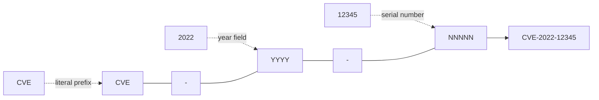
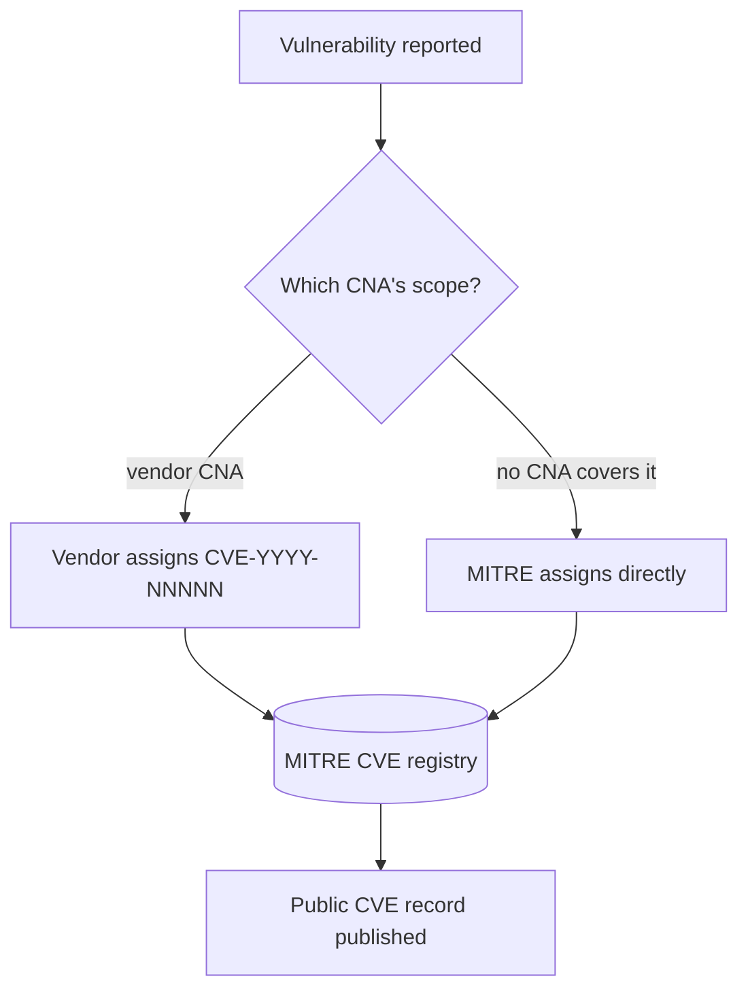
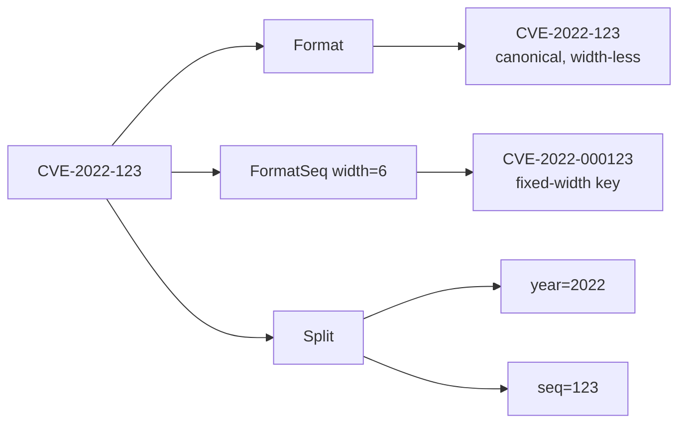
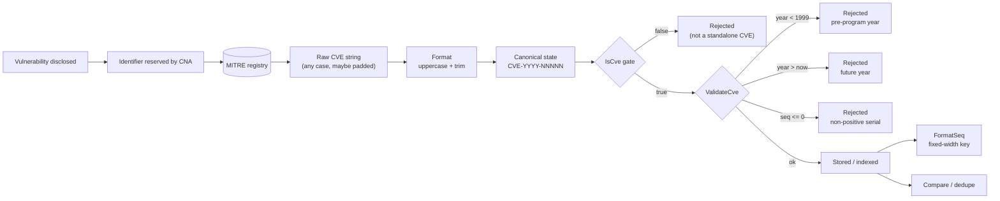

# CVE Identifier System

📌 The CVE identifier system is the universal naming scheme for publicly disclosed cybersecurity vulnerabilities. Every identifier follows the rigid syntax `CVE-YYYY-NNNNN`, where `YYYY` is the year the record was assigned or reserved and `NNNNN` is a serial number unique within that year. This page explains where the format comes from, how MITRE and the CVE Numbering Authorities (CNAs) allocate identifiers, why the year starts at 1999, how the serial number grows, and why the whole scheme needs to be standardized. It then ties each rule back to the `Format` and `IsCve` functions in this `cve` package, which align the library to the official specification.

:::tip Who this is for
Developers building vulnerability databases, security-feed ingestors, or tooling that must emit and recognize CVE identifiers; architects who need to understand *why* the format is what it is before relying on it; and anyone who has wondered why `CVE-1998-1` is rejected or why a single CVE can be `CVE-2022-12345` and `CVE-2022-00012345` at the same time.
:::

## Where the Format Comes From

The `CVE-YYYY-NNNNN` syntax is not an arbitrary convention. It is the public-facing identifier format defined and maintained by the CVE Program, which is operated by MITRE Corporation and overseen by the CVE Numbering Authority. The format has three fixed structural elements:

| Segment | Meaning | Constraint |
| --- | --- | --- |
| `CVE` | Literal prefix marking the identifier as a CVE | Always uppercase in canonical form; case-insensitive on input |
| `YYYY` | Year of assignment or reservation | Four-digit year, `1999` through the current year |
| `NNNNN` | Serial number within the year | One or more digits, monotonically allocated, no fixed width in the spec |

The hyphens are separators, not decoration — they are part of the identifier. This is exactly the shape the `cve` package encodes in its two core regular expressions in `base.go`:

```go
// 精确匹配CVE格式（允许两侧有空白字符）
exactCveRegex = regexp.MustCompile(`(?i)^\s*CVE-\d+-\d+\s*$`)
// 在文本中匹配CVE格式
containsCveRegex = regexp.MustCompile(`(?i)CVE-\d+-\d+`)
```

Two details deserve attention. First, both regexes use the `(?i)` case-insensitive flag, mirroring the official program's rule that the prefix may arrive in any case and must be normalized to uppercase. Second, the serial-number part is `\d+` — one or more digits, with **no fixed width**. This matches the real CVE Program, which has never mandated a fixed number of digits for the serial; it simply grows.



## MITRE and the CNA Allocation Mechanism

The CVE Program does not have a single, centralized clerk typing out identifiers one by one. Allocation is a federated process designed to scale to the hundreds of thousands of vulnerabilities disclosed every year.

At the top sits **MITRE Corporation**, which operates the CVE Program and the master registry. Beneath MITRE sit the **CVE Numbering Authorities (CNAs)** — organizations authorized to assign CVE identifiers within their own scope. A CNA might be a software vendor (responsible for vulnerabilities in its own products), a bug bounty platform, a research team, or a national CERT. When a vulnerability is reported, the CNA whose scope covers the affected product reserves or assigns a CVE identifier, and MITRE records it.

The flow from "a vulnerability is disclosed" to "an identifier exists in the registry" looks like this:



This federated model is exactly why the year and serial fields are structured the way they are. The **year field** records *when* the identifier was allocated (or the year block it was reserved in), giving every party a shared notion of "this is a 2022 issue". The **serial number** is allocated from a per-year pool, so CNAs drawing from the same year never collide as long as they pull distinct serials. The rigid `CVE-YYYY-NNNNN` shape is what lets identifiers from hundreds of independent CNAs collapse into one globally unique, sortable key.

## The Year Field: Why 1999 and Forward

The CVE Program began publishing identifiers under the `CVE-YYYY-NNNNN` syntax starting with the year **1999**. There are no official CVE records with a year earlier than 1999. Any identifier of the form `CVE-1998-NNNNN` or below is, by definition, not a real CVE — it is a typo, a fabricated example, or a non-CVE identifier that happens to match the regex.

This historical fact is encoded directly in the source. The library's year-bounds helper in `base.go` hard-codes the floor:

```go
func IsCveYearOkWithCutoff(cve string, cutoff int) bool {
    year := extractYear(cve)
    return year >= 1999 && year <= time.Now().Year()+cutoff
}
```

The constant `1999` is not derived from configuration. It is a fixed property of the CVE Program itself, so the library treats it as an invariant rather than a tunable. The same `1999` reappears inside `ValidateCve` and the internal `validateSingleCve`, so every validation entry point shares an identical floor.

The upper bound is the **current calendar year**, computed at call time via `time.Now().Year()`. A CVE whose year exceeds the current year is suspicious — MITRE cannot have assigned a "future" record — so such identifiers are rejected by default. This is the library's way of staying honest about what the CVE Program could plausibly have issued.

⚠️ The `cutoff` parameter on `IsCveYearOkWithCutoff` widens the upper bound forward (to admit reserved and pre-published CVEs) but it **never** relaxes the 1999 floor. Even a huge cutoff leaves `CVE-1998-12345` rejected.

## Serial Number Allocation and Growth Rules

While the year field is bounded, the serial number is open-ended. The official rules are simple:

1. **A serial is a positive integer**, allocated from the per-year pool. The library encodes this in `ValidateCve` as `seqInt > 0`, so `CVE-2022-0` is rejected.
2. **There is no fixed width.** Early CVE records had short serials (`CVE-1999-0001`); modern years have serials well into five and six digits (`CVE-2021-44228`, `CVE-2024-3094`). The spec does not zero-pad.
3. **Serials are monotonically allocated within a year**, but they are not necessarily dense. A CNA may reserve a block and not use every number, so gaps are expected and a "missing" serial does not imply an invalid identifier.

Because the spec mandates no fixed width, feeds disagree: some zero-pad the serial to a fixed width for display or database storage, others omit leading zeros. The same logical CVE can therefore appear as `CVE-2022-123` or `CVE-2022-000123`. The library's `FormatSeq` exists precisely to bridge this, rebuilding the serial at a requested width without changing the year:

```go
func FormatSeq(cve string, width int) string {
    if !IsCve(cve) {
        return cve
    }
    year, seq := Split(cve)
    seqInt, err := strconv.Atoi(seq)
    if err != nil {
        return cve
    }
    return fmt.Sprintf("CVE-%s-%0*d", year, width, seqInt)
}
```

`FormatSeq` first guards with `IsCve` (so non-CVE input is returned untouched), then `Split`s into year and serial, then reassembles with `%0*d` zero-padding to the caller's width. This is the library's pragmatic answer to a spec that intentionally leaves serial width open: keep the canonical form width-less, but offer a width-padded form for callers that need fixed-width keys.

The relationship between the canonical form, the width-padded form, and the underlying year and serial is:



## Why Standardization Matters

A vulnerability identifier is only useful if every party agrees on what it names. Without a single canonical form, the same vulnerability ends up as three different records: `cve-2021-44228` in one feed, `CVE-2021-44228` in another, and `CVE-2021-0044228` in a third that zero-padded the serial. Deduplication fails, correlation across advisories fails, and a database `UNIQUE` index either rejects valid duplicates or accepts the same logical CVE twice.

The `cve` package treats standardization as the foundation every other operation builds on, and it does so through two complementary functions:

- **`Format`** — the unconditional canonicalizer. It does exactly two things, `strings.ToUpper(strings.TrimSpace(cve))`, and nothing more. It does not validate, it does not re-order segments, and it does not touch the serial width. Every function in the package that compares, groups, deduplicates, or stores a CVE passes the value through `Format` first, so all downstream logic operates on one canonical shape regardless of how messy the input was.
- **`IsCve`** — the format gatekeeper. It returns `true` only when the string is *exactly* a CVE identifier (optionally surrounded by whitespace), using `exactCveRegex`. This is what separates "looks canonical after `Format`" from "actually is a CVE". A string like `not-a-cve` will be uppercased by `Format` to `NOT-A-CVE` but still rejected by `IsCve`.

```go
func Format(cve string) string {
    return strings.ToUpper(strings.TrimSpace(cve))
}

func IsCve(text string) bool {
    return exactCveRegex.MatchString(text)
}
```

The division of labor is deliberate. `Format` is cheap and total — it never fails, so pipelines can call it defensively on every input. `IsCve` is the strict check that gates any logic depending on the year and serial being meaningful. Together they align the library to the official specification: `Format` enforces the "uppercase, no surrounding whitespace" canonical form the CVE Program expects, and `IsCve` enforces the `CVE-YYYY-NNNNN` structure the program defines.

A concrete walkthrough of how the two functions cooperate:

| Input | After `Format` | `IsCve` result | Interpretation |
| --- | --- | --- | --- |
| `cve-2022-12345` | `CVE-2022-12345` | `true` | Valid, ready for storage |
| `" CVE-2022-12345 "` | `CVE-2022-12345` | `true` | Whitespace tolerated and stripped |
| `Cve-2021-44228` | `CVE-2021-44228` | `true` | Case normalized |
| `not-a-cve` | `NOT-A-CVE` | `false` | Uppercased but rejected by `IsCve` |
| `包含CVE-2022-12345的文本` | (unchanged shape) | `false` | Not a standalone CVE; use `ExtractCve` instead |

## Summary

- The `CVE-YYYY-NNNNN` syntax is the official CVE Program identifier format — a literal `CVE` prefix, a four-digit year, and a variable-width positive serial, joined by hyphens.
- Allocation is federated: MITRE runs the registry, CNAs assign identifiers within their scope, and the rigid format is what lets hundreds of independent CNAs produce globally unique, sortable keys.
- The year floor is **1999**, the first year the CVE Program published under this syntax; it is hard-coded in `base.go` and shared by every validation function. The ceiling is the current year, computed from `time.Now()`.
- The serial is a positive integer with no fixed width; the spec leaves width open, and `FormatSeq` bridges feeds that disagree on zero-padding.
- Standardization is the foundation of the package: `Format` canonicalizes unconditionally (uppercase, trimmed) and `IsCve` gates structure strictly — together they align the library to the official CVE specification.

## Visual Reference

The first diagram is an ASCII decision tree of a single identifier flowing through the package's format-and-validate pipeline. It shows the branching a value takes from raw input to a classified outcome, making the division of labor between `Format`, `IsCve`, `Split`, and the year/serial checks in `validateSingleCve` (base.go:328) explicit:

```text
                    +---------------------+
raw input ---------> | Format(cve)        |
                    | ToUpper + TrimSpace |  (base.go:45)
                    +----------+----------+
                               |
                               v
                    +---------------------+
                    | IsCve(cve)?         |
                    | exactCveRegex       |  (base.go:14)
                    +----------+----------+
                               |
                  +------------+------------+
                  | no                       | yes
                  v                          v
        "invalid CVE format"      +---------------------+
        (rejected)                | Split(cve)          |
                                 | year, seq           |  (base.go:265)
                                 +----------+----------+
                                            |
                     +----------------------+----------------------+
                     |                      |                      |
                     v                      v                      v
              year not a digit        seq not a digit        both parse OK
              "year is not a          "sequence number       |
               valid number"           is not a valid        +-------------------+
                                       number"               | yearInt < 1999?   |
                                                             +--+------------+--+
                                                                | yes        | no
                                                                v            v
                                              "year %d is before 1999"   yearInt > now.Year()?
                                                                        +--+--+--+
                                                                       yes|     |no
                                                                          v     v
                                                "year %d is after current year %d"   seqInt <= 0?
                                                                                   +--+--+
                                                                                  yes|   |no
                                                                                     v   v
                                                                          "sequence number    VALID
                                                                           must be positive"  (return true)
```

The second diagram is a mermaid state view of the same identifier over its lifecycle — from disclosure through reservation, canonicalization, storage, and later retrieval — emphasizing the *states* a CVE string passes through rather than the function call graph:



## Deep Dive

- **Two regexes, two strictness levels.** `exactCveRegex` (base.go:14) is anchored with `^\s*...\s*$`, so `IsCve` rejects a string that merely *contains* a CVE such as `"see CVE-2022-12345 below"`. `containsCveRegex` (base.go:16) drops the anchors and surrounding-whitespace tolerance, which is what lets `ExtractCve` scan free text. The pair encodes a deliberate policy: a standalone identifier must be the whole string (modulo whitespace), while extraction operates on prose where the identifier is a substring.

- **`Format` is intentionally non-validating.** Because `Format` (base.go:45) is just `strings.ToUpper(strings.TrimSpace(cve))`, it never inspects structure — `Format("not-a-cve")` happily returns `NOT-A-CVE`. This is a performance and totality choice: every downstream function can call `Format` defensively without risking a panic or error path, and the strict structural gate is deferred to `IsCve`. The cost is that callers must not mistake "formatted" for "valid"; the Summary table on this page makes that distinction concrete with the `not-a-cve` row.

- **`extractYear` and `Split` share a guard but diverge in failure mode.** Both call `Format` then `strings.Split(cve, "-")` and require exactly three parts (base.go:162-170, 265-272). `Split` returns empty strings on failure (a silent, total failure mode suited to callers that already validated), while `extractYear` returns the integer `0` — which then fails the `year >= 1999` check in `IsCveYearOkWithCutoff` (base.go:233). So a malformed input is rejected by the year floor *implicitly*, without needing a separate format check inside the year helper.

- **Two validation paths, two return shapes.** `ValidateCve` (base.go:445) returns a bare `bool` and is the hot-path check used by `FilterValidCves`. `validateSingleCve` (base.go:328) is the diagnostics path behind `ValidateCves`, returning a `CveValidationResult` with a human-readable `Reason` string. The reason literals are load-bearing — `"invalid CVE format"`, `"year %d is before 1999"`, `"year %d is after current year %d"`, `"sequence number must be positive"` — so any tooling that switches on `Reason` is coupled to these exact strings. Note also that `ValidateCve` uses the bare `time.Now().Year()` ceiling with no `cutoff`; only `IsCveYearOkWithCutoff` widens the upper bound, so the two APIs are *not* interchangeable for reserved/future CVEs.

- **The 1999 floor is a program invariant, not a heuristic.** The literal `1999` appears verbatim in `IsCveYearOkWithCutoff` (base.go:233), in `validateSingleCve` (base.go:353), and in `ValidateCve` (base.go:459). Hard-coding it three times — rather than deriving it from a single constant — is a minor duplication, but it reflects that the value is a fixed property of the CVE Program's history (the first year identifiers were published under this syntax), not a tunable. A pre-1999 identifier cannot exist in the official registry, so no `cutoff` parameter is offered to relax the floor; only the ceiling is adjustable.

## Further Reading

- [Formatting & Normalization](/guide/formatting-normalization) — `Format` vs `FormatSeq`, and why canonical form underpins every other operation.
- [Year Validation Rules](/guide/year-rules) — the 1999 floor, the `time.Now()` ceiling, and the `cutoff` parameter.
- [Validation Strategy](/guide/validation-strategy) — how `IsCve`, `ValidateCve`, and `ValidateCves` layer on top of `Format`.
- [Regex Internals](/guide/regex-internals) — the `exactCveRegex` and `containsCveRegex` patterns behind `IsCve` and `ExtractCve`.
