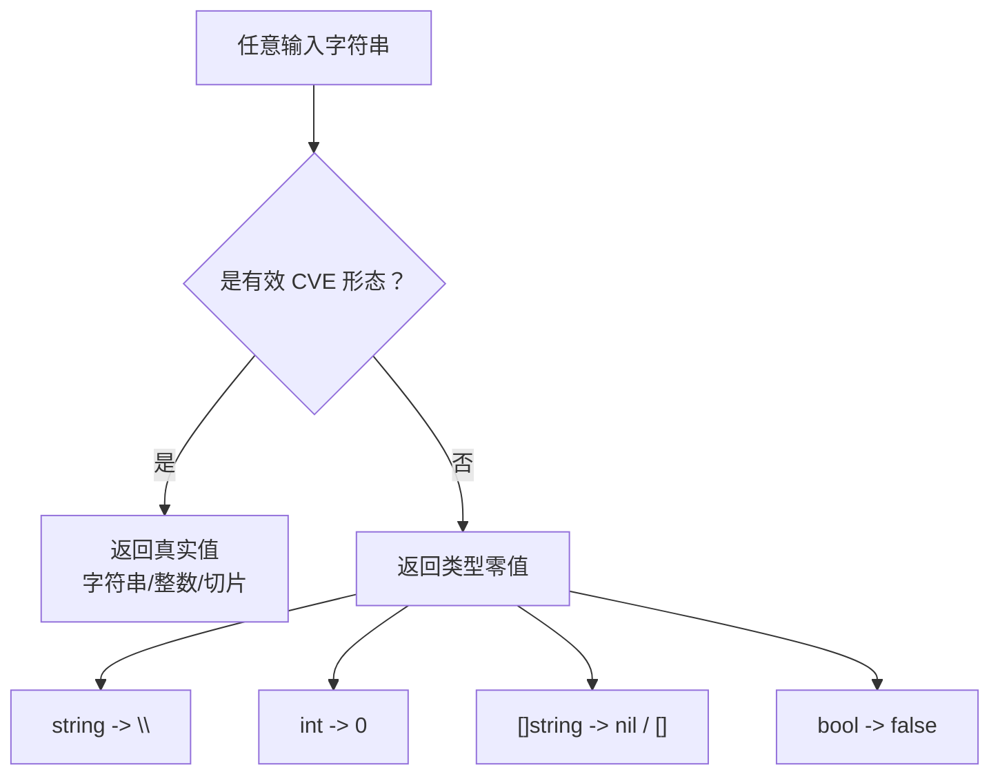
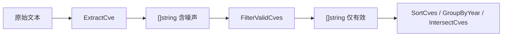

# Error Handling & Edge Cases

The `cve` package does **not** follow the `result, error` idiom that most Go libraries use. Nearly every public function returns a plain value — a string, an int, a slice, a bool — and signals "invalid input" by returning the zero value of that type: `""`, `0`, `nil`, `false`. There are no panics and almost no `error` returns. This page documents exactly what each function does on bad input, why the library was designed that way, and how you detect invalidity at the call site when you need to.

:::tip Who should read this
Developers wiring the library into a pipeline that may receive dirty data — advisory text with typos, mixed-case identifiers, fragments that are not CVEs at all, or range expressions from untrusted sources. If you have ever wondered "why does `ExtractCveYearAsInt` give me `0` instead of an error?" or "what does `Format` do to a non-CVE string?", this is the page.
:::

## The zero-value convention

Go has a well-established pattern for functions that can fail: return `(T, error)` and let the caller decide. The `cve` package deliberately steps away from that pattern for its hot-path functions. The reasoning is practical: CVE identifiers appear inside free-form text, alongside noise, in mixed case, with stray whitespace, and frequently only partially typed. If every extraction and formatting call forced the caller to unwrap an `error`, the common "scan a paragraph and collect identifiers" loop would drown in error handling.

Instead, every function picks a single zero value that means "I could not produce a meaningful result":



| Return type | Zero value | Representative function | Triggered by |
| --- | --- | --- | --- |
| `string` | `""` | `ExtractCveYear`, `ExtractCveSeq`, `ExtractFirstCve` | input has no CVE, or part does not parse |
| `int` | `0` | `ExtractCveYearAsInt`, `ExtractCveSeqAsInt` | `IsCve` fails, or `strconv.Atoi` fails |
| `[]string` | `nil` | `ParseCveRange`, `FilterCvesByPattern` | regex does not match, or regex fails to compile |
| `[]string` | empty `[]` | `ExtractCve`, `FilterValidCves` | no CVE found, or none survive validation |
| `bool` | `false` | `IsCve`, `ValidateCve`, `IsCvesConsecutive` | any rule fails |
| `(min, max int)` | `0, 0` | `YearRange`, `SeqRange` | empty slice, or no valid element |

🧩 The telltale sign of a "nothing found" result is therefore a zero value, **not** a sentinel or an error. Detecting it is a plain equality check: `if year == 0`, `if seq == ""`, `if cves == nil`, `if !ok`.

## Format — it never rejects, it normalizes

`Format(cve string) string` is the single most important function to understand, because nearly every other function calls it as its first step. Its implementation is exactly one expression:

```go
func Format(cve string) string {
    return strings.ToUpper(strings.TrimSpace(cve))
}
```

It does **not** check whether the input is a CVE. It does **not** return an error on non-CVE input. It runs `TrimSpace` then `ToUpper` on whatever string you hand it and hands back the result. That has two consequences that surprise new users:

1. `Format("not-a-cve")` returns `"NOT-A-CVE"` — a perfectly uppercase, perfectly trimmed string that is still not a CVE.
2. `Format("")` returns `""`, so an empty input flows through cleanly rather than crashing downstream callers.

Why this is fine: `Format` is documented as a normalizer, not a validator. Its contract is "give me a canonical form", and the canonical form of garbage is upper-cased, trimmed garbage. The library pairs it with an explicit validator (`IsCve` / `ValidateCve`) so that callers who care about validity can check first. `FormatSeq` shows the pattern: it guards with `if !IsCve(cve) { return cve }` before doing anything, returning the original input unchanged when it is not a CVE.

```go
package main

import (
    "fmt"

    "github.com/scagogogo/cve"
)

func main() {
    for _, s := range []string{"cve-2022-12345", " CVE-2022-12345 ", "not-a-cve", ""} {
        fmt.Printf("%-20q -> %q\n", s, cve.Format(s))
    }
    // "cve-2022-12345"    -> "CVE-2022-12345"
    // " CVE-2022-12345 "  -> "CVE-2022-12345"
    // "not-a-cve"         -> "NOT-A-CVE"
    // ""                  -> ""
}
```

⚠️ The safe idiom is always `if cve.IsCve(s) { ... = cve.Format(s) }`. Treat the validator as the gate and `Format` as the cleanup that runs only on inputs that passed the gate.

## ExtractCveYearAsInt — invalid becomes 0

`ExtractCveYearAsInt(cve string) int` extracts the year and converts it to an integer. It returns `0` in two situations, and the source makes both explicit:

```go
func ExtractCveYearAsInt(cve string) int {
    if !IsCve(cve) {
        return 0
    }
    year := ExtractCveYear(cve)
    i, _ := strconv.Atoi(year)
    return i
}
```

The `0` can come from either branch: the format check failing, or the `Atoi` failing (the error is dropped with `_`). In practice the second branch is unreachable for inputs that pass `IsCve`, because the format regex `CVE-\d+-\d+` guarantees the year segment is all digits. But the function is written defensively, so the `0` contract holds for any input whatsoever.

This 0-is-invalid convention is load-bearing for the comparison functions. `CompareByYear` is literally:

```go
func CompareByYear(cveA, cveB string) int {
    return ExtractCveYearAsInt(cveA) - ExtractCveYearAsInt(cveB)
}
```

So `CompareByYear("garbage", "CVE-2022-1")` returns `0 - 2022 = -2022`. The invalid input is treated as year 0, which sorts before every real CVE (real years start at 1999). The same is true of `CompareCves`, which falls back to sequence comparison via `ExtractCveSeqAsInt` — also a 0-on-failure function — when the years tie.

📌 This means invalid identifiers never crash a sort or a comparison; they silently gravitate to the front of the ordering. If you need to exclude them, run `FilterValidCves` over the slice before sorting.

## ParseCveRange — nil means "not a range"

`ParseCveRange(rangeExpr string) []string` is the one function in the package most likely to receive genuinely untrusted input, because range expressions come from advisory text written by humans. It returns `nil` (not an empty slice) for every failure mode:

```go
func ParseCveRange(rangeExpr string) []string {
    matches := rangeRegex.FindStringSubmatch(rangeExpr)
    if matches == nil {
        return nil
    }
    // ...
    if err != nil || startSeq > endSeq {
        return nil
    }
    // ...
}
```

The failure modes are: the regex does not match, the sequence number does not parse, or `startSeq > endSeq` (a reversed range). Note that `startSeq == endSeq` is allowed and returns a one-element slice — a "range" of length one is not an error.

| Input | Result | Reason |
| --- | --- | --- |
| `CVE-2022-1000 to CVE-2022-1003` | 4 elements | valid `to` form |
| `CVE-2022-1000..1003` | 4 elements | valid double-dot form |
| `CVE-2022-1000-1003` | 4 elements | valid dash form |
| `CVE-2022-1003 to CVE-2022-1000` | `nil` | reversed: `startSeq > endSeq` |
| `CVE-2022-1000 to CVE-2023-1005` | 6 elements, all `CVE-2022-*` | regex matches: `to` branch ignores the end year and reuses the start year |
| `CVE-2022-1000 to CVE-2023-0500` | `nil` | start seq 1000 &gt; end seq 0500, so `startSeq > endSeq` |
| `not a range at all` | `nil` | regex does not match |

```go
package main

import (
    "fmt"

    "github.com/scagogogo/cve"
)

func main() {
    cves := cve.ParseCveRange("CVE-2022-1000 to CVE-2022-1003")
    fmt.Printf("%#v\n", cves)
    // []string{"CVE-2022-1000", "CVE-2022-1001", "CVE-2022-1002", "CVE-2022-1003"}

    none := cve.ParseCveRange("CVE-2022-1003 to CVE-2022-1000")
    fmt.Printf("%#v  len=%d\n", none, len(none))
    // []string(nil)  len=0
}
```

The correct check is `if cves == nil` or, more idiomatically, `if len(cves) == 0` — both work because a `nil` slice has length zero. Do not panic-guard; the function never panics, it only returns `nil`.

## How to detect invalid input

Because the library communicates failure through zero values, the detection strategy is "check the zero value before you act on the result". The table below maps each common function to its zero value and the recommended guard.

| Function | Zero value | Guard expression | What zero means |
| --- | --- | --- | --- |
| `Format` | `""` only for `""` input | `if s == ""` after call | input was empty (never an error) |
| `ExtractFirstCve` | `""` | `if id == ""` | no CVE found in text |
| `ExtractCveYear` | `""` | `if year == ""` | input not a CVE |
| `ExtractCveYearAsInt` | `0` | `if year == 0` | input not a CVE |
| `ExtractCveSeqAsInt` | `0` | `if seq == 0` | input not a CVE, or seq not numeric |
| `ParseCveRange` | `nil` | `if cves == nil` | not a valid range expression |
| `FilterCvesByPattern` | `nil` | `if len(out) == 0` | pattern failed to compile, or no match |
| `IsCvesConsecutive` | `false` | `if !ok` | different years, or either is invalid |
| `YearRange` | `0, 0` | `if min == 0 && max == 0` | empty input, or no valid CVE |

🤖 A reliable pipeline pattern: extract with `ExtractCve`, validate with `FilterValidCves` (which drops the zeros internally), and only then sort or compare. The zero values never reach your downstream logic because `FilterValidCves` removes them first.



## Why the library was designed this way

Three reasons, in order of importance:

1. **The common case is dirty text, not bad data.** Most calls operate on advisory prose where "no CVE here" is a normal, expected outcome, not an exceptional one. Returning an error for "I scanned a paragraph and found nothing" would force every caller to write the same `if err != nil` boilerplate that almost never indicates a real problem. A zero value makes the happy path one line.
2. **Composability.** Functions like `SortCves`, `GroupByYear`, and `CompareCves` call `ExtractCveYearAsInt` and `Format` internally. If those returned errors, every internal call would have to unwrap one — and the only sensible action on a malformed identifier inside a sort comparator is "treat it as year 0 and keep going", which is exactly what the zero value already does.
3. **No panics, ever.** Defensive `Atoi` with `_`-discarded errors, `IsCve` guards before slicing, and `nil`-on-failure for regex parsing all guarantee that no input — however malformed — can crash the process. The library is safe to point at arbitrary untrusted strings.

The trade-off is explicit: you lose the ability to distinguish "the input was empty" from "the input was malformed" at the zero value alone. When that distinction matters, reach for `ValidateCves` — the only function in the package that returns a structured `CveValidationResult` with a `Reason` string explaining *why* an input failed.

## Summary

- The package uses zero-value returns (`""`, `0`, `nil`, `false`) instead of `error`; there are no panics.
- `Format` never rejects — it upper-cases and trims whatever you give it, so always gate with `IsCve` first.
- `ExtractCveYearAsInt` / `ExtractCveSeqAsInt` return `0` on invalid input; comparisons treat `0` as "sorts first".
- `ParseCveRange` returns `nil` for non-matching, unparseable, or reversed ranges — check `len(cves) == 0`.
- When you need the *reason* a row failed, use `ValidateCves`; otherwise zero-value checks are the idiomatic detector.

## Visual Reference

The decision tree below traces a single input string through the package's three families of behavior — the normalizer (`Format`), the validators (`IsCve` / `ValidateCve`), and the extractors (`ExtractCveYearAsInt` / `ExtractCveSeqAsInt` / `ParseCveRange`). The branching point is always "does it look like a CVE?", and every "no" arm collapses onto a type-specific zero value rather than raising.

```text
                       input string
                            |
                   +--------+--------+
                   |   Format(x)     |   normalizer: never rejects
                   |  ToUpper+Trim   |   garbage -> uppercased garbage
                   +--------+--------+
                            |
              +-------------+-------------+
              | IsCve(x)?  exactCveRegex |
              |  (?i)^\s*CVE-\d+-\d+\s*$  |
              +-------------+-------------+
                     |               |
                    yes              no
                     |               |
         +-----------+---+      +----+-----------------+
         | validators    |      | zero-value producers   |
         | ValidateCve   |      | ExtractCveYear -> ""  |
         |  Split+Atoi   |      | ExtractCveSeq   -> "" |
         |  year in      |      | YearAsInt       -> 0  |
         |  [1999, now]  |      | SeqAsInt        -> 0  |
         |  seq > 0      |      | ParseCveRange   -> nil|
         +-----------+---+      +----+-----------------+
                     |               |
                    yes              no  (or "yes" but invalid part)
                     |               |
              return true      return false / zero value
              (valid CVE)      (the telltale "nothing found")
```

The second view flips the perspective from per-input decision to the call graph that ties the functions together. `Format` is the universal entry point; the extractor/comparator family funnels through `ExtractCveYearAsInt` and `ExtractCveSeqAsInt`, whose `0`-on-failure contract is what lets `CompareCves` / `SortCves` stay panic-free on garbage input; and `ValidateCve` is the only path that produces a human-readable `Reason`.

```mermaid
flowchart TD
    In["任意字符串 / 切片"] --> Fmt["Format<br/>ToUpper + TrimSpace"]
    Fmt --> IsCve{"IsCve<br/>exactCveRegex"}
    IsCve -->|no| Zero["零值返回<br/>\"\" / 0 / nil / false"]
    IsCve -->|yes| Split["Split<br/>strings.Split(cve, \"-\")"]
    Split --> Atoi["strconv.Atoi<br/>year 与 seq"]
    Atoi --> Bounds{"year 在 [1999, now]<br/>且 seq &gt; 0？"}
    Bounds -->|no| Zero
    Bounds -->|yes| ValTrue["ValidateCve = true<br/>FilterValidCves 保留"]
    Fmt --> Ext["ExtractCveYearAsInt<br/>ExtractCveSeqAsInt"]
    Ext -->|失败 0| Cmp["CompareCves / SortCves<br/>把 0 当作 \"排在最前\""]
    Ext -->|真实值| Cmp
    Cmp --> Vres["ValidateCves<br/>[]CveValidationResult + Reason"]
```

## Deep Dive

1. **`CompareByYear` returns a raw difference, not a sign.** Its body is literally `return ExtractCveYearAsInt(cveA) - ExtractCveYearAsInt(cveB)` (compare.go:40-42), so `CompareByYear("CVE-2024-1", "CVE-2020-1")` yields `4`, not `1`. `CompareCves` (compare.go:110-128) is the one that normalizes to `-1 / 0 / 1`, and `SortCves` deliberately routes through `CompareCves` rather than `CompareByYear` so the comparator obeys `sort.Interface`'s "less-than" contract without leaking magnitude. If you call `CompareByYear` directly to compute a span, the magnitude is meaningful; if you call it to branch, test `result < 0` / `== 0` / `&gt; 0` rather than treating it as a tri-state.

2. **Two distinct regexes govern "is a CVE" versus "contains a CVE".** `exactCveRegex` (base.go:14) is anchored with `^\s*CVE-\d+-\d+\s*$` and tolerates only surrounding whitespace, so `IsCve("see CVE-2022-1 inside")` is `false`. `containsCveRegex` (base.go:16) drops the anchors to `(?i)CVE-\d+-\d+`, so `IsContainsCve` on the same text is `true`. The package-level `cveRegex` in extract.go:9 is yet a third copy (capture-grouped, case-insensitive) used by `ExtractCve`. All three are compiled once at `var` initialization, so there is no per-call `regexp.Compile` cost on the hot path.

3. **`FilterCvesByPattern` is a hand-rolled glob-to-regex transpiler.** Rather than using `filepath.Match`, it walks the pattern rune by rune (extract.go:302-314), rewriting `*` to `.*` and backslash-escaping the regex metacharacters `. + ( ) [ ] { } \\ ^ $ |`. Because every other metacharacter is escaped, `regexp.Compile` at extract.go:316 essentially never fails for patterns built from CVE-shaped input — the `nil` return at extract.go:318 is a defensive dead branch for genuinely malformed patterns (e.g. an unescaped `]` introduced by a future transpiler bug). The function also calls `SortCves` on the result, so its `nil`-on-compile-failure and its empty-`[]`-on-no-match outputs differ in sort overhead but both test false under `len(out) == 0`.

4. **`extractYear` is an unexported predecessor of `ExtractCveYearAsInt`.** base.go:162-170 implements the same `Format` → `strings.Split` → `strconv.Atoi` (error dropped via `_`) pipeline, but it skips the `IsCve` guard that the public `ExtractCveYearAsInt` performs first. It is used internally by `IsCveYearOkWithCutoff` (base.go:231-234), which is why `IsCveYearOk("CVE-1998-1")` can still return `false` with the precise reason "year is before 1999" rather than short-circuiting on a format failure — the format check is delegated to the bounds comparison, not to `IsCve`. This is one of the few places where the library intentionally accepts a non-CVE-shaped input and still produces a meaningful boolean.

5. **`YearRange` and `SeqRange` use a sentinel of `-1` to distinguish "no valid element yet" from a genuine zero.** Both initialize `min = -1` (base.go:484, generate.go:533) and skip elements whose year/seq is `&lt;= 0`, so a list containing only garbage yields `0, 0` (the sentinel is reset at the end), while a list with one valid `CVE-2022-1` yields `min == max == 2022` (or `1`). This is the one place in the package where `0` is *not* the internal "nothing here" marker — the authors needed a value that no real year or sequence can take, and `-1` was chosen because CVE years start at 1999 and sequence numbers must be positive.

## Further reading

- [Validation Strategy](/guide/validation-strategy) — the four-function validation ladder and the `Reason` chain
- [Format](/api/functions/format) — the normalizer every other function calls first
- [ExtractCveYearAsInt](/api/functions/extract-cve-year-as-int) — 0-on-failure year extractor
- [ExtractCveSeqAsInt](/api/functions/extract-cve-seq-as-int) — 0-on-failure sequence extractor
- [ParseCveRange](/api/functions/parse-cve-range) — nil-on-failure range parser
- [FilterValidCves](/api/functions/filter-valid-cves) — drops zero-value producers from a slice
