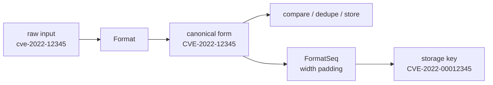
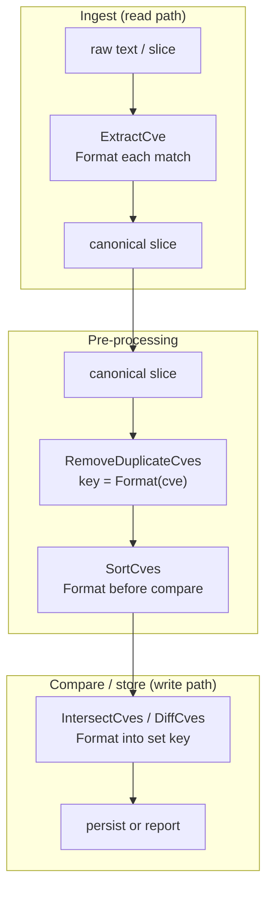
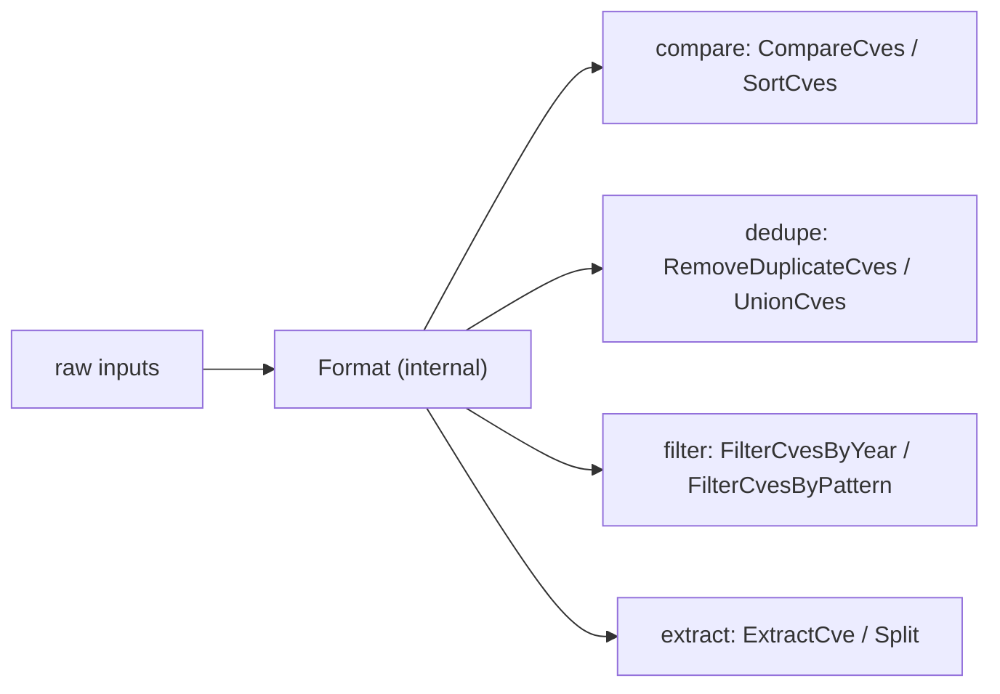
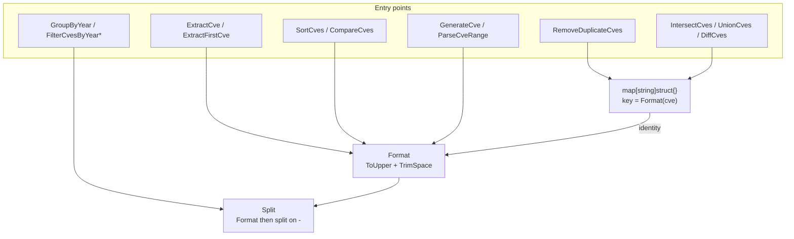

# Formatting & Normalization

CVE identifiers are short strings, yet in the wild they arrive in a surprising variety of shapes: lower-case `cve-2022-12345`, padded with spaces, copied from a PDF with stray whitespace, or stored with a sequence number of inconsistent width. The `cve` package treats normalization as the single foundation that every other operation builds on, so that comparison, deduplication and storage all operate on a canonical form rather than fighting raw input.

:::tip Who should read this
Developers importing CVE data from heterogeneous sources (scanners, advisories, spreadsheets), maintainers building CVE pipelines that must compare or deduplicate reliably, and anyone who has been bitten by `cve-2022-1111` and `CVE-2022-1111` being treated as two different records.
:::

## Why CVE identifiers need normalization

A CVE identifier looks rigid — `CVE-YYYY-NNNNN` — but the sources that emit them are not. The same logical identifier can appear in at least three unreliable ways:

| Source of variation | Example | Why it happens |
| --- | --- | --- |
| Letter case | `cve-2022-12345`, `Cve-2022-12345` | Hand-typed, copied from prose, or emitted by tools that lowercase everything |
| Surrounding whitespace | `" CVE-2022-12345 "` | Copy-paste from a PDF or spreadsheet cell, trailing newline from a file |
| Sequence-number width | `CVE-2022-123` vs `CVE-2022-000123` | Some feeds zero-pad to a fixed width, others omit leading zeros |

If these variants are not folded into a single canonical form, downstream logic breaks silently: a `map[string]struct{}` used for deduplication will keep both `cve-2022-1111` and `CVE-2022-1111`, an equality check between two lists will miss real overlaps, and a database `UNIQUE` index will either reject valid duplicates or accept the same logical CVE twice.

The `cve` package solves this by mandating one rule: **before any value is compared, grouped, deduplicated or stored, it passes through `Format`.**



## Format vs FormatSeq — division of labor

The package exposes two formatting helpers. They are complementary, not redundant: `Format` produces the canonical string every other function expects; `FormatSeq` produces a width-padded variant for display or fixed-width storage.

### Format

`Format` does exactly two things — `strings.ToUpper(strings.TrimSpace(cve))` — and nothing more. It does not validate the input, it does not re-order segments, and it does not touch the sequence-number width.

```go
package main

import (
    "fmt"

    "github.com/scagogogo/cve"
)

func main() {
    fmt.Println(cve.Format(" cve-2022-12345 ")) // CVE-2022-12345
    fmt.Println(cve.Format("cve-2021-44228"))   // CVE-2021-44228
    fmt.Println(cve.Format("not-a-cve"))        // NOT-A-CVE  (no validation, just uppercased)
}
```

Because `Format` skips validation, callers can pass arbitrary text through it without panicking — the trade-off is that "looks canonical" is not the same as "is a valid CVE". Validation is the job of `IsCve` / `ValidateCve`, which run before any logic that depends on the year and sequence number being meaningful.

### FormatSeq

`FormatSeq(cve, width)` is the width-padding helper. It is stricter than `Format`: it first calls `IsCve` to confirm the input is a real CVE, then `Split`s it into year and sequence number, and finally rebuilds the string with `%0*d` so the sequence number is left-padded with zeros to the requested width.

```go
package main

import (
    "fmt"

    "github.com/scagogogo/cve"
)

func main() {
    fmt.Println(cve.FormatSeq("CVE-2022-123", 6))    // CVE-2022-000123
    fmt.Println(cve.FormatSeq("CVE-2022-12345", 6))  // CVE-2022-012345
    fmt.Println(cve.FormatSeq("not-a-cve", 6))       // not-a-cve  (invalid input returned as-is)
}
```

Two consequences follow directly from the source:

1. **Invalid input is returned unchanged.** When `IsCve` fails, `FormatSeq` returns the original string rather than an empty value or an error, so a pipeline that batches thousands of strings will not crash on one malformed entry.
2. **`FormatSeq` is opt-in for fixed-width needs.** The rest of the package never calls `FormatSeq` internally — it is a tool for the caller who needs database-friendly keys or aligned columnar output, not a prerequisite for comparison or deduplication.

| Aspect | `Format` | `FormatSeq` |
| --- | --- | --- |
| Returns canonical case + trimmed | Yes | Yes (via `Split`) |
| Validates CVE format | No | Yes (`IsCve`) |
| Pads sequence to fixed width | No | Yes (`width` param) |
| Called internally by other functions | Yes, almost everywhere | No, caller-driven only |
| Invalid input behavior | Uppercased anyway | Returned unchanged |

## Where normalization sits in the pipeline

Normalization is a position, not just a function. The package's design puts `Format` at the very front of every read path and every write path, so that all the interesting logic downstream sees only canonical input.



The reason this placement matters is that set operations and deduplication rely on string identity. `RemoveDuplicateCves`, `IntersectCves`, `UnionCves` and `DiffCves` all build their sets with `Format(cve)` as the map key. Because `Format` is applied before the lookup, `cve-2022-1111` and `CVE-2022-1111` hash to the same key and collapse into one record — exactly the behavior you want when merging feeds that disagree on case.

```go
// Two sources disagree on case and surrounding whitespace.
sourceA := []string{"cve-2022-1111", " CVE-2022-2222 "}
sourceB := []string{"CVE-2022-2222", "CVE-2022-3333"}

// UnionCves internally formats every entry before keying the set,
// so the result is deduplicated and case-consistent.
all := cve.UnionCves(sourceA, sourceB)
// all = [CVE-2022-1111, CVE-2022-2222, CVE-2022-3333]
```

A common mistake is to format once at ingestion and then assume later stages can skip it. The package does not rely on that assumption — each operation re-applies `Format` defensively, which is why passing a raw, un-formatted slice to `IntersectCves` still produces correct results. The cost is negligible (`ToUpper` + `TrimSpace` are allocation-light) and the safety is real: a single un-formatted entry in the middle of a pipeline cannot poison a set.

### Storage posture

When the destination is a database or a sorted report, `Format` and `FormatSeq` play different roles:

- Use **`Format`** for the canonical column that every query and join targets. This is the value `ExtractCve`, `SortCves` and the set operations emit.
- Use **`FormatSeq`** only when you need a fixed-width key, for example to guarantee lexicographic ordering across sequence numbers of differing length, or to satisfy a legacy schema that expects eight-digit sequences.

```go
// Canonical column for queries and joins.
canonical := cve.Format(raw) // CVE-2022-12345

// Fixed-width key for legacy storage / lexicographic sort.
storageKey := cve.FormatSeq(raw, 8) // CVE-2022-00012345
```

## Format is called internally by almost every function

`Format` is not a helper you must remember to call — it is woven through the package. The following functions all invoke `Format` on their inputs before doing any real work:

| Function | File | How it uses `Format` |
| --- | --- | --- |
| `Split` | base.go | Formats before splitting on `-` |
| `extractYear` | base.go | Formats before extracting the year |
| `ExtractCve` / `ExtractFirstCve` | extract.go | Formats every regex match |
| `SortCves` | compare.go | Formats each entry before sorting |
| `GroupByYear` | filter.go | Formats each entry into its year bucket |
| `FilterCvesByYear` / `FilterCvesByYearRange` | filter.go | Formats before comparing years |
| `FilterCvesByPattern` | filter.go | Formats the pattern and each candidate |
| `RemoveDuplicateCves` | filter.go | Key is `Format(cve)` |
| `IntersectCves` / `UnionCves` / `DiffCves` | filter.go | Set keys are `Format(cve)` |
| `GenerateCve` / `ParseCveRange` | generate.go | Formats each generated identifier |

The practical implication is that you rarely need to pre-format data you hand to the package. Feed it raw text from `ExtractCve`, a messy slice from a scanner, or an untrimmed CVE typed by an analyst — the canonical form is enforced inside, consistently, by every function that cares about identity.



## Common scenarios

### Merging two advisory feeds

Two advisories describe overlapping vulnerabilities but disagree on case and whitespace. Because `UnionCves` formats before keying, the merge is clean.

```go
feed1 := []string{"cve-2021-44228", " CVE-2022-12345 "}
feed2 := []string{"CVE-2022-12345", "CVE-2023-99999"}
merged := cve.UnionCves(feed1, feed2)
// merged = [CVE-2021-44228, CVE-2022-12345, CVE-2023-99999]
```

### Producing a fixed-width report column

A report needs sequence numbers padded to a consistent width for alignment. `FormatSeq` handles invalid rows gracefully — they pass through unchanged instead of breaking the batch.

```go
rows := []string{"CVE-2022-123", "cve-2022-12345", "see-advisory"}
for _, r := range rows {
    fmt.Println(cve.FormatSeq(r, 8))
}
// CVE-2022-00000123
// CVE-2022-00012345
// see-advisory
```

### Deduplicating analyst-entered data

Analysts paste CVEs from different tools; some lower-case, some with trailing spaces. `RemoveDuplicateCves` collapses them via the formatted key.

```go
entered := []string{"CVE-2022-1111", "cve-2022-1111", " CVE-2022-1111 "}
unique := cve.RemoveDuplicateCves(entered)
// unique = [CVE-2022-1111]
```

## Summary

- CVE identifiers arrive with case, whitespace and width variation; without normalization, comparison and deduplication silently fail.
- `Format` is the canonical-form primitive — `ToUpper` + `TrimSpace`, no validation, used internally almost everywhere.
- `FormatSeq` is the opt-in width-padder for fixed-width storage and display; it validates with `IsCve` and returns invalid input unchanged.
- Normalization is positioned at the front of every read and write path, and set operations key on `Format(cve)` so case/whitespace variants collapse correctly.
- You rarely need to call `Format` yourself — `ExtractCve`, `SortCves`, the set operations and the filters all apply it internally.

## Visual Reference

Two views of the same normalization pipeline. The first is a decision-tree/flow view of how a single raw string is routed through `Format` and `FormatSeq`; the second is a call-graph showing which package functions converge on `Format` as their shared identity primitive.

### Decision tree for a single input string

```text
                    raw input string
                          |
              +-----------+-----------+
              |                       |
        passes IsCve?            fails IsCve?
        (CVE-\d+-\d+ ,            (e.g. "not-a-cve",
         case/space tolerant)      "advisory-2022-1")
              |                       |
   +----------+----------+            |  FormatSeq short-
   |                     |            |  circuits: return
Format only           FormatSeq       |  original string
   |                     |            v
   v                     v        [unchanged passthrough]
ToUpper+TrimSpace     Split -> year,seq
   |                     |
   v                     v
canonical form       fmt.Sprintf("CVE-%s-%0*d", year, width, seq)
CVE-YYYY-NNNNN            |
   |                      v
   +-> compare /        fixed-width key
       dedupe /         CVE-YYYY-NNNNNNNN
       store
```

### Call graph: every identity-sensitive function funnels through Format



## Deep Dive

1. **`Format` is intentionally non-validating by design.** Its body is a single expression, `strings.ToUpper(strings.TrimSpace(cve))` (base.go:45-47). It never inspects the `CVE-` prefix or the digit groups, so `Format("not-a-cve")` returns `NOT-A-CVE` rather than an error. This is a deliberate trade-off: making `Format` a total function means every caller can pipe arbitrary text through it without a panic or a sentinel value, and validation is deferred to the separate `IsCve` / `ValidateCve` layer (base.go:119, base.go:445) where a yes/no answer is actually meaningful.

2. **The package's regex is case- and whitespace-tolerant at the match layer, not just the format layer.** `exactCveRegex` is `(?i)^\s*CVE-\d+-\d+\s*$` (base.go:14) — the `(?i)` flag and the `\s*` anchors mean `IsCve(" CVE-2022-12345 ")` returns `true` directly, without `Format` running first. `Format` and the regex therefore handle the *same* source of variation through two independent mechanisms, which is why `FormatSeq` can safely call `IsCve` *before* it trims and still get the right answer.

3. **`FormatSeq` has two early-return paths, not one.** The documented path is "invalid input returned unchanged" when `IsCve` fails (base.go:80-82). The second, less obvious path is the `strconv.Atoi` guard on the sequence number (base.go:84-87): even after `IsCve` confirms the digits-only shape, `FormatSeq` re-parses the sequence to an integer before formatting with `%0*d`. In practice the regex already guarantees digits, so this branch is defensive against a future regex change — it means `FormatSeq` can never emit a malformed `%0*d` result, only either a correct padded CVE or the original string.

4. **Set operations key on `Format(cve)`, not on the original string — and that is what makes cross-feed merges correct.** `IntersectCves` (filter.go:232), `RemoveDuplicateCves` (filter.go:406) and the other set builders all write `Format(cve)` into the `map[string]struct{}`. Because the map key is already uppercased and trimmed, `cve-2022-1111` and `CVE-2022-1111` hash to the identical key and collapse. A side effect worth noting: the *values* these functions return are also the formatted form (filter.go:409, filter.go:242), so a slice that entered the pipeline lower-case comes out canonical without the caller lifting a finger.

5. **`FormatSeq` is never called internally — it is a pure caller-facing utility.** Grepping the package shows `FormatSeq` is invoked by zero other functions; only `Format` is woven through `Split`, `extractYear`, the extractors, sorters, filters and set operations. This separation keeps the canonical form (`Format`) and the display form (`FormatSeq`) decoupled: comparison and deduplication never depend on a fixed sequence width, so a caller who never needs fixed-width output can ignore `FormatSeq` entirely without any correctness impact.

## Further reading

- [Format function reference](/api/functions/format)
- [FormatSeq function reference](/api/functions/format-seq)
- [Extracting CVEs from text](/api/extract)
- [Comparing and sorting CVEs](/guide/comparison-ordering)
- [Set operations and deduplication](/guide/set-operations-guide)
