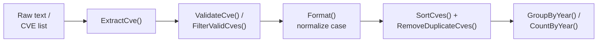
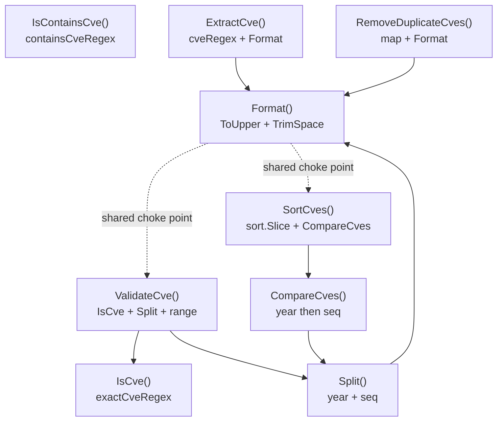

# Getting Started

Welcome to CVE Utils! This guide will help you quickly get started with this powerful CVE processing library.

## Installation

### Install with go get

```bash
go get github.com/scagogogo/cve-skills
```

### Verify Installation

Create a simple test file to confirm the installation succeeded:

```go
// test.go
package main

import (
    "fmt"
    "github.com/scagogogo/cve-skills"
)

func main() {
    // Test basic functionality
    result := cve.Format("cve-2022-12345")
    fmt.Println("Format result:", result)

    if result == "CVE-2022-12345" {
        fmt.Println("✅ CVE Utils installed successfully!")
    } else {
        fmt.Println("❌ Installation may have issues")
    }
}
```

Run the test:

```bash
go run test.go
```

## Basic Concepts

### CVE Format

CVE (Common Vulnerabilities and Exposures) identifiers follow a specific format:

```text
CVE-YYYY-NNNN
```

- `CVE`: Fixed prefix
- `YYYY`: 4-digit year
- `NNNN`: Sequence number (at least 4 digits)

For example: `CVE-2022-12345`, `CVE-2021-44228`

### Core Workflow

Most tasks chain the same handful of functions — extract, validate, normalize, then sort/group:



### Function Categories

CVE Utils organizes its functionality into the following categories:

1. **Format & Validation**: Normalize and validate CVE format
2. **Extraction**: Extract CVE information from text
3. **Compare & Sort**: Compare and sort CVEs
4. **Filter & Group**: Filter and group CVEs by condition
5. **Generate**: Generate new CVE identifiers

## First Example

Let's start with a simple example:

```go
package main

import (
    "fmt"
    "github.com/scagogogo/cve-skills"
)

func main() {
    // 1. Format a CVE
    input := " cve-2022-12345 "
    formatted := cve.Format(input)
    fmt.Printf("Raw input: '%s'\n", input)
    fmt.Printf("Formatted: '%s'\n", formatted)

    // 2. Validate the CVE
    isValid := cve.ValidateCve(formatted)
    fmt.Printf("Valid: %t\n", isValid)

    // 3. Extract CVEs from text
    text := "System affected by multiple vulnerabilities: CVE-2021-44228, CVE-2022-12345 and cve-2023-1234"
    cves := cve.ExtractCve(text)
    fmt.Printf("Extracted CVEs: %v\n", cves)

    // 4. Sort the CVEs
    sorted := cve.SortCves(cves)
    fmt.Printf("Sorted: %v\n", sorted)
}
```

Output:

```text
Raw input: ' cve-2022-12345 '
Formatted: 'CVE-2022-12345'
Valid: true
Extracted CVEs: [CVE-2021-44228 CVE-2022-12345 CVE-2023-1234]
Sorted: [CVE-2021-44228 CVE-2022-12345 CVE-2023-1234]
```

## Common Operations

### Process User Input

```go
func processUserInput(input string) {
    // Check whether the input contains a CVE
    if !cve.IsContainsCve(input) {
        fmt.Println("No CVE found in input")
        return
    }

    // Extract the first CVE
    firstCve := cve.ExtractFirstCve(input)
    fmt.Printf("First CVE: %s\n", firstCve)

    // Validate it
    if cve.ValidateCve(firstCve) {
        fmt.Println("✅ CVE format is valid")

        // Extract year and sequence
        year, seq := cve.Split(firstCve)
        fmt.Printf("Year: %s, Sequence: %s\n", year, seq)
    } else {
        fmt.Println("❌ CVE format is invalid")
    }
}

// Usage
processUserInput("Vulnerability ID: CVE-2022-12345")
```

### Batch Process CVEs

```go
func processCveList(cveList []string) {
    fmt.Printf("Original list (%d): %v\n", len(cveList), cveList)

    // Deduplicate
    unique := cve.RemoveDuplicateCves(cveList)
    fmt.Printf("After dedup (%d): %v\n", len(unique), unique)

    // Sort
    sorted := cve.SortCves(unique)
    fmt.Printf("Sorted: %v\n", sorted)

    // Group by year
    grouped := cve.GroupByYear(sorted)
    fmt.Println("Grouped by year:")
    for year, cves := range grouped {
        fmt.Printf("  %s: %v\n", year, cves)
    }

    // Get CVEs from the last 2 years
    recent := cve.GetRecentCves(sorted, 2)
    fmt.Printf("Last 2 years: %v\n", recent)
}

// Usage
cveList := []string{
    "CVE-2022-1111",
    "cve-2022-1111", // duplicate (different case)
    "CVE-2021-2222",
    "CVE-2023-3333",
    "CVE-2022-4444",
}
processCveList(cveList)
```

## Error Handling

Most CVE Utils functions have robust error handling:

```go
func safeProcessing() {
    // For invalid input, functions return safe defaults

    // Invalid CVE returns an empty string
    seq := cve.ExtractCveSeq("invalid-input")
    fmt.Printf("Sequence for invalid input: '%s'\n", seq) // Output: ''

    // Invalid CVE returns 0
    year := cve.ExtractCveYearAsInt("invalid-input")
    fmt.Printf("Year for invalid input: %d\n", year) // Output: 0

    // Empty text returns an empty slice
    cves := cve.ExtractCve("")
    fmt.Printf("Extract from empty text: %v\n", cves) // Output: []
}
```

## Performance Considerations

CVE Utils is optimized for performance:

```go
func performanceExample() {
    // For large datasets, batch processing is recommended
    largeCveList := make([]string, 10000)
    for i := 0; i < 10000; i++ {
        largeCveList[i] = fmt.Sprintf("CVE-2022-%d", i+1)
    }

    start := time.Now()

    // Batch dedup and sort
    unique := cve.RemoveDuplicateCves(largeCveList)
    sorted := cve.SortCves(unique)

    duration := time.Since(start)
    fmt.Printf("Processed %d CVEs in: %v\n", len(largeCveList), duration)
    fmt.Printf("Result count: %d\n", len(sorted))
}
```

## Next Steps

Now that you know the basics of CVE Utils, you can:

1. Read the [API Reference](/api/) for all available functions
2. Drive it from the shell with the [CLI Reference](/cli)
3. Browse [Examples](/examples/) for more real-world scenarios
4. Read the [Basic Usage Guide](/guide/basic-usage) for more detail

If you run into problems, check [GitHub Issues](https://github.com/scagogogo/cve-skills/issues) or open a new one.

## Visual Reference

The diagram below traces a single user input through the validation decision tree. Notice how `IsCve` (exact match) and `IsContainsCve` (substring match) gate two different entry points, and how invalid branches still return safe defaults rather than panicking.

```text
                  user input string
                          |
            +-------------+-------------+
            |                           |
      IsContainsCve(text)         IsCve(token)
      substring scan            exact-form scan
            |                           |
       found? +-- no --> ""        matched? +-- no --> false / 0 / ""
        | yes                          | yes
   ExtractCve(text)              Split(token) --> year, seq
   regex FindAllString           strconv.Atoi(year, seq)
        |                              |
   []CVE (uppercase)        year in [1999, now] & seq > 0?
        |                       |           |
   RemoveDuplicateCves        yes          no
   map[string]struct{}         |           |
        |                 ValidateCve   safe default
   SortCves(slice)            returns true   ("", 0, [])
   sort.Slice + CompareCves        |
        |                          |
   GroupByYear / CountByYear   downstream use
```

A second view shows the dependency graph between the core functions — which helpers call which, and where `Format()` sits as the shared normalization choke point that every path funnels through.



## Deep Dive

- **Two regexes, two semantics.** `base.go` declares `exactCveRegex` (`^\s*CVE-\d+-\d+\s*$`) and `containsCveRegex` (`CVE-\d+-\d+`) side by side. The anchors on the former are why `IsCve("...CVE-2022-12345...")` returns `false` while `IsContainsCve` returns `true` for the same text — pick the function that matches your intent rather than re-anchoring by hand. `extract.go` carries a third, `cveRegex` with a capture group, because `ExtractCve` needs `FindAllString` semantics over arbitrary prose.
- **`Format()` is the single normalization choke point.** Almost every public function (`Split`, `ExtractCve`, `SortCves`, `RemoveDuplicateCves`, `FilterCvesByPattern`, …) calls `strings.ToUpper(strings.TrimSpace(cve))` internally. This is why case-variant duplicates like `CVE-2022-1111` and `cve-2022-1111` collapse correctly in `RemoveDuplicateCves` — the map key is always the canonical uppercase form, so you never need to pre-normalize input yourself.
- **Validation is a three-rule pipeline, not a regex.** `ValidateCve` (base.go) first delegates to `IsCve` for shape, then `Split` + `strconv.Atoi` for numericness, then enforces `year >= 1999 && year <= time.Now().Year() && seq > 0`. The upper bound is computed at call time against the live clock, which is why `CVE-2026-1` flips from valid to invalid as the year rolls over — there is no hardcoded cutoff. `IsCveYearOkWithCutoff` exposes the same check with a `cutoff` argument for pre-reserved IDs.
- **`CompareCves` is lexicographic-by-field, not string compare.** `compare.go` resolves year first (`CompareByYear`), and only falls through to `ExtractCveSeqAsInt` on a year tie. A naive `sort.Strings` would place `CVE-2022-9` before `CVE-2022-10` (string "9" > "1"); the integer fallback in `CompareCves` avoids that trap. `SortCves` wraps it in `sort.Slice`, giving O(n log n) with a fresh normalized copy so the input slice is never mutated.
- **Failure modes return zero values, not errors.** `ExtractCveSeq` returns `""`, `ExtractCveYearAsInt` returns `0`, `ExtractCve` on empty text returns a non-nil but length-zero slice, and `FilterCvesByPattern` returns `nil` only on a regex compile error. Callers that distinguish "absent" from "zero" (e.g. `CVE-0000-0` cannot exist because `seq > 0`) can rely on `0` meaning "unparseable", but should not conflate it with a legitimately zero-valued field.
