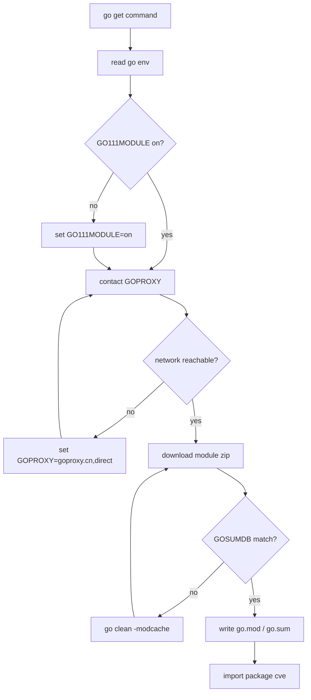

# Installation Guide

This page provides detailed instructions on how to install and configure CVE Utils in different environments.

## System Requirements

- Go 1.18 or higher
- Supported operating systems: Linux, macOS, Windows

## Installation Methods

### Method 1: Using go get (Recommended)

This is the simplest and recommended installation method:

```bash
go get github.com/scagogogo/cve-skills
```

### Method 2: Using go mod

If you are using Go modules, you can import it directly in your project:

```go
import "github.com/scagogogo/cve-skills"
```

Then run:

```bash
go mod tidy
```

### Method 3: Manual Download

You can also clone the repository manually:

```bash
git clone https://github.com/scagogogo/cve-skills.git
cd cve
go build
```

Pick an installation method based on your scenario:


## Verifying the Installation

### Basic Verification

Create a test file to verify the installation:

```go
// verify.go
package main

import (
    "fmt"
    "github.com/scagogogo/cve-skills"
)

func main() {
    // Test basic functionality
    testCve := "CVE-2022-12345"

    // Test formatting
    formatted := cve.Format(testCve)
    fmt.Printf("Format test: %s -> %s\n", testCve, formatted)

    // Test validation
    isValid := cve.ValidateCve(testCve)
    fmt.Printf("Validation test: %s -> %t\n", testCve, isValid)

    // Test extraction
    text := "System affected by CVE-2021-44228"
    extracted := cve.ExtractCve(text)
    fmt.Printf("Extraction test: %s -> %v\n", text, extracted)

    if len(extracted) > 0 && isValid {
        fmt.Println("✅ CVE Utils installed successfully!")
    } else {
        fmt.Println("❌ Installation verification failed")
    }
}
```

Run the verification:

```bash
go run verify.go
```

Expected output:

```text
Format test: CVE-2022-12345 -> CVE-2022-12345
Validation test: CVE-2022-12345 -> true
Extraction test: System affected by CVE-2021-44228 -> [CVE-2021-44228]
✅ CVE Utils installed successfully!
```

### Full Feature Test

Run the project's built-in test suite:

```bash
# Clone the repository (if you haven't already)
git clone https://github.com/scagogogo/cve-skills.git
cd cve

# Run all tests
go test -v

# Run tests and show coverage
go test -v -cover
```

## Using in a Project

### New Project

If you are creating a new Go project:

```bash
# Create a new project
mkdir my-cve-project
cd my-cve-project

# Initialize a Go module
go mod init my-cve-project

# Add the CVE Utils dependency
go get github.com/scagogogo/cve-skills

# Create the main file
cat > main.go << 'EOF'
package main

import (
    "fmt"
    "github.com/scagogogo/cve-skills"
)

func main() {
    cves := cve.ExtractCve("Found vulnerability CVE-2022-12345")
    fmt.Println("Extracted CVEs:", cves)
}
EOF

# Run the project
go run main.go
```

### Existing Project

If you want to add CVE Utils to an existing project:

```bash
# In the project root directory
go get github.com/scagogogo/cve-skills

# Update dependencies
go mod tidy
```

Then import it in your code:

```go
import "github.com/scagogogo/cve-skills"
```

## Version Management

### Using a Specific Version

If you need to use a specific version:

```bash
# Use a specific tagged version
go get github.com/scagogogo/cve-skills@v1.0.0

# Use a specific commit
go get github.com/scagogogo/cve-skills@commit-hash
```

### Viewing the Current Version

```bash
go list -m github.com/scagogogo/cve-skills
```

### Updating to the Latest Version

```bash
go get -u github.com/scagogogo/cve-skills
go mod tidy
```

## Common Issues

### Issue 1: Go Version Too Old

**Error message**:
```text
go: module github.com/scagogogo/cve-skills requires go >= 1.18
```

**Solution**:
Upgrade Go to 1.18 or higher.

### Issue 2: Network Connection Problems

**Error message**:
```text
go: github.com/scagogogo/cve-skills: dial tcp: lookup github.com: no such host
```

**Solution**:
1. Check your network connection
2. Configure a Go proxy (if in China):

```bash
go env -w GOPROXY=https://goproxy.cn,direct
go env -w GOSUMDB=sum.golang.google.cn
```

### Issue 3: Module Cache Problems

**Error message**:
```text
go: github.com/scagogogo/cve-skills@v1.0.0: invalid version: unknown revision
```

**Solution**:
Clean the module cache:

```bash
go clean -modcache
go get github.com/scagogogo/cve-skills
```

### Issue 4: Wrong Import Path

**Error message**:
```text
package github.com/scagogogo/cve-skills is not in GOROOT
```

**Solution**:
Make sure you are using Go modules:

```bash
# Check whether Go modules are enabled
go env GO111MODULE

# If the output is not "on", enable it
go env -w GO111MODULE=on
```

## Development Environment Setup

If you want to contribute to the development of CVE Utils:

### 1. Clone the Repository

```bash
git clone https://github.com/scagogogo/cve-skills.git
cd cve
```

### 2. Install Development Dependencies

```bash
# Install the test tool
go install golang.org/x/tools/cmd/cover@latest

# Install the code formatting tool
go install golang.org/x/tools/cmd/goimports@latest
```

### 3. Run Development Tests

```bash
# Run all tests
go test ./...

# Run tests and generate a coverage report
go test -coverprofile=coverage.out ./...
go tool cover -html=coverage.out -o coverage.html

# Format code
gofmt -w .
goimports -w .
```

### 4. Build

```bash
# Build the project
go build

# Cross-compile (for example, build for Linux)
GOOS=linux GOARCH=amd64 go build
```

## Visual Reference

The diagram below traces how a `go get` request flows through the Go toolchain and lands in your module cache, alongside the decision tree for choosing an installation path.

```text
+-------------------+     go get github.com/scagogogo/cve-skills
|  Your Go project  |  ------------------------------------------------+
|  (go.mod present) |                                                   |
+---------+---------+                                                   v
          | reads GO111MODULE, GOPROXY, GOSUMDB            +-----------------------+
          +----------------------------------------------> |  go command (client)  |
                                                           +-----------+-----------+
                                                                       | resolves module path
                                                                       v
                                                       +---------------+----------------+
                                                       |  GOPROXY (goproxy.cn/direct)  |
                                                       +---------------+----------------+
                                                                       | downloads .zip + .info
                                                                       v
                                                          +-----------------------------+
                                                          | module cache ($GOPATH/pkg) |
                                                          +--------------+--------------+
                                                                         | unpacked to pkg dir
                                                                         v
                                                            +----------------------------+
                                                            | GOSUMDB checksum verified  |
                                                            +--------------+-------------+
                                                                           | add to go.mod / go.sum
                                                                           v
                                                              +---------------------------+
                                                              | import "github.com/scagogogo/cve-skills"
                                                              | package cve ready to use  |
                                                              +---------------------------+
```

From another angle, the flowchart below shows the same pipeline as a state machine, with the branch points where installation commonly fails and the recovery action for each.



## Deep Dive

- **Module path vs. import path**: The module declared in `go.mod` is `github.com/scagogogo/cve-skills`, and every source file declares `package cve` (see the first line of `base.go`, `extract.go`, `generate.go`). This means after `go get` you write `import "github.com/scagogogo/cve-skills"` but reference the identifier as `cve.Format`, `cve.ValidateCve`, and so on. The mismatch between the long module path and the short package name is a frequent source of "cannot find package" errors when users hand-type the import.
- **Why Go 1.18 is the floor**: `go.mod` pins `go 1.18`. The library relies on the `strings`, `regexp`, and `strconv` standard packages rather than generics, but 1.18 is kept as the minimum so consumers on maintained Go toolchains all see the same behavior. Going below 1.18 makes `go mod tidy` refuse to resolve the module, which is exactly what Issue 1 in *Common Issues* reports.
- **Verification touches three subsystems on purpose**: The `verify.go` snippet calls `cve.Format`, `cve.ValidateCve` (`base.go:445`), and `cve.ExtractCve` (`extract.go:42`) rather than just one function. `Format` exercises the regex normalization path in `base.go:45`, `ValidateCve` exercises the strict matcher in `base.go:119` (`IsCve`), and `ExtractCve` exercises the text-scanning regex. If any one of these compiles and runs, the package is wired into your module graph correctly.
- **Cache, proxy, and checksumDB form a trust chain**: `GOPROXY` supplies the bits, `GOSUMDB` (default `sum.golang.org`, mirrored as `sum.golang.google.cn` in China) records the expected hash of each version, and `$GOPATH/pkg/mod` caches the unpacked source. The "unknown revision" and "no such host" errors in *Common Issues* map to a break at exactly one link of this chain, which is why each fix targets a single env var rather than a blanket reinstall.
- **CLI vs. library use the same binary**: The repository also builds a cobra-based CLI (`require github.com/spf13/cobra v1.8.1` in `go.mod`). When you `go build` the root package you get the library; the CLI entry point lives in the same module. This is why Method 3 (`git clone` + `go build`) works for both embedding the library and poking at the command surface, with no separate install step.

## Next Steps

After installation, you can:

1. Read [Getting Started](/guide/getting-started) to learn the basic usage
2. Check the [Basic Usage Guide](/guide/basic-usage) for more features
3. Browse the [API Reference](/api/) for all available functions
4. View the [Examples](/examples/) to learn real-world use cases
