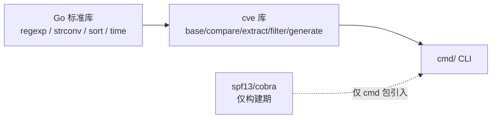
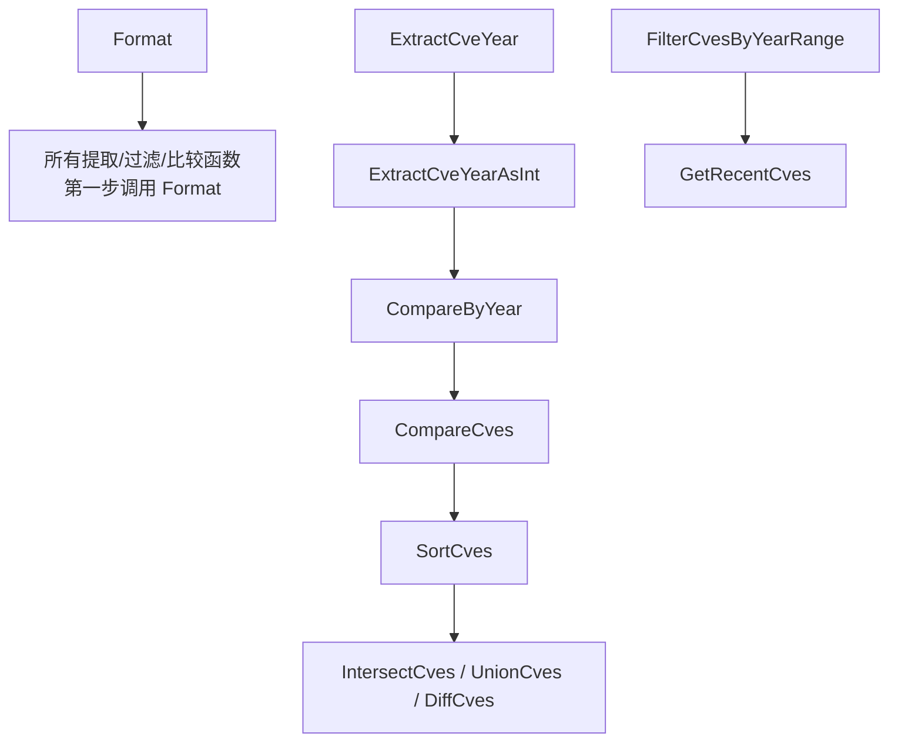
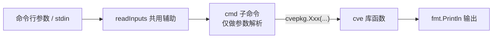
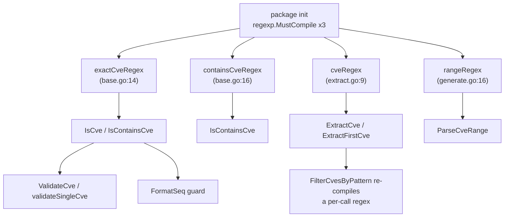

# Library Design Philosophy

The `cve` package is a deliberately small, deliberately boring Go library. It has no third-party runtime dependencies, exposes a flat namespace of stateless functions, funnels every code path through one normalizer (`Format`), never panics on bad input, ships a CLI that is a thin wrapper over the same public functions, and gives every function its own `_test.go` file. This page walks through each of those choices, why it was made, and where in the source you can see it enforced — so that contributors extending the package keep it consistent.

:::tip Who should read this
Contributors adding a new function, a new CLI subcommand, or a new validation rule, and maintainers evaluating whether the package fits their architecture. If you have asked "why are there no `error` returns?", "why does the CLI import the library instead of duplicating logic?", or "how do I keep the test file naming convention when I add `foo.go`?", this page is the contract.
:::

## Pure standard library, zero runtime deps

Open `go.mod` and you see exactly one direct requirement:

```
module github.com/scagogogo/cve-skills

go 1.18

require github.com/spf13/cobra v1.8.1
```

`cobra` is a **build-time** dependency of the `cmd/` package (the CLI), pulled in only by `cmd/*.go`. The library proper — `base.go`, `compare.go`, `extract.go`, `filter.go`, `generate.go`, `cve.go` — imports nothing outside the Go standard library. Each file's import block is the proof:

| Source file | stdlib imports only |
| --- | --- |
| `base.go` | `fmt`, `regexp`, `strconv`, `strings`, `time` |
| `compare.go` | `sort` |
| `extract.go` | `regexp`, `strconv` |
| `filter.go` | `strconv`, `time` |
| `generate.go` | `fmt`, `regexp`, `strconv`, `time` |
| `cve.go` | _(package doc only, no imports)_ |

📌 Why it matters: a downstream service or agent runtime can vendor this package with no transitive dependency explosion, no version-skew between `cobra` versions, and no supply-chain surface from the library itself. The cost is that conveniences like a structured validator result are hand-rolled (`CveValidationResult` struct in `base.go`) rather than borrowed from a validation framework — a trade the package accepts willingly.



## Functional, stateless API

There are no structs to instantiate, no `New()` constructors, no methods on receivers, and no package-level mutable state other than a single `var Version = "dev"` in `cve.go` (declared `var` specifically so goreleaser's `-ldflags` can overwrite it at link time — the doc comment warns against changing it to `const`). Every public symbol is a top-level function taking strings, ints, or slices and returning the same:

```go
// base.go — all top-level funcs, no receivers
func Format(cve string) string
func IsCve(text string) bool
func Split(cve string) (year string, seq string)
func ValidateCves(cveSlice []string) []CveValidationResult

// compare.go — pure functions, compose by calling each other
func CompareByYear(cveA, cveB string) int
func SortCves(cveSlice []string) []string
```

The one struct that exists, `CveValidationResult`, is a plain data carrier returned by `ValidateCves` — it has no methods and holds no behavior. Composition happens by direct function call: `CompareCves` calls `CompareByYear`; `SortCves` calls `Format` then `CompareCves`; `GetRecentCves` delegates entirely to `FilterCvesByYearRange`.



🧩 The practical consequence: every function is safe to call concurrently from any goroutine, and the entire package is testable as a black box — feed bytes in, assert bytes out, no setup or teardown.

## Format as the single normalizer

Nearly every public function begins with `Format(cve)` or calls a helper that does. The implementation is one expression:

```go
func Format(cve string) string {
    return strings.ToUpper(strings.TrimSpace(cve))
}
```

It is the contract every other function relies on. `Split` formats before splitting; `ExtractCveYearAsInt` formats via `Split`; `SortCves` formats every element before sorting; `FilterCvesByPattern` formats both the pattern and each candidate; the set operations (`IntersectCves`, `UnionCves`, `DiffCves`) format before inserting into the dedup map. The result is that **any CVE that survives one of these functions comes out uppercase and trimmed**, regardless of how dirty the input was.

| Function | Calls `Format`? | Where |
| --- | :-: | --- |
| `Split` | ✅ | first line, before `strings.Split` |
| `ExtractCveYear` / `ExtractCveSeq` | ✅ | via `Split` |
| `extractYear` (internal) | ✅ | first line |
| `SortCves` | ✅ | per-element before `sort.Slice` |
| `FilterCvesByPattern` | ✅ | pattern + each candidate |
| `GroupByYear` / `FilterCvesByYear` / `FilterCvesByYearRange` | ✅ | per element |
| `IntersectCves` / `UnionCves` / `DiffCves` / `RemoveDuplicateCves` | ✅ | before map insert |
| `FormatSeq` | ✅ | via `Split` (after `IsCve` guard) |
| `ParseCveRange` | ✅ | per generated element, via `GenerateCve` |

⚡ The one function that intentionally does **not** gate on validity is `Format` itself — it normalizes whatever you hand it, so the canonical form of garbage is upper-cased trimmed garbage. Validity is a separate concern, handled by `IsCve` / `ValidateCve`. This separation is what lets the package be both permissive (never crash) and strict (explicit validators) at the same time.

## Zero-value tolerance, no panics

The package returns zero values for invalid input instead of `error`, and guards every unsafe operation. Three patterns recur throughout the source:

1. **`IsCve` guard before slicing.** `FormatSeq` returns the original input unchanged when `!IsCve(cve)`; `ExtractCveSeq` returns `""` early; `IsCvesConsecutive` returns `false` if either year is `0`.
2. **Discarded `strconv.Atoi` errors.** `extractYear` does `year, _ := strconv.Atoi(split[1])`; `ExtractCveYearAsInt` and `ExtractCveSeqAsInt` do the same, returning `0` on failure. No panic, no error propagation — the zero value is the signal.
3. **`nil` on regex failure.** `FilterCvesByPattern` returns `nil` if `regexp.Compile` errors; `ParseCveRange` returns `nil` if the range regex does not match or the range is reversed.

```go
// extract.go — 0 on any failure, no error returned
func ExtractCveYearAsInt(cve string) int {
    if !IsCve(cve) {
        return 0
    }
    year := ExtractCveYear(cve)
    i, _ := strconv.Atoi(year)
    return i
}
```

🤖 This makes the library safe to point at untrusted strings — advisory prose, range expressions scraped from the web, mixed-case identifiers pasted by a human. No input crashes it. The trade-off is documented honestly in [Error Handling & Edge Cases](/guide/error-handling): you cannot distinguish "empty input" from "malformed input" at the zero value alone, so when the *reason* matters, use `ValidateCves` — the only function returning a structured `Reason`.

## CLI and library share one source of truth

The `cmd/` package does not reimplement CVE logic. It imports the library and calls its public functions directly:

```go
// cmd/extract.go
import cvepkg "github.com/scagogogo/cve-skills"

// ...
cves := cvepkg.ExtractCve(input)   // library function
fmt.Println(cvepkg.ExtractFirstCve(input))
year, seq := cvepkg.Split(input)
```

Every CLI subcommand is a thin adapter that (1) reads input from args or stdin via the shared `readInputs` helper, (2) calls exactly one library function, and (3) prints the result. The mapping is one-to-one and discoverable:

| CLI subcommand | Library function called |
| --- | --- |
| `cve extract` / `extract first` / `extract last` | `ExtractCve` / `ExtractFirstCve` / `ExtractLastCve` |
| `cve extract year` / `extract seq` / `extract split` | `ExtractCveYear` / `ExtractCveSeq` / `Split` |
| `cve format` | `Format` / `FormatSeq` |
| `cve validate` / `validate batch` | `ValidateCve` / `ValidateCves` |



🛠️ The payoff is correctness by construction: a bug fixed in the library is fixed in the CLI for free, and the CLI's behavior is fully specified by the library's documented contracts. The only CLI-local code is argument parsing and output formatting (`fmt.Println`, tab-separated `year<TAB>seq`).

## Testability — every function has a `_test.go`

The repository ships a `_test.go` file per source file, with no exceptions:

| Source file | Test file | What it covers |
| --- | --- | --- |
| `base.go` | `base_test.go` | `Format`, `FormatSeq`, `IsCve`, `Split`, `ValidateCve`, `ValidateCves`, `FilterValidCves`, year checks |
| `compare.go` | `compare_test.go` | `CompareByYear`, `SubByYear`, `CompareCves`, `SortCves` |
| `extract.go` | `extract_test.go` | `ExtractCve`, `ExtractFirstCve`, `ExtractLastCve`, year/seq extractors, `FilterCvesByPattern` |
| `filter.go` | `filter_test.go` | `GroupByYear`, year filters, `GetRecentCves`, set ops, `CountByYear`, ranges |
| `generate.go` | `generate_test.go` | `GenerateCve`, `GenerateFakeCve`, `ParseCveRange`, `IsCvesConsecutive` |

✅ Because the API is stateless and pure, tests are table-driven and need no fixtures: each case is a `(input, expected)` row. The naming convention is enforced by file colocation — adding `foo.go` without `foo_test.go` is immediately visible in `git status` and fails review. Combined with the zero-panic guarantee, this means `go test ./...` from a clean checkout is the single command that proves the whole package.

## Summary

- **Pure stdlib**: the library imports only `fmt`/`regexp`/`strconv`/`strings`/`sort`/`time`; `cobra` is a CLI-only build dependency.
- **Stateless functions**: no structs to construct, no methods, no mutable package state except the ldflags-injected `Version`.
- **One normalizer**: `Format` is the first step of nearly every function, guaranteeing uppercase trimmed output.
- **Zero-value tolerance**: `IsCve` guards before slicing, `Atoi` errors are discarded, regex failures return `nil` — no panics, ever.
- **CLI shares the source**: `cmd/` imports `cvepkg` and calls library functions directly; no logic is duplicated.
- **One test file per source file**: `base_test.go` … `generate_test.go`, table-driven, no fixtures.

## Visual Reference

The two diagrams below show the same package from two angles. The ASCII diagram traces the runtime data flow of a single CVE string as it moves through normalization, validation, and extraction. The mermaid diagram traces the package-level regex lifecycle and who depends on which compiled pattern.

```text
                 raw input string
                         |
                         v
        +------------------------------------------+
        | Format(cve)                              |
        |   strings.ToUpper(strings.TrimSpace(...))|
        +------------------------------------------+
                         |
              upper-cased, trimmed
                         |
              +----------+----------+
              |                     |
              v                     v
        +-----------+         +-----------------+
        | IsCve(t)  |         | Split(cve)      |
        | exactCve  |         |  Split on "-"   |
        | Regex     |         |  -> year, seq   |
        +-----------+         +-----------------+
              |                     |
        bool valid?            year/seq strings
        |     |                  |        |
       yes    no                 v        v
        |     |          +-------+   +-----------+
        |     |          | Atoi  |   | Atoi err  |
        |     |          | year  |   | discarded |
        |     |          +-------+   +-----------+
        |     |              |            |
        v     v              v            v
   normal      0/""       int year     int seq (0 on fail)
   path        zero-value  |            |
   |           path        |            |
   |                        v            v
   |                  CompareByYear = yearA - yearB (raw diff)
   |                        |
   |                        v
   |                  CompareCves normalizes to -1/0/1
   |                        |
   |                        v
   |                  SortCves -> sort.Slice
   |
   +-- ExtractCve(text) scans with containsCveRegex / cveRegex
        |                Format each match
        v
   []string (upper-cased, trimmed)
```



## Deep Dive

1. **Four package-level regexes, compiled once at init.** The package declares `exactCveRegex`, `containsCveRegex`, and `cveRegex` as `var ... = regexp.MustCompile(...)` at the top of `base.go` (lines 14, 16) and `extract.go` (line 9), plus `rangeRegex` in `generate.go` (line 16). Because they are package-level, the Go runtime compiles each pattern exactly once when the package is first imported and caches the `*regexp.Regexp` for the lifetime of the process. This is why hot paths like `IsCve` and `ExtractCve` never pay a compile cost per call — only a `MatchString`/`FindAllString` cost. The one exception is `FilterCvesByPattern` (extract.go), which compiles a fresh regex per call because the pattern is caller-supplied; on a `regexp.Compile` error it returns `nil` rather than panicking.

2. **`CompareByYear` returns a raw difference, `CompareCves` normalizes it.** `CompareByYear` (compare.go:41) returns `ExtractCveYearAsInt(cveA) - ExtractCveYearAsInt(cveB)` — an unconstrained integer that can be large (e.g. `-23` for 1999 vs 2022). `CompareCves` (compare.go:110) wraps that: it folds any non-zero year comparison down to `-1`/`1` and only falls through to sequence-number comparison when the years are equal. `SortCves` then calls `CompareCves` inside `sort.Slice`, so the comparator is stable and bounded. This layering means a consumer who wants the *magnitude* of the year gap should call `CompareByYear`/`SubByYear`, while one who only needs ordering should call `CompareCves`.

3. **Set operations use `map[string]struct{}`, not `map[string]bool`.** `IntersectCves`, `UnionCves`, and `DiffCves` (filter.go:230, 285, 345) all build their dedup sets as `map[string]struct{}`. An empty struct consumes zero bytes of value storage, so the map's memory footprint is just the key strings and hash table overhead — a deliberate choice for a library that may process large CVE lists. The pattern also surfaces in `RemoveDuplicateCves` (filter.go:402) and the `seen` guards inside `IntersectCves`/`DiffCves`, which preserve insertion order by appending to the result slice only on first sight.

4. **The `Version` variable is `var`, not `const`, on purpose.** `cve.go:41` declares `var Version = "dev"` and its doc comment explicitly warns against changing it to `const`. goreleaser injects the real semver via `-ldflags "-X github.com/scagogogo/cve-skills.Version=vX.Y.Z"` at link time; `const` would make that injection silently no-op. This is the only piece of mutable package-level state in the entire library, and it exists solely to be overwritten by the build toolchain.

5. **`Format` is intentionally not gated by `IsCve`.** Every other public function either calls `Format` first or reaches it through `Split`/`ExtractCveYear`. But `Format` itself (base.go:45) applies `ToUpper`+`TrimSpace` unconditionally — the canonical form of `"garbage"` is `"GARBAGE"`. This keeps the normalizer total (defined for every string) so that callers never have to pre-validate before normalizing. Validity is a separate axis, owned by `IsCve`/`ValidateCve`/`ValidateCves`, which is what lets the package be both permissive (never crash) and strict (explicit, reason-bearing validators) without those two concerns colliding.

## Further reading

- [Error Handling & Edge Cases](/guide/error-handling) — the zero-value convention in depth, function by function
- [Validation Strategy](/guide/validation-strategy) — the four-function validation ladder built on top of `Format`
- [Regex Internals](/guide/regex-internals) — the three package-level regexes and how they stay compiled
- [Format](/api/functions/format) — the normalizer every other function calls first
- [ValidateCves](/api/functions/validate-cves) — the one function that returns a `Reason`
- [Getting Started](/guide/getting-started) — install the library and CLI in one command
