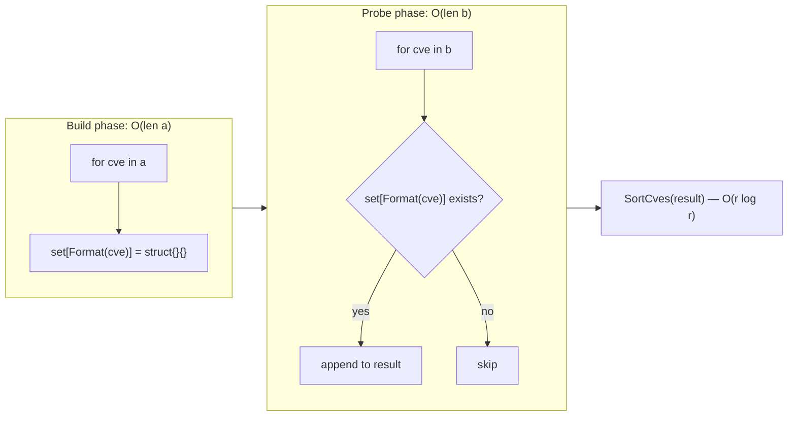
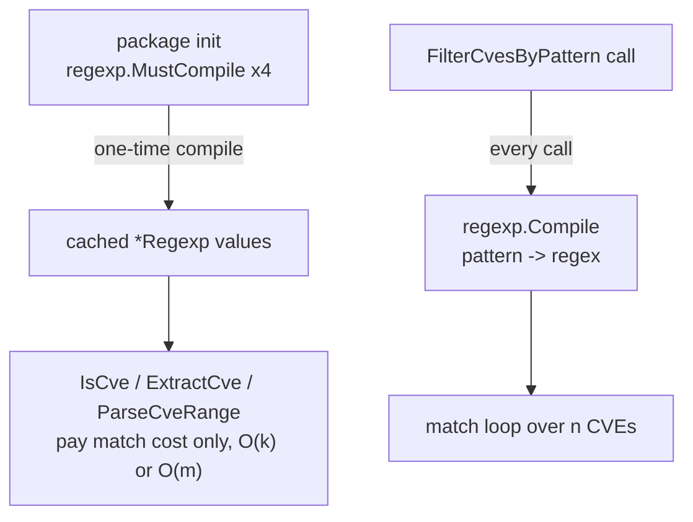
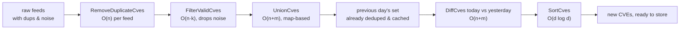
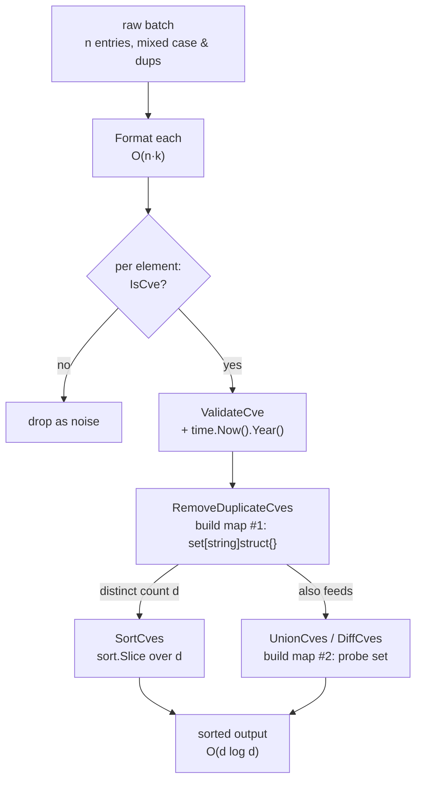

# Performance Characteristics

The `cve` package is deliberately allocation-light: most operations are single-pass scans over a slice, the regex engines are compiled once at package init, and the set operations lean on Go's `map[string]struct{}` for O(1) membership probes. This page consolidates the time and space complexity documented across the source — `O(n)`, `O(n log n)`, and `O(n+m)` — explains *why* the map gives set operations a constant-factor edge, and offers two concrete tuning levers (dedupe before large-list work, and reuse the compiled pattern regexes) for the few hot paths where it matters.

:::tip Who should read this
Engineers processing CVE lists in the tens of thousands or above — feed reconcilers, advisory aggregators, CI pipelines that diff today's CVE set against yesterday's. If you only validate a handful of user-typed identifiers per request, the complexities below are irrelevant; this page is for the callers who can feel `SortCves` or `IntersectCves` in their profile.
:::

## The complexity map at a glance

Every public function that touches a slice has its cost written into its source-level doc comment. The table below collects them in one place, alongside the dominant cost driver and whether the function allocates a fresh result slice.

| Function | Time | Space | Dominant cost | New allocation |
| --- | --- | --- | --- | :-: |
| `Format` | O(k) | O(k) | `strings.ToUpper` + `TrimSpace` over input of length k | ✅ |
| `IsCve` | O(k) | O(1) | single `exactCveRegex.MatchString` | ❌ |
| `IsContainsCve` | O(k) | O(1) | single `containsCveRegex.MatchString` | ❌ |
| `Split` | O(k) | O(k) | `strings.Split` on `-` | ✅ |
| `ExtractCve` | O(m) | O(n) | regex scan over text of length m, n matches | ✅ |
| `ExtractFirstCve` / `ExtractLastCve` | O(m) | O(n) | delegate to `ExtractCve` | ✅ |
| `ExtractCveYear` / `ExtractCveYearAsInt` | O(k) | O(k) | `Split` + `strconv.Atoi` | ✅ |
| `ExtractCveSeq` / `ExtractCveSeqAsInt` | O(k) | O(k) | `Split` + `strconv.Atoi` | ✅ |
| `ValidateCve` | O(k) | O(k) | `IsCve` + `Split` + `time.Now().Year()` | ✅ |
| `ValidateCves` | O(n·k) | O(n) | loop of `validateSingleCve` | ✅ |
| `FilterValidCves` | O(n·k) | O(n) | loop of `ValidateCve` + `Format` | ✅ |
| `CompareByYear` / `SubByYear` | O(k) | O(k) | two `ExtractCveYearAsInt` calls | ✅ |
| `CompareCves` | O(k) | O(k) | year compare + seq compare | ✅ |
| `SortCves` | O(n log n) | O(n) | `sort.Slice` with `CompareCves` comparator | ✅ |
| `GroupByYear` | O(n) | O(n) | single pass into `map[string][]string` | ✅ |
| `FilterCvesByYear` | O(n) | O(k) | single pass; k = matching count | ✅ |
| `FilterCvesByYearRange` | O(n) | O(k) | single pass; k = matching count | ✅ |
| `FilterCvesByPattern` | O(n·k) | O(n) | per-call `regexp.Compile` + n matches | ✅ |
| `IntersectCves` | O(n+m) | O(min(n,m)) | map build on a + probe on b | ✅ |
| `UnionCves` | O(n+m) | O(n+m) | map build across both + dedupe | ✅ |
| `DiffCves` | O(n+m) | O(n+m) | map build on b + probe on a | ✅ |
| `RemoveDuplicateCves` | O(n) | O(n) | single pass into `map[string]struct{}` | ✅ |
| `CountByYear` | O(n) | O(n) | single pass into `map[int]int` | ✅ |
| `YearRange` | O(n) | O(1) | single pass tracking min/max | ❌ |
| `SeqRange` | O(n) | O(1) | single pass filtered by year | ❌ |
| `GenerateCve` | O(1) | O(k) | `fmt.Sprintf` + `Format` | ✅ |
| `GenerateFakeCve` | O(1) | O(k) | `time.Now()` + `GenerateCve` | ✅ |
| `ParseCveRange` | O(p) | O(p) | one regex + p-length result slice | ✅ |
| `IsCvesConsecutive` | O(k) | O(k) | two `Extract*AsInt` pairs | ✅ |

📖 Here `n` and `m` are slice lengths, `k` is the length of a single CVE string (a dozen characters or so — effectively a constant for most reasoning), and `p` is the width of a parsed range expression (`endSeq - startSeq + 1`). The "New allocation" column is a reminder that the package is **non-mutating** by design — no function rewrites its input slice, so callers can safely retain the original.

## Three complexity families

Strip away the single-string helpers and the table collapses into three behavioral families, each with a recognisable cost shape:

```mermaid
flowchart TD
    A["Single-string helpers<br/>Format / IsCve / Split / Extract*"] -->|O(k)| P["per-identifier cost<br/>effectively constant"]
    B["Linear scans<br/>GroupByYear / FilterByYear* / CountByYear"] -->|O(n)| Q["one pass over the slice<br/>map build or filtered append"]
    C["Sort & set ops<br/>SortCves / Intersect / Union / Diff"] -->|O(n log n) or O(n+m)| R["comparator or map probe<br/>dominates total time"]
```

| Family | Representative | Time | What makes it cheap | What makes it expensive |
| --- | --- | --- | --- | --- |
| Single-string | `IsCve`, `Split`, `ExtractCveYear` | O(k) | One regex match or one `Split`; k ≈ 14 chars | Nothing, at this size — k is bounded |
| Linear scan | `GroupByYear`, `FilterCvesByYearRange`, `RemoveDuplicateCves`, `CountByYear` | O(n) | One pass, no nested loop, no sort | Sheer input size n |
| Sort & set ops | `SortCves`, `IntersectCves`, `UnionCves`, `DiffCves` | O(n log n) or O(n+m) | Map probes are O(1) amortised; sort is stdlib `sort.Slice` | The `log n` comparator factor; map allocation on the larger operand |

⚡ The interesting family is the third one. `SortCves` is O(n log n) because `sort.Slice` calls the `CompareCves` comparator O(n log n) times, and each comparator call does two `ExtractCveYearAsInt` (themselves a `Split` + `Atoi`). The set operations `IntersectCves` / `UnionCves` / `DiffCves` are O(n+m) — linear in the *sum* of the two input lengths — because they build a map from one operand and probe it once per element of the other. There is no hidden quadratic.

## Why map gives set operations a constant-factor edge

`IntersectCves`, `UnionCves`, and `DiffCves` all share the same shape: build a `map[string]struct{}` from one operand, then walk the other operand probing that map. A naive two-loop intersection would be O(n·m) — for two lists of 50 000 CVEs each that is 2.5 billion comparisons. The map drops the inner probe to O(1) amortised, collapsing the whole operation to O(n+m):



🧩 Three details in the source keep the constant factor low:

1. **`map[string]struct{}` not `map[string]bool`.** `struct{}` is zero-width, so the map stores keys only — no boolean value payload. For 50 000 keys that is the difference between allocating a value byte per entry and allocating none.
2. **Pre-sized `make`.** `IntersectCves` does `make(map[string]struct{}, len(a))` and `make(map[string]struct{}, len(b))`; `UnionCves` does `make(..., len(a)+len(b))`. Sizing the map up front avoids the incremental rehash-and-grow that a zero-capacity `make` would trigger roughly `log₂(n)` times.
3. **A second `seen` map deduplicates the probe output.** Without it, a duplicated entry in operand `b` would be appended multiple times; the `seen` map keeps each survivor unique in O(1) per element.

The payoff: even though `IntersectCves` ends with a `SortCves(result)` call (which is O(r log r) where r is the result size), r is bounded by `min(n,m)`, and the map-build-and-probe prefix is strictly linear. For typical advisory-reconciliation workloads r is small relative to n+m, so the linear prefix dominates and the operation feels O(n+m) in practice.

## Dedupe large lists before the expensive work

Several functions internally re-derive uniqueness or re-sort their output, which is wasted work if your input is already known to contain duplicates from multiple sources. The single most effective pre-processing lever is `RemoveDuplicateCves` — an O(n) single pass — run *before* you hand the list to an O(n log n) or O(n+m) operation:

```go
package main

import (
    "fmt"

    "github.com/scagogogo/cve"
)

func main() {
    // Three advisory feeds, each with internal duplicates and cross-feed overlap.
    feedA := []string{"CVE-2022-1111", "CVE-2022-2222", "CVE-2022-1111"}
    feedB := []string{"cve-2022-2222", "CVE-2022-3333", "CVE-2022-3333"}
    feedC := []string{"CVE-2022-1111", "CVE-2022-4444"}

    // Step 1: dedupe each feed in O(n) before any sort or set op.
    cleanA := cve.RemoveDuplicateCves(feedA)
    cleanB := cve.RemoveDuplicateCves(feedB)
    cleanC := cve.RemoveDuplicateCves(feedC)

    // Step 2: union the deduped feeds. Each UnionCves is O(n+m); without
    // step 1 the internal dedup map would still have to absorb the dups.
    merged := cve.UnionCves(cve.UnionCves(cleanA, cleanB), cleanC)

    fmt.Println(merged)
    // Output: [CVE-2022-1111 CVE-2022-2222 CVE-2022-3333 CVE-2022-4444]
}
```

⚠️ Why this matters numerically: `UnionCves(a, b)` is O(len(a)+len(b)). If `a` and `b` each carry 30 000 entries but only 20 000 are distinct across both, skipping the dedupe means the union builds a map sized for 60 000 entries and runs 60 000 probes, then `SortCves` sorts maybe 20 000 survivors — but it built the map at the *pre-dedupe* size. Deduping first shrinks the map build and probe count to the true distinct set, and the final sort runs over 20 000 instead of being fed a 60 000-element intermediate.

The same logic applies to `SortCves`: sorting a list with many duplicates is O(n log n) over `n` elements when the meaningful output is only `distinct(n)`. `RemoveDuplicateCves` first turns it into O(n) + O(distinct(n) · log distinct(n)), which is strictly better whenever the duplicate ratio is non-trivial.

| Pipeline | Without pre-dedupe | With `RemoveDuplicateCves` first |
| --- | --- | --- |
| `SortCves(duped)` | O(n log n) over all n, including dups | O(n) + O(d log d), d = distinct count |
| `UnionCves(dupedA, dupedB)` | map sized len(a)+len(b), all probed | map sized d_a+d_b, only distinct probed |
| `IntersectCves(dupedA, dupedB)` | probe runs over all of b incl. dups | probe runs over distinct b only |

## Regex compilation: cached at init, recompiled per call

The package declares four regular expressions at package scope, so they are compiled exactly once when the package initialises and shared across every call for the lifetime of the process:

```go
// base.go
var (
    exactCveRegex    = regexp.MustCompile(`(?i)^\s*CVE-\d+-\d+\s*$`)
    containsCveRegex = regexp.MustCompile(`(?i)CVE-\d+-\d+`)
)
// extract.go
var cveRegex = regexp.MustCompile(`(?i)(CVE-\d+-\d+)`)
// generate.go
var rangeRegex = regexp.MustCompile(`(?i)^\s*CVE-(\d+)-(\d+)\s*(?:to\s*CVE-\d+-(\d+)|\.\.(\d+)|\s*-\s*(\d+))\s*$`)
```

This matters because `regexp.MustCompile` parses and builds the automaton — a comparatively expensive operation. `IsCve`, `IsContainsCve`, `ExtractCve`, `ExtractFirstCve`, and `ParseCveRange` all reuse their package-level regex, so on the hot path each call pays only the *match* cost (linear in the input length), never the *compile* cost.



⚠️ There is **one** exception: `FilterCvesByPattern`. It translates a glob-style pattern (`CVE-2022-*`, `CVE-*-1234`) into a regex string at runtime and calls `regexp.Compile` on every invocation (extract.go, inside the function body). That compile is not cached — calling `FilterCvesByPattern` in a tight loop with the same pattern re-parses the regex each time.

🛠️ If `FilterCvesByPattern` shows up in your profile, hoist the compiled regex out of the loop yourself. The pattern-to-regex translation is deterministic, so compiling once and reusing drops a per-call O(k) parse to a one-time cost:

```go
package main

import (
    "fmt"
    "regexp"
    "strings"

    "github.com/scagogogo/cve"
)

// globToRegex mirrors the translation inside FilterCvesByPattern so you can
// compile once and reuse across many lists, instead of recompiling per call.
func globToRegex(pattern string) *regexp.Regexp {
    pattern = cve.Format(pattern)
    var b strings.Builder
    for _, r := range pattern {
        switch r {
        case '*':
            b.WriteString(".*")
        case '.', '+', '(', ')', '[', ']', '{', '}', '\\', '^', '$', '|':
            b.WriteByte('\\')
            b.WriteRune(r)
        default:
            b.WriteRune(r)
        }
    }
    re, err := regexp.Compile(b.String())
    if err != nil {
        return nil
    }
    return re
}

func filterMany(lists [][]string, pattern string) [][]string {
    re := globToRegex(pattern) // compile once
    if re == nil {
        return nil
    }
    out := make([][]string, len(lists))
    for i, list := range lists {
        var matched []string
        for _, c := range list {
            f := cve.Format(c)
            if re.MatchString(f) {
                matched = append(matched, f)
            }
        }
        out[i] = cve.SortCves(matched)
    }
    return out
}

func main() {
    lists := [][]string{
        {"CVE-2022-1111", "CVE-2023-2222"},
        {"cve-2022-3333", "CVE-2021-4444"},
    }
    for _, l := range filterMany(lists, "CVE-2022-*") {
        fmt.Println(l)
    }
}
```

## time.Now() on the validation hot path

A subtler cost sits inside `ValidateCve` and `validateSingleCve`: each call reads the system clock via `time.Now().Year()` to bound the year check. `time.Now()` itself is cheap (a single `vDSO` call on Linux), but it is not free, and it is invoked *per element* in `ValidateCves` and `FilterValidCves`.

| Function | `time.Now()` calls | Per call |
| --- | :-: | --- |
| `ValidateCve` | 1 | once per single identifier |
| `ValidateCves` | n | once per element of the slice |
| `FilterValidCves` | n | once per element (it loops `ValidateCve`) |
| `IsCve` / `IsCveYearOk` / `IsCveYearOkWithCutoff` | 0 or 1 | `IsCve` none; the year helpers one |

✅ For a few hundred identifiers this is irrelevant. For batches in the hundreds of thousands, if you know the acceptable year window ahead of time, `IsCveYearOkWithCutoff` lets you fix the upper bound and still reuse the same predicate shape — and `IsCve` alone skips the clock entirely when all you need is a format gate. Prefer the batch functions (`ValidateCves`, `FilterValidCves`) over hand-rolling a `ValidateCve` loop, not because the clock calls differ — they do not — but because the batch forms keep the result slice and rejection reasons colocated for a single output pass.

## Putting it together: a tuned reconciliation pipeline

The levers compose. A feed-reconciliation job that merges multiple advisory sources, keeps only valid CVEs, and diffs against the previous day's set can apply all of them at once:



| Stage | Function | Complexity | Why it is the right call |
| --- | --- | --- | --- |
| Dedupe per feed | `RemoveDuplicateCves` | O(n) | shrinks every downstream stage to the distinct set |
| Drop noise | `FilterValidCves` | O(n·k) | normalises to upper-case and drops malformed rows |
| Merge feeds | `UnionCves` | O(n+m) | map-based union, no quadratic |
| Diff vs yesterday | `DiffCves` | O(n+m) | map build on yesterday, probe on today |
| Final ordering | `SortCves` | O(d log d) | only the new distinct set, not the raw feeds |

🤖 The key instinct: push the O(n) dedupe as far *upstream* as possible. Every stage after it — validation, union, diff, sort — runs over the distinct count `d` rather than the raw count `n`, so the O(n log n) sort at the end operates on the smallest possible input. That single ordering choice is worth more than any micro-optimisation inside the comparator.

## Summary

- Three complexity families cover the package: single-string O(k) helpers, O(n) linear scans, and O(n log n) / O(n+m) sort-and-set operations — no hidden quadratics.
- `IntersectCves`, `UnionCves`, and `DiffCves` are O(n+m) because they build a `map[string]struct{}` from one operand and probe it with the other; `struct{}`, pre-sized `make`, and a `seen` map keep the constant factor low.
- Four regexes (`exactCveRegex`, `containsCveRegex`, `cveRegex`, `rangeRegex`) are compiled once at package init and reused; `FilterCvesByPattern` is the lone exception and recompiles per call — hoist it out of hot loops.
- `RemoveDuplicateCves` (O(n)) run before `SortCves` or a set operation shrinks every downstream stage from the raw count `n` to the distinct count `d`.
- `ValidateCve` / `ValidateCves` / `FilterValidCves` call `time.Now().Year()` per element; for huge batches prefer the batch forms and consider `IsCveYearOkWithCutoff` when the year window is fixed.

## Visual Reference

Two complementary views of how a single CVE string flows through the package's hot path — from raw input to a sorted, deduplicated result element.

The first is an ASCII decision-tree of where one identifier goes when it enters the reconciliation pipeline, showing which function owns each transformation and where allocation happens:

```text
                    raw CVE string (" cve-2022-1111 ")
                              |
                              v
                     +------------------+
                     |  Format (O(k))   |  strings.ToUpper + TrimSpace
                     |  alloc: 1 string |  -> "CVE-2022-1111"
                     +------------------+
                              |
              +---------------+---------------+
              |                               |
              v                               v
   +---------------------+          +----------------------+
   | IsCve (O(k), no     |          | ExtractCveYearAsInt  |
   | alloc) format gate  |          | (O(k)) Split + Atoi  |
   | exactCveRegex.Match |          | -> year int, seq int |
   +---------------------+          +----------------------+
              |                               |
              v                               v
   +---------------------+          +----------------------+
   | ValidateCve (O(k))  |          | CompareCves (O(k))   |
   | + time.Now().Year() |          | year comp, then seq |
   +---------------------+          +----------------------+
              |                               |
              +---------------+---------------+
                              |
                              v
                  +---------------------------+
                  | RemoveDuplicateCves O(n)  |  map[string]struct{}
                  | set[Format(c)] = {}       |  alloc: 1 map + result
                  +---------------------------+
                              |
                              v
                  +---------------------------+
                  | SortCves O(n log n)       |  copy -> Format all
                  | sort.Slice(CompareCves)   |  alloc: 1 slice
                  +---------------------------+
                              |
                              v
                  sorted, deduped, upper-cased output
```

The second is a mermaid view of the same pipeline as a state machine over a *batch* of identifiers, emphasising the two map-allocation sites and where the O(n) dedupe short-circuits the O(n log n) sort:



## Deep Dive

A few implementation details that the complexity table does not surface but that matter when you read the source or reason about a profile:

1. **`SortCves` is deliberately non-in-place.** `compare.go:166` allocates a fresh `result := make([]string, len(cveSlice))`, copies every element through `Format` into it, and only then calls `sort.Slice(result, ...)`. The input slice is never mutated — consistent with the package-wide "non-mutating by design" contract — at the cost of one extra O(n) copy pass before the O(n log n) sort. That copy also normalises case, so the comparator (`CompareCves`) never sees mixed-case input and does not need to. If you are tempted to call `sort.Slice` directly on your own slice to avoid the copy, you lose both the case-normalisation and the immutability guarantee.

2. **`CompareCves` short-circuits on year before touching the sequence.** `compare.go:111` calls `CompareByYear` first; only if the year difference is zero does it fall through to `ExtractCveSeqAsInt` on both operands. For a slice clustered around one or two years (the common case for a single advisory feed), most comparator calls pay one `Split + Atoi` for the year and skip the second pair entirely. The worst case — every pair in a different year — still only does the year branch. `CompareByYear` itself (`compare.go:41`) is a raw subtraction `yearA - yearB` rather than a chain of comparisons, so the comparator body is branch-light.

3. **`RemoveDuplicateCves` is the one map that is *not* pre-sized.** `filter.go:402` writes `make(map[string]struct{})` with no capacity hint, unlike `IntersectCves` (`make(..., len(a))`), `UnionCves` (`make(..., len(a)+len(b))`), and `DiffCves` (`make(..., len(b))`). For a 50 000-element input this means the map rehashes roughly `log₂(50000)` ≈ 16 times as it grows. The constant factor is still small — rehash is amortised O(1) — but if `RemoveDuplicateCves` ever dominates your profile, the fix is trivial: a local wrapper that pre-sizes the map to `len(input)` recovers the same constant-factor edge the set operations already enjoy. The maintainers have left it unsized, likely because dedupe is meant to be the cheap upstream lever, not a hot spot itself.

4. **`IntersectCves` builds *two* maps, `UnionCves` builds *one*.** Reading `filter.go:230` and `filter.go:285` closely: `IntersectCves` allocates `set` (from operand `a`) *and* `seen` (from operand `b`) — the second is what keeps a duplicated entry in `b` from being appended twice. `UnionCves` needs only a single `set` because it appends to `result` at the same time it inserts into `set`, so the membership check itself is the dedupe. `DiffCves` mirrors `IntersectCves` with `bSet` + `aSeen`. This is why the space column lists `O(min(n,m))` for intersect but `O(n+m)` for union and diff — the two-map shape of intersect caps its result at the smaller operand.

5. **`IsCvesConsecutive` avoids any slice allocation for the comparison.** `generate.go:207` extracts year and sequence as ints via `ExtractCveYearAsInt` / `ExtractCveSeqAsInt` and compares them arithmetically; the `O(k)` space listed in the table comes from the `Split` calls inside the extractors, not from the consecutive check itself. Notably it does not sort or build a slice — so for the common "are these two CVE IDs adjacent?" question it is cheaper than calling `SortCves` on a two-element slice, which would still pay the `sort.Slice` overhead.

## Further reading

- [SortCves](/api/functions/sort-cves) — the O(n log n) comparator-backed sort
- [IntersectCves](/api/functions/intersect-cves) — O(n+m) map-based intersection
- [UnionCves](/api/functions/union-cves) — O(n+m) map-based union
- [DiffCves](/api/functions/diff-cves) — O(n+m) map-based difference
- [RemoveDuplicateCves](/api/functions/remove-duplicate-cves) — O(n) dedupe, the upstream lever
- [ExtractCve](/api/functions/extract-cve) — O(m) regex scan reusing the cached `cveRegex`
- [FilterCvesByPattern](/api/functions/filter-cves-by-pattern) — the per-call-compile outlier
- [Validation Strategy](/guide/validation-strategy) — choosing the right validation tier, including the `time.Now()` cost
