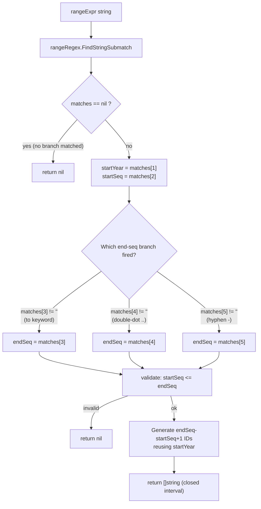
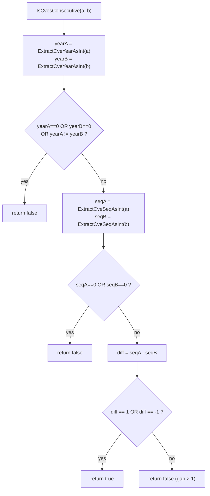
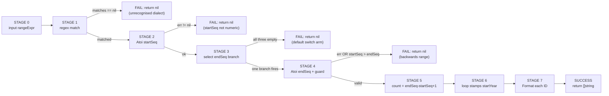

# Range Parsing Guide

Security advisories rarely list vulnerabilities one identifier at a time. A vendor bulletin that patches a run of related bugs tends to write `CVE-2022-12345 to CVE-2022-12350`, or the compact `CVE-2022-12345..12350`, or even the hyphen form `CVE-2022-12345-12350`. The `cve` package collapses all three dialects into one primitive — `ParseCveRange` — and pairs it with `IsCvesConsecutive`, a predicate that tells you whether two identifiers are direct neighbours. Both live in `generate.go` and lean on a single regular expression, `rangeRegex`, to do the heavy lifting. This page walks through the three accepted syntaxes, the same-year constraint that governs every range, the closed-interval expansion rule, and the patterns you will meet in real-world bulletins.

:::tip Who this is for
You already call `Format` and `ExtractCve` on raw advisory text and now need to turn a range expression like `CVE-2022-12345..12350` into the six concrete identifiers it denotes. If you want the regex internals behind `rangeRegex`, read [Regex Matching Internals](/guide/regex-internals) first; this page focuses on the parsing contract and the advisory patterns it unlocks.
:::

## Three syntaxes, one regex

`ParseCveRange(rangeExpr string) []string` accepts three notations for the same range. They are not three separate code paths — they are three alternative branches inside a single compiled pattern, `rangeRegex`:

```go
var rangeRegex = regexp.MustCompile(
    `(?i)^\s*CVE-(\d+)-(\d+)\s*(?:to\s*CVE-\d+-(\d+)|\.\.(\d+)|\s*-\s*(\d+))\s*$`,
)
```

The leading `CVE-(\d+)-(\d+)` captures the start of the range unconditionally — the start year goes into group 1 and the start sequence number into group 2. The trailing non-capturing group `(?:...)` then offers three mutually exclusive alternatives for the end of the range, and exactly one of them fires:

| Syntax | Example | Capture group that fires | End-seq source |
| --- | --- | --- | --- |
| `to` keyword | `CVE-2022-12345 to CVE-2022-12350` | `matches[3]` (after `to CVE-<year>-`) | `12350` |
| Double-dot `..` | `CVE-2022-12345..12350` | `matches[4]` | `12350` |
| Hyphen `-` | `CVE-2022-12345-12350` | `matches[5]` | `12350` |

Notice what the three branches have in common: only the **end sequence number** is captured in each alternative branch. The end year is never read back from the input — the regex matches it literally (`CVE-\d+-` in the `to` branch) but discards it. The implementation then reuses the start year for every generated identifier, which is the mechanism that enforces the same-year constraint described in the next section.



The three syntaxes exist because real advisories are not consistent. The `to` form reads naturally in prose; the `..` form mirrors Go and Python range notation and is compact; the hyphen form is what you get when a copy-paste of two CVE IDs is collapsed into one token. `ParseCveRange` accepts all three so that downstream code never has to normalise the delimiter by hand.

## The same-year constraint

Every range produced by `ParseCveRange` lives inside a single calendar year. This is not a style choice — it falls out of how the regex is written and how the result is assembled:

```go
count := endSeq - startSeq + 1
result := make([]string, count)
year, _ := strconv.Atoi(startYear)
for i := 0; i < count; i++ {
    result[i] = Format(fmt.Sprintf("CVE-%d-%d", year, startSeq+i))
}
```

The loop stamps the **start year** onto every generated identifier. The end year — even if present in the input — is never propagated into the output. Two consequences follow.

First, a `to` expression whose two CVE IDs disagree on the year is silently treated as belonging to the start year. The regex matches `CVE-2022-12345 to CVE-2023-12350` because the `to CVE-\d+-` portion is permissive about the second year, but the generated list runs from `CVE-2022-12345` up to `CVE-2022-12350`, all stamped with `2022`. The second year is matched and discarded.

Second, this means `ParseCveRange` cannot express a cross-year boundary. An advisory that genuinely spans `CVE-2022-99999` into `CVE-2023-00001` cannot be written as a single range here — you would call `ParseCveRange` twice and concatenate, or fall back to building the list yourself with `GenerateCve`. The same-year rule mirrors how CVE IDs are reserved (the year is the bucket), and a year boundary almost always means a separate reservation, so collapsing the two would be misleading.

| Input | Start year | End year in input | Generated list year | Valid? |
| --- | --- | --- | --- | --- |
| `CVE-2022-12345 to CVE-2022-12350` | `2022` | `2022` | `2022` | ✅ matches |
| `CVE-2022-12345 to CVE-2023-12350` | `2022` | `2023` (discarded) | `2022` | ⚠️ accepted, second year ignored |
| `CVE-2022-12345..12350` | `2022` | (none) | `2022` | ✅ matches |
| `CVE-2022-12345-12350` | `2022` | (none) | `2022` | ✅ matches |

If you need to reject cross-year `to` expressions rather than silently collapsing them, compare the two years yourself after a successful match — the package does not expose the raw capture groups, so in practice you would parse the two endpoints with `ExtractCveYearAsInt` before calling `ParseCveRange`.

## Closed interval: the endpoints are included

`ParseCveRange` returns a **closed** interval: both the start and the end identifier appear in the result. The arithmetic is `count := endSeq - startSeq + 1`, and the `+1` is what makes the interval closed. A range from `12345` to `12347` yields three identifiers, not two:

```go
cves := cve.ParseCveRange("CVE-2022-12345..12347")
// cves == ["CVE-2022-12345", "CVE-2022-12346", "CVE-2022-12347"]
// count = 12347 - 12345 + 1 = 3
```

This matches the conventional reading of `to` and `..` in security writing — "CVE-2022-12345 to CVE-2022-12350" means the bulletin addresses both endpoints and every ID in between. The closed-interval rule is also why `startSeq > endSeq` is rejected: a backwards range would produce a negative `count` and the loop would never execute, so the guard short-circuits to `nil` instead:

```go
if err != nil || startSeq > endSeq {
    return nil
}
```

| Expression | startSeq | endSeq | count | Result |
| --- | --- | --- | --- | --- |
| `CVE-2022-12345..12347` | `12345` | `12347` | `3` | 3 IDs, endpoints included |
| `CVE-2022-12345 to CVE-2022-12345` | `12345` | `12345` | `1` | single-element list `[CVE-2022-12345]` |
| `CVE-2022-12350 to CVE-2022-12345` | `12350` | `12345` | — | `nil` (start &gt; end) |
| `CVE-2022-12345 to CVE-2022-12ABC` | `12345` | (parse fails) | — | `nil` |

The single-element case (`start == end`) is legal and returns a one-element slice rather than `nil`. This is the right behaviour for advisories that hedge with a range but turn out to name only one identifier.

## IsCvesConsecutive: are two IDs neighbours?

While `ParseCveRange` expands a range expression into a list, `IsCvesConsecutive(a, b string) bool` answers the inverse question: given two concrete identifiers, are they directly adjacent? Two CVEs are consecutive when they share the same year **and** their sequence numbers differ by exactly one:

```go
func IsCvesConsecutive(a, b string) bool {
    yearA := ExtractCveYearAsInt(a)
    yearB := ExtractCveYearAsInt(b)
    if yearA == 0 || yearB == 0 || yearA != yearB {
        return false
    }
    seqA := ExtractCveSeqAsInt(a)
    seqB := ExtractCveSeqAsInt(b)
    if seqA == 0 || seqB == 0 {
        return false
    }
    diff := seqA - seqB
    return diff == 1 || diff == -1
}
```

Three rules are worth calling out because they shape the false cases.

**Same year is required.** `CVE-2022-12345` and `CVE-2023-12345` are not consecutive even though their sequence numbers match — the year boundary breaks adjacency, exactly as it does in `ParseCveRange`'s same-year rule. The check `yearA != yearB` returns false before the sequence comparison runs.

**The order of arguments does not matter.** The final line tests `diff == 1 || diff == -1`, so `IsCvesConsecutive(a, b)` and `IsCvesConsecutive(b, a)` return the same value. Consecutiveness is a symmetric relation; there is no "before" or "after".

**Invalid input fails closed.** Both `ExtractCveYearAsInt` and `ExtractCveSeqAsInt` return `0` on a malformed identifier, and the function explicitly guards `yearA == 0`, `yearB == 0`, `seqA == 0`, `seqB == 0`. A sequence number of `0` is not a real CVE sequence, so treating it as "not consecutive" is the safe default.

| Pair (a, b) | Same year? | Seq diff | Result |
| --- | --- | --- | --- |
| `CVE-2022-12345`, `CVE-2022-12346` | ✅ | `1` | `true` |
| `CVE-2022-12346`, `CVE-2022-12345` | ✅ | `-1` | `true` (symmetric) |
| `CVE-2022-12345`, `CVE-2022-12347` | ✅ | `2` | `false` (gap of 2) |
| `CVE-2022-12345`, `CVE-2023-12346` | ❌ | — | `false` (year differs) |
| `CVE-2022-12345`, `not-a-cve` | year `0` | — | `false` (invalid) |



`IsCvesConsecutive` is the building block you reach for when you want to decide whether a list of scattered CVE IDs can be collapsed back into a range expression for display, or whether two advisories that mention neighbouring IDs are likely describing the same logical fix.

## Common range forms in security advisories

Range expressions are most often seen in vendor bulletins, NVD entries, and scanner output. The table below collects the forms you will meet in the wild and how `ParseCveRange` handles each.

| Advisory form | Dialect | Parsed by `ParseCveRange`? | Notes |
| --- | --- | --- | --- |
| `CVE-2022-12345 to CVE-2022-12350` | `to` keyword | ✅ | Most common in human-readable prose |
| `CVE-2022-12345..12350` | double-dot | ✅ | Compact form, common in tool output |
| `CVE-2022-12345-12350` | hyphen | ✅ | Ambiguous with a single CVE; the regex disambiguates by requiring a trailing `\d+` after the inner hyphen |
| `CVE-2022-12345 - CVE-2022-12350` | spaced hyphen | ✅ | The `\s*-\s*` branch tolerates surrounding spaces |
| `CVE-2022-12345, CVE-2022-12346` | comma list | ❌ | Not a range; use `ExtractCve` then `SortCves` |
| `CVE-2022-12345+` | plus suffix | ❌ | Not a CVE range syntax; rejected |

The hyphen form deserves a note. A string like `CVE-2022-12345-12350` is syntactically a single token yet semantically a range, and the regex resolves the ambiguity by structure: after matching `CVE-2022-12345` as the start, it requires another `-` followed by a bare `\d+` to qualify as a range. If that trailing group is absent the string is simply not matched by `rangeRegex` at all, and `ParseCveRange` returns `nil` — it does not fall through to treating the input as one CVE.

A realistic advisory-to-list pipeline looks like this:

```go
package main

import (
    "fmt"

    "github.com/scagogogo/cve"
)

func main() {
    // 1. A vendor bulletin written with the 'to' keyword.
    ids := cve.ParseCveRange("CVE-2022-12345 to CVE-2022-12350")
    fmt.Println(ids)
    // [CVE-2022-12345 CVE-2022-12346 CVE-2022-12347 CVE-2022-12348 CVE-2022-12349 CVE-2022-12350]

    // 2. The same range in compact double-dot form yields the same list.
    compact := cve.ParseCveRange("CVE-2022-12345..12350")
    fmt.Println(len(compact) == len(ids)) // true

    // 3. Check whether two neighbouring IDs are adjacent.
    fmt.Println(cve.IsCvesConsecutive("CVE-2022-12349", "CVE-2022-12350")) // true
    fmt.Println(cve.IsCvesConsecutive("CVE-2022-12350", "CVE-2023-00001")) // false (year boundary)

    // 4. A malformed or backwards range returns nil, not a panic.
    fmt.Println(cve.ParseCveRange("CVE-2022-12350 to CVE-2022-12345")) // []
}
```

The pipeline is intentionally forgiving: the three dialects are interchangeable, invalid input degrades to `nil` rather than an error, and every generated identifier is `Format`-normalised on the way out so casing and whitespace never leak into the result.

## Summary

- 📌 `ParseCveRange` accepts three syntaxes — `to`, `..`, and `-` — all matched by the single `rangeRegex` pattern via three alternative capture branches.
- 🧩 The same-year constraint is structural: the end year is matched but discarded, and the start year is stamped onto every generated identifier.
- ⚡ The result is a **closed** interval (`count = endSeq - startSeq + 1`); `startSeq &gt; endSeq` short-circuits to `nil`.
- 🤖 `IsCvesConsecutive(a, b)` returns `true` only when both IDs share a year and their sequence numbers differ by exactly `1` — order-independent and fail-closed on invalid input.
- 🛠️ The hyphen form `CVE-2022-12345-12350` is disambiguated structurally: a trailing bare `\d+` after the inner hyphen is required, otherwise the string is not a range.
- ⚠️ Cross-year ranges cannot be expressed in one call; split them or build the list with `GenerateCve`.
- ✅ Chain `ParseCveRange` → `IsCvesConsecutive` to turn advisory range prose into concrete, adjacency-aware identifier lists.

## Visual Reference

The first diagram is an ASCII flowchart of the expansion pipeline that turns one range expression into a closed list of identifiers. It traces the data flow from the raw input string through the single compiled regex, the year-stamping loop, and the `Format`-normalised output:

```text
+--------------------------+
| rangeExpr (raw string)   |
| e.g. "CVE-2022-12345..   |
|              12350"      |
+-----------+--------------+
            |
            v
+--------------------------+      nil   +---------+
| rangeRegex.              |----------->| return  |
| FindStringSubmatch       |  no match |  nil    |
+-----------+--------------+           +---------+
            | matches != nil
            v
+--------------------------+
| startYear = matches[1]   |
| startSeq   = matches[2]  |
+-----------+--------------+
            |
            v
+--------------------------+
| pick endSeq:             |
|   matches[3] != "" ? to  |
|   matches[4] != "" ? ..  |
|   matches[5] != "" ? -   |
+-----------+--------------+
            |
            v
+--------------------------+      bad   +---------+
| startSeq > endSeq?       |----------->| return  |
| strconv error?           |  invalid   |  nil    |
+-----------+--------------+           +---------+
            | ok
            v
+--------------------------+
| count = endSeq - start   |
|         Seq + 1  (closed)|
| result := make([]string, |
|              count)      |
+-----------+--------------+
            |
            v
+--------------------------+
| for i in [0, count):     |
|   Format("CVE-%d-%d",    |
|     startYear,           |
|     startSeq+i)          |  <-- year is FIXED
+-----------+--------------+
            |
            v
+--------------------------+
| []string (closed,        |
|  Format-normalised,      |
|  same-year stamped)      |
+--------------------------+
```

The second diagram is a mermaid timeline that re-views the same call as a sequence of stages with their failure short-circuits, emphasising *where* each guard fires rather than the data shape. It makes the three termination paths (`nil` on no regex match, `nil` on validation, success) and the single success path explicit:



## Deep Dive

- **One compiled regex, no per-call compilation.** `rangeRegex` is a package-level `var` initialised with `regexp.MustCompile` at load time (`generate.go:16`). `ParseCveRange` calls `FindStringSubmatch` on every invocation but never recompiles the pattern, so the cost of building the NFA is paid once at program start, not per range. This is the same idiom used by `exactCveRegex` / `containsCveRegex` in `base.go:14-16` and `cveRegex` in `extract.go:9`; the package is consistent in hoisting its regexes to package scope.

- **The `default` arm is unreachable in practice but load-bearing.** The `switch` in `ParseCveRange` (`generate.go:158-167`) dispatches on `matches[3]`, `matches[4]`, `matches[5]` and has a `default: return nil`. Because `rangeRegex` is anchored with `^...$` and the trailing group is mandatory, a successful match always populates exactly one of the three capture groups — the `default` arm can never fire on a string that the regex accepted. It exists as a defensive guard against a future edit that loosens the pattern, and it makes the function's contract explicit: "no end-seq, no result."

- **`IsCvesConsecutive`'s `seq == 0` guard is not redundant with the year guard.** `ExtractCveYearAsInt` (`extract.go:183-190`) calls `IsCve` and returns `0` for a malformed input; `ExtractCveSeqAsInt` (`extract.go:262-266`) does **not** call `IsCve` — it feeds `ExtractCveSeq`'s output straight into `strconv.Atoi`, which returns `0, error` for the empty string that `ExtractCveSeq` yields on a non-CVE. A string like `"CVE-2022-ABC"` passes the year check (`2022` parses fine) but yields `seq == 0`, so the explicit `seqA == 0 || seqB == 0` test in `IsCvesConsecutive` (`generate.go:215`) is what actually catches a non-numeric sequence. Remove it and the function would happily compare year-equal IDs with garbage sequence numbers.

- **`Format` is applied twice on the hot path, by design.** Inside the generation loop (`generate.go:176`) each ID is built as `fmt.Sprintf("CVE-%d-%d", year, startSeq+i)` and then passed through `Format`, which is `strings.ToUpper(strings.TrimSpace(...)` (`base.go:46`). Because the `Sprintf` output is already uppercase and trimmed, the `Format` call is a no-op on the produced bytes — but it is the same normalisation that `ExtractCve` and `GenerateCve` apply, so the output of `ParseCveRange` is guaranteed byte-identical to what every other producer in the package emits. The cost is two trivial string passes per ID; the benefit is that downstream callers can mix range-expanded IDs with extracted IDs without ever needing to re-normalise.

- **`ParseCveRange` and `IsCvesConsecutive` are not inverses.** `ParseCveRange("CVE-2022-12345..12350")` expands to six IDs, but `IsCvesConsecutive("CVE-2022-12345", "CVE-2022-12350")` returns `false` — the endpoints of a range of length &gt; 2 are never *direct* neighbours. The two functions model different relations: `ParseCveRange` models "lies in the closed interval `[start, end]`", while `IsCvesConsecutive` models "the sequence-number difference is exactly `1`". Collapsing a list back into a range expression therefore needs more than `IsCvesConsecutive` alone — you need a sort (`SortCves`) plus a scan that groups runs of consecutive pairs, and only then can you emit `..` notation for each run.

## Further reading

- [`ParseCveRange` API reference](/api/functions/parse-cve-range)
- [`IsCvesConsecutive` API reference](/api/functions/is-cves-consecutive)
- [`GenerateCve` API reference](/api/functions/generate-cve) — the primitive `ParseCveRange` uses internally to stamp the year onto each ID
- [Regex Matching Internals](/guide/regex-internals) — the `rangeRegex` pattern dissected branch by branch
- [Year Validation Rules](/guide/year-rules) — why the year is the reservation bucket and why a year boundary breaks adjacency
- [Set Operations Guide](/guide/set-operations-guide) — every set helper ends by calling `SortCves`, which orders the expanded range list by year then sequence
