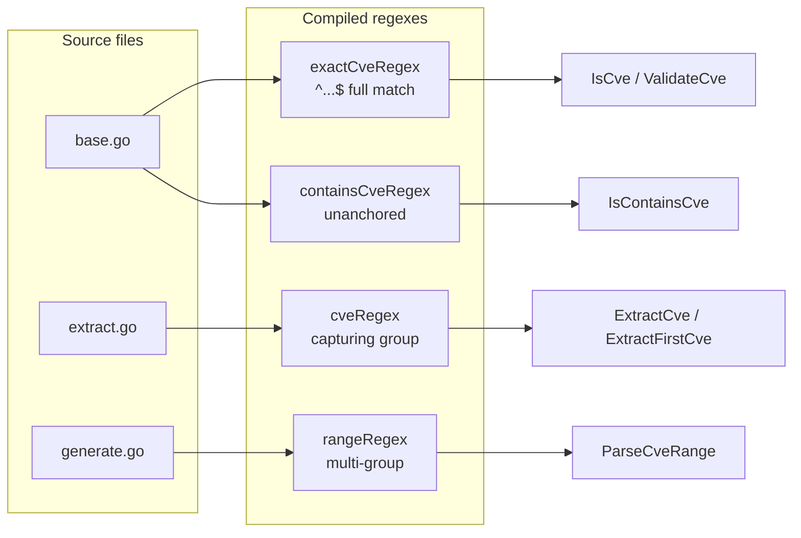
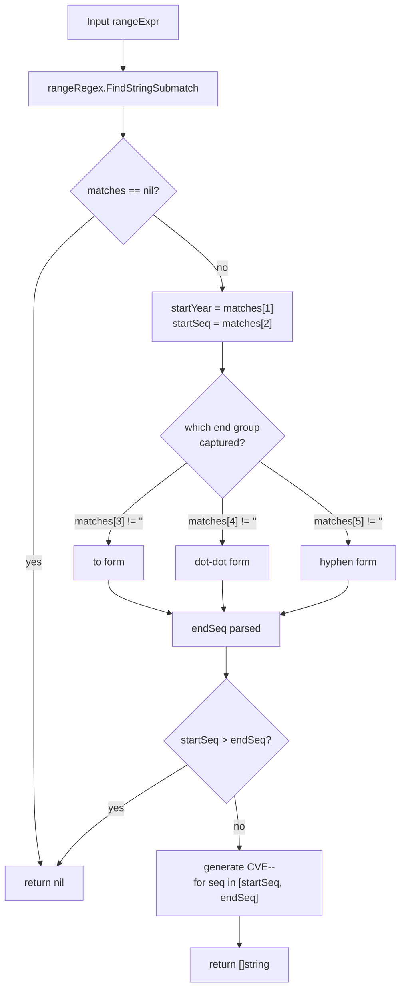
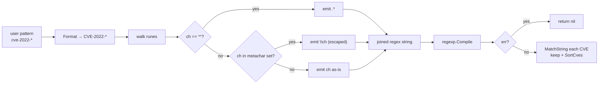
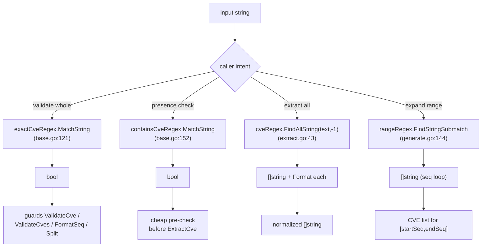

# Regex Matching Internals

The `cve` package leans on four hand-written regular expressions to power its core capabilities: format validation, free-text scanning, identifier extraction, and range expansion. This page peels back the regex layer to show exactly how each pattern is shaped, why case-insensitivity is built in at the pattern level, and how the wildcard filter translates glob-style `*` into a safe compiled regex.

:::tip Who this is for
Developers extending the library, writing custom CVE scanners, or debugging why a particular string matched (or did not match). You should already be comfortable with the public API surface — this page is about the engine underneath.
:::

## The Four Core Regexes

All four patterns are compiled once at package init time with `regexp.MustCompile` and stored in unexported package variables. They never recompile, so hot paths like `IsCve` and `ExtractCve` carry no compilation overhead per call.

| Variable | Defined in | Pattern (Go raw string) | Anchor style | Purpose |
| --- | --- | --- | --- | --- |
| `exactCveRegex` | `base.go` | `` `(?i)^\s*CVE-\d+-\d+\s*$` `` | full match (`^...$`) | Validate a whole string is one CVE |
| `containsCveRegex` | `base.go` | `` `(?i)CVE-\d+-\d+` `` | unanchored scan | Detect whether any CVE appears |
| `cveRegex` | `extract.go` | `` `(?i)(CVE-\d+-\d+)` `` | unanchored, capturing | Extract all CVEs from text |
| `rangeRegex` | `generate.go` | `` `(?i)^\s*CVE-(\d+)-(\d+)\s*(?:to\s*CVE-\d+-(\d+)|\.\.(\d+)|\s*-\s*(\d+))\s*$` `` | full match, multi-group | Parse range expressions |

Note the deliberate split: `base.go` owns validation/detection, `extract.go` owns extraction with a capture group, and `generate.go` owns the far more complex range parser. Each file only declares the regex it needs.



## Exact vs. Text-Scan: Why Two Patterns

A CVE that *is* the whole input and a CVE that *appears inside* a paragraph are different problems, and the package treats them with two separate regexes rather than one configurable one.

`exactCveRegex` is anchored on both ends — `^\s*...$` — so the entire string must be (optionally whitespace-padded) `CVE-<digits>-<digits>`. Anything else, including `"see CVE-2022-12345 above"`, fails. This backs `IsCve`, which in turn guards `ValidateCve`, `ValidateCves`, `FormatSeq`, and `Split`.

`containsCveRegex` is the same token body without anchors. It does not care what surrounds the match, only that a CVE-shaped substring exists somewhere. This backs `IsContainsCve` — the cheap pre-check before a full `ExtractCve` pass.

| Input string | `exactCveRegex` (`IsCve`) | `containsCveRegex` (`IsContainsCve`) |
| --- | --- | --- |
| `"CVE-2022-12345"` | match | match |
| `" CVE-2022-12345 "` | match (whitespace allowed) | match |
| `"see CVE-2022-12345 above"` | no match (extra chars) | match |
| `"cve-2022-12345"` | match (case-insensitive) | match |
| `"CVE-2022-ABCD"` | no match (non-digit seq) | no match |

The asymmetry is intentional: validation must be strict, detection must be lenient. Combining them into one regex would force every caller to specify anchoring mode, which is exactly the kind of knob the library hides from its users.

### Why the capture group lives in `cveRegex` only

`extract.go` declares `cveRegex` separately from `containsCveRegex` even though the visible pattern body is the same. The difference is the parentheses: `(?i)(CVE-\d+-\d+)`. That single capture group is what lets `ExtractCve` call `FindAllString` and receive the CVE text directly, then normalize each hit with `Format`. `containsCveRegex` only needs a boolean — `MatchString` — so it carries no capturing overhead.

## Case-Insensitivity via `(?i)`

Every one of the four patterns opens with the inline flag `(?i)`. This is the RE2/Syntax case-insensitive toggle, applied inside the pattern rather than through `regexp.MustCompile` flags. The practical effect: `cve`, `Cve`, and `CVE` all match identically, and so does mixed casing in input text.

```go
// base.go
exactCveRegex    = regexp.MustCompile(`(?i)^\s*CVE-\d+-\d+\s*$`)
containsCveRegex = regexp.MustCompile(`(?i)CVE-\d+-\d+`)

// extract.go
cveRegex = regexp.MustCompile(`(?i)(CVE-\d+-\d+)`)

// generate.go
rangeRegex = regexp.MustCompile(`(?i)^\s*CVE-(\d+)-(\d+)\s*(?:...)...`)
```

There is a subtlety worth stating plainly: `(?i)` makes the *literal letters* in the pattern case-insensitive, but the digits and structural hyphens are unaffected. `CVE` in the pattern will match `cve`, `CvE`, etc.; the `-` and `\d+` segments behave exactly the same regardless of input case. This is why downstream code can safely call `strings.ToUpper` after matching — the regex has already accepted any casing, and `Format` then canonicalizes to upper case for storage and comparison.

The library never uses `regexp.MatchString(pattern, s)` with a runtime-compiled pattern, and never sets `Ignorecase` through a flag struct. The `(?i)` prefix is the single, declarative source of case-insensitivity across all four regexes.

## `rangeRegex`: One Pattern, Three Syntaxes

`ParseCveRange` accepts three notations for the same concept — a closed interval of sequence numbers within one year — and collapses them into a single regex with three alternative tails.

```go
`(?i)^\s*CVE-(\d+)-(\d+)\s*(?:to\s*CVE-\d+-(\d+)|\.\.(\d+)|\s*-\s*(\d+))\s*$`
```

Reading it group by group:

- `(\d+)` (group 1) captures the start year.
- `(\d+)` (group 2) captures the start sequence number.
- The non-capturing group `(?: ... | ... | ... )` then picks one of three endings:
  - `to\s*CVE-\d+-(\d+)` — the `to` word form, end seq in group 3.
  - `\.\.(\d+)` — the `..` double-dot form, end seq in group 4.
  - `\s*-\s*(\d+)` — the hyphen form, end seq in group 5.

| Expression | Matching tail | End-seq group |
| --- | --- | --- |
| `CVE-2022-12345 to CVE-2022-12350` | `to\s*CVE-\d+-(\d+)` | group 3 |
| `CVE-2022-12345..12350` | `\.\.(\d+)` | group 4 |
| `CVE-2022-12345-12350` | `\s*-\s*(\d+)` | group 5 |

After `FindStringSubmatch`, the Go code in `ParseCveRange` walks `matches[3]`, `matches[4]`, `matches[5]` in order to find whichever end-sequence group actually captured text, parses it to an int, and rejects the input if `startSeq > endSeq`. Because the whole pattern is anchored with `^...$` and the year is captured only once (group 1), the start and end are guaranteed to share a year — there is no syntactic way to express a cross-year range.



## `FilterCvesByPattern`: Wildcard to Regex Translation

`FilterCvesByPattern` is the one place in the library where a regex is built from user input at runtime. The function accepts glob-style patterns (`CVE-2022-*`, `CVE-*-1234`, `CVE-2022-1*`) and converts them into a compiled RE2 pattern by walking the pattern rune by rune.

```go
pattern = Format(pattern)            // uppercase first
patternParts := []rune(pattern)
var regexParts []rune
for _, ch := range patternParts {
    switch ch {
    case '*':
        regexParts = append(regexParts, []rune(".*")...)
    case '.', '+', '(', ')', '[', ']', '{', '}', '\\', '^', '$', '|':
        regexParts = append(regexParts, '\\', ch)   // escape regex metachar
    default:
        regexParts = append(regexParts, ch)
    }
}
regex, err := regexp.Compile(string(regexParts))
```

Three design choices stand out:

1. **`*` becomes `.*`, not `.*?` or `.*` with anchors.** The translated pattern is used with `MatchString`, which reports whether the regex matches *anywhere* in the string. Because the result is unconstrained, a pattern of `CVE-2022-1*` will match `CVE-2022-12345` (the `.*` gobbles `2345`) — and would also match `CVE-2022-1ABC` if such a thing were passed in, since `.*` is not digit-restricted.
2. **Only the listed metacharacters are escaped.** The set is `. + ( ) [ ] { } \ ^ $ |`. Notably, `?` is *not* in the escape list, so a user pattern containing `?` flows through as a regex quantifier rather than a literal. In practice CVE patterns do not contain `?`, but the behavior is load-bearing to know.
3. **`Format` is applied to the pattern before translation.** This uppercases it, so `cve-2022-*` and `CVE-2022-*` behave identically, and the `CVE-` literal in the pattern lines up with the uppercased candidate CVEs.

| User pattern | Translated regex | Matches `CVE-2022-12345`? |
| --- | --- | --- |
| `CVE-2022-*` | `CVE-2022-.*` | yes |
| `CVE-*-1234` | `CVE-.*-1234` | no (seq is `12345`, not `1234`) |
| `CVE-2022-1*` | `CVE-2022-1.*` | yes |
| `CVE-2022-.*` | `CVE-2022-\..*` (dot escaped) | no (expects a literal `.` after `2022-`) |

The last row is the important one: a user who already knows regex and types `CVE-2022-.*` does not get raw regex semantics. The `.` is escaped to `\.`, so it matches a literal dot. The function is a glob translator, not a regex passthrough.

If `regexp.Compile` fails (which, given the conservative translation, is rare), the function returns `nil` rather than panicking — a deliberate choice to keep a malformed pattern from taking down a caller that might be filtering a large batch.



## Summary

- Four regexes, declared in three files, power validation, detection, extraction, and range parsing. Each is compiled once at init.
- `exactCveRegex` (anchored) and `containsCveRegex` (unanchored) deliberately separate "is a CVE" from "contains a CVE" so callers never configure anchoring.
- `cveRegex` reuses the same body as `containsCveRegex` but adds a capture group so `ExtractCve` can pull matched text directly.
- `(?i)` inside every pattern is the single source of case-insensitivity; `Format` then canonicalizes to upper case.
- `rangeRegex` collapses three notations (`to`, `..`, `-`) into one anchored pattern with three alternative end-sequence groups.
- `FilterCvesByPattern` translates `*` to `.*` and escapes a fixed metacharacter set; it is a glob translator, not a regex passthrough, and returns `nil` on compile failure.

## Visual Reference

Two complementary views of how a raw input string flows through the regex layer to a typed result. The first is the runtime decision path for an arbitrary input; the second is the call-time relationship between the public API and the compiled regexes.

```text
                    +-------------------------+
       input str -->| route by caller intent |
                    +-------------------------+
                      |        |        |
            validate  |  scan  |  extract |  range
                      v        v          |        |
              +-----------+ +-----------+  |        |
              | IsCve     | | IsContain |  |        |
              | exactCve  | | contains  |  |        |
              |  Regex    | | CveRegex  |  |        |
              +-----------+ +-----------+  |        |
                      |        |          |        |
                   bool|    bool|          |        |
                      v        v          v        v
                   +----------------+ +-----------+ +-----------+
                   | ValidateCve... | | ExtractCve| | ParseCve  |
                   | (guard)        | | cveRegex  | | Range     |
                   +----------------+ | FindAll   | | rangeRegex|
                                      +-----------+ | FindSubm. |
                                                    +-----------+
                                                          |
                                                          v
                                                    []string
```

The ASCII diagram above captures the *dispatch* layer: a single input string is routed to one of four regexes depending on what the caller wants — a boolean guard, a boolean presence check, a list of hits, or an expanded range. Note that `IsCve` feeds `ValidateCve`/`ValidateCves`/`FormatSeq`/`Split` as a guard, while `ExtractCve` returns a slice directly.



The mermaid view emphasizes the *return-type split*: two regexes yield booleans (guards and pre-checks) and two yield `[]string` (extraction and generation). The boolean branch cheaply short-circuits before the slice-producing branch ever runs.

## Deep Dive

- **Compile-once, share forever.** All four regexes live in package-level `var` blocks initialized at process start (`base.go:14`, `base.go:16`, `extract.go:9`, `generate.go:16`). `regexp.MustCompile` panics on a bad pattern at init, which is acceptable because the patterns are literals — a panic here is a compile-time-authoring bug, not a runtime failure. The payoff is that `IsCve` (`base.go:121`) and `ExtractCve` (`extract.go:43`) hit an already-compiled `*Regexp` on every call, so the per-call cost is a RE2 NFA match with no allocation for the pattern itself.
- **`FindAllString(text, -1)` is the unbounded form.** `extract.go:43` passes `-1` as the count, meaning "all matches, no cap." For pathological inputs embedding thousands of CVE-shaped substrings this allocates a slice of arbitrary size in one call. There is no streaming variant; callers scanning untrusted, very large text should pre-bound the work themselves (e.g., chunk the input) rather than relying on `ExtractCve` to be lazy. `ExtractFirstCve` and `ExtractLastCve` exist precisely to avoid materializing the full slice when only one endpoint is needed.
- **The `to`-form repeats the year literally, not as a backreference.** In `rangeRegex` the tail `to\s*CVE-\d+-(\d+)` re-spells `CVE-\d+-` rather than back-referencing group 1. RE2 deliberately does not support backreferences, so the year is matched a second time against an independent `\d+`. This is why `CVE-2022-12345 to CVE-2023-12350` *matches the regex* (both years are digits) but the Go code in `ParseCveRange` only ever reads `matches[1]` for the year — the end year is structurally ignored, and the result is generated as if both were `matches[1]`. The library treats the range as implicitly same-year; cross-year ranges are not expressible through the year capture, only through the (discarded) end-year literal.
- **Why `(?i)` instead of `IgnoreCase` flag or `ToUpper`-first matching.** Go's `regexp` package has no `Ignorecase` compile flag — case folding is expressed *inside* the pattern via `(?i)`. The alternative, uppercasing the input before matching, would also work but would force an allocation on every `IsCve`/`IsContainsCve` call. By folding case into the compiled NFA, the match itself stays zero-allocation on the input; `Format` is then called only on the *result* (the much smaller set of actual hits), not on every candidate string scanned. This is a deliberate hot-path optimization.
- **`FilterCvesByPattern` is the only runtime-compiled regex — and it is sandboxed.** Every other regex is a literal compiled at init; `FilterCvesByPattern` (`filter.go:316`) calls `regexp.Compile` per invocation. Two consequences: (1) it is the only place a malformed *user* input can produce a compile error, and the code returns `nil` rather than panicking (`filter.go:317-319`); (2) because the metacharacter escape set omits `?`, a user pattern containing `?` flows through as a regex quantifier. The library leans on the invariant that real CVE patterns never contain `?`, but a caller passing arbitrary glob strings should know this is glob-with-regex-leakage, not strict glob.

## Further Reading

- [Validation](/api/format-validate) — public functions built on `exactCveRegex`
- [Extraction](/api/extract) — `ExtractCve`, `ExtractFirstCve`, `ExtractLastCve`
- [Range & Generation](/api/generate) — `ParseCveRange`, `GenerateCve`, `GenerateFakeCve`
- [Filter & Group](/api/filter-group) — `FilterCvesByPattern` and friends
