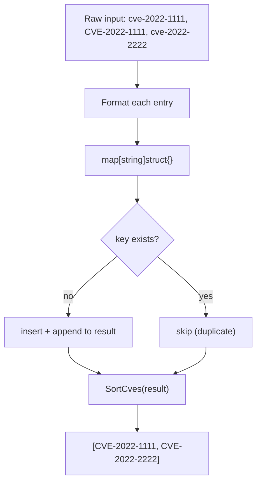
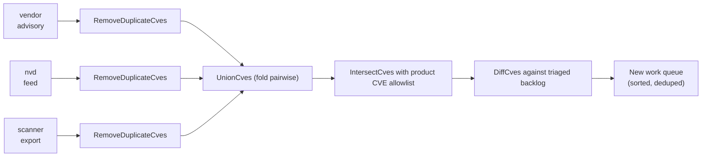
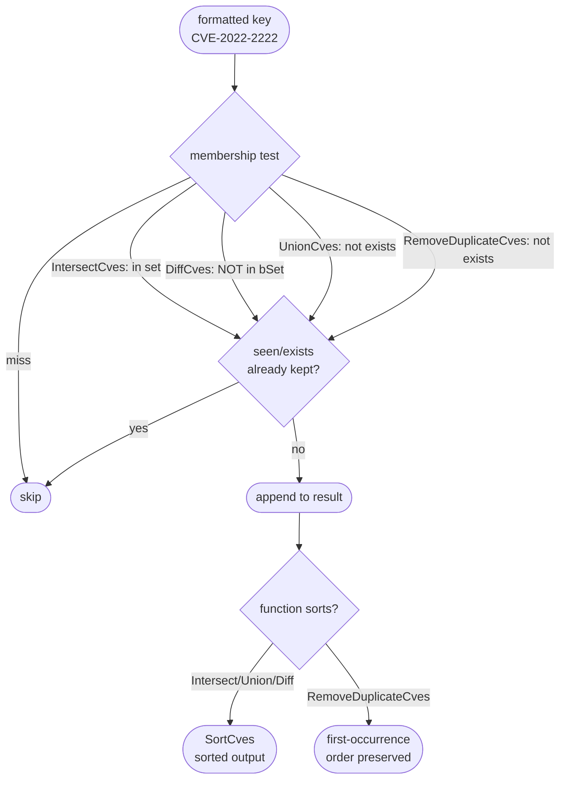

# Set Operations Guide

The `cve` package ships four set-theoretic helpers in `filter.go` — `IntersectCves`, `UnionCves`, `DiffCves`, and `RemoveDuplicateCves`. They are the building blocks for reconciling CVE lists that arrive from independent sources: a vendor advisory, an NVD pull, a scanner export, an internal inventory. All four lean on the same primitive — a Go `map[string]struct{}` keyed on the `Format`-normalised identifier — which is what gives them their O(n+m) (or O(n) for the deduplicator) complexity and their case-insensitive, duplicate-collapsing semantics. This page walks through each function, the map discipline they share, and how they compose in a realistic multi-source merge.

:::tip Who this is for
You already import the package, call `Format` on raw input, and now need to answer questions like "which CVEs appear in both lists?", "which are new since last week?", or "give me one clean list with no duplicates". If you want the ordering half of the story, read [Comparison & Ordering](/guide/comparison-ordering) first — every function on this page ends by calling `SortCves`.
:::

## The shared map discipline

Before diving into the four functions, it helps to see what they have in common, because the shared pattern is what makes the complexity guarantees hold. Each function builds one or two `map[string]struct{}` instances. The key is **always** the `Format`-normalised CVE — `strings.ToUpper(strings.TrimSpace(cve))` — so `cve-2022-1111`, ` CVE-2022-1111 `, and `CVE-2022-1111` all collapse onto a single map key. The value is the empty struct `struct{}`, which carries zero bytes; the map is being used purely as a set, not a dictionary.

| Property | Source of the guarantee | Effect on output |
| --- | --- | --- |
| Case-insensitive comparison | `Format` uppercases before keying | `cve-2022-1111` and `CVE-2022-1111` are treated as equal |
| Whitespace tolerance | `Format` trims both ends | `" CVE-2022-1111 "` matches `CVE-2022-1111` |
| Duplicate collapse | A second `set[key] = struct{}{}` is a no-op | Each identifier survives at most once |
| Sorted output | Final `return SortCves(result)` | Result is ordered by year, then sequence number |

The empty-struct value is a deliberate memory choice: a `map[string]bool` would work identically but cost one extra byte per entry. At the scale of a full NVD year (tens of thousands of entries) that difference is negligible per-entry, but it signals intent — "this is a set, the value is meaningless" — and the package is consistent about it across all four functions.



This diagram is literally the body of `RemoveDuplicateCves`, and the other three functions are variations on it: `IntersectCves` adds a second map for membership testing, `UnionCves` runs the same loop over two inputs, and `DiffCves` inverts the membership test.

## IntersectCves — what both lists share

`IntersectCves(a, b []string) []string` returns the identifiers that appear in **both** `a` and `b`. The implementation builds a set from the first list, then walks the second list keeping only those entries whose normalised form is in the set.

```go
func IntersectCves(a, b []string) []string {
    set := make(map[string]struct{}, len(a))
    for _, cve := range a {
        set[Format(cve)] = struct{}{}
    }

    var result []string
    seen := make(map[string]struct{}, len(b))
    for _, cve := range b {
        formatted := Format(cve)
        if _, inA := set[formatted]; inA {
            if _, exists := seen[formatted]; !exists {
                seen[formatted] = struct{}{}
                result = append(result, formatted)
            }
        }
    }

    return SortCves(result)
}
```

Two maps are in play here. The first, `set`, is the membership index of list `a`. The second, `seen`, guards against duplicates inside list `b`: if `b` contains `CVE-2022-2222` three times, the result should still contain it exactly once. Without `seen`, a duplicated entry in `b` would be appended once per occurrence. Building `set` from `a` is O(n); walking `b` with constant-time lookups is O(m); the final `SortCves` is O(k log k) where k is the intersection size — so the dominant term for typical inputs is O(n+m).

| Input `a` | Input `b` | Output |
| --- | --- | --- |
| `CVE-2022-1111, CVE-2022-2222` | `CVE-2022-2222, CVE-2022-3333` | `CVE-2022-2222` |
| `CVE-2022-1111` | `CVE-2023-2222` | `[]` (empty) |
| `cve-2022-2222` | `CVE-2022-2222, CVE-2022-2222` | `CVE-2022-2222` (one copy) |

The classic use case is cross-referencing two security reports. Given a vendor advisory and an NVD feed, the intersection is the set of CVEs both sources agree affect your product — the highest-confidence workload to triage first.

## UnionCves — merge without duplicates

`UnionCves(a, b []string) []string` returns every identifier that appears in either list, deduplicated. The implementation is the most direct expression of the set pattern: one map, two loops, append only on first sight.

```go
func UnionCves(a, b []string) []string {
    set := make(map[string]struct{}, len(a)+len(b))
    var result []string

    for _, cve := range a {
        formatted := Format(cve)
        if _, exists := set[formatted]; !exists {
            set[formatted] = struct{}{}
            result = append(result, formatted)
        }
    }

    for _, cve := range b {
        formatted := Format(cve)
        if _, exists := set[formatted]; !exists {
            set[formatted] = struct{}{}
            result = append(result, formatted)
        }
    }

    return SortCves(result)
}
```

Note the capacity hint `len(a)+len(b)` — the map is sized for the worst case where the two lists are disjoint, so no rehashing occurs mid-build. The same `if _, exists := set[formatted]; !exists` guard appears in both loops, which is what deduplicates within `a`, within `b`, and across the two lists in a single pass each. Time complexity is O(n+m); space is O(n+m) in the disjoint worst case.

Union is the right tool when you are aggregating coverage rather than narrowing it. If a scanner flags a list of candidate CVEs and your internal inventory tracks another, the union is the complete universe of identifiers your tooling should reason about — and because the output is sorted, downstream consumers can binary-search it.

## DiffCves — what a has that b does not

`DiffCves(a, b []string) []string` returns the identifiers present in `a` but absent from `b` — set subtraction, `a \ b`. The implementation builds the exclusion set from `b`, then walks `a` keeping entries that are not in that set.

```go
func DiffCves(a, b []string) []string {
    bSet := make(map[string]struct{}, len(b))
    for _, cve := range b {
        bSet[Format(cve)] = struct{}{}
    }

    aSeen := make(map[string]struct{}, len(a))
    var result []string
    for _, cve := range a {
        formatted := Format(cve)
        if _, inB := bSet[formatted]; !inB {
            if _, exists := aSeen[formatted]; !exists {
                aSeen[formatted] = struct{}{}
                result = append(result, formatted)
            }
        }
    }

    return SortCves(result)
}
```

The structure mirrors `IntersectCves` with the membership test inverted: the inner `if` keeps the entry only when it is **not** in `bSet`. The `aSeen` map serves the same deduplication role as `seen` did in `IntersectCves` — if `a` lists `CVE-2022-1111` twice, the result contains it once. The order of operations matters: `b` is indexed first (O(m)), then `a` is scanned with constant-time exclusion tests (O(n)), so the total is again O(n+m).

| Input `a` | Input `b` | Output | Reading |
| --- | --- | --- | --- |
| `CVE-2022-1111, CVE-2022-2222` | `CVE-2022-2222, CVE-2022-3333` | `CVE-2022-1111` | In `a`, not in `b` |
| `CVE-2022-1111, CVE-2022-1111` | `CVE-2022-3333` | `CVE-2022-1111` | Duplicate in `a` collapsed |

Diff is the change-detection primitive. Keep yesterday's CVE list as `b` and today's as `a`: `DiffCves(today, yesterday)` is exactly the set of newly-arrived identifiers — the work queue for a triage pipeline that should only ever process what it has not seen before.

## RemoveDuplicateCves — collapse one list

`RemoveDuplicateCves(cveSlice []string) []string` is the single-input special case: deduplicate one list, normalise formatting, preserve nothing about order (the result is **not** sorted — unlike the other three, there is no `SortCves` call).

```go
func RemoveDuplicateCves(cveSlice []string) []string {
    cveMap := make(map[string]struct{})
    var result []string

    for _, cve := range cveSlice {
        formattedCve := Format(cve)
        if _, exists := cveMap[formattedCve]; !exists {
            cveMap[formattedCve] = struct{}{}
            result = append(result, formattedCve)
        }
    }

    return result
}
```

Two details distinguish this from the other three. First, the map has **no capacity hint** (`make(map[string]struct{})` rather than `make(map[string]struct{}, len(cveSlice))`) — a minor missed optimisation, but it does mean the map may rehash as it grows. Second, the result preserves **first-occurrence order** rather than being sorted: the comment on the function states "只保留每个CVE的第一次出现" (keep only the first occurrence of each). If you need sorted output, chain it with `SortCves`. Time complexity is O(n); space is O(n).

This asymmetry — three functions sort their output, one does not — is worth memorising. The three binary operations sort because their results are conceptually unordered sets and a stable order makes them comparable across runs; `RemoveDuplicateCves` is often used as a streaming pre-processing step where the caller wants to preserve arrival order from the source.

## Putting it together: multi-source merge

The realistic scenario is rarely one operation. Suppose you ingest from three sources: a vendor advisory (`vendor`), an NVD pull (`nvd`), and an internal scanner (`scanner`). A typical reconciliation pipeline chains the four functions together.



Each source is first deduplicated in isolation — `RemoveDuplicateCves` is cheap O(n) insurance against a noisy upstream. The three cleaned lists are then folded with `UnionCves` (apply it pairwise: `UnionCves(UnionCves(vendor, nvd), scanner)`) into one master universe. `IntersectCves` narrows that universe to the CVEs your product actually ships (intersection with an allowlist of affected-component identifiers). Finally, `DiffCves` subtracts the backlog of CVEs your team has already triaged, leaving only genuinely new work — sorted, deduplicated, and ready to assign.

```go
package main

import (
    "fmt"

    "github.com/scagogogo/cve"
)

func main() {
    vendor := []string{"cve-2022-1111", "CVE-2022-2222", "CVE-2022-1111"}
    nvd := []string{"CVE-2022-2222", "CVE-2022-3333", " cve-2022-3333 "}
    scanner := []string{"CVE-2022-1111", "CVE-2023-4444"}

    // Step 1: deduplicate each source independently (preserves order).
    cleanVendor := cve.RemoveDuplicateCves(vendor)
    cleanNvd := cve.RemoveDuplicateCves(nvd)
    cleanScanner := cve.RemoveDuplicateCves(scanner)

    // Step 2: union into one universe (sorted output).
    universe := cve.UnionCves(cve.UnionCves(cleanVendor, cleanNvd), cleanScanner)
    fmt.Println("universe:", universe)
    // universe: [CVE-2022-1111 CVE-2022-2222 CVE-2022-3333 CVE-2023-4444]

    // Step 3: narrow to CVEs the product actually ships (intersection).
    allowlist := []string{"CVE-2022-2222", "CVE-2022-3333", "CVE-2023-4444"}
    affected := cve.IntersectCves(universe, allowlist)
    fmt.Println("affected:", affected)
    // affected: [CVE-2022-2222 CVE-2022-3333 CVE-2023-4444]

    // Step 4: subtract the backlog already triaged.
    backlog := []string{"CVE-2022-2222"}
    queue := cve.DiffCves(affected, backlog)
    fmt.Println("new queue:", queue)
    // new queue: [CVE-2022-3333 CVE-2023-4444]
}
```

Notice how the case and whitespace noise — `cve-2022-1111`, ` cve-2022-3333 ` — never reaches the comparison logic because every function keys on `Format` internally. The caller does not need to pre-normalise; that responsibility lives inside the set operations themselves.

## Summary

- All four functions live in `filter.go` and share a `map[string]struct{}` keyed on `Format`-normalised CVEs, which gives them case-insensitive, whitespace-tolerant, duplicate-collapsing semantics for free.
- `IntersectCves`, `UnionCves`, and `DiffCves` are O(n+m) and return **sorted** output via a final `SortCves`; `RemoveDuplicateCves` is O(n) and preserves first-occurrence order (no sort).
- Two-map designs (`IntersectCves`, `DiffCves`) use the second map to guard against duplicates in the scanned input; the single-map designs (`UnionCves`, `RemoveDuplicateCves`) deduplicate inline via the existence check.
- The natural composition is deduplicate each source, union into a universe, intersect with an allowlist, diff against a backlog — a pipeline whose every stage is sub-quadratic.

## Visual Reference

The text diagram below traces a single CVE through the four functions as data-flow: which map it lands in, which branch the membership test takes, and where the entry ends up. It collapses the per-function differences into one picture so you can see at a glance how `IntersectCves`/`DiffCves` reuse the same two-map shape while `UnionCves`/`RemoveDuplicateCves` run on one.

```text
                 raw CVE string (e.g. " cve-2022-2222 ")
                              |
                              v
                    +-------------------+
                    |  Format(cve)      |   strings.ToUpper + TrimSpace
                    +-------------------+
                              |
                              v   normalised key: "CVE-2022-2222"
                              |
  ============ IntersectCves / DiffCves (two maps) ============
                              |
              +---------------+---------------+
              |                               |
              v                               v
   +---------------------+        +---------------------+
   | index map (a or b)  |        | scan map (seen/aSeen)|
   | built in pass 1     |        | guards dupes in pass 2|
   +---------------------+        +---------------------+
              |                               |
              |   membership test on key      |
              v                               v
        +-----------+                   +-----------+
        | in index? |   Intersect: yes  | already   |
        +-----------+   Diff: no        | seen?     |
              |                         +-----------+
      yes/keep |                               |
              v                               v
              +---------------+---------------+
                              |
                              v
                       append to result
                              |
  ============ UnionCves / RemoveDuplicateCves (one map) ============
                              |
                              v
                   +---------------------+
                   | single set map      |   exists? -> skip
                   | (capacity hinted    |   !exists -> insert + append
                   |  only in UnionCves) |
                   +---------------------+
                              |
                              v
                  SortCves(result)  <-- Intersect/Union/Diff ONLY
                              |       (RemoveDuplicateCves skips this)
                              v
                     sorted, deduped []string
```

The complementary mermaid view below shows the same four functions as a state machine over the result slice. Each function is a path through three decision states; the terminal state records whether the entry survives and whether the output is ultimately sorted. This makes the sort-vs-no-sort asymmetry — the one detail callers trip over — the visual centrepiece.



## Deep Dive

- **Why two maps beat one for `IntersectCves`/`DiffCves`.** A naive single-map intersect would be: build a set from `a`, then for each entry in `b` check membership and append. That works — until `b` has duplicates. Without the `seen` map (filter.go:48, :236), a `b` containing `CVE-2022-2222` three times would append it three times. The second map turns the per-`b`-entry dedup into an O(1) existence check, keeping the whole function O(n+m) instead of degrading to O(n+m·d) where d is the duplicate count. `DiffCves` carries the same `aSeen` guard (filter.go:350) for the symmetric reason on the `a` side. `UnionCves` and `RemoveDuplicateCves` get away with one map because their single set already doubles as the dedup index — the existence check and the dedup check are the same line.

- **Capacity hints are load-bearing, except in one function.** `IntersectCves` hints `len(a)` for the index map and `len(b)` for `seen` (filter.go:42, :48); `UnionCves` hints `len(a)+len(b)` — the disjoint worst case — so the map never rehashes mid-build (filter.go:285); `DiffCves` hints `len(b)` and `len(a)` (filter.go:345, :350). `RemoveDuplicateCves` is the outlier: `make(map[string]struct{})` with no hint (filter.go:402). Go's map grows by doubling buckets on overload, so an unhinted map over N entries rehashes roughly log₂(N) times. For a 50k-entry NVD year that is ~17 rehashes, each copying the live set — measurable but not catastrophic. If you deduplicate a full NVD pull in a hot path, pre-size the map yourself or call `UnionCves(x, []string{})` which hints correctly.

- **`SortCves` is the hidden O(k log k) tail.** Every binary operation ends with `return SortCves(result)` (filter.go:247, :304, :362). `SortCves` allocates a fresh slice, formats every entry, and calls `sort.Slice` with `CompareCves` (compare.go:165-176). `CompareCves` itself calls `ExtractCveYearAsInt` then `ExtractCveSeqAsInt` on each comparison — so the comparator is not free. The true complexity of `IntersectCves` is therefore O(n+m + k log k · c) where k is the result size and c is the per-comparison extraction cost. For small intersections (k ≪ n+m) the map phase dominates; for a union of two near-identical large lists (k ≈ n+m) the sort is the dominant term. This is why the package documents the functions as "O(n+m)" with a straight face — the sort is asymptotically smaller than the linear phase for typical intersect/diff workloads, but it is not zero.

- **Symmetric difference is not a primitive — compose it.** The package exposes intersection, union, and difference but not XOR (symmetric difference: in either list but not both). The deliberate composition is `(a \ b) ∪ (b \ a)`, i.e. `UnionCves(DiffCves(a, b), DiffCves(b, a))`. Note the argument order flip on the second `DiffCves` — `DiffCves` is not commutative (`a \ b ≠ b \ a`), so getting it backwards yields the empty set when the lists overlap. Two diffs + one union is 3·O(n+m) — still linear, and cheaper than most callers realise. This is the standard shape for "what changed between two snapshots" when you want both additions and removals, not just additions.

- **Normalisation is inside the operations, not a precondition.** Every function calls `Format` on each entry as it keys the map (filter.go:232, :238, :289, :297, :347, :353, :406). This is a design choice with a consequence: if a list contains a malformed token like `CVE-2022-2222-extra` or `not-a-cve`, `Format` will still uppercase and trim it (`strings.ToUpper + TrimSpace` performs no structural validation — see base.go:45-47) and it becomes a legitimate, distinct map key. The set operations will happily carry garbage through to the output. To keep garbage out, chain `FilterValidCves` (base.go:400) upstream of any set operation — it runs `ValidateCve` (format + year range + positive sequence) and only then formats. The set functions assume their input is already a list of CVE-shaped strings; they normalise case and whitespace, not structure.

## Further reading

- [IntersectCves](/api/functions/intersect-cves) — intersection function reference
- [UnionCves](/api/functions/union-cves) — union function reference
- [DiffCves](/api/functions/diff-cves) — difference function reference
- [RemoveDuplicateCves](/api/functions/remove-duplicate-cves) — deduplication function reference
- [SortCves](/api/functions/sort-cves) — the ordering step every binary operation ends with
- [Format](/api/functions/format) — the normalisation primitive behind every set key
- [Comparison & Ordering](/guide/comparison-ordering) — how `SortCves` and the comparators fit together
- [Validation Strategy](/guide/validation-strategy) — clean inputs before they reach a set operation with `FilterValidCves`
