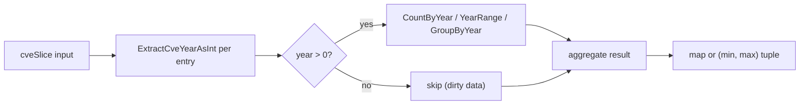
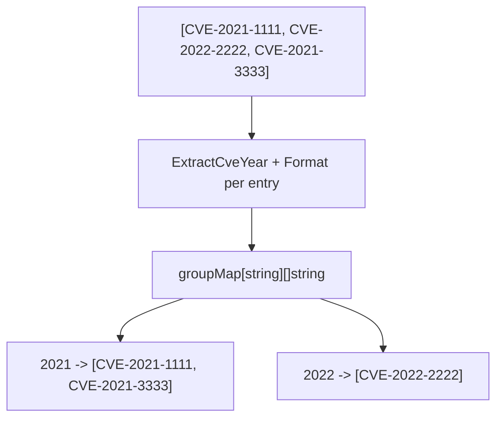
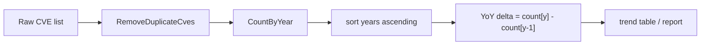
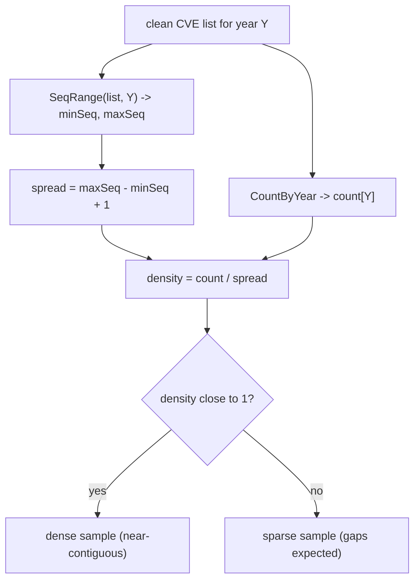
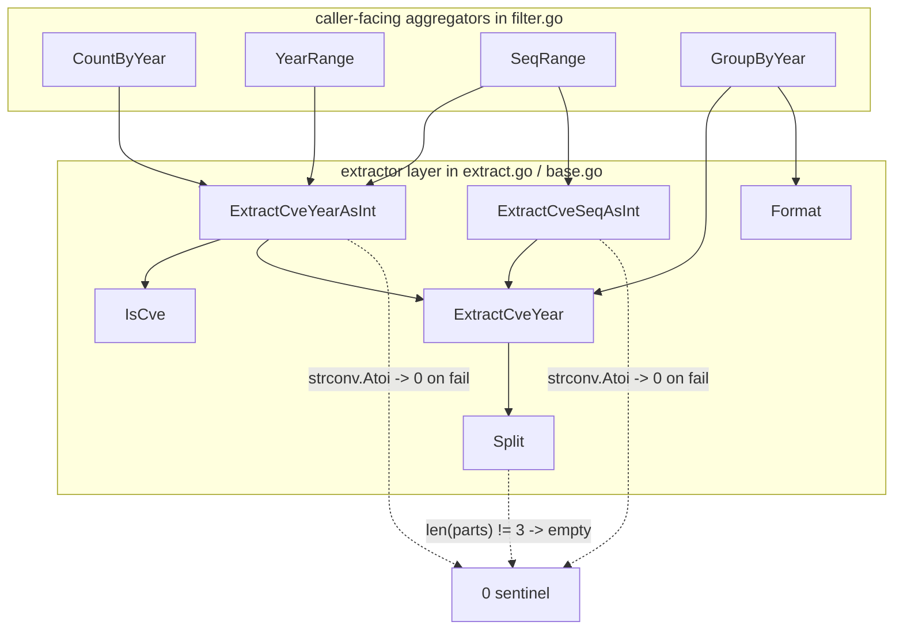

# Statistics & Analysis

The `cve` package exposes a small statistics surface in `filter.go` — `CountByYear`, `YearRange`, `SeqRange`, and the grouping helper `GroupByYear` — built on top of the year/sequence extractors in `extract.go`. Together they turn a flat list of identifiers into the numbers a security report actually needs: how many CVEs landed per year, what time span the data covers, and how densely a given year's sequence-number block was allocated. None of these functions allocate beyond a single pass over the input; they are the analytical layer you reach for after `ExtractCve` and `RemoveDuplicateCves` have produced a clean list.

:::tip Who this is for
You already extract, format, and deduplicate CVE identifiers, and now need to answer questions like "how is our vulnerability inventory distributed across years?", "does this dataset span the full reporting period?", or "how full is the 2024 sequence-number block?". This page assumes you have read [Year Rules](/guide/year-rules) and [Formatting & Normalization](/guide/formatting-normalization).
:::

## The statistics toolkit at a glance

All four functions live in `filter.go` and share a single design principle: one linear scan, constant auxiliary state, no sorting unless the caller asks for it. The extractors they depend on (`ExtractCveYearAsInt`, `ExtractCveSeqAsInt`) are defined in `extract.go` and return `0` on any malformed input, which is what makes the statistics robust to dirty data.

| Function | Signature | Returns | Backing extractor |
| --- | --- | --- | --- |
| `CountByYear` | `(cveSlice []string) map[int]int` | year -> count map | `ExtractCveYearAsInt` |
| `YearRange` | `(cveSlice []string) (min, max int)` | earliest & latest year | `ExtractCveYearAsInt` |
| `SeqRange` | `(cveSlice []string, year int) (min, max int)` | min & max sequence for a year | `ExtractCveYearAsInt` + `ExtractCveSeqAsInt` |
| `GroupByYear` | `(cveSlice []string) map[string][]string` | year -> CVE list | `ExtractCveYear` + `Format` |



The `year > 0` guard is load-bearing: a malformed entry such as `CVE-ABCD-1234` makes `ExtractCveYearAsInt` return `0`, and the statistics functions explicitly skip it rather than poisoning the result with a bogus "year 0" bucket.

## CountByYear — the per-year histogram

`CountByYear(cveSlice []string) map[int]int` walks the slice once, calling `ExtractCveYearAsInt` on each entry, and increments a `map[int]int` keyed by year. Entries whose year parses to `0` are dropped, so the returned map never contains a `0` key.

```go
func CountByYear(cveSlice []string) map[int]int {
    result := make(map[int]int)
    for _, cve := range cveSlice {
        year := ExtractCveYearAsInt(cve)
        if year > 0 {
            result[year]++
        }
    }
    return result
}
```

The function is case-insensitive and format-tolerant by construction, because `ExtractCveYearAsInt` delegates to `Split`, which normalises through `Format`. Feeding it `["CVE-2022-1111", "CVE-2022-2222", "CVE-2021-3333", "cve-2022-4444"]` yields `{2021: 1, 2022: 3}` — the lowercase `cve-2022-4444` lands in the same `2022` bucket as its uppercase siblings.

| Input | Output | Note |
| --- | --- | --- |
| `["CVE-2022-1111", "CVE-2022-2222", "CVE-2021-3333", "cve-2022-4444"]` | `{2021: 1, 2022: 3}` | case folded into one bucket |
| `["CVE-2022-1111", "not-a-cve"]` | `{2022: 1}` | malformed entry dropped |
| `[]` | `{}` | empty input, empty map |

A practical histogram loop:

```go
package main

import (
    "fmt"
    "sort"

    "github.com/scagogogo/cve-skills/cve"
)

func main() {
    list := []string{
        "CVE-2020-1111", "CVE-2021-2222", "CVE-2021-3333",
        "CVE-2022-4444", "CVE-2022-5555", "CVE-2022-6666",
        "cve-2022-7777",
    }
    counts := cve.CountByYear(list)

    years := make([]int, 0, len(counts))
    for y := range counts {
        years = append(years, y)
    }
    sort.Ints(years)
    for _, y := range years {
        fmt.Printf("%d: %d CVEs\n", y, counts[y])
    }
    // 2020: 1 CVEs
    // 2021: 2 CVEs
    // 2022: 4 CVEs
}
```

Note that `CountByYear` does **not** deduplicate — if the same identifier appears twice in the slice, it is counted twice. Run `RemoveDuplicateCves` first if you want unique counts.

## YearRange and SeqRange — the bounds trio

Where `CountByYear` gives the distribution, `YearRange` and `SeqRange` give the extent. They are intentionally small functions, but together they answer two distinct reporting questions.

### YearRange — the temporal span

`YearRange(cveSlice []string) (min, max int)` returns the earliest and latest year present in the list. The implementation seeds `min` to `-1` (a sentinel distinct from any valid year), skips any entry whose year is `<= 0`, and tightens `min`/`max` as it walks. If the list is empty or contains no valid CVE, both return values are `0`.

```go
func YearRange(cveSlice []string) (min, max int) {
    if len(cveSlice) == 0 {
        return 0, 0
    }
    min = -1
    for _, cve := range cveSlice {
        year := ExtractCveYearAsInt(cve)
        if year <= 0 {
            continue
        }
        if min == -1 || year < min {
            min = year
        }
        if year > max {
            max = year
        }
    }
    if min == -1 {
        return 0, 0
    }
    return min, max
}
```

| Input | min | max | Note |
| --- | --- | --- | --- |
| `["CVE-2020-1111", "CVE-2022-2222", "CVE-2021-3333"]` | `2020` | `2022` | unsorted input is fine |
| `[]` | `0` | `0` | empty-list guard |
| `["not-a-cve", "CVE-2021-2222"]` | `2021` | `2021` | dirty entry skipped, sentinel reset |

### SeqRange — the sequence-number extent for one year

`SeqRange(cveSlice []string, year int) (min, max int)` narrows the scan to a single year and returns the smallest and largest sequence number observed among that year's identifiers. It uses the same `-1` sentinel pattern, skips entries whose year does not match the target, and additionally skips entries whose sequence parses to `<= 0` (for example, a malformed `CVE-2022-ABC`).

```go
func SeqRange(cveSlice []string, year int) (min, max int) {
    min = -1
    for _, cve := range cveSlice {
        cveYear := ExtractCveYearAsInt(cve)
        if cveYear != year {
            continue
        }
        seq := ExtractCveSeqAsInt(cve)
        if seq <= 0 {
            continue
        }
        if min == -1 || seq < min {
            min = seq
        }
        if seq > max {
            max = seq
        }
    }
    if min == -1 {
        return 0, 0
    }
    return min, max
}
```

| Input | year | min | max |
| --- | --- | --- | --- |
| `["CVE-2022-1111", "CVE-2022-5555", "CVE-2022-3333", "CVE-2021-9999"]` | `2022` | `1111` | `5555` |
| `["CVE-2022-1111"]` | `2023` | `0` | `0` | no match for the target year |

## GroupByYear — bucketing for reports

`GroupByYear(cveSlice []string) map[string][]string` is the structural sibling of `CountByYear`: where the latter returns counts, this returns the actual identifiers, keyed by the **string** year (e.g. `"2022"`, not `2022`). Each value is a `[]string` of `Format`-normalised identifiers, so the buckets are uppercase and whitespace-trimmed even when the input was not.

```go
func GroupByYear(cveSlice []string) map[string][]string {
    groupMap := make(map[string][]string, 0)
    for _, cve := range cveSlice {
        year := ExtractCveYear(cve)
        groupMap[year] = append(groupMap[year], Format(cve))
    }
    return groupMap
}
```

Unlike `CountByYear`, `GroupByYear` does **not** skip malformed entries — it calls `ExtractCveYear`, which returns `""` for a non-CVE string, so a dirty entry lands under the `""` key. If your input may contain noise, filter it with `IsCve` or run `ExtractCve` over the source text first.



A typical report-builder iterates the grouped map in sorted year order:

```go
package main

import (
    "fmt"
    "sort"

    "github.com/scagogogo/cve-skills/cve"
)

func main() {
    list := []string{
        "CVE-2021-1111", "CVE-2022-2222", "CVE-2021-3333",
        "cve-2021-4444",
    }
    grouped := cve.GroupByYear(list)

    years := make([]string, 0, len(grouped))
    for y := range grouped {
        years = append(years, y)
    }
    sort.Strings(years)
    for _, y := range years {
        fmt.Printf("%s (%d): %v\n", y, len(grouped[y]), grouped[y])
    }
    // 2021 (3): [CVE-2021-1111 CVE-2021-3333 CVE-2021-4444]
    // 2022 (1): [CVE-2022-2222]
}
```

## Annual trend analysis

Composing these primitives yields the annual trend view that most vulnerability reports lead with. The recipe is: deduplicate, count by year, and walk the years in order so the trend reads left-to-right.



```go
package main

import (
    "fmt"
    "sort"

    "github.com/scagogogo/cve-skills/cve"
)

func main() {
    raw := []string{
        "CVE-2020-0001", "CVE-2020-0002", "CVE-2020-0003",
        "CVE-2021-0001", "CVE-2021-0002", "CVE-2021-0003", "CVE-2021-0004",
        "CVE-2022-0001", "CVE-2022-0002",
    }
    clean := cve.RemoveDuplicateCves(raw)
    counts := cve.CountByYear(clean)

    years := make([]int, 0, len(counts))
    for y := range counts {
        years = append(years, y)
    }
    sort.Ints(years)

    prev := 0
    for _, y := range years {
        delta := counts[y] - prev
        arrow := "stable"
        switch {
        case delta > 0:
            arrow = "up"
        case delta < 0:
            arrow = "down"
        }
        fmt.Printf("%d: %d CVEs (%s)\n", y, counts[y], arrow)
        prev = counts[y]
    }
    // 2020: 3 CVEs (up)
    // 2021: 4 CVEs (up)
    // 2022: 2 CVEs (down)
}
```

Two caveats worth flagging on a trend chart. First, `CountByYear` counts **allocations**, not disclosures — a year with a high count reflects how many identifiers were reserved, which is only loosely correlated with how many were actively exploited. Second, the current year is always a partial observation; `GetRecentCves` can scope the comparison to the last *n* years to avoid comparing a half-year against full years.

## Sequence-number density estimation

`SeqRange` is the hook for a rough density estimate. Because CVE sequence numbers are allocated monotonically within a year, the spread `(max - min)` relative to the count of identifiers gives a sense of how completely a dataset samples that year's allocation block.



```go
package main

import (
    "fmt"

    "github.com/scagogogo/cve-skills/cve"
)

func main() {
    list := []string{
        "CVE-2022-1111", "CVE-2022-2222", "CVE-2022-3333",
        "CVE-2022-4444", "CVE-2022-5555",
    }
    year := 2022

    minSeq, maxSeq := cve.SeqRange(list, year)
    counts := cve.CountByYear(list)
    n := counts[year]

    if minSeq == 0 {
        fmt.Println("no CVEs for", year)
        return
    }
    spread := maxSeq - minSeq + 1
    density := float64(n) / float64(spread)
    fmt.Printf("year %d: %d CVEs, seq %d-%d, spread %d, density %.2f\n",
        year, n, minSeq, maxSeq, spread, density)
    // year 2022: 5 CVEs, seq 1111-5555, spread 4445, density 0.00
}
```

Read the density number carefully. A low density (as above) means the dataset covers a wide sequence range thinly — typical for a curated advisory feed, not evidence of under-reporting. A density near `1.0` would indicate a near-contiguous block, which is what you would expect from a full NVD mirror, not from a selective inventory. The estimate is also bounded by `SeqRange`'s skip rule: any entry with a non-numeric sequence is excluded from both the min/max and the count, so malformed identifiers cannot inflate the spread.

## Summary

- `CountByYear`, `YearRange`, `SeqRange`, and `GroupByYear` are the analytical layer in `filter.go`, all built on the `extract.go` year/sequence extractors.
- All four do a single linear pass; `CountByYear`, `YearRange`, and `SeqRange` explicitly skip malformed entries (year `<= 0` or seq `<= 0`), while `GroupByYear` buckets them under the empty-string key.
- `CountByYear` returns `map[int]int` keyed by integer year; `GroupByYear` returns `map[string][]string` keyed by the string year and holding `Format`-normalised identifiers.
- `YearRange` gives the temporal extent of the dataset; `SeqRange` gives the sequence-number extent for one year, which supports a rough density estimate.
- Compose `RemoveDuplicateCves` -> `CountByYear` -> sorted iteration for annual trend charts, and keep in mind that allocation counts are not disclosure counts.

## Visual Reference

The two diagrams below restate the statistics pipeline from two complementary angles. The first is a plain-text data-flow view of how a single CVE string is dispatched across the four aggregators; the second is a dependency graph showing which extractor each function ultimately reaches into, and where the malformed-input short-circuits live.

```text
                 +-----------------------------+
                 |  cveSlice []string          |
                 +-----------------------------+
                              |
                              v
        +-----------------------------------------+
        |  per-entry dispatch (single linear scan)|
        +-----------------------------------------+
                              |
   +----------+----------+----------+-------------+
   |          |          |          |             |
   v          v          v          v             v
+------+  +--------+  +--------+  +-----------+
|Count |  |Year    |  |Seq     |  |Group      |
|ByYear|  |Range   |  |Range   |  |ByYear     |
+------+  +--------+  +--------+  +-----------+
   |          |          |          |
   v          v          v          v
map[int]  (min,max)  (min,max)  map[string]
[int]     year        seq         []string
   |          |          |          |
   |          |   year != target?  |  no IsCve gate
   |          |   skip             |  dirty -> "" key
   |          |          |          |
   +----------+----------+----------+
                |
                v
   +-------------------------+
   |  extractor backing layer|
   |  ExtractCveYearAsInt    |
   |  ExtractCveSeqAsInt     |
   |  ExtractCveYear + Format|
   +-------------------------+
```



## Deep Dive

- **The `-1` sentinel is the hinge that makes `0` unambiguous.** `YearRange` and `SeqRange` both seed `min` to `-1` (filter.go lines 484, 533) and only fall back to `(0, 0)` when the sentinel survives the whole loop. Because a real CVE year or sequence is always `&gt; 0`, reserving `0` as the "no valid observation" return value and `-1` as the "have not yet seen anything" internal state means a list full of malformed entries is indistinguishable from an empty list — which is exactly what a reporting caller wants, rather than getting a bogus `(0, 2022)` for a list that contained nothing but `not-a-cve` strings.

- **`CountByYear` and `GroupByYear` disagree on how to treat dirty input, and the difference is deliberate.** `CountByYear` gates on `year &gt; 0` (filter.go line 445), so malformed entries vanish from the histogram. `GroupByYear` calls `ExtractCveYear` directly with no `IsCve` pre-check (filter.go line 49) and buckets whatever string `Split` returns — which is `""` for a non-CVE. The rationale is that `CountByYear` feeds trend *numbers*, where a phantom bucket would distort the chart, while `GroupByYear` feeds *reports*, where silently dropping entries would hide data-quality problems from the operator. If you want `GroupByYear` to behave like `CountByYear`, pre-filter with `IsCve` or pipe the source through `ExtractCve`.

- **Capacity hints are inconsistent across the four functions, and it is a real (if tiny) allocation difference.** `GroupByYear` writes `make(map[string][]string, 0)` (filter.go line 47) — the `0` is a no-op hint, so the map starts at Go's default small size and rehashes as buckets grow. `CountByYear` writes `make(map[int]int)` with no hint at all (filter.go line 442). Neither pre-sizes to `len(cveSlice)` even though the upper bound on distinct years is trivially the input length. For the modest lists these functions are designed for this is fine; if you are aggregating a million-identifier NVD mirror, expect a few extra rehashes and consider a pre-sized local wrapper.

- **`ExtractCveYearAsInt` is stricter than it looks, because it routes through `IsCve` rather than `Split` directly.** A naive reader sees `ExtractCveYear` -> `Split` and assumes any `CVE-YYYY-NNNN` substring parses. In fact `ExtractCveYearAsInt` (extract.go line 184) calls `IsCve` first, which matches the anchored `^\s*CVE-\d+-\d+\s*$` regex in base.go line 14. So `CVE-2022-12345` parses, but `"see CVE-2022-12345 for details"` returns `0` even though the embedded CVE is valid — the surrounding prose breaks the anchored match. The statistics functions inherit this strictness: pass them already-extracted identifiers, not raw advisory prose, or counts will silently drop to zero.

- **`SeqRange`'s density estimate is bounded by monotonic allocation, not by your sample.** CVE sequence numbers are handed out monotonically within a year by the CNAs, so `max - min + 1` is a *lower bound* on the allocation block size, not the block size itself — there may be unassigned numbers above your `max`. Consequently the `density = count / spread` figure on this page is a *sample* density, conservative as a coverage estimate: a sparse dataset can still sit inside a year whose true allocation block is far larger. Compare densities only across datasets sampling the same year, never across years with different observation windows.

## Further reading

- [Year Rules](/guide/year-rules) — the structure of the year field and how `ExtractCveYearAsInt` parses it.
- [Formatting & Normalization](/guide/formatting-normalization) — why `Format` is applied inside `GroupByYear` before bucketing.
- [Set Operations Guide](/guide/set-operations-guide) — `RemoveDuplicateCves`, the deduplication step that should precede any statistics call.
- [Comparison & Ordering](/guide/comparison-ordering) — `SortCves`, used to order grouped buckets deterministically.
- [Performance](/guide/performance) — the O(n) complexity story behind these single-pass aggregators.
