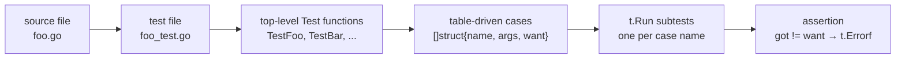

# Testing Strategy

The `cve` package ships 95 test functions across 3,342 lines of test code, organized as one `*_test.go` file per source file — plus a CLI test tier in `cmd/cmd_test.go` that drives the compiled binary as a subprocess. This page documents how those tests are structured, how to run them, and how to add new ones without breaking the conventions that keep the suite deterministic.

:::tip 📂 View Source
Test files live next to the source they cover — open any of them on GitHub:
[`base_test.go`](https://github.com/scagogogo/cve-skills/blob/main/base_test.go) ·
[`compare_test.go`](https://github.com/scagogogo/cve-skills/blob/main/compare_test.go) ·
[`extract_test.go`](https://github.com/scagogogo/cve-skills/blob/main/extract_test.go) ·
[`filter_test.go`](https://github.com/scagogogo/cve-skills/blob/main/filter_test.go) ·
[`generate_test.go`](https://github.com/scagogogo/cve-skills/blob/main/generate_test.go) ·
[`cmd/cmd_test.go`](https://github.com/scagogogo/cve-skills/blob/main/cmd/cmd_test.go)
:::

## Test Inventory

| Test file | Source file | Tests | Lines | Coverage focus |
|---|---|---|---|---|
| `base_test.go` | `base.go` | 11 | 656 | Format, IsCve, IsContainsCve, Split, year checks, validation |
| `compare_test.go` | `compare.go` | 4 | 246 | CompareByYear, SubByYear, CompareCves, SortCves |
| `extract_test.go` | `extract.go` | 8 | 380 | Extract/First/Last/Year/Seq, FilterCvesByPattern |
| `filter_test.go` | `filter.go` | 11 | 826 | GroupByYear, filters, set ops, dedup, statistics, ranges |
| `generate_test.go` | `generate.go` | 4 | 252 | GenerateCve, GenerateFakeCve, ParseCveRange, IsCvesConsecutive |
| `cmd/cmd_test.go` | `cmd/` (14 files) | 57 | 890 | CLI: version/help/unknown, every subcommand's happy path + empty-input + missing-flag + parent-Help branches |
| **Total** | **5 source files + `cmd/`** | **95** | **3,342** | Library tier (in-process) + CLI tier (subprocess) |

## Test Organization



- **One test file per source file.** `base.go` is covered by `base_test.go`, `compare.go` by `compare_test.go`, and so on. There are no cross-file test packages; the test files use `package cve` (white-box), so they can reference unexported helpers if needed.
- **One top-level `Test*` function per exported function.** Each exported function gets its own `TestXxx` — `Format` → `TestFormat`, `IsCve` → `TestIsCve`, etc. This makes test failures self-locating: the failing function name is in the test name.
- **Table-driven cases inside each `Test*`.** Each `Test*` declares a `tests := []struct{name, args, want}` slice and loops over it with `t.Run(tt.name, ...)`. A single test function typically covers 1–8 cases this way.

## Table-Driven Pattern

Every test in the suite follows the same shape. Here is the canonical structure, drawn from `TestFormat` in `base_test.go`:

```go
func TestFormat(t *testing.T) {
    type args struct {
        cve string
    }
    tests := []struct {
        name string
        args args
        want string
    }{
        {
            name: "format CVE with mixed case and spaces",
            args: args{
                cve: " cVe-2002-100098  ",
            },
            want: "CVE-2002-100098",
        },
        // ...more cases
    }
    for _, tt := range tests {
        t.Run(tt.name, func(t *testing.T) {
            if got := Format(tt.args.cve); got != tt.want {
                t.Errorf("Format() = %v, want %v", got, tt.want)
            }
        })
    }
}
```

Conventions enforced across all 38 tests:

- **`name` is a human-readable sentence**, not `case1`. Subtest names like `"format CVE with mixed case and spaces"` describe the scenario, so a failure reads as `--- FAIL: TestFormat/format_CVE_with_mixed_case_and_spaces`.
- **`args` is a named struct**, even when there is only one field. This keeps the call site (`Format(tt.args.cve)`) readable and lets future parameters be added without rewriting every case.
- **`want` is the expected return**, asserted with a single `got != want` check (or `!reflect.DeepEqual` for slices/maps). Tests never assert on side effects, because the library has none.
- **One assertion per subtest.** If a case needs multiple checks, it still reports a single `t.Errorf` line with `got` and `want` so the failure is greppable.

## Slice/Map Comparisons

For functions returning slices (`[]string`) or maps (`map[string][]string`), the tests use `reflect.DeepEqual` instead of `!=`:

```go
if !reflect.DeepEqual(got, tt.want) {
    t.Errorf("GroupByYear() = %v, want %v", got, tt.want)
}
```

`reflect.DeepEqual` is used 14 times across the suite — 9 of them in `filter_test.go`, which has the most slice/map-returning functions (set operations, grouping, ranges).

## Time-Dependent Tests

Several functions depend on "the current year" (`IsCveYearOk`, `GetRecentCves`, `GenerateFakeCve`). The tests handle this by reading `time.Now().Year()` at test time rather than hard-coding a year:

```go
// from base_test.go — IsCveYearOk cases
{ name: "valid current year",  args: args{cve: fmt.Sprintf("CVE-%d-10086", time.Now().Year())},     want: true },
{ name: "valid past year",     args: args{cve: "CVE-1999-10086"},                                   want: true },
{ name: "future year",         args: args{cve: fmt.Sprintf("CVE-%d-10086", time.Now().Year()+1)}, want: false },
{ name: "year before 1999",    args: args{cve: "CVE-1998-10086"},                                  want: false },
```

- **Why `time.Now()` instead of a fixed year:** a hard-coded `"CVE-2022-..."` case would flip from `valid` to `future-year` as the calendar advances, causing a silent test rot. Reading `time.Now().Year()` keeps the test correct forever.
- **The trade-off:** these tests are not reproducible to the exact year — a failure in December 2026 might not reproduce in January 2027. This is accepted because the *property under test* ("current year is valid, next year is not") is itself time-dependent.
- **`IsCveYearOkWithCutoff`** tests compute the cutoff relative to now: `cutoff: time.Now().Year() - 2019`, so the "tolerate N future years" case stays valid as years pass.

## Edge-Case Coverage

The suite deliberately probes the boundaries documented in each function's [Edge Cases](/api/functions/format) table:

| Boundary class | Example case | Where |
|---|---|---|
| Empty / whitespace input | `" "`, `""` | `TestFormat`, `TestIsCve` |
| Mixed case | `"cVe-2007-199"` | `TestIsCve`, `TestFormat` |
| Leading/trailing spaces | `" cve-2007-199"`, `"cve-2007-199 "` | `TestIsCve` |
| Year boundaries | `1998` (before 1999), `1999` (first valid), current year, current+1 | `TestIsCveYearOk` |
| Sequence digit counts | 1-digit, 4-digit, 5-digit, 6-digit | `TestExtractCve`, `TestFormatSeq` |
| Negative / unrealistic years | `0`, `9999` | `TestGenerateCve` |
| Duplicates in input | `["CVE-2022-1","CVE-2022-1"]` | `TestRemoveDuplicateCves` |
| Empty slices | `[]string{}` | `TestSortCves`, `TestGroupByYear` |
| Set operations on disjoint sets | intersect/union/diff of non-overlapping lists | `TestIntersectCves` etc. |

## Running the Tests

```bash
# Run the entire suite
go test ./...

# Run with verbose output — shows every subtest name and its pass/fail
go test -v ./...

# Run a single test function
go test -run TestFormat ./...

# Run a single subtest by name (regex on the case name)
go test -run 'TestIsCve/year_before_1999' ./...

# Run a single source file's tests
go test -run 'TestExtract' ./...

# Coverage profile — which lines of each source file are exercised
go test -coverprofile=coverage.out ./...
go tool cover -html=coverage.out     # open a browser view
go tool cover -func=coverage.out      # per-function summary
```

:::tip 🖥️ Determinism
The suite is fully deterministic — there are no `time.Sleep`, no network calls, no filesystem dependencies, and no `math/rand` seeding that varies between runs. `GenerateFakeCve` uses randomness internally, but its test asserts on the *shape* of the output (valid CVE, current-year prefix) rather than the exact value. Run the suite any number of times; the result is the same.
:::

## Coverage Philosophy

The suite targets **behavioral coverage of edge cases** and reaches **100.0% statement coverage** of the library (`go test -coverprofile=... .` → `total: (statements) 100.0%`), and the `cmd/` CLI tier also reaches 100% via its subprocess scheme (see [CLI Tier: Subprocess Coverage](#cli-tier-subprocess-coverage)). `go test -race ./...` passes in ~1s:

- Every exported function (plus the two unexported helpers `validateSingleCve` and `extractYear`) has at least one `Test*`, and every `Test*` has at least one happy-path case plus one or more boundary cases.
- Functions with time-dependent logic get cases for current year, past year, and future year.
- Functions returning slices get cases for empty input, single-element input, and duplicate input.
- `reflect.DeepEqual` is used wherever `!=` cannot compare composite returns.
- The "regex passes but `strconv.Atoi` overflows" defensive branches are hit with 26-digit sequence numbers (e.g. `CVE-2022-99999999999999999999999999`) — `\d+` matches any length, but `Atoi` overflows `int`, covering the otherwise-unreachable error paths in `FormatSeq`, `validateSingleCve`, and `ParseCveRange`.
- Two structurally-unreachable branches were removed rather than left as dead code: `FilterCvesByPattern` now uses `regexp.MustCompile` (the escaping logic guarantees a compilable regex), and `ParseCveRange`'s `switch` has no `default` (the `rangeRegex` invariant guarantees one of three groups is non-empty; the downstream `startSeq > endSeq` check is the fallback).
- There are **no benchmarks** in the suite. Performance is documented in each function page's [Complexity](/api/functions/format) section based on source analysis, not measured here. If you need to benchmark, add a `func BenchmarkXxx(b *testing.B)` following the same per-source-file convention.

## CLI Tier: Subprocess Coverage

The `cmd/` package is a thin cobra CLI layer whose `Run` closures call `os.Exit(1)` on error — a call that cannot be captured by an in-process `go test -coverprofile`. So `cmd/cmd_test.go` drives the CLI through a **subprocess coverage** scheme that reaches 100% of `cmd/`:

- **`buildCoveredBinary`** compiles the main package with coverage instrumentation (`go build -cover -o <bin> ./cmd/cve`) into a persistent `os.MkdirTemp` directory (not `t.TempDir`, which the first test's cleanup would delete out from under later tests).
- **`runCve(t, args...)`** spawns that binary via `os/exec` with `GOCOVERDIR=<tmpdir>`, so each invocation's coverage data lands in a fresh temp dir (tracked in a `collectedCoverDirs` slice under a mutex). It returns `(stdout, stderr, exitCode)` so tests assert on all three.
- **`TestMain`** runs all tests, then merges the per-invocation coverage with `go tool covdata merge` (comma-separated `-i`) and `go tool covdata textfmt` into the path named by `$GOCOVER_SUBPROCESS_OUT` — a standard `mode: set` profile.
- **`readInputs`** (the pure helper in `cmd/helpers.go`) has no `os.Exit`, so it is covered in-process by four direct tests — including `TestReadInputsCharDevice`, which feeds `/dev/null` as stdin to hit the char-device branch that an in-process stdin can never be.
- **Merging two profiles.** The final `cmd/` coverage is the OR of the in-process profile (covers `readInputs` 100%) and the subprocess profile (covers `Execute`, all `init`, all `Run`/`RunE` closures 100%). A small merge script OR-s the counts per `file:line:col` block.
- **`os.Exit` counters do flush.** The `format` command's empty-input `os.Exit(1)` block shows count 1 in the subprocess profile — coverage counters are written to `GOCOVERDIR` before the process exits. So any remaining zero-count block is a genuinely missing test, not a flush artifact.

Reproduce the full `cmd/` coverage locally:

```bash
# In-process profile (covers readInputs)
go test -count=1 -coverprofile=proc.out ./cmd/

# Subprocess profile (covers Execute + Run/RunE closures)
GOCOVER_SUBPROCESS_OUT=cli_sub.out go test -count=1 ./cmd/

# Merge by OR-ing per-block counts → merged.out, then:
go tool cover -func=merged.out | grep '/cmd/'
```

The `examples/` directory (33 runnable `main` packages) is deliberately excluded from the coverage target — those are demonstration programs, not code under test.

## Unified Single-Profile Coverage

The library (`go test .`) and the CLI dual-profile merge each report 100%, but a single `go test -coverpkg ./...` cannot capture subprocess coverage (the CLI `Run` closures execute in spawned processes). `make coverage` uses Go 1.20+ `-test.gocoverdir` to make in-process tests also emit covdir format, unifies it with subprocess `GOCOVERDIR` covdir, then merges both via pure-Go `go tool covdata merge -pcombine` into a single directory and converts to a standard `mode: set` profile via `textfmt` — `go tool cover -func coverage.out` reports 100.0% for lib + cmd in this single view.

```bash
make coverage   # produces coverage.out, single-view 100.0%
make test       # plain unit tests, fast feedback
```

## Data Flow

```text
+-------------------+     +-------------------------+     +---------------------------+
| source: foo.go    | --> | test: foo_test.go       | --> | TestFoo (table-driven)    |
| func Foo(...)     |     | package cve (white-box) |     |   tests := []struct{...}  |
+-------------------+     +-------------------------+     +-------------+-------------+
                                                                        |
                                                          for _, tt := range tests
                                                                        |
                                                                        v
                                              +-------------------------------------------+
                                              | t.Run(tt.name, func(t *testing.T){       |
                                              |   got := Foo(tt.args...)                 |
                                              |   if got != tt.want { t.Errorf(...) }    |
                                              | })                                       |
                                              +-------------------+-----------------------+
                                                                  |
                                                                  v
                                              +-------------------------------------------+
                                              | go test -v output:                        |
                                              |   --- PASS: TestFoo/case_name (0.00s)     |
                                              |   --- FAIL: TestFoo/other_case (0.00s)    |
                                              +-------------------------------------------+
```

## Adding a New Test

When you add or change an exported function, follow the existing conventions so the suite stays uniform:

1. **Put the test in the matching `*_test.go` file.** A function in `filter.go` is tested in `filter_test.go`. If the source file is new, create a matching `*_test.go` with `package cve`.
2. **Name it `Test<FunctionName>`.** One top-level test per exported function.
3. **Use the table-driven shape.** Declare `type args struct{...}`, a `tests` slice with `name`/`args`/`want`, and loop with `t.Run(tt.name, ...)`.
4. **Write `name` as a sentence** describing the scenario, not `case1`/`case2`.
5. **Cover at least: one happy path, one empty/zero input, one boundary.** If the function is time-dependent, add current-year and future-year cases using `time.Now().Year()`.
6. **Use `reflect.DeepEqual`** if the return is a slice or map; plain `!=` for scalars.
7. **Assert with `t.Errorf("Foo() = %v, want %v", got, tt.want)`** — keep the `got`/`want` format so failures are greppable.
8. **Run `go test -v ./...`** and confirm your new subtests pass and are named readably in the output.

## Deep Dive

- **White-box, same package.** All five test files declare `package cve`, not `package cve_test`. This means the tests can see unexported symbols if a refactor ever introduces them. Today no test relies on an unexported symbol — the choice is a convenience hedge, not a current need. If the package ever wanted to freeze its internals, switching to `package cve_test` (black-box) would be a one-line change per file with no test breakage.
- **No test helpers, no fixtures.** The suite has zero `TestMain`, zero shared setup functions, and zero `t.Helper()` wrappers. Each `Test*` is self-contained: it builds its own `tests` slice inline. This is viable because the library is stateless — there is no shared state to initialize or tear down.
- **`reflect.DeepEqual` over custom equality.** For slice returns, the tests never sort-then-compare or write a custom diff; they trust `reflect.DeepEqual` on the raw return. This works because every tested function's output is already in a canonical order (sorted, or grouped by ascending year) — the tests would catch a reorder bug as a mismatch.
- **Time-dependent tests trade reproducibility for correctness-over-time.** A hard-coded `"CVE-2022-10086"` would rot; `time.Now().Year()` does not. The trade is deliberate: the property ("current year valid, next year not") is itself a function of the calendar, so the test *should* move with it.
- **No benchmarks by design.** Performance claims in each function page come from source-level complexity analysis, not from measured runs. This keeps the suite fast (sub-second) and hermetic. A contributor who wants measured numbers should add a `BenchmarkXxx` in the matching `*_test.go` rather than a separate bench file.
- **Subtest naming uses spaces, not underscores.** Go's `testing` package replaces spaces with underscores in the runnable test name (`TestIsCve/year_before_1999`), but the source `name` field keeps spaces for readability in the table. This is the idiomatic Go convention and matches `go test -v` output.

## Related

- [Library Design](/guide/library-design) — why the library is stateless, which is what makes the test suite this simple
- [Error Handling & Boundaries](/guide/error-handling) — the edge cases the tests probe
- [API Reference](/api/) — each function page lists its own edge cases
- [CLI Conventions](/reference/cli-conventions) — the CLI layer is thin; library tests cover the real logic
