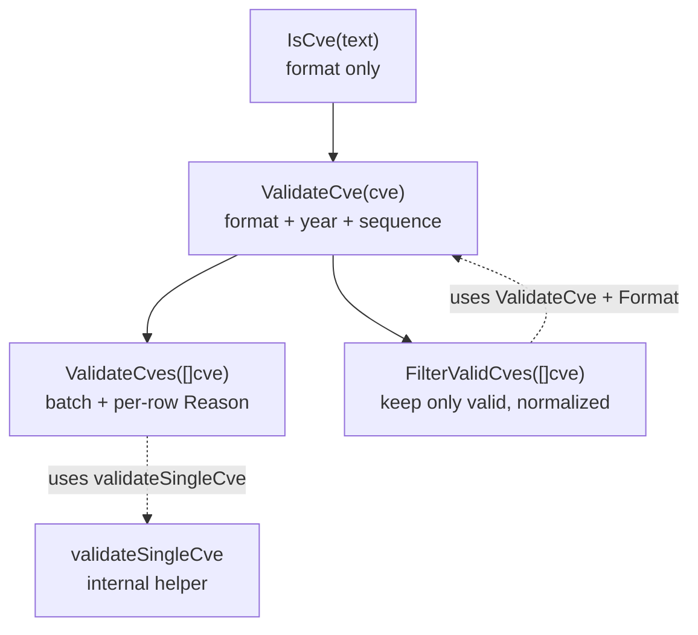
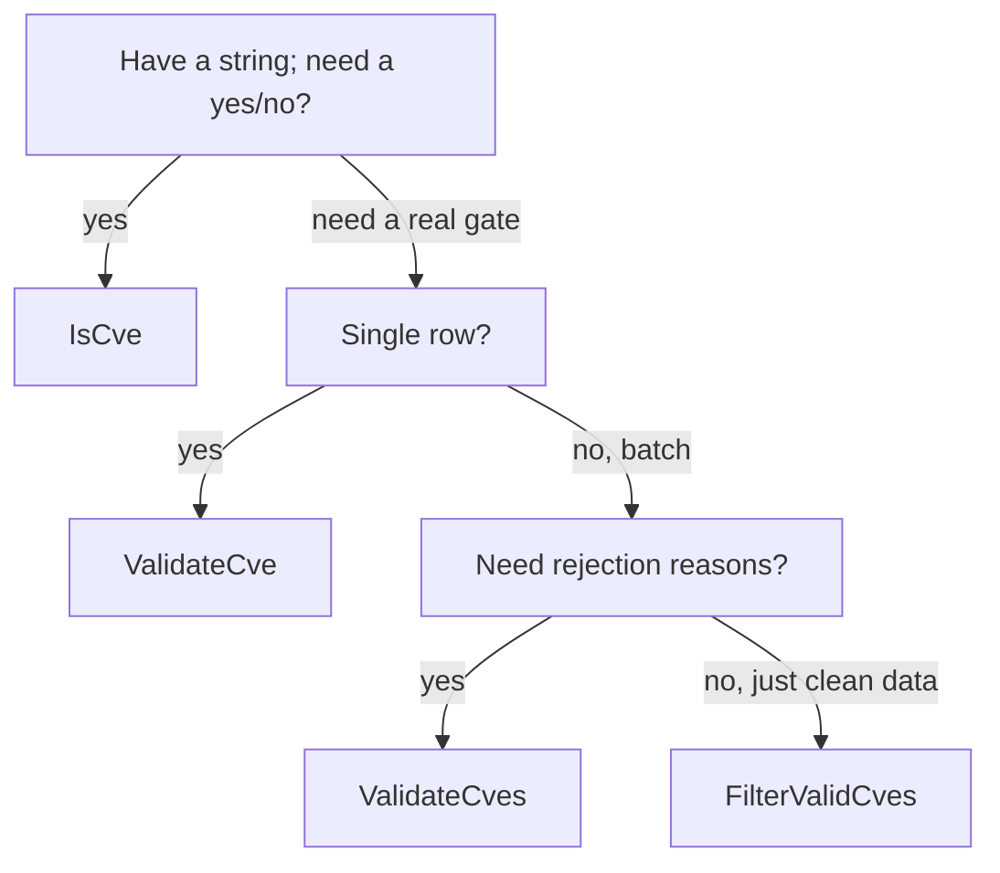
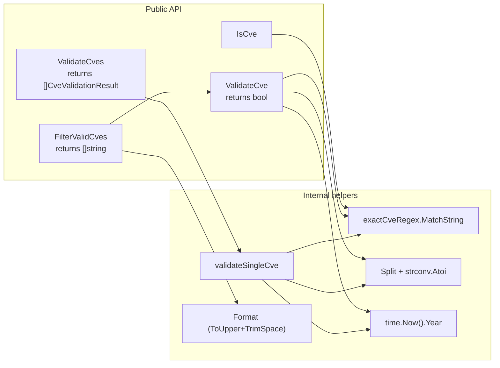

# Validation Strategy

The `cve` package ships four entry points for checking whether a string is a usable CVE identifier: `IsCve`, `ValidateCve`, `ValidateCves`, and `FilterValidCves`. They are not redundant tiers — each owns a distinct trade-off between speed, strictness, and the richness of the information returned. This page lays out their layered relationship, the `CveValidationResult.Reason` chain, and a decision guide for picking the right one per scenario.

:::tip Who should read this
Developers importing CVE data from feeds, parsing security advisories, or building data-quality pipelines where a single malformed identifier must not crash the whole batch. If you only need a yes/no on a user-typed string, start at [IsCve](/api/functions/is-cve); if you owe your users an explanation of *why* a row was rejected, jump to [ValidateCves](/api/functions/validate-cves).
:::

## Why four functions instead of one

A single "validate everything" function would force every caller to pay for work it does not need. A format-only fast path is enough to gate UI input; a full year+sequence check belongs at the import boundary; a batch importer additionally wants per-row reasons for its rejection report. Splitting these concerns keeps each call site both fast and expressive.

The four functions form a strict ladder — each tier adds one capability on top of the previous:



| Function | Input | Returns | Checks format | Checks year | Checks sequence | Gives reason | Normalizes output |
| --- | --- | --- | :-: | :-: | :-: | :-: | :-: |
| `IsCve` | `string` | `bool` | ✅ | ❌ | ❌ | ❌ | ❌ |
| `ValidateCve` | `string` | `bool` | ✅ | ✅ | ✅ | ❌ | ❌ |
| `ValidateCves` | `[]string` | `[]CveValidationResult` | ✅ | ✅ | ✅ | ✅ | ❌ |
| `FilterValidCves` | `[]string` | `[]string` | ✅ | ✅ | ✅ | ❌ | ✅ |

Note the asymmetry in the last two columns: `ValidateCves` is the only tier that explains failures, while `FilterValidCves` is the only tier that hands back clean, upper-cased identifiers ready for storage.

## IsCve — the format-only fast path

`IsCve(text string) bool` matches the string against `(?i)^\s*CVE-\d+-\d+\s*$`. It tolerates surrounding whitespace and mixed case, but rejects anything that is not the *entire* string. `CVE-2022-12345` passes; `see CVE-2022-12345 for details` fails because extra characters surround the match.

This is the cheapest check in the package — a single regex with no parsing, no `time.Now()` lookup, no integer conversion. Use it when you only need to know "is this string shaped like a CVE", for example to decide whether to color a token in an editor or to short-circuit a UI validator before the user has finished typing.

```go
package main

import (
    "fmt"

    "github.com/scagogogo/cve"
)

func main() {
    samples := []string{
        "CVE-2022-12345",
        " cve-2022-12345 ",
        "CVE-2022-ABC",
        "see CVE-2022-12345 in the report",
        "CVE-2022-0",
    }
    for _, s := range samples {
        fmt.Printf("%-40t -> %v\n", s, cve.IsCve(s))
    }
}
```

⚠️ `IsCve` does **not** reject `CVE-1998-1` or `CVE-9999-0`. Both match the format. If a year out of range or a zero sequence number would corrupt your downstream data, you need the next tier.

## ValidateCve — format, year, and sequence

`ValidateCve(cve string) bool` layers two extra rules on top of `IsCve`:

1. **Year range** — the year must satisfy `1999 <= year <= time.Now().Year()`. The lower bound 1999 reflects the first year CVE identifiers were assigned; the upper bound uses the current system clock, so `CVE-2030-1` will start failing once the calendar passes 2030.
2. **Positive sequence** — the sequence number must parse as an integer strictly greater than zero, so `CVE-2022-0` is rejected.

```go
package main

import (
    "fmt"

    "github.com/scagogogo/cve"
)

func main() {
    candidates := []string{
        "CVE-2022-12345", // valid
        "CVE-1998-12345", // year before 1999
        "CVE-2030-12345", // year after current (as of 2026)
        "CVE-2022-ABC",  // non-numeric sequence
        "CVE-2022-0",    // non-positive sequence
    }
    for _, c := range candidates {
        fmt.Printf("%-20s valid=%v\n", c, cve.ValidateCve(c))
    }
}
```

Use `ValidateCve` at any single-row boundary where you want a true gate but do not need to *explain* the rejection — for instance guarding a `Get(year, seq)` lookup or filtering input before passing it to a `Compare*` function. The companion `IsCveYearOk` / `IsCveYearOkWithCutoff` helpers expose only the year-range check when you want to relax the upper bound (for example to accept reserved future CVEs up to `currentYear + cutoff`).

## ValidateCves — batch validation with a reason chain

`ValidateCves(cveSlice []string) []CveValidationResult` iterates the slice and delegates each element to the internal `validateSingleCve` helper, which returns a `CveValidationResult` carrying the original input plus a human-readable `Reason` when invalid:

```go
type CveValidationResult struct {
    Cve    string // original identifier as passed in
    Valid  bool   // true when every rule passes
    Reason string // empty when Valid; otherwise the first failing rule
}
```

🧩 The `Reason` chain is a short-circuit ladder — `validateSingleCve` checks rules in order and stops at the first failure, so each result reports exactly one reason. The possible values, in evaluation order, are:

| # | Rule checked | Reason string on failure |
| :-: | --- | --- |
| 1 | `IsCve` format | `invalid CVE format` |
| 2 | year parses as integer | `year is not a valid number` |
| 3 | sequence parses as integer | `sequence number is not a valid number` |
| 4 | `year >= 1999` | `year %d is before 1999` |
| 5 | `year <= currentYear` | `year %d is after current year %d` |
| 6 | `sequence > 0` | `sequence number must be positive` |

Reading that table top to bottom is exactly how `validateSingleCve` walks an input: a string that fails the format regex never reaches the year check, and a year-before-1999 input never reaches the sequence check. The result preserves the original `Cve` string verbatim, so you can echo it back to the user without losing case or surrounding whitespace.

```go
package main

import (
    "fmt"

    "github.com/scagogogo/cve"
)

func main() {
    raw := []string{
        "CVE-2022-12345",
        "not-a-cve",
        "CVE-1998-5",
        "CVE-2030-5",
        "CVE-2022-0",
    }
    for _, r := range cve.ValidateCves(raw) {
        if r.Valid {
            fmt.Printf("OK   %s\n", r.Cve)
        } else {
            fmt.Printf("FAIL %s  ->  %s\n", r.Cve, r.Reason)
        }
    }
}
```

📌 Reach for `ValidateCves` whenever you import a batch and need a data-quality report — a CSV importer, a feed reconciler, or an audit log. Because it never mutates the input, the report can point at the exact offending row.

## FilterValidCves — keep only the good ones

`FilterValidCves(cveSlice []string) []string` is the convenience tier: it runs `ValidateCve` on every element and returns only the survivors, each run through `Format` so the result is uniformly upper-cased and trimmed. Invalid entries are dropped silently — no reasons, no indices.

```go
package main

import (
    "fmt"

    "github.com/scagogogo/cve"
)

func main() {
    raw := []string{"cve-2022-12345", "invalid", "CVE-1998-1", "CVE-2023-99999"}
    fmt.Printf("%#v\n", cve.FilterValidCves(raw))
    // Output: []string{"CVE-2022-12345", "CVE-2023-99999"}
}
```

This is the right tool for "clean then proceed" pipelines: extract identifiers from an advisory with `ExtractCve`, hand them to `FilterValidCves`, and feed the normalized slice straight into `SortCves`, `GroupByYear`, or a set operation like `IntersectCves`. The silent drop is by design — if you need to know what was dropped and why, run `ValidateCves` on the same input and diff.

## Choosing the right tier



Map that flow onto common tasks:

| Scenario | Pick | Why |
| --- | --- | --- |
| Syntax-highlight a typed token in an editor | `IsCve` | Cheapest; tolerates incomplete input as the user types |
| Guard a single lookup before fetching a record | `ValidateCve` | One boolean, no allocation for reasons |
| CSV/JSON import that must log every bad row | `ValidateCves` | Per-row `Reason` feeds straight into an error report |
| Pipeline that extracts then stores clean CVEs | `FilterValidCves` | Returns normalized, ready-to-store slice |
| Accepting reserved future-year CVEs | `IsCveYearOkWithCutoff` | Relaxes the upper bound with a year offset |

⚡ Performance note: `IsCve` is a single regex and allocation-free on the hot path; `ValidateCve` and above add a `time.Now().Year()` call plus integer parsing per element. For batches above a few thousand entries, prefer the batch functions over looping `ValidateCve` yourself — the loop body is the same, but a single `ValidateCves` call keeps the results colocated for one rejection-report pass.

## Summary

- The four functions are a ladder: `IsCve` (format) → `ValidateCve` (+year, +sequence, `bool`) → `ValidateCves` (batch + `Reason`) → `FilterValidCves` (clean output only).
- `validateSingleCve` short-circuits in a fixed order, so every `CveValidationResult.Reason` pinpoints the first rule that failed.
- Only `ValidateCves` explains failures; only `FilterValidCves` normalizes survivors — choose by whether your caller needs the "why" or the "what's left".
- Year bounds are `1999..currentYear` via `time.Now()`, so future-dated CVEs fail today and pass later; use `IsCveYearOkWithCutoff` to relax.

## Visual Reference

The first diagram is an ASCII walk-through of a single input string as `validateSingleCve` evaluates it. Read top to bottom: each box is a rule, the side branches are the failure paths (with the exact `Reason` string written back into `CveValidationResult`), and the bottom is the only path that sets `Valid = true`.

```text
                 input string "cve"
                       |
                       v
              +------------------+      no
              | IsCve format?    |------------> Reason: "invalid CVE format"
              | (?i)^\s*CVE-     |              (return early, Valid=false)
              |   \d+-\d+\s*$    |
              +------------------+
                       | yes
                       v
              +------------------+      err      Reason: "year is not a valid number"
              | strconv.Atoi    |-------------->  (Split year is non-numeric)
              |   (year)        |
              +------------------+
                       | ok
                       v
              +------------------+      err      Reason: "sequence number is not a valid
              | strconv.Atoi    |-------------->   number"
              |   (seq)         |
              +------------------+
                       | ok
                       v
              +------------------+      no        Reason: "year %d is before 1999"
              | year >= 1999 ?  |-------------->   (fmt.Sprintf, yearInt plugged in)
              +------------------+
                       | yes
                       v
              +------------------+      no        Reason: "year %d is after current
              | year <=          |-------------->   year %d" (time.Now().Year())
              |  time.Now().Year |              |
              +------------------+
                       | yes
                       v
              +------------------+      no        Reason: "sequence number must be positive"
              | seq > 0 ?        |-------------->
              +------------------+
                       | yes
                       v
        CveValidationResult{Cve: <orig>, Valid: true, Reason: ""}
```

The second diagram shifts from "how one input is judged" to "how the four public functions delegate to each other at call time". It makes two facts visible that the ladder table hides: `ValidateCve` and `validateSingleCve` share the same rule body but split at the boolean-vs-result seam, and `FilterValidCves` is the only tier that pipes survivors through `Format` on the way out.



## Deep Dive

- **Two regexes, package-level, compiled once.** `exactCveRegex` and `containsCveRegex` are declared as package-level `var` blocks in `base.go` (lines 12-17) and compiled with `regexp.MustCompile` at package init. Every call to `IsCve` / `IsContainsCve` reuses the same compiled matcher — there is no per-call `regexp.Compile` allocation, which is why the docs can claim `IsCve` is "allocation-free on the hot path". The `(?i)` inline flag makes matching case-insensitive without a second pattern.

- **`validateSingleCve` and `ValidateCve` share rules but not return type.** Both walk the same six checks, yet they are not wired through a common predicate. `validateSingleCve` (base.go:328-374) returns a `CveValidationResult` and short-circuits with a specific `Reason` at each step; `ValidateCve` (base.go:445-460) collapses the year/seq parse errors with `yearErr != nil || seqErr != nil` and then evaluates `yearInt >= 1999 && yearInt <= time.Now().Year() && seqInt > 0` as a single boolean expression — it never produces a reason, only the final `bool`. So the rule order is identical, but `ValidateCve` cannot tell you *which* clause failed; that information exists only inside `validateSingleCve`.

- **`time.Now()` is read per element, not cached per batch.** In `validateSingleCve` the line `currentYear := time.Now().Year()` (base.go:359) is reached on every element that survives the format and parse checks. `ValidateCves` does not hoist the year lookup out of the loop — each surviving element pays one `time.Now()` syscall. For a batch of N well-formed inputs that is N calls, not one. In practice `time.Now()` is cheap, but if you are validating hundreds of thousands of rows in a tight pipeline and already know your cutoff, calling `IsCveYearOkWithCutoff` with a precomputed bound (or pre-filtering with `IsCve`) avoids the repeated clock read.

- **`ValidateCves` preallocates; `FilterValidCves` does not.** `ValidateCves` sizes its result slice with `make([]CveValidationResult, len(cveSlice))` (base.go:320) so there is exactly one allocation regardless of input size, and indices line up 1:1 with the input. `FilterValidCves` (base.go:400-408) declares `var result []string` — a nil slice — and grows it with `append` as survivors are found. When most inputs are valid this triggers a few reallocations; when most are invalid the slice stays small and the cost is negligible. The asymmetry is intentional: `ValidateCves` must preserve positional correspondence for a rejection report, while `FilterValidCves` only emits survivors and benefits from a tight final allocation.

- **The year lower bound 1999 is a CVE-program fact, not a Go convention.** The constant `1999` appears as a literal in `IsCveYearOkWithCutoff` (base.go:233), in `validateSingleCve` (base.go:353), and in the `Reason` string `"year %d is before 1999"`. It mirrors the real-world history of the CVE program, which began assigning identifiers in 1999, so any `CVE-1998-*` or earlier is by definition not a real CVE. The upper bound is intentionally dynamic — `time.Now().Year()` — which means the same input can transition from invalid to valid as the calendar advances: `CVE-2030-1` fails today and passes in 2030. Use `IsCveYearOkWithCutoff(cve, k)` to widen the upper bound to `currentYear + k` when ingesting reserved future CVEs.

## Further reading

- [IsCve](/api/functions/is-cve) — format-only predicate reference
- [ValidateCve](/api/functions/validate-cve) — single-row full validation reference
- [ValidateCves](/api/functions/validate-cves) — batch validation and `CveValidationResult` reference
- [FilterValidCves](/api/functions/filter-valid-cves) — normalized-survivor filter reference
- [IsCveYearOkWithCutoff](/api/functions/is-cve-year-ok-with-cutoff) — relaxed year-range helper
- [Format](/api/functions/format) — normalization used by `FilterValidCves`
