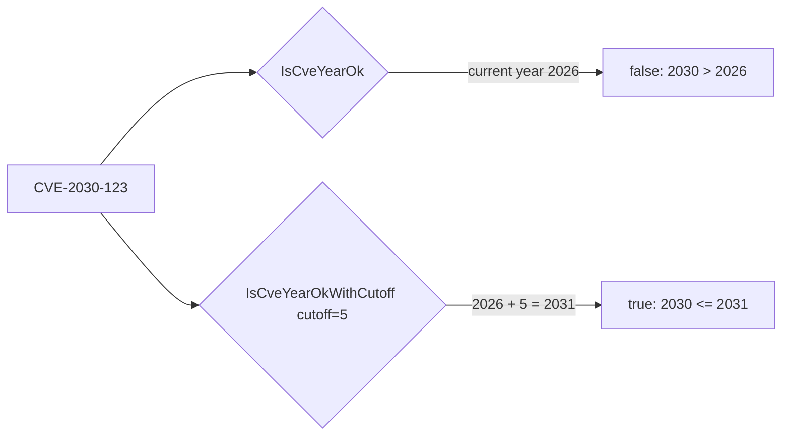
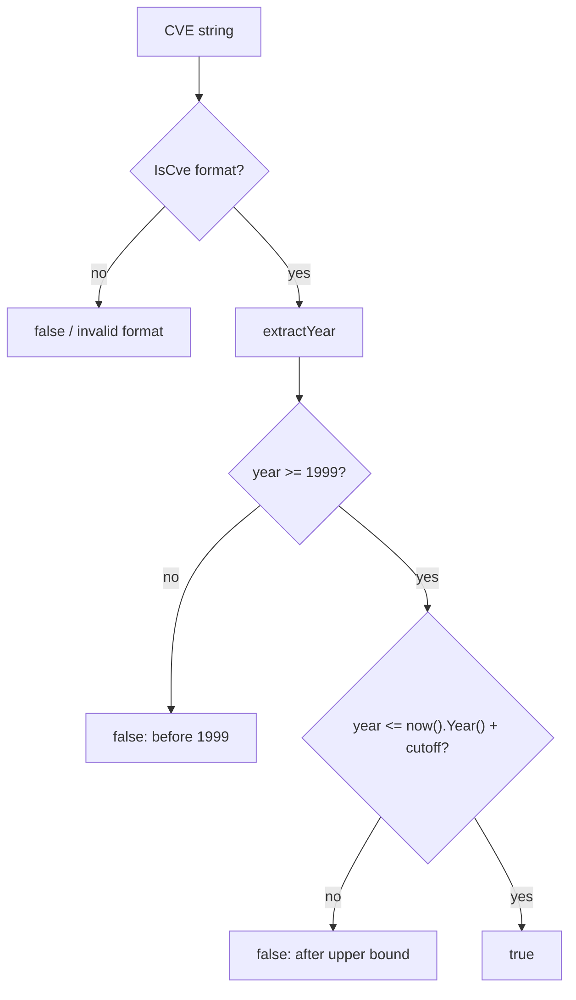
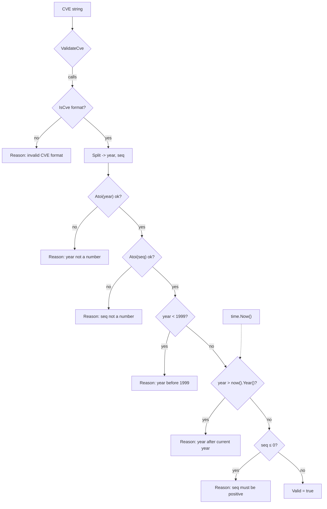

# Year Validation Rules

📌 The `cve` package enforces a year boundary on every CVE identifier: the year must fall between **1999** (inclusive, the lower bound) and the **current runtime year** (inclusive, the upper bound). This page explains the rationale behind the two bounds, how `IsCveYearOk` and `IsCveYearOkWithCutoff` differ, how they relate to `ValidateCve`, and why validation depends on `time.Now()`.

:::tip Who this is for
Developers who need to filter out malformed, historical, or future-dated CVEs; teams ingesting CVE feeds from multiple sources; and anyone wondering why a "validly formatted" CVE such as `CVE-2030-12345` can still be rejected.
:::

## Why 1999 as the Lower Bound

The CVE program as operated by MITRE began publishing identifiers under the `CVE-YYYY-NNNNN` syntax starting with the **1999** year field. There are no official CVE records with a year earlier than 1999, so any identifier of the form `CVE-1998-NNNNN` or below is by definition not a real CVE — it is either a typo, a fabricated example, or a non-CVE identifier that happens to match the regex.

The lower bound is encoded directly in the source. In `base.go`:

```go
func IsCveYearOkWithCutoff(cve string, cutoff int) bool {
	year := extractYear(cve)
	return year >= 1999 && year <= time.Now().Year()+cutoff
}
```

The constant `1999` is hard-coded rather than derived from configuration, because it reflects a historical fact about the CVE program rather than a tunable policy. The same constant reappears inside `ValidateCve` and the internal helper `validateSingleCve`, so all three validation entry points share an identical floor.

The table below summarizes how the lower bound is enforced across the public API:

| Function | Lower-bound check | Behavior below 1999 |
| --- | --- | --- |
| `IsCveYearOk` | `year >= 1999` (via `IsCveYearOkWithCutoff`) | returns `false` |
| `IsCveYearOkWithCutoff` | `year >= 1999` | returns `false`, `cutoff` only affects the upper bound |
| `ValidateCve` | `yearInt >= 1999` | returns `false` |
| `validateSingleCve` | `yearInt < 1999` | returns `false` with reason `"year %d is before 1999"` |

⚠️ The `cutoff` parameter does **not** relax the lower bound. Even with a large `cutoff`, `CVE-1998-12345` is rejected. Cutoffs only widen the window into the future, never into the past.

## Why the Current Year Is the Upper Bound

A CVE identifier whose year exceeds the current calendar year is suspicious: MITRE cannot have assigned a "future" record. Such identifiers typically come from corrupted data, test fixtures, or sources that invent IDs. The default upper bound is therefore `time.Now().Year()`.

This is visible in two places in `base.go`. The simpler one is the year-only check:

```go
func IsCveYearOkWithCutoff(cve string, cutoff int) bool {
	year := extractYear(cve)
	return year >= 1999 && year <= time.Now().Year()+cutoff
}
```

And the more thorough one inside the full validator:

```go
// 基础验证规则：年份在1999至今，序列号为正整数
return yearInt >= 1999 && yearInt <= time.Now().Year() && seqInt > 0
```

Because the upper bound is computed at call time from the system clock, the result of validating `CVE-2027-1` changes as the calendar advances. An identifier that is invalid today may become valid on January 1 of the matching year. This is intentional — it keeps the library honest about what MITRE could plausibly have issued.

## IsCveYearOk vs IsCveYearOkWithCutoff: the cutoff Parameter

`IsCveYearOk` is a thin wrapper:

```go
func IsCveYearOk(cve string) bool {
	return IsCveYearOkWithCutoff(cve, 0)
}
```

It delegates to `IsCveYearOkWithCutoff` with `cutoff = 0`, meaning the upper bound is exactly the current year. `IsCveYearOkWithCutoff` adds a single knob: it extends the upper bound forward by `cutoff` years, so that `year <= time.Now().Year()+cutoff` admits a controlled range of future years.

🧩 The cutoff exists to handle **reserved and pre-published CVEs**. MITRE lets CNAs reserve blocks of IDs in advance, and a CVE record can be publicly referenced (for example, in an advisory or a vendor bulletin) before its year "arrives" in a strict sense, or you may legitimately process a feed that was generated slightly ahead of the calendar. A modest cutoff (1–3 years) lets these through without disabling year validation entirely.

The contrast between the two functions:



A practical comparison of accepted year ranges (assuming the current year is 2026):

| Input | `IsCveYearOk` | `IsCveYearOkWithCutoff(_, 2)` | `IsCveYearOkWithCutoff(_, 5)` |
| --- | --- | --- | --- |
| `CVE-1998-1` | `false` | `false` | `false` |
| `CVE-1999-1` | `true` | `true` | `true` |
| `CVE-2026-1` | `true` | `true` | `true` |
| `CVE-2027-1` | `false` | `true` | `true` |
| `CVE-2029-1` | `false` | `false` | `true` |
| `CVE-2031-1` | `false` | `false` | `true` |
| `CVE-2032-1` | `false` | `false` | `false` |

⚡ Use a cutoff when you ingest third-party feeds that may carry reserved IDs; use the plain `IsCveYearOk` when you want the strictest possible interpretation of "could MITRE have issued this today".

## Relationship and Differences with ValidateCve

`IsCveYearOk` and `ValidateCve` are related but not interchangeable. They share the same year bounds but check different things:

| Aspect | `IsCveYearOk` | `ValidateCve` |
| --- | --- | --- |
| Checks format? | No — relies on `extractYear`, which returns `0` for malformed input | Yes — calls `IsCve` first |
| Checks year? | Yes, `[1999, now]` | Yes, `[1999, now]` |
| Checks sequence number? | No | Yes, must be a positive integer |
| Supports cutoff? | Yes, via `IsCveYearOkWithCutoff` | No, upper bound is always the current year |
| Return type | `bool` | `bool` |

A key consequence: `IsCveYearOk` cannot tell you *why* a CVE is bad, and it does not verify the sequence number. `ValidateCve` is the stricter, all-in-one check. The internal helper `validateSingleCve` goes further still and produces a `CveValidationResult` with a human-readable `Reason`:

```go
if yearInt < 1999 {
	result.Valid = false
	result.Reason = fmt.Sprintf("year %d is before 1999", yearInt)
	return result
}

currentYear := time.Now().Year()
if yearInt > currentYear {
	result.Valid = false
	result.Reason = fmt.Sprintf("year %d is after current year %d", yearInt, currentYear)
	return result
}
```

⚠️ `ValidateCve` deliberately does **not** expose a cutoff. If you need a future-tolerant full validation, combine the checks yourself: call `IsCve` for format, `IsCveYearOkWithCutoff` for the year, and verify the sequence is positive. There is no single built-in function that does "full validation with a relaxed upper bound".

## Runtime Dependency on time.Now()

All year validation ultimately calls `time.Now().Year()`. This has several practical implications:

1. **Non-deterministic results across time.** The same input string can return `false` today and `true` next year. Treat any cached validation result as stale after the year changes.
2. **No dependency injection.** The current implementation reads the system clock directly inside `IsCveYearOkWithCutoff`, `ValidateCve`, and `validateSingleCve`. There is no way to inject a fixed "now" for testing through the public API.
3. **Clock skew matters.** If the host clock is wrong, validation follows the wrong year. A machine whose clock is stuck in 2020 will reject every legitimate `CVE-2026-*` identifier.
4. **Deterministic testing requires control over the year, not the clock.** Because `cutoff` shifts the upper bound relative to `time.Now()`, you can write year-stable tests by choosing `cutoff` values that compensate for the current date — for example, asserting `IsCveYearOkWithCutoff("CVE-2050-1", 30)` is `true` regardless of when the test runs.

🤖 The diagram below shows how a single CVE flows through the year checks and where `time.Now()` enters the decision:



## Usage Scenarios

- **Strict input validation at an API boundary.** Use `ValidateCve` to reject malformed, out-of-range, or zero-sequence CVEs before they enter your database. The hard `1999` floor and the `time.Now()` ceiling protect against both typos and fabricated IDs.
- **Ingesting partner feeds that reserve IDs.** Wrap `IsCveYearOkWithCutoff` with a small cutoff (1–3 years) so reserved or pre-published CVEs are not falsely rejected, while still filtering gross errors like `CVE-1998-*` or `CVE-9999-*`.
- **Data-quality reporting.** Use `ValidateCves` / the internal `validateSingleCve` path to obtain per-item `Reason` strings such as `"year 1998 is before 1999"` or `"year 2030 is after current year 2026"` for an audit report.
- **Long-running batch jobs.** Because the ceiling depends on `time.Now()`, a job that starts on December 31 and finishes on January 1 may see different results for the same input. Re-validate at the moment of decision rather than trusting stale results.

## 小结

- The lower bound `1999` is a fixed historical fact of the CVE program, hard-coded in `base.go` and shared by every validation function.
- The upper bound defaults to `time.Now().Year()` and is computed at call time, so validation results can change as the calendar advances.
- `IsCveYearOk` is just `IsCveYearOkWithCutoff(cve, 0)`; the `cutoff` parameter widens the upper bound forward only, to admit reserved and pre-published CVEs.
- `ValidateCve` is stricter than `IsCveYearOk` because it also checks format and a positive sequence number, but it does **not** accept a cutoff.
- For test-stable behavior, exploit `cutoff` to offset the current year rather than trying to mock `time.Now()`.

## Visual Reference

The first diagram is an ASCII flow of how a single CVE string is dispatched across the four validation entry points, showing which checks each performs and where `time.Now()` enters. The second is a mermaid sequence view of one call through `ValidateCve` → `validateSingleCve`, illustrating the short-circuit order of reasons a CVE can collect.

```text
                     CVE string (e.g. CVE-2030-12345)
                              |
          +-------------------+-------------------+
          |                   |                   |
   IsCveYearOk        IsCveYearOkWithCutoff   ValidateCve
   cutoff = 0         cutoff = N              (no cutoff)
          |                   |                   |
          v                   v                   v
     extractYear        extractYear            IsCve? ----- no ---> "invalid CVE format"
          |                   |                   | yes
          v                   v             Split -> year,seq
   year >= 1999?       year >= 1999?        strconv.Atoi year/seq
     | no  | yes        | no  | yes             |
     v     v            v     v            yearInt < 1999?  -- yes --> "year %d is before 1999"
   false  |           false   |                | no
          |                   |           yearInt > now().Year()? -- yes --> "year %d is after current year %d"
          v                   v                | no
   year <= now+N?      year <= now+N?      seqInt <= 0? -- yes --> "sequence number must be positive"
     | no  | yes        | no  | yes             | no
     v     v            v     v                 v
   false  true        false  true           Valid = true
                            ^
                            |
                  time.Now().Year() supplies
                  the upper bound at call time
                  (cutoff shifts it forward only)
```



## Deep Dive

1. **`validateSingleCve` checks in a fixed short-circuit order.** The source (`base.go`, lines 328-374) evaluates: format (`IsCve`) → `strconv.Atoi(year)` → `strconv.Atoi(seq)` → `year < 1999` → `year > time.Now().Year()` → `seq <= 0`. The first failing predicate wins and becomes the `Reason`; a CVE never collects more than one reason per call. This is why the `Reason` strings enumerated in the existing sections are mutually exclusive — they reflect distinct early-return branches, not a list of all problems.

2. **`extractYear` silently returns `0` on malformed input, and `0` happens to fail the lower bound.** `extractYear` (`base.go`, lines 162-170) calls `Format`, splits on `-`, requires exactly 3 parts, and ignores the `Atoi` error (returning `0` on parse failure). Because `0 < 1999`, the year-only functions `IsCveYearOk` / `IsCveYearOkWithCutoff` reject malformed strings as a side effect of the lower bound, *not* because they validate format. This is the asymmetry called out in the comparison table: `IsCveYearOk("not-a-cve")` is `false`, but for the "before 1999" reason's logic, not because format was checked.

3. **The `1999` literal is duplicated in three places, not centralized.** The same magic number appears in `IsCveYearOkWithCutoff` (line 233), in `validateSingleCve` (line 353), and in `ValidateCve` (line 459). There is no shared constant, so the three are coupled by convention. A hypothetical change to the lower bound requires editing all three call sites; the existing docs' claim that "all three validation entry points share an identical floor" is true today precisely because each hard-codes the same literal.

4. **`cutoff` is additive on the upper bound only, applied as `time.Now().Year()+cutoff`.** Reading line 233 literally, `cutoff` shifts the ceiling *relative to the moment of the call*, not relative to a fixed epoch. Two consequences: a negative `cutoff` would tighten the upper bound below the current year (rejecting same-year CVEs), and a `cutoff` chosen today does not stay calibrated as the calendar advances — a test using `cutoff=30` to admit `CVE-2050-1` is stable only because both the year and `time.Now()` advance together, keeping their difference constant.

5. **No `Clock` interface means validation is not mockable through the public API.** Unlike libraries that accept an injected `func() time.Time` or a `Clock` interface, the three year-checking paths all call `time.Now()` directly (`base.go` lines 233, 359-360, 459). The only test-stable lever is the `cutoff` parameter, which works precisely because it is expressed as a *delta* from the live clock. This is a deliberate simplicity trade-off: fewer moving parts, at the cost of forcing callers who want time-travel to either wrap the package or compute compensating cutoffs.

## Further Reading

- [Format and IsCve](/api/functions/is-cve) — the format regexes and `Format`/`IsCve` that year validation builds on.
- [ValidateCve and ValidateCves](/api/functions/validate-cve) — full validation, including sequence-number checks and `CveValidationResult`.
- [FilterValidCves](/api/functions/filter-valid-cves) — bulk filtering built on top of `ValidateCve`.
- [Getting Started](/guide/getting-started) — install and first run of the `cve` package.
