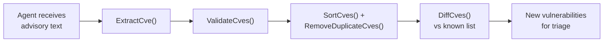
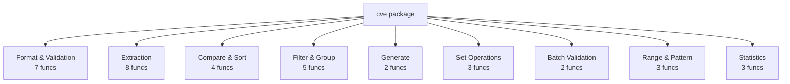

## How an AI Agent uses it



::: code-group

```bash [Install CLI]
# Prebuilt binary for every major platform
go install github.com/scagogogo/cve-skills/cmd/cve@latest
# or download from Releases:
# https://github.com/scagogogo/cve-skills/releases
```

```bash [Use the CLI]
# Extract & validate CVEs from any text — deterministic stdout
echo "Affected by CVE-2021-44228 and CVE-2022-12345" | cve extract
# 34 subcommands, all args-or-stdin — see the CLI Reference: /cli
```

```go [Use as a Go library]
package main

import (
    "fmt"
    "github.com/scagogogo/cve-skills" // go get github.com/scagogogo/cve-skills
)

func main() {
    text := "System affected by CVE-2021-44228 and CVE-2022-12345"

    // Extract, validate, dedup, sort — in one pipeline
    cves := cve.SortCves(cve.RemoveDuplicateCves(cve.ExtractCve(text)))
    fmt.Println(cves) // [CVE-2021-44228 CVE-2022-12345]

    fmt.Println(cve.ValidateCve("CVE-2022-12345")) // true
}
```

:::

## Function Map

30+ functions across 9 categories. One dependency, zero CVE-format reinvention.



## Why CVE Utils?

| Problem | CVE Utils solves it |
|---------|---------------------|
| Format inconsistency (`cve-...`, `CVE-...`, mixed case) | `Format()` → canonical `CVE-YYYY-NNNNN` |
| Manual extraction with custom regex | `ExtractCve()` from any text |
| No native Go comparison/sort | `CompareCves()` / `SortCves()` |
| Duplicates when merging sources | `RemoveDuplicateCves()` |
| Range parsing in bulletins | `ParseCveRange()` → expanded list |

🚀 **[Get started in 30 seconds →](/guide/getting-started)**
