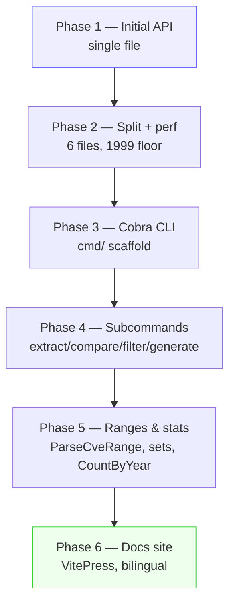
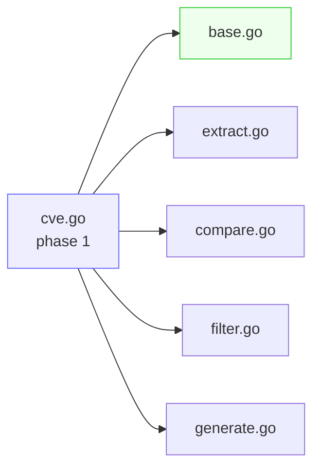
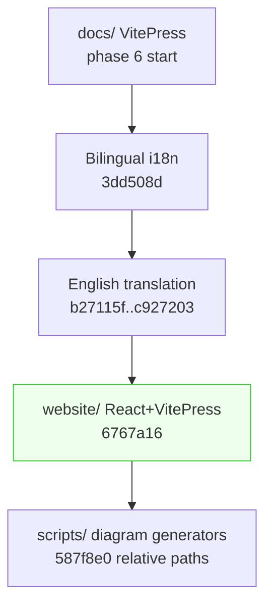
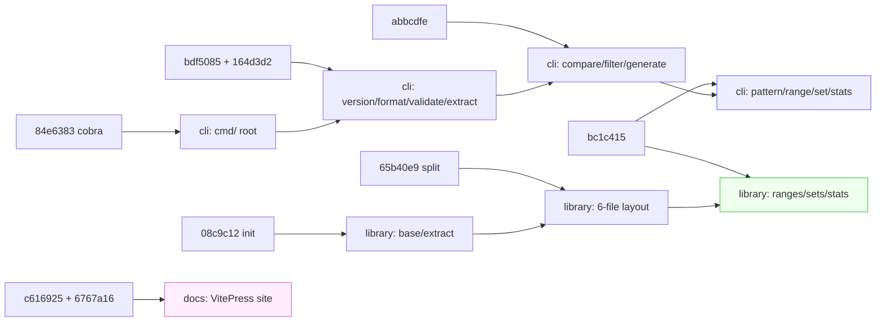

# Changelog

The `cve` package did not arrive fully formed. It grew commit by commit from a single-file Go module into a six-file library, then gained a Cobra-based CLI, then a batch of range, pattern and statistics functions, and finally a bilingual VitePress documentation site. This page reconstructs that evolution from the git history so you can see which capability landed when, what was renamed or refactored along the way, and how the public API reached its current shape. It is a reading aid for the function and CLI reference pages, not a substitute for them — every entry below points back to the concrete source file or command it describes.

:::tip Who this is for
Anyone who wants to understand why the `cve` package is organized the way it is: which file owns which function family, why `SortCves` is not called `SortedCves`, why the year floor is 1999 and not 1970, and when the CLI and the docs site appeared. Read it alongside the [migration guide](/reference/migration) to map old hand-written patterns onto the current API.
:::

## How to read this changelog

The history falls into five phases. Each phase is a section on this page, and each section lists the commits that shaped it together with the public-surface change they introduced. The table below is the index.

| Phase | Theme | Headline commit | Public surface added |
| --- | --- | --- | --- |
| 1 | Initial API in one file | `08c9c12 init` | `Format`, `IsCve`, `ExtractCve`, year checks |
| 2 | Split into modules + perf | `65b40e9 refactor: 拆分单一的大文件` | Six-file layout, `SortCves` rename, 1999 floor |
| 3 | CLI (Cobra) introduced | `84e6383 feat(cli): add cobra` | `cmd/`, `version`, `format`, `validate` |
| 4 | CLI subcommand expansion | `abbcdfe feat(cli): compare, filter, generate` | `extract`, `compare`, `filter`, `generate` |
| 5 | Range, pattern, statistics | `bc1c415 feat: docs, examples, CLI` | `ParseCveRange`, `FilterCvesByPattern`, sets, stats |
| 6 | Documentation site | `6767a16 feat: add React website` | VitePress site, bilingual docs, diagrams |



## Phase 1 — The initial API

The repository's first real content commit (`08c9c12 init`) established the package as a Go module and shipped the original CVE-handling surface in a single `cve.go` file. The functions that landed here are the ones every later phase builds on: normalization, format detection, extraction from free text, and year validation.

| Function | File today | Role since phase 1 |
| --- | --- | --- |
| `Format` | `base.go` | Upper-case + trim; the canonicalization primitive |
| `IsCve` | `base.go` | Exact-shape match, whitespace-tolerant |
| `IsContainsCve` | `base.go` | Presence check inside arbitrary text |
| `ExtractCve` | `extract.go` | Pull all CVEs from a string, upper-cased |
| `IsCveYearOk` | `base.go` | Year-window check |

Two decisions from this phase are worth noting because they show up in every later commit. First, `Format` was always the canonicalization entry point — every compare, dedupe and filter call in the modern package still keys on `Format(cve)`. Second, the original year floor was `1970`, not `1999`; that was corrected only in phase 2. The phase-1 commit also carried the first GitHub Actions workflow (`1ba5ddc`), so CI was present from the very beginning and every later refactor shipped under test.

```go
// The shape of phase 1, still recognizable in base.go today:
standardized := cve.Format("cve-2022-12345") // "CVE-2022-12345"
if cve.IsCve(userInput) {
    ids := cve.ExtractCve(report) // upper-cased matches
}
```

## Phase 2 — Splitting into modules and a performance pass

The single `cve.go` grew until it warranted splitting. Commit `65b40e9` ("拆分单一的大文件为多个小文件") carved it into the six files the package still uses: `base.go` (normalization and validation), `extract.go` (text extraction and year/seq accessors), `compare.go` (comparison and sorting), `filter.go` (filtering, grouping and set operations), `generate.go` (CVE construction), and the package entry `cve.go`. The test file was split in parallel (`e082326`) so each module has a matching `_test.go`. This is why the reference pages cite functions by file — the file boundaries are real and trace back to this commit.

The performance and correctness pass that followed (`0534ee2`, `d98869e`) did three things at once:

| Commit | Change | Why it matters |
| --- | --- | --- |
| `0534ee2` | Hoisted shared regexes to package-level vars (`exactCveRegex`, `containsCveRegex`) | Avoids recompiling on every `IsCve` / `IsContainsCve` call |
| `0534ee2` | Moved the year floor from `1970` to `1999` | Aligns with the CVE Program's actual first published year |
| `d98869e` | Hoisted `cveRegex` in `extract.go` | `ExtractCve`/`ExtractFirstCve` share one compiled pattern |
| `33386ad` | Renamed `SortedCves` to `SortCves`; `SubByYear` now delegates to `CompareByYear` | Naming consistency; less duplicated logic |

The `SortedCves` → `SortCves` rename is the only breaking rename in the history. If you find `SortedCves` in old code or old issues, the modern equivalent is [`SortCves`](/api/functions/sort-cves). The `IsCveYearOkWithCutoff` variant was introduced in the same window (`90c5595`, `2b9b816`) to let callers accept a future-year offset, which is how reserved-but-unpublished CVE IDs get validated.



## Phase 3 — The Cobra CLI scaffolding

The library stayed Go-API-only until commit `84e6383` ("feat(cli): add cobra dependency and cmd directory structure"). That commit introduced the `github.com/spf13/cobra v1.8.1` dependency recorded in `go.mod`, created the `cmd/` directory, and seeded two files: `cmd/cve/main.go` (the entry point) and `cmd/root.go` (the root command). The CLI is now a first-class deliverable alongside the library, and every later subcommand hangs off this root.

The very next commit (`bdf5085`) populated the first batch of leaf commands:

| Command | File | Wraps |
| --- | --- | --- |
| `version` | `cmd/version.go` | Package version banner |
| `format` | `cmd/format.go` | `cve.Format` |
| `validate` | `cmd/validate.go` | `cve.IsCve`, `cve.ValidateCve`, `cve.IsCveYearOk` |
| `helpers` | `cmd/helpers.go` | Shared output formatting utilities |

```bash
# The CLI became installable and queryable from this phase on.
cve version
cve format "cve-2022-12345"
cve validate "CVE-1998-1"
```

Note that `go.mod` pins `cobra v1.8.1` with `pflag v1.0.5` and `mousetrap v1.1.0` as indirect dependencies — the lockfile has been stable since this phase, so the CLI's behavior on `--help` flag rendering and shell completion is the Cobra defaults.

## Phase 4 — Expanding the CLI subcommands

Once the Cobra scaffold existed, subcommands landed in three focused commits, each mapping a library function family onto a command group.

| Commit | Subcommand | File | Library functions exposed |
| --- | --- | --- | --- |
| `164d3d2` | `extract` | `cmd/extract.go` | `ExtractFirstCve`, `ExtractLastCve`, `ExtractCveYear`, `ExtractCveSeq`, `Split` |
| `abbcdfe` | `compare` | `cmd/compare.go` | `CompareByYear`, `CompareCves`, `SortCves` |
| `abbcdfe` | `filter` | `cmd/filter.go` | `FilterCvesByYear`, `FilterCvesByYearRange`, `GetRecentCves`, `GroupByYear` |
| `abbcdfe` | `generate` | `cmd/generate.go` | `GenerateCve`, `GenerateFakeCve` |

A small chore commit (`0230ed3`) updated `.gitignore` to ignore the compiled CLI binary, and `4cce5fc` added a CLI development plan document under `docs/superpowers/plans/`. After this phase the CLI covered the core library surface — extract, compare, filter, generate — but the range, pattern, set and statistics functions were not yet wired up. That gap is exactly what phase 5 closed.

```bash
# Phase 4 command shapes (still current today).
cve extract first "Affected by CVE-2021-44228 and CVE-2022-12345"
cve compare "CVE-2022-1111" "CVE-2022-2222"
cve filter by-year --year 2022 --in cves.txt
cve generate --year 2022 --seq 12345
```

## Phase 5 — Ranges, patterns, sets and statistics

The largest single functional commit in the history is `bc1c415` ("feat: add docs, examples, and CLI for new capabilities"). It landed four new source files of library code (`base.go` extensions, `extract.go` extensions, `filter.go` extensions, and `generate.go`), their test files, twelve new example programs (`examples/20` through `examples/31`), four new CLI commands, and four new API doc pages — all in one commit.

The library additions in this phase are the functions that distinguish the modern package from a simple format-and-extract helper:

| Function | File | Capability added |
| --- | --- | --- |
| `ValidateCves`, `FilterValidCves`, `CveValidationResult` | `base.go` | Batch validation with per-item `Reason` |
| `FilterCvesByPattern` | `extract.go` | Glob-style `*` patterns, regex-escaped |
| `ParseCveRange`, `IsCvesConsecutive` | `generate.go` | `to` / `..` / `-` range syntax expansion |
| `IntersectCves`, `UnionCves`, `DiffCves` | `filter.go` | Set operations, sorted and deduped |
| `CountByYear`, `YearRange`, `SeqRange` | `filter.go` | Year/sequence statistics |

The matching CLI commands landed in the same commit:

| Command | File | Purpose |
| --- | --- | --- |
| `pattern` | `cmd/pattern.go` | `FilterCvesByPattern` over a CVE list |
| `range` | `cmd/range.go` | `ParseCveRange` expansion |
| `set` | `cmd/set.go` | `IntersectCves` / `UnionCves` / `DiffCves` |
| `stats` | `cmd/stats.go` | `CountByYear`, `YearRange`, `SeqRange` |
| `validate-batch` | `cmd/validate_batch.go` | `ValidateCves` with `Reason` output |

```go
// Phase 5 is where the package became a real toolkit.
patterned := cve.FilterCvesByPattern(list, "CVE-2022-*")
expanded := cve.ParseCveRange("CVE-2022-12345 to CVE-2022-12350")
common := cve.IntersectCves(scannerA, scannerB)
counts := cve.CountByYear(list)
minY, maxY := cve.YearRange(list)
```

A subtle but important design choice crystallized in this phase: every set operation (`IntersectCves`, `UnionCves`, `DiffCves`) and `FilterCvesByPattern` returns `SortCves(result)` internally. That means their output is deterministic across runs and input orderings, which is what makes them safe to feed into test assertions and stored reports — a convention the [migration guide](/reference/migration) relies on.

## Phase 6 — The documentation site

The last phase is documentation, not library code. Commit `c616925` added the original VitePress site under `docs/`, `3dd508d` wired up bilingual (English + Chinese) support, and a long run of `docs:` commits (`b27115f`, `842395a`, `c927203`, …) completed the English translation and fixed dead links. The most recent structural commit, `6767a16` ("feat: add React website, fix security vulns, refactor Go module path"), introduced the modern `website/` React + VitePress layout, refactored the Go module path to `github.com/scagogogo/cve-skills`, and replaced the `docs.yml` workflow with `website.yml`.

The site you are reading is the product of that phase. The Python diagram generators under `scripts/` (`gen_architecture.py`, `gen_cli_tree.py`, `gen_feature_map.py`) produce the architecture, CLI-tree and feature-map PNGs used across the guide pages; commit `587f8e0` fixed them to use relative paths so they run from any checkout.

| Site asset | Source | Purpose |
| --- | --- | --- |
| Architecture diagram | `scripts/gen_architecture.py` | Package structure overview |
| CLI tree | `scripts/gen_cli_tree.py` | `cmd/` command hierarchy |
| Feature map | `scripts/gen_feature_map.py` | Function-to-capability matrix |
| Bilingual pages | `website/` + `website/zh/` | EN/ZH content parity |



## Summary

- The package started as a single `cve.go` with `Format`, `IsCve`, `ExtractCve` and a year check; the six-file split (`65b40e9`) is the layout the reference pages still cite today.
- The only breaking rename in the history is `SortedCves` → `SortCves` (`33386ad`); the year floor moved from `1970` to `1999` (`0534ee2`) to match the CVE Program.
- The CLI is a Cobra app pinned to `v1.8.1`, scaffolded in `84e6383` and grown across `bdf5085`, `164d3d2` and `abbcdfe` to cover extract, compare, filter and generate.
- Phase 5 (`bc1c415`) is the largest functional commit: it added ranges, patterns, set operations and statistics to both the library and the CLI in one shot.
- The documentation site is the youngest layer — original VitePress in `c616925`, bilingual in `3dd508d`, modern React+VitePress layout in `6767a16`.

## Visual Reference

The two diagrams below reframe the same six-phase history from a different angle than the phase table at the top of the page. The first is a text-only call graph showing how a single user input flows through the package's file boundaries; the second is a mermaid timeline that maps commits onto the library/CLI/docs layers they touched.

```text
+-----------+     +-------------+     +-------------------+
| user text | --> | extract.go  | --> | ExtractCve()      |
+-----------+     +-------------+     |  - cveRegex scan  |
                                      |  - Format() each  |
                                      +---------+---------+
                                                |
                                                v
+-------------+     +-------------+     +-------------------+
| base.go     | <-> | compare.go  | <-> | SortCves()        |
|  Format     |     |  CompareBy  |     |  sort.Slice +     |
|  IsCve      |     |  Year/Cves  |     |  CompareCves      |
|  ValidateCve|     +-------------+     +---------+---------+
+-------------+                                   |
      ^                                           v
      |                 +-------------+   +-------------------+
      +---------------- | filter.go   |<--| set ops + stats   |
                        |  Filter...  |   | Intersect/Union/  |
                        |  GroupBy... |   | Diff/Count/Range  |
                        +------+------+   +-------------------+
                               |
                               v
                        +-------------+
                        | generate.go |
                        |  GenerateCve|
                        |  ParseCveRng|
                        +-------------+
```

The ASCII graph makes the file-boundary design from phase 2 visible at a glance: `Format` in `base.go` is the hub every other module reaches back into, which is why the phase-1 commit is load-bearing for every later phase.



The mermaid timeline separates the three delivery tracks (library, CLI, docs) so you can see that the CLI track lags the library track by roughly one phase, and the docs track only begins after the library surface stabilized in phase 5.

## Deep Dive

A few details that the per-phase narrative above glosses over but that matter if you are reading the source alongside this changelog:

1. **`exactCveRegex` vs `containsCveRegex` are deliberately different anchors.** In `base.go` the exact matcher is `^\s*CVE-\d+-\d+\s*$` (anchored, whitespace-tolerant) while the contains matcher is unanchored `CVE-\d+-\d+`. This is why `IsCve("text CVE-2022-1 text")` returns `false` but `IsContainsCve` on the same string returns `true` — the two functions answer different questions and the phase-1 commit shipped both rather than overloading one. The separate `cveRegex` in `extract.go` (line 9) carries a capture group because `ExtractCve` needs the matched span, not just a boolean.

2. **`CompareByYear` returns the raw year difference, not a sign-normalized value.** `CompareByYear("CVE-2020-1","CVE-2022-1")` returns `-2`, not `-1`. `CompareCves` then collapses that to `{-1,0,1}` for `sort.Slice` consumption. This is a deliberate two-level design: callers that want the actual year gap (e.g. "how many years apart") use `CompareByYear`/`SubByYear` directly, while sorting uses the normalized `CompareCves`. `SubByYear` is now a one-line delegate to `CompareByYear`, which is the dedup that commit `33386ad` introduced.

3. **The 1999 floor is enforced in two places with slightly different semantics.** `IsCveYearOkWithCutoff` (line 231) and `ValidateCve` (line 459) both gate on `year >= 1999`, but `ValidateCve` also rejects years past `time.Now().Year()` with no cutoff, whereas `IsCveYearOkWithCutoff` accepts a future offset. That is why the CLI's `validate` command (which wraps `ValidateCve`) rejects reserved-but-unpublished IDs while library callers who need to accept them reach for `IsCveYearOkWithCutoff` — the variant introduced in the `90c5595`/`2b9b816` window specifically for this gap.

4. **Set operations and `FilterCvesByPattern` always return `SortCves(result)`.** Look at the tail of `IntersectCves`, `UnionCves`, `DiffCves` (filter.go) and `FilterCvesByPattern` (extract.go line 329): every one ends with `return SortCves(result)`. This is the determinism guarantee phase 5 introduced — outputs are stable across input orderings, which is what lets the CLI's `set` and `pattern` commands produce diffable output and what the migration guide relies on when replacing hand-written dedup loops.

5. **`ParseCveRange` requires same-year endpoints and rejects inverted ranges.** The `rangeRegex` (generate.go line 16) captures the start year once and only re-captures the end *sequence*, never the end year, so `CVE-2021-1 to CVE-2022-5` cannot match. The body then explicitly checks `startSeq > endSeq` and returns `nil`, so `CVE-2022-5 to CVE-2022-1` yields an empty slice rather than a reversed expansion. Both constraints are intentional — CVE ranges in advisories are always intra-year and ascending — but they mean the function is a range *expander*, not a general interval parser.

## Further reading

- [Migration guide](/reference/migration) — map hand-written CVE code onto the current API
- [Format function reference](/api/functions/format)
- [SortCves function reference](/api/functions/sort-cves)
- [ParseCveRange function reference](/api/functions/parse-cve-range)
- [FilterCvesByPattern function reference](/api/functions/filter-cves-by-pattern)
- [CountByYear function reference](/api/functions/count-by-year)
- [CLI overview & conventions](/cli)
