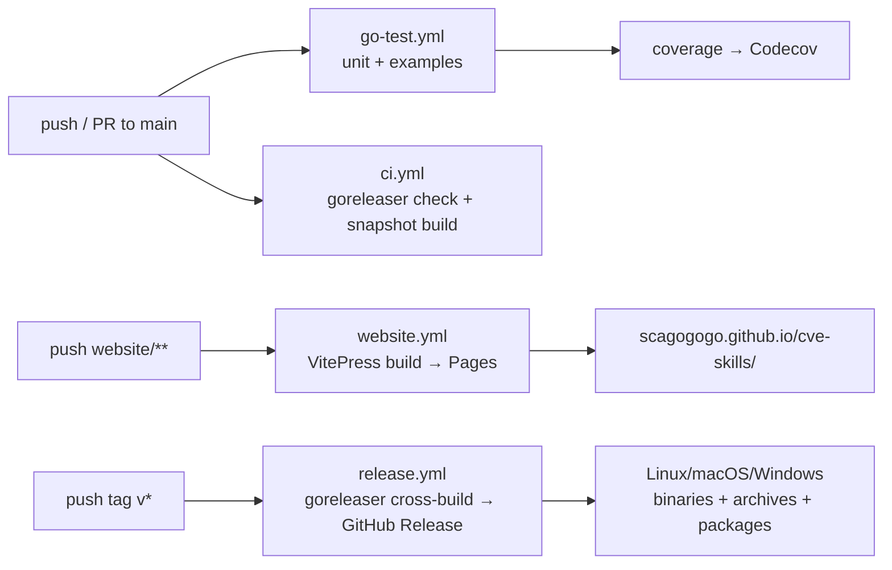

# CI/CD Pipeline

The repository runs four GitHub Actions workflows that together guard `main`, test every change, publish the website, and cut cross-platform releases on tag. This page documents each workflow's trigger, jobs, permissions, and artifacts so contributors know what runs when, and so AI agents can reason about the build pipeline they are operating inside.

:::tip 📂 View Source
All four workflow files live in [`.github/workflows/`](https://github.com/scagogogo/cve-skills/tree/main/.github/workflows):
[`go-test.yml`](https://github.com/scagogogo/cve-skills/blob/main/.github/workflows/go-test.yml) ·
[`ci.yml`](https://github.com/scagogogo/cve-skills/blob/main/.github/workflows/ci.yml) ·
[`website.yml`](https://github.com/scagogogo/cve-skills/blob/main/.github/workflows/website.yml) ·
[`release.yml`](https://github.com/scagogogo/cve-skills/blob/main/.github/workflows/release.yml)
:::

## Pipeline Overview



Four workflows, three triggers, zero overlap:

| Workflow | Trigger | Purpose | Publishes? |
|---|---|---|---|
| `go-test.yml` | any push, any PR | Run unit tests + all examples, upload coverage | No (coverage to Codecov) |
| `ci.yml` | push to `main`, PR to `main` | Validate goreleaser config + single-target snapshot build | No (dry-run only) |
| `website.yml` | push `website/**` to `main`, PR | Build VitePress site, deploy to GitHub Pages | Yes (Pages, on `main` only) |
| `release.yml` | push tag `v*` | Cross-platform goreleaser build + GitHub Release | Yes (Release binaries) |

## go-test.yml — Tests & Coverage

The primary quality gate. Runs on **every** push and every PR, regardless of branch.

:::tip 📂 View Source
[`go-test.yml`](https://github.com/scagogogo/cve-skills/blob/main/.github/workflows/go-test.yml) — 61 lines, two jobs.
:::

**Trigger:** `on: push:` and `on: pull_request:` (no branch filter — fires for every branch).

**Jobs:**

1. **`unit-tests`** (`ubuntu-latest`, Go 1.18) — checks out, sets up Go, runs `go mod download`, then:
   - `go test -v ./...` — runs the 38-test suite verbosely.
   - `go test -race -coverprofile=coverage.txt -covermode=atomic ./...` — re-runs with the race detector and coverage instrumentation.
   - Uploads `coverage.txt` to [Codecov](https://codecov.io) via `codecov-action@v3` (`fail_ci_if_error: false` — a coverage upload failure does not fail the build).

2. **`examples`** (`ubuntu-latest`, Go 1.18, `needs: unit-tests`) — runs only after `unit-tests` passes:
   - Loops over `examples/*/` and runs `go run .` in each directory that has a `main.go`.
   - This guarantees every runnable example in the docs actually compiles and executes — see [Testing Strategy](/guide/testing) for why the examples double as integration tests.

**Permissions:** default (read-only `contents`). No write tokens needed.

**Key design choices:**

- **Two jobs, not one.** Splitting unit tests from examples lets the example job reuse the Go setup cache and fail independently — a broken example does not mask a unit-test failure or vice versa.
- **`-race` only on the coverage run.** The verbose run is plain `go test`; the race detector is expensive, so it runs once on the coverage pass rather than twice.
- **`fail_ci_if_error: false` on Codecov.** Coverage is informational; a Codecov outage should not block a PR.
- **Go 1.18 pinned.** Matches `go.mod`'s `go 1.18` directive exactly, so the CI sees the same language version as local builds.

## ci.yml — goreleaser Guard

A dry-run gate that runs only on `main` (and PRs to `main`). It exists so that a broken `.goreleaser.yaml` is caught on `main`, not on the day someone pushes a release tag.

:::tip 📂 View Source
[`ci.yml`](https://github.com/scagogogo/cve-skills/blob/main/.github/workflows/ci.yml) — 47 lines, one job.
:::

**Trigger:** `on: push: branches: [main]` and `on: pull_request: branches: [main]`.

**Job:** `goreleaser-check` (`ubuntu-latest`, Go 1.18, `fetch-depth: 0`):

1. `goreleaser check` — validates the `.goreleaser.yaml` syntax and config.
2. `goreleaser build --snapshot --clean --single-target` — builds one binary (the runner's native target) without publishing. This proves the build matrix, ldflags, and `main: ./cmd/cve` are all correct.

**Permissions:** `contents: read` only. This workflow never publishes.

**Key design choices:**

- **`fetch-depth: 0`** — goreleaser needs full git history to resolve tags for versioning, even in a dry-run.
- **`--single-target`** — builds only the host platform to keep the job fast (seconds, not minutes). The full cross-platform matrix is exercised only on real releases.
- **No publish step.** The job is pure validation; there is no `release:` or `GITHUB_TOKEN` write. This makes it safe to run on every PR.

## website.yml — Docs Deployment

Builds the VitePress site and deploys it to GitHub Pages at `https://scagogogo.github.io/cve-skills/`.

:::tip 📂 View Source
[`website.yml`](https://github.com/scagogogo/cve-skills/blob/main/.github/workflows/website.yml) — 70 lines, two jobs.
:::

**Trigger:** `on: push: branches: [main]` with `paths: ["website/**", ".github/workflows/website.yml"]`, and the same `paths` filter on PRs. The workflow fires only when website content changes.

**Concurrency:** `group: "pages"`, `cancel-in-progress: false` — page deployments never cancel each other mid-flight; they queue instead.

**Jobs:**

1. **`build`** (`ubuntu-latest`, Node 20):
   - `npm ci` in `website/` (deterministic install from `package-lock.json`).
   - `npm run build` → `vitepress build`, output to `website/.vitepress/dist`.
   - `configure-pages` + `upload-pages-artifact` with `path: website/.vitepress/dist`.

2. **`deploy`** (`ubuntu-latest`, `needs: build`, `if: github.ref == 'refs/heads/main'`):
   - Runs only on `main` pushes (PRs build but do not deploy).
   - `deploy-pages@v4` publishes the artifact to GitHub Pages.

**Permissions:** `contents: read`, `pages: write`, `id-token: write` — the OIDC token is required for the modern `deploy-pages` action.

**Key design choices:**

- **Path filter.** A Go-source-only PR does not trigger a website rebuild, keeping CI fast.
- **PR builds don't deploy.** The `if: github.ref == 'refs/heads/main'` guard means PRs verify the site builds (catching markdown/mermaid errors) without publishing a preview.
- **`cancel-in-progress: false`.** A Pages deploy mid-upload is not interrupted by a new push; the new push waits its turn. This avoids half-deployed sites.

## release.yml — Cross-Platform Release

The only workflow that produces binaries. Triggered by pushing a `v*` tag.

:::tip 📂 View Source
[`release.yml`](https://github.com/scagogogo/cve-skills/blob/main/.github/workflows/release.yml) · [`.goreleaser.yaml`](https://github.com/scagogogo/cve-skills/blob/main/.goreleaser.yaml)
:::

**Trigger:** `on: push: tags: ["v*"]`.

**Job:** `release` (`ubuntu-latest`, Go 1.18, `fetch-depth: 0`):

- Runs `goreleaser/goreleaser-action@v6` with `args: release --clean`.
- goreleaser reads `.goreleaser.yaml` and:
  - Runs `before.hooks` (`go mod tidy`, `go test ./...`).
  - Cross-compiles `./cmd/cve` for **4 OSes × 4 arches** (with some invalid combos ignored) — see [Release & goreleaser](/reference/release).
  - Injects the version into `cve.Version` via ldflags.
  - Produces archives (tar.gz / zip), Linux packages (deb/rpm/apk), a SHA-256 checksums file, and a git-sorted changelog.
  - Publishes a GitHub Release with the binaries attached.

**Permissions:** `contents: write` (to create the Release), `packages: write`.

**Key design choices:**

- **Tag-triggered, not branch-triggered.** Releases happen only when a maintainer pushes `v1.2.3`; no accidental releases from `main` pushes.
- **`fetch-depth: 0`.** goreleaser walks the full history to generate the changelog between the previous tag and the new one.
- **`--clean` removes the `dist/` dir first**, preventing stale artifacts from a previous local run leaking into the release.
- **`prerelease: auto`** in `.goreleaser.yaml` marks pre-release tags (e.g. `v1.2.3-rc1`) automatically.

## How to trigger each workflow

```bash
# go-test.yml — runs automatically on any push or PR
git push origin my-branch
gh pr create

# ci.yml — runs automatically on push to main / PR to main
git push origin main

# website.yml — runs when website/** changes on main
git push origin main   # (only if website/ files changed)

# release.yml — push a v* tag
git tag v1.2.3
git push origin v1.2.3
# → goreleaser builds + publishes a GitHub Release
```

## Local equivalents (no CI needed)

```bash
# Reproduce go-test.yml locally
go test -v ./...
go test -race -coverprofile=coverage.txt -covermode=atomic ./...
go tool cover -func=coverage.txt

# Reproduce ci.yml locally
goreleaser check
goreleaser build --snapshot --clean --single-target

# Reproduce website.yml locally
cd website && npm ci && npm run build
# output in website/.vitepress/dist

# Reproduce release.yml locally (no publish)
goreleaser release --snapshot --clean
```

## Data Flow

```text
+-------------------+        +-------------------+        +-------------------+
|  contributor      |        |  GitHub Actions   |        |  artifacts        |
|  git push / tag   | -----> |  4 workflows      | -----> |  published        |
+-------------------+        +-------------------+        +-------------------+
        |                            |
        |   push any branch          |   go-test.yml  → tests pass? + coverage→Codecov
        |   ---------------          |   ci.yml       → goreleaser config valid?
        |                            |   website.yml  → site builds? → Pages (main only)
        |   push tag v*              |   release.yml  → cross-build → GitHub Release
        v                            v
   +-----------+              +----------------------+
   | trigger   |              | gate: main must be  |
   | routing   |              | green before a tag  |
   +-----------+              | is cut for release  |
                              +----------------------+
```

## Deep Dive

- **Four workflows, not one mega-workflow.** Each concern (test, build-validate, docs, release) is a separate file with its own trigger and permissions. This keeps the blast radius small: a broken `website.yml` cannot fail a Go release, and a flaky `go-test.yml` example does not block a docs deploy.
- **`main` is the gate.** `ci.yml` and `website.yml` deploy/run on `main`; `release.yml` fires on tags. The implicit contract is: keep `main` green, then tag for release — because `release.yml`'s `before.hooks` re-runs `go test ./...`, a tag on a red `main` will fail at release time, not silently ship broken binaries.
- **Go 1.18 everywhere.** All three Go-using workflows pin `go-version: "1.18"`, matching `go.mod`. This guarantees the CI builds against the minimum supported Go version, catching accidental use of newer stdlib features.
- **`fetch-depth: 0` only where needed.** `ci.yml` and `release.yml` need full history (goreleaser tag walking); `go-test.yml` and `website.yml` use the default shallow checkout because they never inspect git history.
- **Permissions are scoped per workflow.** `release.yml` needs `contents: write` + `packages: write`; `website.yml` needs `pages: write` + `id-token: write`; the test workflows need nothing. No workflow has broader permissions than its job requires — a compromised test run cannot push a release.
- **Codecov is `fail_ci_if_error: false`.** Coverage is a signal, not a gate. This is deliberate: a third-party outage should not block merges, and coverage trends are reviewed by humans, not enforced by CI.
- **Examples run in CI as integration tests.** The `examples` job in `go-test.yml` executes every `examples/*/main.go`, which means the 31 documented examples are continuously verified to compile and run. A code change that breaks an example fails CI before it reaches `main`.

## Related

- [Release & goreleaser](/reference/release) — the `.goreleaser.yaml` config in detail (cross-platform matrix, ldflags, archives)
- [Testing Strategy](/guide/testing) — what the `go-test.yml` unit-tests job actually runs
- [Download & Install](/download) — where the release binaries end up for users
- [Version](/api/functions/version) — how `release.yml`'s ldflags injection sets `cve.Version`
