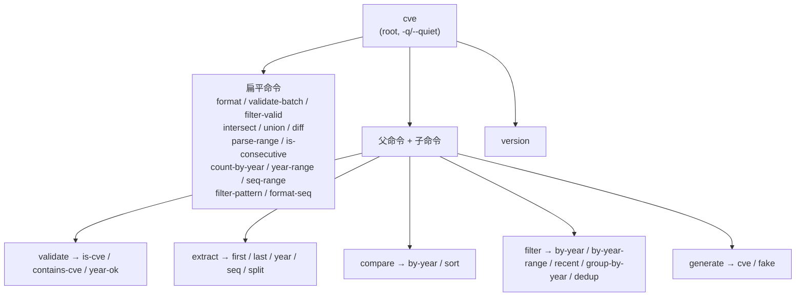
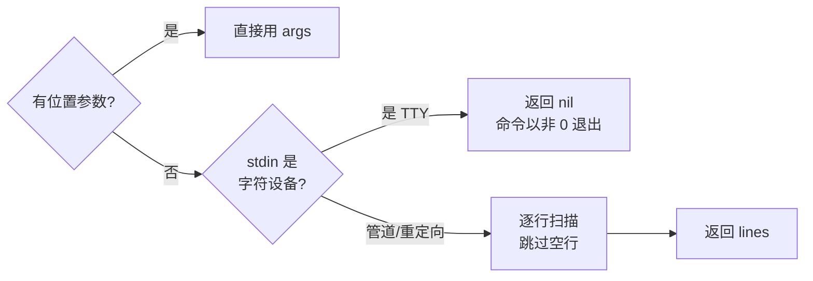
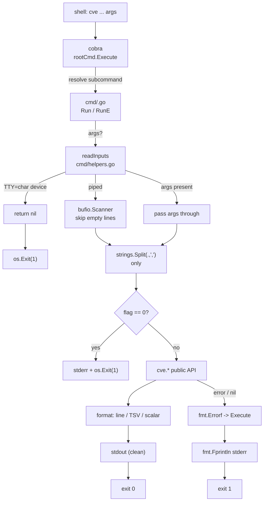

# CLI Conventions

The `cve` command-line tool is a thin wrapper over the library, built with [cobra](https://github.com/spf13/cobra) and organized so that **every subcommand is safe to drive from a script or an AI agent**. The conventions on this page are not accidental — they are enforced uniformly across all 20+ commands in `cmd/`, so once you know them for one command you know them for all. This page is the contract: command hierarchy, stdin fallback, comma-separated lists, exit codes, the `--year`/`--seq` flag style, and the `version` command.

:::tip Who should read this
Developers and AI agents scripting against the `cve` CLI, contributors adding a new subcommand who want it to behave like the rest, and anyone who has been surprised by a CLI that colored its output, prompted interactively, or returned exit code 0 on failure. If you have asked "does this command read stdin?", "why does `--year` use `-y`?", or "what does exit code 1 mean here?", this page is the answer.
:::

## Command hierarchy

The root command is `cve` (defined in `cmd/root.go` as `Use: "cve"`). It carries one persistent flag (`-q, --quiet`) and a long description that embeds the library `Version`. Beneath it, commands fall into three shapes: **flat root commands** (`format`, `validate-batch`, `intersect`, …), **parent-with-subcommands** (`validate` → `is-cve` / `contains-cve` / `year-ok`; `extract` → `first` / `last` / `year` / `seq` / `split`; `compare` → `by-year` / `sort`; `filter` → `by-year` / `by-year-range` / `recent` / `group-by-year` / `dedup`; `generate` → `cve` / `fake`), and **bare group commands** that just print help (`filter`, `generate` call `cmd.Help()` when invoked with no subcommand).



📌 The split between flat and nested is deliberate: commands that take a single homogeneous input (a list, two lists, one CVE) stay flat for shorter pipelines; commands with several *modes* of operating on the same input (`validate` checks three different things, `extract` has five return shapes) nest as subcommands so each mode has its own `Use` line and `--help`.

## stdin support via readInputs

Every input-taking command funnels argument reading through one shared helper, `readInputs` in `cmd/helpers.go`. Its contract is the keystone of the whole CLI:

1. If positional `args` are non-empty, return them as-is — stdin is never touched.
2. Otherwise, stat `os.Stdin`. If it is a character device (a real TTY, no piped input), return `nil` — the command will then exit non-zero.
3. Otherwise (piped or redirected stdin), read line by line with a `bufio.Scanner`, **skipping empty lines**, and return the collected slice.

```go
// cmd/helpers.go — the single input contract for the whole CLI
func readInputs(args []string) []string {
    if len(args) > 0 {
        return args
    }
    stat, _ := os.Stdin.Stat()
    if (stat.Mode() & os.ModeCharDevice) != 0 {
        return nil // no pipe → don't block waiting for a TTY
    }
    var lines []string
    scanner := bufio.NewScanner(os.Stdin)
    for scanner.Scan() {
        line := scanner.Text()
        if line != "" {
            lines = append(lines, line)
        }
    }
    return lines
}
```

🧩 The `os.ModeCharDevice` check is what makes the CLI pleasant interactively: run `cve format` with no args and no pipe and it exits immediately instead of hanging on a blinking cursor waiting for you to type and press Ctrl-D. Run `echo cve-2022-1 | cve format` and it reads the pipe. This is why every command can be used both as a one-shot (`cve extract year CVE-2022-12345`) and as a pipeline stage (`cat list.txt | cve extract year`).



## Comma-separated lists

Commands whose `Use` line shows `<cve-list>` accept **two equivalent list syntaxes** at once: multiple positional arguments (or multiple stdin lines), *and* comma-separated values within any one argument. The mechanism is a one-liner repeated across `cmd/validate_batch.go`, `cmd/stats.go`, `cmd/pattern.go`, and `cmd/set.go`:

```go
var cveList []string
for _, input := range inputs {
    cveList = append(cveList, strings.Split(input, ",")...)
}
```

Because `strings.Split` is applied to *every* input element (whether it came from an arg or a stdin line), the two syntaxes compose freely:

```bash
# All three of these are equivalent for a <cve-list> command:
cve validate-batch "CVE-2022-12345,CVE-1998-1,not-a-cve"
cve validate-batch CVE-2022-12345 CVE-1998-1 not-a-cve
printf 'CVE-2022-12345\nCVE-1998-1\nnot-a-cve\n' | cve validate-batch
```

| Command shape | `Use` line | List syntax | Where it splits on `,` |
| --- | --- | --- | --- |
| `validate-batch` / `filter-valid` | `<cve-list>` | comma + args + stdin | `cmd/validate_batch.go` |
| `count-by-year` / `year-range` | `<cve-list>` | comma + args + stdin | `cmd/stats.go` |
| `seq-range` | `<year> <cve-list>` | comma + args + stdin | `cmd/stats.go` |
| `filter-pattern` | `<pattern> <cve-list>` | comma + args + stdin | `cmd/pattern.go` |
| `intersect` / `union` / `diff` | `<list1> <list2>` | comma within each list | `cmd/set.go` |

⚡ Commands that take **individual CVEs** rather than a list — `format`, `validate`, `extract`, `compare sort`, `filter by-year`, etc. — do *not* split on commas. `cve format "CVE-2022-1,CVE-2022-2"` is one argument and is formatted as one (invalid) string. The comma convention applies only where the `Use` line says `<cve-list>` or `<listN>`.

## Exit codes

The CLI uses exactly two exit codes, and they mean the same thing everywhere:

| Code | Meaning | How it is produced |
| --- | --- | --- |
| `0` | Success (including an **empty result** — no stdout lines, but no error) | normal `Run` return, or `RunE` returning `nil` |
| `1` | Error: missing required flag, no input, invalid argument, or a library call that returned `nil`/failed | `os.Exit(1)` in `Run`, or an `error` from `RunE` caught by `Execute` |

The root command sets `SilenceUsage: true` and `SilenceErrors: true` (`cmd/root.go`), and `Execute` prints the error to stderr itself before exiting 1. The consequence is that **stderr is the only place errors appear** — stdout is never polluted by a usage banner or a cobra error message, which is what lets you pipe `cve …` into another `cve …` and trust stdout to be pure data.

```go
// cmd/root.go — errors go to stderr, stdout stays clean
func Execute() {
    if err := rootCmd.Execute(); err != nil {
        fmt.Fprintln(os.Stderr, err)
        os.Exit(1)
    }
}
```

Two idioms recur for producing exit 1. Commands written with `Run` call `os.Exit(1)` directly when there is no input or a required flag is zero — this is the pattern in `extract`, `format`, `validate`, `compare sort`, and every `filter` subcommand. Commands written with `RunE` (the newer `validate-batch`, `filter-valid`, `filter-pattern`, `format-seq`, set ops, range, and stats commands) return a `fmt.Errorf(...)` instead, which cobra routes through `Execute` to the same `os.Exit(1)`. The two idioms reach the same exit code; `RunE` additionally lets the error message reach stderr uniformly.

⚠️ Note the asymmetry: an **empty result is exit 0**. `cve filter by-year --year 2099 CVE-2022-1` produces no stdout lines but exits 0, because nothing went *wrong* — the filter simply matched nothing. Exit 1 is reserved for "the command could not do its job" (no input, missing flag, unparseable argument), not "the job produced an empty set". Scripts that need to distinguish "no matches" from "error" should check the exit code, not just whether stdout is empty.

## Flag style: --year / --seq and friends

Numeric flags throughout the CLI follow one naming style: a long `--word` form paired with a short `-letter` form, registered with cobra's `IntP` so both work. The flag is **required-by-convention** — it defaults to `0`, and the command checks `if year == 0` and exits 1 with a clear stderr message, rather than relying on cobra's `Required: true` (which prints a usage block to stderr).

| Command | Flags | Short forms | Required-by-convention check |
| --- | --- | --- | --- |
| `filter by-year` | `--year` | `-y` | `if year == 0` → "error: --year is required" |
| `filter by-year-range` | `--start`, `--end` | `-s`, `-e` | `if startYear == 0 \|\| endYear == 0` |
| `filter recent` | `--years` | `-n` | `if years == 0` |
| `generate cve` | `--year`, `--seq` | `-y`, `-s` | `if year == 0 \|\| seq == 0` |
| `validate year-ok` | `--cutoff` | `-c` | optional; `if cutoff > 0` switches behavior |
| root | `--quiet` | `-q` | persistent, optional, suppresses non-essential output |

```go
// cmd/filter.go — the canonical flag registration shape
filterByYearCmd.Flags().IntP("year", "y", 0, "target year (required)")
filterByYearRangeCmd.Flags().IntP("start", "s", 0, "start year (required, inclusive)")
filterByYearRangeCmd.Flags().IntP("end", "e", 0, "end year (required, inclusive)")
filterRecentCmd.Flags().IntP("years", "n", 0, "number of recent years (required)")

// cmd/generate.go — same shape, --year and --seq together
generateCveCmd.Flags().IntP("year", "y", 0, "CVE year (required)")
generateCveCmd.Flags().IntP("seq", "s", 0, "CVE sequence number (required)")
```

🤖 Two conventions are worth memorizing for scripting: (1) `--year` is always `-y` and `--seq` is always `-s` — these are the most-used pair, for `generate cve` and `filter by-year`. (2) A flag defaulting to `0` means *not provided*, because 1999 is the earliest valid CVE year and 0 is never a meaningful year — so the commands use `== 0` as the "absent" sentinel rather than cobra's required-flag machinery. The one flag that is genuinely optional is `--cutoff` on `validate year-ok`: `cutoff > 0` switches from `IsCveYearOk` to `IsCveYearOkWithCutoff`, allowing N years into the future.

## Output shape

Output is deliberately boring and machine-readable. Three shapes cover every command:

| Shape | Commands | Example |
| --- | --- | --- |
| One CVE per line | `format`, `extract` family, `compare sort`, all `filter` subcommands, `filter-valid`, set ops, `parse-range` | `CVE-2022-12345` |
| Tab-separated `field<TAB>value` | `validate` (`cve<TAB>bool`), `validate is-cve`, `validate year-ok`, `extract split` (`year<TAB>seq`) | `CVE-2022-12345\ttrue` |
| Bare scalar | `compare` / `compare by-year` (`-1`/`0`/`1`), `validate contains-cve` (`true`/`false`), `generate cve`, `version` | `-1` |

`validate-batch` is the one command with a richer per-line format: `✓ CVE-2022-12345` for valid, `✗ CVE-1998-1 — year 1998 is before 1999` for invalid (the `—` is an em-dash, the part after it is the `Reason` field from `CveValidationResult`). Booleans are always the literal strings `true` / `false`, never `1`/`0` or `yes`/`no`.

```bash
# Tab-separated, one row per input — easy to cut -f2 for just the boolean
$ cve validate CVE-2022-12345 CVE-1998-12345
CVE-2022-12345	true
CVE-1998-12345	false
```

## version command

`cve version` (defined in `cmd/version.go`) prints exactly one thing: the `cve.Version` string from the library. `Version` is declared as `var Version = "dev"` in `cve.go` — a `var`, not a `const`, specifically so that goreleaser can overwrite it at link time with `-ldflags "-X github.com/scagogogo/cve-skills.Version=v1.2.3"`. A source build (`go build ./cmd/cve`) reports `dev`; a released binary reports the injected semantic version.

```go
// cmd/version.go — the whole command
var versionCmd = &cobra.Command{
    Use:   "version",
    Short: "Print the version number",
    Run: func(cmd *cobra.Command, args []string) {
        fmt.Println(cve.Version)
    },
}
```

✅ Because `version` reads the same `cve.Version` symbol the library exposes, the CLI and the Go API always agree on the version — there is no separate CLI version string to drift out of sync. The root command's long description also embeds `cve.Version`, so `cve --help` shows the version alongside the synopsis.

## Summary

- **Hierarchy**: one root `cve` with a persistent `-q/--quiet`; flat commands for single inputs, nested subcommands for multi-mode operations (`validate`, `extract`, `compare`, `filter`, `generate`), plus a bare `version`.
- **stdin**: `readInputs` returns args if present, else reads piped stdin line-by-line skipping blanks, else returns `nil` when stdin is a TTY — so no command ever hangs waiting for interactive input.
- **Comma lists**: `<cve-list>` / `<listN>` commands split every input on `,` via `strings.Split`, making comma-separated strings, multiple args, and multiple stdin lines fully interchangeable.
- **Exit codes**: `0` for success (including empty results), `1` for any error; `SilenceUsage` + `SilenceErrors` keep all error text on stderr so stdout stays pure data.
- **Flag style**: `--word`/`-letter` via `IntP`, defaulting to `0` and checked by hand for "required"; `--year`/`-y` and `--seq`/`-s` are the canonical pair; `--cutoff`/`-c` is the one truly optional flag.
- **Output**: one-CVE-per-line, tab-separated `field<TAB>value`, or a bare scalar — booleans print as `true`/`false`, never abbreviated.
- **version**: prints `cve.Version` (`dev` from source, injected semver from a release build); the same symbol the library exposes, so CLI and API never disagree.

## Visual Reference

Two complementary views of how a single `cve` invocation flows from the shell to the library: the first is the end-to-end data path through the shared helpers, the second is the runtime call sequence between cobra, `cmd/*.go`, and the `cve` package.

```text
                    argv / stdin
                         |
                         v
              +----------------------+
              |  cobra root command  |   cmd/root.go
              |  (cve, -q/--quiet)   |
              +----------------------+
                         |
            resolves subcommand + flags
                         |
                         v
              +----------------------+
              |  cmd/<name>.go RunE  |   e.g. validate_batch.go
              +----------------------+
                         |
              1. readInputs(args) ----+ (args non-empty? use args)
                         |             | (else: TTY? nil; else: scan stdin)
                         v             |
              +----------------------+ |
              |  normalize list:     | |
              |  strings.Split(",")  | <--' only for <cve-list>/<listN>
              +----------------------+
                         |
              2. required-flag check (if year == 0 -> os.Exit(1))
                         |
                         v
              +----------------------+
              |  cve.* library call   |   e.g. cve.ValidateCveBatch
              +----------------------+
                         |
              3. format output (one-cve/line | TSV | scalar)
                         |
              +--> stdout (pure data)
              +--> stderr (only on error, via Execute)
                         |
                         v
              exit 0 (incl. empty) | exit 1 (any error)
```



## Deep Dive

A few details that the rest of this page glosses over — useful when you are extending the CLI or reasoning about why a pipeline behaves the way it does.

- **`SilenceUsage` + `SilenceErrors` is what makes stdout pipe-safe, not just quiet.** In `cmd/root.go` the root command sets both to `true`, and `Execute` does its own `fmt.Fprintln(os.Stderr, err)` before `os.Exit(1)`. Without `SilenceErrors`, cobra would print a `Error: ...` line and a usage block to **stdout** on any `RunE` error — which would silently corrupt `cve validate-batch A,B | cve filter-valid`. The two flags move all of that to stderr, so stdout is exclusively command output. This is the single most load-bearing line in the whole `cmd/` package for scripting safety.

- **`Run` vs `RunE` is an evolution, not a stylistic split.** The older commands (`extract`, `format`, `validate`, `compare sort`, the `filter` subcommands) use `Run` and call `os.Exit(1)` directly — you can see the repeated `os.Exit(1)` calls at `cmd/filter.go:37,41,62,66,86,90,111,138`. The newer set (`validate-batch`, `filter-valid`, `filter-pattern`, `format-seq`, set ops, range, stats) use `RunE` and return `fmt.Errorf(...)`, letting cobra route the error uniformly through `Execute`. Both reach exit 1, but `RunE` is preferred for new commands because the error message lands on stderr through one path instead of being re-implemented per command. If you are adding a command, model it on `cmd/validate_batch.go`, not `cmd/filter.go`.

- **The `0` sentinel for "flag absent" works because CVE years start at 1999.** Every numeric flag is registered with `IntP(..., 0, ...)` and checked with `== 0`. This is only safe because no valid CVE year is `0` — 1999 is the floor enforced by `cve.IsCveYearOk` — and no sequence number is `0`. It deliberately avoids cobra's `Required: true`, whose failure mode is to print a usage block to stderr (acceptable) but also to surface the error in a way that is harder to customize with the project's `error: --year is required` message style. The one flag that is *not* required is `--cutoff` on `validate year-ok`: `cutoff > 0` is a behavior switch (it selects `IsCveYearOkWithCutoff` over `IsCveYearOk`), not a presence check.

- **`readInputs` deliberately does not distinguish "pipe closed empty" from "TTY".** The `os.Stdin.Stat()` + `os.ModeCharDevice` test identifies a real terminal and returns `nil` so the command exits 1 instead of blocking. But once stdin is a pipe, an *empty* pipe and a pipe with content go through the same `bufio.Scanner` loop and produce `nil` vs a slice respectively — an empty pipe yields zero lines, which most commands then treat as "no input" and exit 1. So `echo -n | cve format` exits 1 (no input), while `cve format` with no pipe also exits 1 — the failure is the same, the *reason* differs (no input vs TTY), and neither hangs. The scanner also skips empty lines (`if line != ""`), so blank lines in a piped list are silently collapsed rather than producing a row of empty output.

- **`version` shares the `cve.Version` symbol so the CLI cannot drift from the library.** `cve.Version` is declared as `var Version = "dev"` in `cve.go` (a `var`, not a `const`, specifically so goreleaser's `-ldflags "-X github.com/scagogogo/cve-skills.Version=..."` can overwrite it at link time). `cmd/version.go` imports the library and does `fmt.Println(cve.Version)` — it does not carry its own version constant. A source build reports `dev` for both the CLI and the API; a released binary reports the injected semver for both. There is no second string to keep in sync, which is why `cve version` and `import "github.com/scagogogo/cve-skills"; cve.Version` always agree.

## Further reading

- [CLI Reference](/cli) — the full per-command reference with example output for all 20+ subcommands.
- [Library Design Philosophy](/guide/library-design) — why the CLI is a thin wrapper that imports the library and calls its public functions directly, never duplicating logic.
- [Error Handling & Edge Cases](/guide/error-handling) — the zero-value convention behind the "empty result is exit 0, error is exit 1" split.
- [Getting Started](/guide/getting-started) — install the CLI and run `cve version` in one command.
- [Download & Install](/download) — prebuilt binaries and the goreleaser ldflags that inject `Version`.
