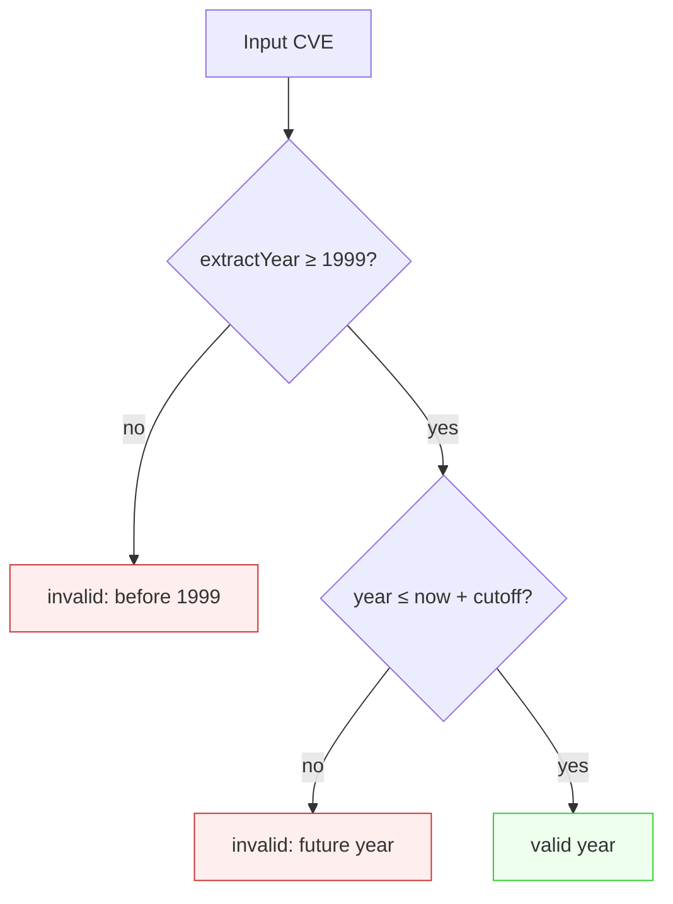
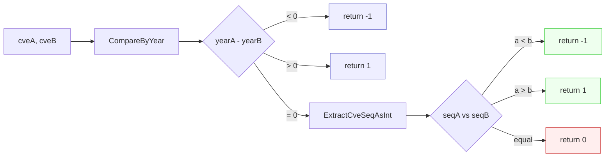

# FAQ

This page answers the questions that come up most often when developers start using the `cve` package and its CLI to process CVE identifiers. The answers are grounded directly in the source: every rule cited here (the 1999 floor, the current-year ceiling, the case-insensitive regex, the stdin fallback) is the actual behavior implemented in `base.go`, `extract.go`, `compare.go`, `filter.go`, `generate.go`, and the `cmd/` CLI. Where a question has a single function or command that answers it, the answer points at it directly so you can read the source yourself.

:::tip Who this is for
Developers integrating the `cve` package or the `cve` CLI into a pipeline who hit an edge case, a validation rejection, or an unexpected comparison result and want the authoritative answer fast. Each Q&A is self-contained, so you can jump to the question that matches your situation.
:::

## Format and validity

### Is `CVE-1999-*` a legal CVE?

Yes. The package's year validation uses `1999` as the inclusive lower bound, and `CVE-1999-*` passes every check that `ValidateCve` enforces.

The CVE Program officially began publishing records in 1999, so `1999` is the earliest year the package will accept. `ValidateCve` rejects anything strictly below 1999 with the reason `year <year> is before 1999`, and `1999` itself is accepted:

```go
// CVE-1999-* is valid: 1999 is the inclusive floor.
cve.ValidateCve("CVE-1999-0001") // true
cve.ValidateCve("CVE-1998-0001") // false, year 1998 is before 1999
```

The floor is hard-coded as the literal `1999` in `base.go` — it is not derived from a configuration or a database lookup, so it does not drift over time.

### Is there a limit on the sequence number's digit count?

No. The sequence number is matched by the regex `\d+`, which has no upper bound on length, and the package stores and compares it as an integer, not as a fixed-width string.

This matters for two reasons. First, real CVE sequence numbers have grown over time and routinely exceed four digits (for example `CVE-2021-44228`). Second, comparing sequence numbers as *strings* is the classic CVE-handling bug: as strings `"9999" > "10000"`, but as integers `9999 < 10000`. The package always converts to `int` before comparing, so it gets this right regardless of digit count:

```go
// No width limit — 4, 5, 6+ digit sequence numbers all compare correctly.
cve.CompareCves("CVE-2022-10000", "CVE-2022-9999") // 1, 10000 > 9999 as integers
cve.ValidateCve("CVE-2022-123456789")              // true (format + year + positive seq)
```

`FormatSeq(cve, width)` is the only function that imposes a width, and it only does so for *display* — it left-pads the sequence with zeros to the requested width without truncating. A sequence longer than `width` is returned unchanged.

### Is matching case-sensitive?

No. CVE matching, validation, extraction, comparison, and deduplication are all case-insensitive, and every public function normalizes to upper-case before returning.

The internal regexes carry the `(?i)` flag, so `cve-2022-12345`, `CVE-2022-12345`, and `CvE-2022-12345` all match. `Format` (which is `strings.ToUpper(strings.TrimSpace(cve))`) is applied at the boundary of every function that compares or keys CVEs, so two inputs differing only in case are treated as the same identifier:

```go
cve.IsCve("cve-2022-12345")               // true
cve.ExtractCve("see cve-2022-12345")      // ["CVE-2022-12345"] (upper-cased)
cve.RemoveDuplicateCves([]string{
    "CVE-2022-1111", "cve-2022-1111",
}) // ["CVE-2022-1111"] — case-insensitive dedup
```

In the CLI, this means you can pipe lower-case input and still get standardized upper-case output.

## Year rules

### Why does the year use the current time?

Because the CVE Program assigns years as records are published, the *current* year is the natural upper bound for a CVE that can plausibly exist today. A CVE dated next year has not been assigned yet.

`ValidateCve` and `validateSingleCve` compute the ceiling at call time as `time.Now().Year()`, and reject a year strictly above it:

```go
currentYear := time.Now().Year()
if yearInt > currentYear {
    result.Reason = fmt.Sprintf("year %d is after current year %d", yearInt, currentYear)
}
```

This is a sanity check, not a security policy — its job is to catch typos and mis-pasted numbers like `CVE-2202-1234`. The consequence is that the *same* input can validate differently depending on when you run it: `CVE-2025-0001` is invalid in 2024 and valid in 2025. If you need deterministic behavior across time or environments, pin the upper bound explicitly with `IsCveYearOkWithCutoff` and a fixed cutoff.

### How do I handle future CVEs?

Use `IsCveYearOkWithCutoff(cve, cutoff)`, which extends the ceiling by `cutoff` years. It accepts a year up to and including `time.Now().Year() + cutoff`.

```go
// In 2024: 2024 + 5 = 2029 is the ceiling.
cve.IsCveYearOkWithCutoff("CVE-2026-12345", 5) // true (2026 <= 2029)
cve.IsCveYearOkWithCutoff("CVE-2031-12345", 5) // false (2031 > 2029)
cve.IsCveYearOk("CVE-2026-12345")              // false (2026 > 2024, no cutoff)
```

Use cases for the cutoff include processing reserved or pre-publication CVE IDs, ingesting feeds that announce next-year assignments early, and writing tests that should not flip from green to red on January 1st. Note that `IsCveYearOk` is just `IsCveYearOkWithCutoff(cve, 0)` — the cutoff-free form is the zero-offset special case.

The decision flow for a year check is:



### What about the lower bound — can I change 1999?

No. The `1999` floor is a literal constant in `base.go`, not a parameter. There is no `WithMinYear` variant. This is intentional: the CVE Program did not exist before 1999, so any year below that is unambiguously malformed.

If you have a dataset that genuinely predates CVE (for example, a legacy advisory database using its own `CVE-1998-*`-style IDs), the right move is to filter those out before handing the list to the package, or to use `IsCve` for a *format-only* check that skips the year rule entirely:

```go
// Format-only check: passes regardless of year, as long as the shape is right.
cve.IsCve("CVE-1998-12345") // true (format ok, year not checked)
cve.ValidateCve("CVE-1998-12345") // false (year < 1999)
```

## CLI behavior

### How does the CLI read from stdin?

When you invoke a command with no positional arguments and stdin is piped (not a terminal), the CLI reads CVE identifiers from stdin, one per line. Empty lines are skipped. If you pass arguments, they are used directly and stdin is ignored.

This is implemented once in `readInputs` and shared by every input-accepting subcommand (`validate`, `format`, `extract`, `compare`, `filter`, etc.):

```go
func readInputs(args []string) []string {
    if len(args) > 0 {
        return args
    }
    stat, _ := os.Stdin.Stat()
    if (stat.Mode() & os.ModeCharDevice) != 0 {
        return nil // interactive terminal, no piped input
    }
    var lines []string
    scanner := bufio.NewScanner(os.Stdin)
    for scanner.Scan() {
        line := scanner.Text()
        if line != "" {
            lines = append(lines, line)
        }
    }
    return lines
}
```

The character-device check means the CLI will not hang waiting for you to type into an interactive shell — it only reads stdin when something is actually piped in. Practical patterns:

```bash
# Pipe a file of CVEs, one per line
cat cves.txt | cve validate

# Extract from an advisory on stdin
grep -i cve advisory.txt | cve extract

# Mix: arguments take precedence over stdin
cve validate CVE-2022-12345 < extra.txt   # only CVE-2022-12345 is validated
```

### Is the CLI case-sensitive?

No — the CLI inherits the library's case-insensitivity. Every input is passed through `Format` (upper-case + trim) before output, so lower-case or mixed-case input comes back standardized:

```bash
$ echo "cve-2022-12345" | cve validate
CVE-2022-12345	true

$ cve format cve-2022-12345
CVE-2022-12345
```

This also means deduplication-style commands (`cve set union`, `cve set diff`) treat `CVE-2022-1111` and `cve-2022-1111` as the same identifier, matching the library behavior.

### Does the CLI validate the year, or just the format?

It depends on which subcommand you run. The table below maps the common checks to their commands:

| Command | What it checks | Rejects year &lt; 1999? | Rejects future year? |
| --- | --- | --- | --- |
| `cve validate` | format + year + positive seq | yes | yes (current year) |
| `cve validate is-cve` | format only | no | no |
| `cve validate contains-cve` | substring match only | no | no |
| `cve validate year-ok` | year range only | yes | yes, unless `--cutoff` |

So `cve validate is-cve CVE-1998-12345` returns `true` (format is correct) while `cve validate CVE-1998-12345` returns `false` (year fails). Choose the command that matches the strictness you want.

## Generation and ranges

### Does `GenerateCve` validate the year?

No. `GenerateCve(year, seq)` formats the two integers into `CVE-<year>-<seq>` and returns it without any year or sequence sanity check. It will happily produce `CVE-1800-0` or `CVE-9999-0`:

```go
cve.GenerateCve(2022, 12345) // "CVE-2022-12345"
cve.GenerateCve(1800, 0)     // "CVE-1800-0" — no validation
```

This is by design: `GenerateCve` is a *formatter*, not a validator. If you need a valid CVE, run the result through `ValidateCve`:

```go
id := cve.GenerateCve(year, seq)
if !cve.ValidateCve(id) {
    // reject or fix
}
```

### What does `GenerateFakeCve` produce?

A fake CVE using the current year and a random sequence number in the range `[10000, 99999]`. The randomness comes from `time.Now().Nanosecond() % 90000`, so it is not cryptographically random and not guaranteed unique — it is intended only for tests, demos, and placeholder data:

```go
cve.GenerateFakeCve() // e.g. "CVE-2024-54321" (current year, random 5-digit seq)
```

Because it uses the current year, a fake CVE passes `IsCve` (format) but you should not rely on it for anything that pretends to be a real assignment.

### How are CVE ranges expanded?

`ParseCveRange(expr)` expands a range expression into the full list of CVEs in the closed interval `[start, end]`. It supports three syntaxes, all within the same year:

```go
cve.ParseCveRange("CVE-2022-12345 to CVE-2022-12347")
// ["CVE-2022-12345", "CVE-2022-12346", "CVE-2022-12347"]

cve.ParseCveRange("CVE-2022-12345..12347")  // double-dot
cve.ParseCveRange("CVE-2022-12345-12347")   // hyphen
```

The start and end must share the same year, and the start sequence must be less than or equal to the end sequence; otherwise the function returns `nil`. This is the function to reach for when an advisory says "CVE-2022-12345 through CVE-2022-12350" and you need the individual IDs.

## Summary

- `CVE-1999-*` is valid: `1999` is the inclusive lower bound, hard-coded in `base.go`.
- The sequence number has no digit limit; the package compares it as an integer, so `10000 > 9999` is correct.
- All matching is case-insensitive (`(?i)` regex) and outputs are upper-cased by `Format`.
- The year ceiling is `time.Now().Year()`; for future years use `IsCveYearOkWithCutoff(cve, cutoff)`.
- The CLI reads stdin line-by-line when no arguments are given and stdin is piped; empty lines are skipped.
- `GenerateCve` does not validate — pair it with `ValidateCve` if you need a real CVE.
- `ParseCveRange` expands `to` / `..` / hyphen ranges into a closed interval within one year.

## Visual Reference

Two complementary views of how a single CVE travels through the package's validation pipeline, from raw input to a normalized, comparable result.

### ASCII flow: input-to-result pipeline

```text
+------------------+      +------------------+      +-----------------------+
| raw input string | ---> | Format()         | ---> | exactCveRegex (?i)    |
| " cve-2022-12345"|      | ToUpper + Trim   |      | ^\s*CVE-\d+-\d+\s*$   |
+------------------+      +------------------+      +-----------+-----------+
                                                                |
                                          +---------------------v----------------------+
                                          | IsCve() true?                            |
                                          |   no  --> invalid CVE format             |
                                          |   yes --> Split() -> year, seq           |
                                          +---------------------+--------------------+
                                                                |
                                          +---------------------v----------------------+
                                          | Atoi(year), Atoi(seq)                    |
                                          |   err  --> year/seq not a valid number   |
                                          +---------------------+--------------------+
                                                                |
                                          +---------------------v----------------------+
                                          | year checks                              |
                                          |   yearInt < 1999      --> before 1999    |
                                          |   yearInt > now+cut   --> future year    |
                                          +---------------------+--------------------+
                                                                |
                                          +---------------------v----------------------+
                                          | seqInt <= 0 ? --> seq must be positive   |
                                          +---------------------+--------------------+
                                                                |
                                          +---------------------v----------------------+
                                          | valid == true; output is upper-cased     |
                                          | ready for CompareCves / SortCves         |
                                          +------------------------------------------+
```

`Format` runs at every boundary, so the same normalization that lets `IsCve` accept leading/trailing whitespace is also what makes downstream comparison and dedup case-insensitive.

### Mermaid flow: comparison and ordering state machine



`CompareCves` short-circuits on year before ever touching the sequence number, and within a year it compares `int` sequence values — so the ordering matches the CVE Program's own chronological intent, not a naive string sort.

## Deep Dive

- **The 1999 floor is a literal, not a parameter.** `IsCveYearOkWithCutoff` (base.go) encodes the lower bound as the bare literal `1999` inside `year >= 1999 && year <= time.Now().Year()+cutoff`. There is no `minYear` field, no constructor option, and no `WithMinYear` variant — the floor cannot be relaxed without editing the source. `ValidateCve` and `validateSingleCve` independently re-derive the same `1999` and the same `time.Now().Year()` ceiling, so the library and the year-check helpers stay in lockstep by construction, not by shared state.

- **Comparison is integer-based end to end.** `CompareCves` (compare.go) never compares the raw string tokens. It routes through `ExtractCveYearAsInt`/`ExtractCveSeqAsInt`, which `Atoi` the segments, so `CVE-2022-10000` correctly sorts after `CVE-2022-9999`. `SortCves` then drives `sort.Slice` with `CompareCves(...) < 0` as the less-than predicate, giving the documented `O(n log n)` ordering. The practical payoff: feeding a mixed list like `["CVE-2022-2222", "cve-2020-1111", "CVE-2022-1111"]` yields `["CVE-2020-1111", "CVE-2022-1111", "CVE-2022-2222"]` with case normalized to upper-case as a side effect of the per-element `Format` pass.

- **Validation has three independent failure axes, not one.** `validateSingleCve` returns a `CveValidationResult` whose `Reason` distinguishes `invalid CVE format` (regex miss), `year is not a valid number` / `sequence number is not a valid number` (Atoi failure), `year <d> is before 1999`, `year <d> is after current year <d>`, and `sequence number must be positive`. Each axis is checked in sequence and short-circuits, so a malformed ID never reaches the year logic and a bad year never reaches the sequence check. `ValidateCve` is the boolean projection of the same pipeline (returns `false` on any axis), which is why `ValidateCve` and `ValidateCves`/`validateSingleCve` can disagree only on *detail*, never on the verdict.

- **`GenerateCve` and `ValidateCve` are deliberately decoupled.** `GenerateCve(year, seq)` is a pure `fmt.Sprintf`-style formatter with no guards, so it will emit `CVE-1800-0` or `CVE-9999-0`. The split between generation and validation is intentional: builders that compose IDs from parsed advisory fields can produce a candidate first and run `ValidateCve` as a separate gate. Treating them as one function would force every internal caller that already knows its inputs are valid to pay for redundant checks.

- **The CLI's stdin contract is a single shared helper, not per-command logic.** `readInputs` (cmd/) applies one rule everywhere — arguments win, otherwise a `os.ModeCharDevice` check decides whether stdin is a pipe, and only then does it scan line-by-line dropping empties. Because the library's `Format` is applied at output time, the CLI gets case-insensitive, whitespace-tolerant input for free across `validate`, `format`, `extract`, `compare`, `filter`, and the `set` subcommands without each command re-implementing normalization.

## Further reading

- [Format function reference](/api/functions/format)
- [ValidateCve function reference](/api/functions/validate-cve)
- [IsCveYearOkWithCutoff function reference](/api/functions/is-cve-year-ok-with-cutoff)
- [ExtractCve function reference](/api/functions/extract-cve)
- [CompareCves function reference](/api/functions/compare-cves)
- [GenerateCve function reference](/api/functions/generate-cve)
- [ParseCveRange function reference](/api/functions/parse-cve-range)
- [Year rules guide](/guide/year-rules)
- [Formatting & normalization guide](/guide/formatting-normalization)
- [Validation strategy guide](/guide/validation-strategy)
- [Migration guide](/reference/migration)
