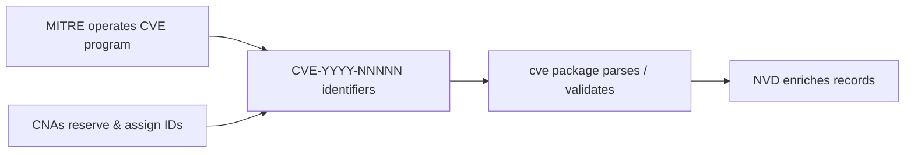
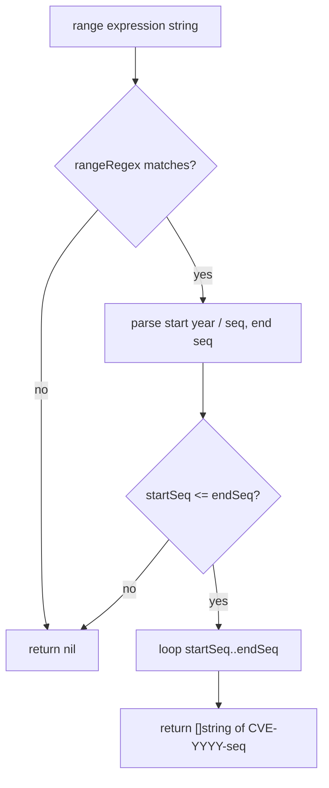
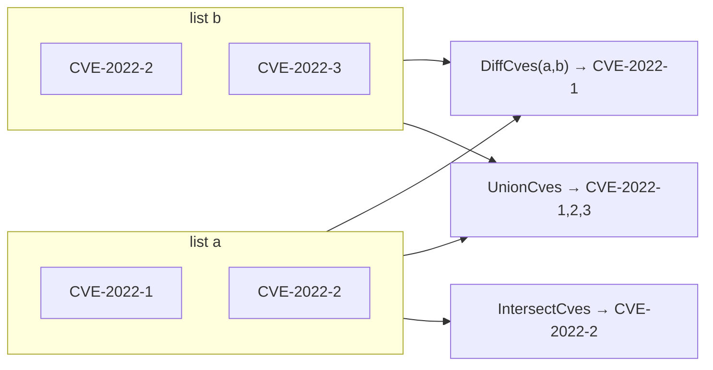
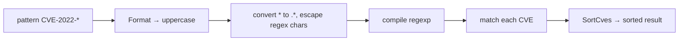
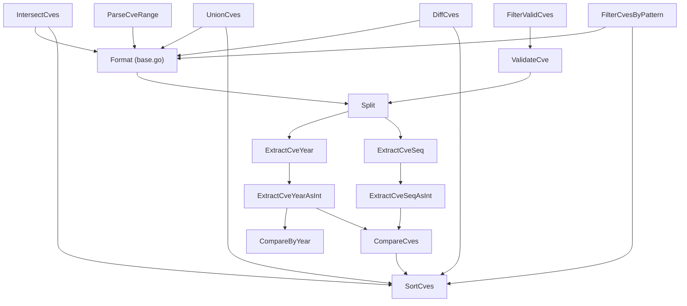

# Glossary

📌 This glossary defines the recurring terms used across the `cve` package, its CLI, and this documentation site. Each entry pairs a plain-language explanation with the concrete source location or function where the concept is implemented, so you can jump from a term to the exact behavior. Read this page whenever a guide or API page references a concept you want to verify against the code.

:::tip Who this is for
Newcomers to the CVE ecosystem who need a single place to look up acronyms (CVE, CNA, MITRE, NVD), and developers who want to map each term to the specific Go function or regex that encodes it.
:::

## CVE, MITRE, NVD, and CNA

These four names describe the ecosystem the `cve` package operates in. They are not invented by this library — they are real-world organizations and identifiers — but several functions assume you understand them.

- **CVE** — Common Vulnerabilities and Exposures. A publicly cataloged list of security vulnerabilities, each identified by a string of the form `CVE-YYYY-NNNNN`. The `cve` package models this string as its core data type; every function in `base.go`, `extract.go`, `compare.go`, `filter.go`, and `generate.go` accepts, returns, or manipulates CVE identifiers.
- **MITRE** — The organization that operates the CVE program on behalf of the U.S. government. MITRE assigns and reserves CVE IDs and publishes the format specification the package follows. The hard-coded lower year bound `1999` in `base.go` reflects the year MITRE began publishing under the `CVE-YYYY-NNNNN` syntax.
- **NVD** — National Vulnerability Database, maintained by NIST. The NVD enriches CVE records with impact scores and references; it consumes the same `CVE-YYYY-NNNNN` identifiers this package parses, so data exported by `SortCves` or `UnionCves` is directly consumable by NVD-oriented tooling.
- **CNA** — CVE Numbering Authority. An organization authorized by MITRE to assign CVE IDs within a reserved scope. The `cutoff` parameter on `IsCveYearOkWithCutoff` exists precisely because CNAs reserve blocks of IDs in advance of public disclosure.



📌 Throughout the docs, "CVE" refers to both the program and an individual identifier; the surrounding sentence disambiguates which.

## Year and Sequence Number

A CVE identifier has exactly two variable parts separated by hyphens: the year and the sequence number. The package treats them as independently extractable, comparable, and filterable fields.

```text
CVE - 2022 - 12345
 │     │      │
 │     │      └─ sequence number (NNNNN+)
 │     └──────── year (YYYY)
 └────────────── fixed prefix "CVE"
```

- **Year (年份 / YYYY)** — A four-digit calendar year. `ExtractCveYear` returns it as a string, `ExtractCveYearAsInt` returns it as an `int`. Valid years must satisfy `year >= 1999 && year <= time.Now().Year()` (see `IsCveYearOkWithCutoff` in `base.go`). An invalid format yields year `0`.
- **Sequence number (序列号 / NNNNN)** — A positive integer assigned within a year. `ExtractCveSeq` returns the string form, `ExtractCveSeqAsInt` returns an `int` (`0` on parse failure). `ValidateCve` rejects sequence numbers that are not positive integers via `seqInt <= 0`.

| Concept | String accessor | Int accessor | Invalid-input sentinel |
| --- | --- | --- | --- |
| Year | `ExtractCveYear` | `ExtractCveYearAsInt` | `""` / `0` |
| Sequence number | `ExtractCveSeq` | `ExtractCveSeqAsInt` | `""` / `0` |
| Both | `Split` returns `(year, seq)` | — | both `""` |

🧩 `Split` is the lower-level primitive both extractors build on: it upper-cases the input via `Format`, splits on `"-"`, and returns the two parts only when exactly three segments exist.

## Range Expression

A range expression denotes a contiguous block of CVE IDs within a single year. The `ParseCveRange` function in `generate.go` accepts three syntactic variants, all matched by a single compiled regex:

- `CVE-2022-12345 to CVE-2022-12350` — the word `to` between two full IDs.
- `CVE-2022-12345..12350` — double-dot shorthand, end given as a bare sequence.
- `CVE-2022-12345-12350` — hyphen shorthand, end given as a bare sequence.

```go
var rangeRegex = regexp.MustCompile(`(?i)^\s*CVE-(\d+)-(\d+)\s*(?:to\s*CVE-\d+-(\d+)|\.\.(\d+)|\s*-\s*(\d+))\s*$`)
```

Parsing rules, taken directly from `ParseCveRange`:

1. The start and end must share the **same year** — the regex captures only one year group.
2. The start sequence must be **less than or equal to** the end sequence; otherwise the function returns `nil`.
3. The range is a **closed interval** — both endpoints are included in the returned slice.

`IsCvesConsecutive` is the related boolean check: two IDs are consecutive when they share a year and their sequence numbers differ by exactly `1`.



## Intersection, Union, and Difference

Set operations over CVE lists are implemented in `filter.go` and behave like their mathematical namesakes, with three shared conventions enforced by every implementation:

- **Case-insensitive comparison** — all inputs pass through `Format`, so `"cve-2022-1"` and `"CVE-2022-1"` are the same element.
- **Deduplication** — results never contain duplicates; an internal `seen` map or set map guards against them.
- **Sorted output** — each function ends with `return SortCves(result)`, so the returned slice is ordered by year then sequence.

| Operation | Function | Definition |
| --- | --- | --- |
| Intersection | `IntersectCves(a, b)` | elements present in **both** `a` and `b` |
| Union | `UnionCves(a, b)` | elements present in **either** `a` or `b` |
| Difference | `DiffCves(a, b)` | elements in `a` **but not** in `b` |



⚠️ `DiffCves` is directional: `DiffCves(a, b)` returns IDs in `a` that are missing from `b`, **not** the symmetric difference. Swapping the arguments gives a different result.

## Normalization

Normalization is the process of converting a CVE string into a single canonical form. In this package it always means **upper-casing and trimming surrounding whitespace**, performed by `Format` in `base.go`:

```go
func Format(cve string) string {
	return strings.ToUpper(strings.TrimSpace(cve))
}
```

Every public function that accepts or returns CVE strings calls `Format` internally, so the in-memory representation is consistently uppercase regardless of input casing. The two validating regexes encode the same expectation:

- `exactCveRegex` matches `^\s*CVE-\d+-\d+\s*$` (case-insensitive), used by `IsCve`.
- `containsCveRegex` matches `CVE-\d+-\d+` (case-insensitive), used by `IsContainsCve`.

🤖 A related, narrower operation is `FormatSeq`, which pads the sequence number to a fixed width with leading zeros (e.g. `CVE-2022-123` → `CVE-2022-000123` at width `6`). It normalizes width, not casing.

| Function | What it normalizes | Output example |
| --- | --- | --- |
| `Format` | case + surrounding spaces | `" cve-2022-1 "` → `"CVE-2022-1"` |
| `FormatSeq` | sequence-number width | `CVE-2022-123`, width `6` → `CVE-2022-000123` |

## Wildcard Pattern

A wildcard pattern is a glob-like filter string accepted by `FilterCvesByPattern` in `extract.go`. Only one metacharacter is supported: `*`, which matches any run of characters. The implementation converts the pattern into a regular expression and matches it against each CVE.

- `CVE-2022-*` — all IDs whose year is `2022`.
- `CVE-*-1234` — all IDs whose sequence is `1234`, any year.
- `CVE-2022-1*` — all `2022` IDs whose sequence starts with `1`.

Internally, `*` becomes `.*`, and regex metacharacters such as `.`, `+`, `(`, `)`, `[`, `]`, `{`, `}`, `\`, `^`, `$`, `|` are escaped so they match literally. The result is sorted via `SortCves`.



⚡ Patterns are auto-formatted to uppercase, so `"cve-2022-*"` and `"CVE-2022-*"` are equivalent.

## Summary

- **CVE / MITRE / NVD / CNA** define the ecosystem; the package's hard-coded `1999` floor and `cutoff`-based future tolerance both stem from how MITRE and CNAs operate.
- **Year** and **sequence number** are the two variable fields of a CVE, exposed by `ExtractCveYear`/`ExtractCveSeq` and their `AsInt` variants, with `Split` as the shared primitive.
- A **range expression** is one contiguous, same-year block expanded by `ParseCveRange` into an inclusive list of IDs.
- **Intersection, union, and difference** are case-insensitive, deduplicating set operations that return sorted slices.
- **Normalization** (`Format`) upper-cases and trims every CVE so internal data is canonical; `FormatSeq` additionally pads sequence-number width.
- A **wildcard pattern** uses `*` as its only metacharacter and is compiled to a regex by `FilterCvesByPattern`.

## Visual Reference

The first diagram traces the life of a single CVE string as it flows through the package, from raw input to a sorted, deduplicated output. It shows where `Format` is applied (every entry point), where the year/sequence split happens, and which functions are terminal validators versus transformers.

```text
                 raw input string
                        |
            +-----------+-----------+
            |                       |
        IsCve?                IsContainsCve?
   exactCveRegex           containsCveRegex
            |                       |
        +---+---+               ExtractCve
        |       |             (cveRegex + Format)
       yes      no                  |
        |       |             +-----+-----+
   ValidateCve  |             |           |
   year>=1999   |        ExtractCveYear  ExtractCveSeq
   seq>0        |        / ExtractCveYearAsInt / ExtractCveSeqAsInt
        |       |             |           |
        v       v             v           v
   FilterValidCves        Split (shared primitive, Format + split on "-")
        |                       |
        +-----------+-----------+
                    |
            SortCves (CompareCves: year, then seq)
                    |
                    v
        sorted, uppercase, deduplicated []string
```

The second diagram maps the call graph among the public functions so you can see which helpers delegate to which. `Split` and `Format` sit at the center; the set operations in `filter.go` and the range/wildcard paths in `generate.go`/`extract.go` all converge on `SortCves` for output ordering.



## Deep Dive

- **`Format` is the single chokepoint for casing.** Every public function that touches a CVE string calls `Format` (a one-liner: `strings.ToUpper(strings.TrimSpace(cve))` in `base.go`). This means callers never need to pre-normalize — `IntersectCves`, `UnionCves`, `DiffCves`, `FilterCvesByPattern`, and `SortCves` each apply `Format` to every element on entry, so `"cve-2022-1"` and `"CVE-2022-1"` are indistinguishable by the time any comparison runs. The trade-off is that `Format` runs more than strictly necessary (e.g. `ExtractCveYearAsInt` re-checks `IsCve` then calls `Split`, which itself calls `Format` again), but the cost is negligible against the safety of guaranteed-canonical internal state.
- **Two-tier validation: format vs. semantics.** `IsCve` is a pure regex test against `exactCveRegex` (`^\s*CVE-\d+-\d+\s*$`, case-insensitive) — it accepts any digit run, including `CVE-0000-0` or `CVE-9999-000`. `ValidateCve` layers semantics on top: after `IsCve` passes, it enforces `yearInt >= 1999 && yearInt <= time.Now().Year() && seqInt > 0`. `validateSingleCve` (used by `ValidateCves`) walks the same checks in order and emits a `Reason` string at each failure point — format, year-numeric, seq-numeric, year-before-1999, year-after-current, seq-not-positive — which is why batch validation produces actionable per-item diagnostics while the boolean `ValidateCve` collapses all of those into `false`.
- **Asymmetric `DiffCves` and the `seen`-map idiom.** `DiffCves(a, b)` builds a `bSet` from `b`, then walks `a` keeping only elements absent from `bSet`, and additionally guards against duplicates within `a` itself via `aSeen`. Because membership is tested against the formatted (uppercased) key, the result is case-stable. `IntersectCves` uses the same pattern but with `set` built from `a` and `seen` tracking outputs; `UnionCves` uses a single `set` as both membership and dedup guard. All three finish with `return SortCves(result)`, which is why every set operation's output is sorted even though none of them sort internally during accumulation.
- **`ParseCveRange` is regex-driven, not tokenizer-driven.** A single compiled `rangeRegex` with three alternations (`to CVE-...`, `..NNNNN`, `-NNNNN`) captures the end sequence into capture groups 3, 4, or 5 respectively; the function then picks the first non-empty group. The start year is captured once (group 1), which is how the same-year constraint is enforced structurally rather than by a runtime check. The closed-interval expansion (`make([]string, count)` then a `for i := 0; i < count; i++` loop calling `GenerateCve`) pre-allocates the exact slice length, avoiding repeated growth — a small but deliberate optimization for large ranges.
- **`CompareCves` ordering and the `CompareByYear` shortcut.** `CompareCves` first delegates to `CompareByYear`, which is literally `ExtractCveYearAsInt(cveA) - ExtractCveYearAsInt(cveB)` — returning the raw year difference, not just a sign. `CompareCves` collapses that to `{-1, 0, 1}` and only falls through to sequence comparison when years are equal. `SortCves` then calls `sort.Slice` with `CompareCves(...) < 0` as the less-than predicate. Invalid inputs degrade gracefully: `ExtractCveYearAsInt` returns `0` for non-`IsCve` strings, so malformed entries sort to the front rather than crashing the comparator.

## Further Reading

- [Format & Validation](/api/format-validate) — `Format`, `IsCve`, `ValidateCve`, and the regexes behind normalization.
- [Extraction Methods](/api/extract) — `ExtractCve`, `ExtractCveYear`, `ExtractCveSeq`, and `FilterCvesByPattern`.
- [Range & Pattern](/api/range-pattern) — `ParseCveRange` and the three range syntaxes.
- [Set Operations](/api/set-operations) — `IntersectCves`, `UnionCves`, `DiffCves`.
- [Year Validation Rules](/guide/year-rules) — the rationale for the `1999` floor and `time.Now()` ceiling.
