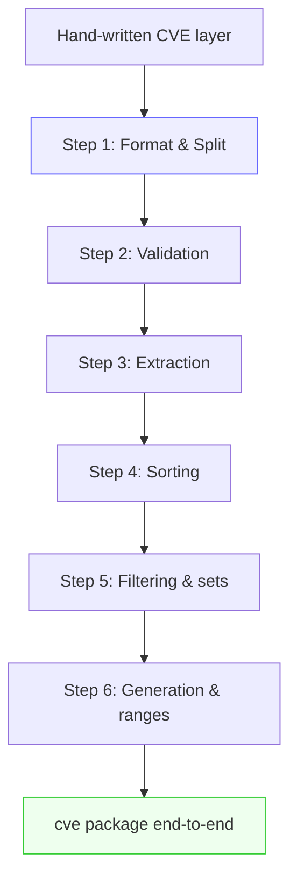
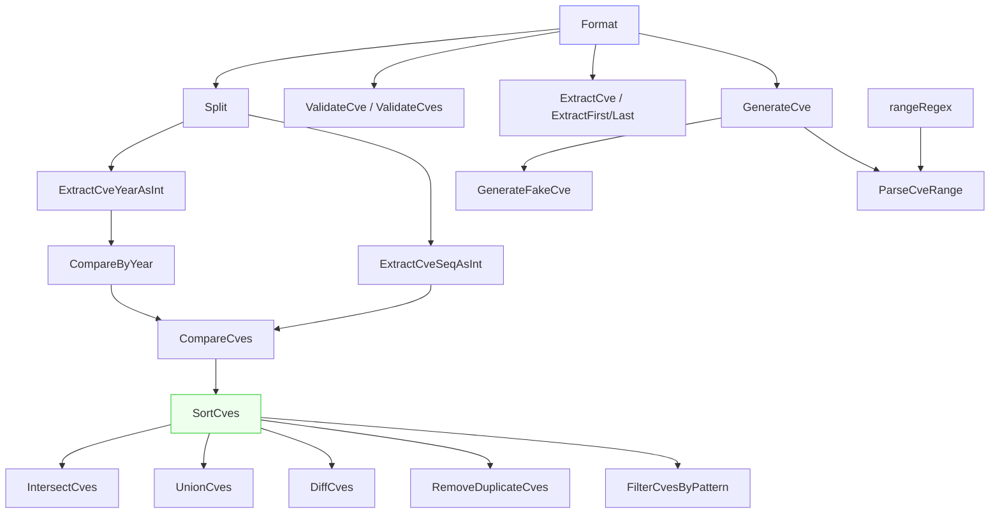

# Migration Guide

Most projects that touch CVE identifiers grew their own ad-hoc handling long before they reached for a library: a `strings.ToUpper` here to normalize case, a `strings.Split(s, "-")` there to pull out the year, a hand-rolled `sort.Slice` with a bespoke comparator, and a copy-pasted regex to fish CVEs out of advisory text. Each snippet is small and harmless in isolation, but together they form a scattered, duplicated, under-tested CVE layer that quietly breaks on edge cases — case-insensitive duplicates that survive deduplication, sequence numbers compared as strings so `"9999" > "10000"`, year validation that forgets the 1999 floor. This page maps those hand-written patterns onto the `cve` package one by one, so you can migrate incrementally and delete code as you go.

:::tip Who this is for
Developers who already have working CVE-handling code in their own codebase (string munging, regex extraction, manual sorting) and want to replace it with the `cve` package without changing behavior. Each section is self-contained, so you can migrate one pattern at a time.
:::

## Why migrate

Hand-written CVE logic tends to be correct for the inputs its author tested and wrong for the inputs they did not think of. The `cve` package encodes the conventions that are easy to miss:

| Concern | Typical hand-written code | Hidden trap | What the package does |
| --- | --- | --- | --- |
| Case + whitespace | `strings.ToUpper(strings.TrimSpace(s))` | None for this operation — but callers forget to apply it consistently before comparing | `Format` is applied internally by every compare/dedupe/filter path |
| Year + seq split | `strings.Split(s, "-")` then index `[1]`/`[2]` | Panic or empty string on malformed input; no length guard | `Split` returns `"", ""` for non-CVE input, never panics |
| Validation | `regexp.MatchString` inline | Forgets the 1999 floor, the current-year ceiling, and the positive-sequence rule | `ValidateCve` / `ValidateCves` enforce all three rules |
| Extraction | A local `regexp.MustCompile` | Forgets to upper-case matches; no shared pattern | `ExtractCve` returns upper-canned, deduplicated-order results |
| Sorting | `sort.Slice` with a comparator built from `Split` | String comparison of sequence numbers: `"9999" > "10000"` | `SortCves` compares years then sequence numbers as integers |
| Deduplication | `map[string]struct{}` on raw input | `cve-2022-1111` and `CVE-2022-1111` both survive | `RemoveDuplicateCves` keys on `Format(cve)` |

The migration is rarely a single big-bang rewrite. The sections below are ordered so that you can replace the lowest-level helpers first (`Format`, `Split`, validation), then the higher-level ones (extraction, sorting, set operations) on top of a stable foundation.



## Replace case and whitespace handling with Format

The single most common hand-written line in CVE code is `strings.ToUpper(strings.TrimSpace(cve))`. The package's `Format` is exactly that line, wrapped and named so the intent is obvious at the call site.

| Hand-written | Migrated |
| --- | --- |
| `strings.ToUpper(strings.TrimSpace(s))` | `cve.Format(s)` |
| `strings.ToUpper(s)` (forgot to trim) | `cve.Format(s)` (trims too) |
| `strings.TrimSpace(s)` then `ToUpper` later | `cve.Format(s)` (one call) |

```go
// Before: scattered, easy to forget one half.
func normalize(s string) string {
    return strings.ToUpper(strings.TrimSpace(s))
}

// After: one named call, identical behavior.
func normalize(s string) string {
    return cve.Format(s)
}
```

A subtle reason to centralize on `Format` even when the body is trivial: the rest of the package keys comparison, deduplication and grouping on `Format(cve)`. If your codebase calls `Format` at the boundary and then passes the canonical value down, every downstream `cve` function behaves consistently without re-normalizing.

Note what `Format` deliberately does *not* do: it does not validate, and it does not re-pad the sequence number. `"not-a-cve"` comes back as `"NOT-A-CVE"`. If you need validation, reach for `IsCve` or `ValidateCve`; if you need width padding, reach for `FormatSeq`.

## Replace manual splitting with Split

Pulling the year and sequence number out of a CVE with `strings.Split(s, "-")` and indexing into the result is the second most common pattern, and it is also the most fragile: a malformed input yields a slice of the wrong length, and indexing `[1]` or `[2]` either panics or silently returns the wrong field.

| Hand-written | Migrated | Behavior on malformed input |
| --- | --- | --- |
| `parts := strings.Split(s, "-"); year := parts[1]` | `year, _ := cve.Split(s)` | Hand-written: panic / wrong field; `Split`: returns `"", ""` |
| `parts := strings.Split(s, "-"); seq := parts[2]` | `_, seq := cve.Split(s)` | Same as above |
| `strconv.Atoi(parts[1])` for the year | `cve.ExtractCveYearAsInt(s)` | Returns `0` on failure instead of an error to ignore |

```go
// Before: panics on "CVE-2022" (only two parts).
parts := strings.Split(raw, "-")
year, _ := strconv.Atoi(parts[1])
seq, _ := strconv.Atoi(parts[2])

// After: never panics, returns zero-values on bad input.
yearStr, seqStr := cve.Split(raw)
year, _ := strconv.Atoi(yearStr)
seq, _ := strconv.Atoi(seqStr)

// Or skip the Atoi entirely and use the int extractors:
yearInt := cve.ExtractCveYearAsInt(raw) // 0 if invalid
seqInt := cve.ExtractCveSeqAsInt(raw)   // 0 if invalid
```

`Split` internally calls `Format` first, so the input does not need to be pre-normalized, and it checks `len(split) != 3` before indexing, which is the exact guard the hand-written version usually omits.

## Replace inline regex validation with IsCve and ValidateCve

Inline `regexp` calls for validation come in two flavors, both incomplete. The first only checks the shape (`CVE-\d+-\d+`) and accepts `CVE-1998-1` or `CVE-9999-0`. The second adds a year bounds check but forgets that the sequence number must be a positive integer.

| Hand-written intent | Migrated | What you gain |
| --- | --- | --- |
| `regexp.MustCompile(\`CVE-\d+-\d+\`).MatchString(s)` | `cve.IsCve(s)` | Allows surrounding whitespace; compiled once at package init |
| Shape + year + seq check, hand-rolled | `cve.ValidateCve(s)` | Enforces 1999 floor, current-year ceiling, positive seq — in one call |
| Loop over a slice calling the above | `cve.ValidateCves(slice)` | Returns per-item `CveValidationResult` with a `Reason` string |
| Filter a slice to valid items | `cve.FilterValidCves(slice)` | Returns only valid CVEs, upper-cased |

```go
// Before: shape only, accepts CVE-1998-0 and CVE-9999-0.
var cveRe = regexp.MustCompile(`(?i)CVE-\d+-\d+`)
if cveRe.MatchString(s) {
    // ...but is it really valid?
}

// After: full validity — format, year window, positive sequence.
if cve.ValidateCve(s) {
    // safe to use
}

// Batch form gives you a reason per item:
for _, r := range cve.ValidateCves(raw) {
    if !r.Valid {
        log.Printf("rejecting %q: %s", r.Cve, r.Reason)
    }
}
```

The `Reason` field is the part that is genuinely expensive to reproduce by hand: `ValidateCves` reports `"invalid CVE format"`, `"year 1998 is before 1999"`, `"year 2030 is after current year 2026"`, or `"sequence number must be positive"` per item, so your data-quality report can tell users *why* a row was rejected rather than just that it was.

## Replace hand-rolled extraction with ExtractCve

The hand-rolled extraction regex is almost always a copy of `CVE-\d+-\d+` with `FindAllString`, and it almost always forgets to upper-case the matches — so a paragraph mentioning `cve-2021-44228` yields `"cve-2021-44228"`, which then fails an equality check against the canonical `"CVE-2021-44228"` stored elsewhere.

| Hand-written | Migrated |
| --- | --- |
| `cveRe.FindAllString(text, -1)` (lower-case survives) | `cve.ExtractCve(text)` (all matches upper-cased) |
| `cveRe.FindString(text)` then `ToUpper` | `cve.ExtractFirstCve(text)` |
| `FindAllString` then take last element | `cve.ExtractLastCve(text)` |
| `cveRe.MatchString(text)` as a presence check | `cve.IsContainsCve(text)` |

```go
// Before: matches keep their original case.
var re = regexp.MustCompile(`(?i)CVE-\d+-\d+`)
matches := re.FindAllString(report, -1) // ["cve-2021-44228", ...]

// After: canonical, upper-cased, ready to compare.
matches := cve.ExtractCve(report) // ["CVE-2021-44228", ...]
first := cve.ExtractFirstCve(report)
last := cve.ExtractLastCve(report)
```

`ExtractCve` uses the package's single compiled `cveRegex` (declared in `extract.go`), so there is no per-call compilation and no regex literal duplicated across your codebase. `ExtractFirstCve` and `ExtractLastCve` are thin wrappers over the same engine, so the three functions stay consistent by construction rather than by discipline.

## Replace bespoke comparators with CompareCves and SortCves

The most dangerous hand-written pattern is the sort comparator built from `Split`. Two CVEs with the same year but sequence numbers `9999` and `10000` sort the wrong way if the sequence numbers are compared as strings, because `"9999" > "10000"` lexicographically. The fix — parsing both to `int` — is easy to forget inside a comparator that looks correct at a glance.

| Hand-written | Migrated | Subtle bug avoided |
| --- | --- | --- |
| `sort.Slice(list, func(i,j) bool { return list[i] < list[j] })` | `cve.SortCves(list)` | String compare orders `"9999"` after `"10000"` |
| Comparator built from `Split` + `Atoi` | `cve.SortCves(list)` | Forgets to `Format` first; mixed case sorts inconsistently |
| `func less(a,b string) bool { ... }` then `sort.Slice` | `cve.CompareCves(a,b) < 0` as the predicate | Year-vs-seq tie-break encoded once, correctly |
| Year-only diff `yearA - yearB` | `cve.CompareByYear(a,b)` / `cve.SubByYear(a,b)` | Invalid CVE treated as year 0, documented |

```go
// Before: string comparator — silently wrong for seq >= 10000.
sort.Slice(cves, func(i, j int) bool {
    return cves[i] < cves[j]
})

// After: year-then-seq, integer compare, pre-formatted.
sorted := cve.SortCves(cves)
// sorted is a new slice; all entries are upper-cased.
```

`SortCves` returns a *new* slice rather than sorting in place, which is a behavior change worth noting if your existing code sorted the input slice in place and relied on that. The trade-off is that the input is never mutated, and the returned slice is guaranteed to be both sorted and uniformly formatted — so a subsequent `RemoveDuplicateCves` or set operation sees canonical values without an extra pass.

If you need a comparator for a custom container (a heap, a tree, or `sort.Slice` over a struct field), use `CompareCves(a, b) < 0` as the less-than predicate. It returns `-1`, `0`, or `1` (not the raw year difference), so it composes safely with `sort.Search` and friends.

## Replace manual maps with set operations and grouping

Once CVEs are extracted and validated, the next layer of hand-written code is usually a `map[string]struct{}` for deduplication, a nested loop for intersection, or a `map[string][]string` for grouping by year. These are correct but verbose, and they all silently break on case variation unless the key is `Format`-ed first.

| Hand-written intent | Migrated | What you stop writing |
| --- | --- | --- |
| `map[string]struct{}` dedupe on raw input | `cve.RemoveDuplicateCves(list)` | The loop, the set, the `Format` call on the key |
| Nested loop: items in both `a` and `b` | `cve.IntersectCves(a, b)` | Two loops, a set, dedup, sort |
| Append-all-then-dedupe for union | `cve.UnionCves(a, b)` | The append, the set, the sort |
| Loop: in `a` but not in `b` | `cve.DiffCves(a, b)` | The set lookup, the dedup, the sort |
| `map[string][]string` keyed by year | `cve.GroupByYear(list)` | The `Split`/`ExtractCveYear` call, the map append |
| `map[int]int` counting by year | `cve.CountByYear(list)` | The `Atoi`, the increment |

```go
// Before: dedupe that keeps cve-2022-1111 and CVE-2022-1111 as two entries.
seen := map[string]struct{}{}
var out []string
for _, c := range in {
    if _, ok := seen[c]; ok {
        continue
    }
    seen[c] = struct{}{}
    out = append(out, c)
}

// After: case-insensitive dedupe, upper-cased output.
out := cve.RemoveDuplicateCves(in)

// Set operations return sorted, deduped, upper-canned slices:
common := cve.IntersectCves(scannerA, scannerB)   // both reported
onlyA := cve.DiffCves(scannerA, scannerB)         // gap analysis
all := cve.UnionCves(scannerA, scannerB)          // merge
```

The set operations all return `SortCves(result)` internally, so the output is not just correct — it is deterministic across runs and across input orderings, which matters when the result feeds a test assertion or a stored report.

## Replace hand-written year filters and sort with FilterCvesByYear and friends

Filtering CVEs to a year or a range is often written as a `for` loop with an inline `ExtractCveYear`-equivalent, and "most recent N years" is often written with a `time.Now().Year()` call buried in business logic. The package collapses these into named functions whose behavior is documented.

| Hand-written | Migrated |
| --- | --- |
| Loop + `ExtractCveYear == "2022"` | `cve.FilterCvesByYear(list, 2022)` |
| Loop + year-in-range check | `cve.FilterCvesByYearRange(list, 2021, 2023)` |
| Loop + `time.Now().Year()` window | `cve.GetRecentCves(list, 2)` |
| Glob matcher built from `regexp` | `cve.FilterCvesByPattern(list, "CVE-2022-*")` |

```go
// Before: inline year filter, no normalization.
var out []string
for _, c := range in {
    parts := strings.Split(c, "-")
    if len(parts) == 3 && parts[1] == "2022" {
        out = append(out, c)
    }
}

// After: normalized, one call, intent in the name.
out := cve.FilterCvesByYear(in, 2022)

// Range and recency:
rangeCves := cve.FilterCvesByYearRange(in, 2021, 2023)
recent := cve.GetRecentCves(in, 2) // current year and last year
```

`FilterCvesByPattern` is the migration target for hand-written glob logic. It converts `*` to `.*`, escapes regex meta-characters (`.` `+` `(` etc.), compiles the result, and returns matching CVEs sorted. The escaping is the part most hand-written versions skip, which is why a user-supplied pattern like `CVE-2022-1.2` typically crashes a naive `regexp.Compile`.

## Replace manual range expansion with ParseCveRange

Advisories frequently write a block of reserved CVEs as a range — `CVE-2022-12345 to CVE-2022-12350`, `CVE-2022-12345..12350`, or `CVE-2022-12345-12350`. Hand-written expansion is a `regexp` with three alternations and a loop, and it is almost always the part of the codebase with the most latent bugs (off-by-one on the upper bound, year mismatch not detected, dash-range confused with a single CVE).

| Hand-written | Migrated |
| --- | --- |
| Multi-branch regex + loop to expand a range | `cve.ParseCveRange(expr)` |
| `for i := start; i <= end; i++ { fmt.Sprintf("CVE-%d-%d", year, i) }` | Same loop, but inside `ParseCveRange` with year-consistency validation |
| Hand-rolled "are these two consecutive?" check | `cve.IsCvesConsecutive(a, b)` |

```go
// Before: regex with three alternations, easy to get wrong.
re := regexp.MustCompile(`(?i)CVE-(\d+)-(\d+)\s*(?:to|..|-)\s*(?:CVE-\d+-)?(\d+)`)
// ...plus the expansion loop, plus the year-mismatch check...

// After: one call, three syntaxes supported, year mismatch rejected.
cves := cve.ParseCveRange("CVE-2022-12345 to CVE-2022-12350")
// ["CVE-2022-12345", ..., "CVE-2022-12350"]

dashForm := cve.ParseCveRange("CVE-2022-12345..12350")
dotForm := cve.ParseCveRange("CVE-2022-12345-12350")
```

`ParseCveRange` rejects cross-year ranges and ranges where the start sequence exceeds the end, returning `nil` rather than a partial or wrapped result. That guard is the difference between a quiet data-corruption bug and a loud empty slice you can log and investigate.

## A migration cookbook

The table below is the whole page in one place, sorted by how much code each row typically deletes.

| You used to write... | Now call... | Deletes |
| --- | --- | --- |
| `strings.ToUpper(strings.TrimSpace(s))` | `cve.Format(s)` | 1 line, named |
| `strings.Split(s, "-")` + index guards | `cve.Split(s)` | 3-4 lines + panic risk |
| Inline `CVE-\d+-\d+` regex for validation | `cve.IsCve(s)` / `cve.ValidateCve(s)` | regex literal + call |
| Loop validating a slice | `cve.ValidateCves(slice)` | loop + reason formatting |
| Loop filtering to valid items | `cve.FilterValidCves(slice)` | loop + filter |
| `FindAllString` + manual `ToUpper` | `cve.ExtractCve(text)` | regex + loop |
| `sort.Slice` + string comparator | `cve.SortCves(list)` | comparator + sort call |
| `map[string]struct{}` dedupe | `cve.RemoveDuplicateCves(list)` | set + loop |
| Nested-loop intersection | `cve.IntersectCves(a, b)` | 2 loops + set + sort |
| Append + dedupe union | `cve.UnionCves(a, b)` | append + set + sort |
| Set-difference loop | `cve.DiffCves(a, b)` | set + loop + sort |
| `map[string][]string` by year | `cve.GroupByYear(list)` | split + map append |
| `map[int]int` count by year | `cve.CountByYear(list)` | atoi + increment |
| Loop + inline year check | `cve.FilterCvesByYear(list, y)` | loop + split |
| Range-window loop with `time.Now` | `cve.GetRecentCves(list, n)` | loop + time call |
| Hand-built glob regex | `cve.FilterCvesByPattern(list, pat)` | regex compile + escape |
| Range expansion regex + loop | `cve.ParseCveRange(expr)` | regex + loop + guards |
| `Sprintf("CVE-%d-%d", y, s)` | `cve.GenerateCve(y, s)` | sprintf + format |

## Summary

- Migrate bottom-up: replace `Format` and `Split` first, then validation, then extraction, then sorting and sets. Each layer is built on the one below, so stabilizing the foundation makes the higher layers drop-in.
- The single highest-value replacement is `SortCves` over a string comparator: it fixes the `9999` vs `10000` ordering bug that hand-written comparators almost always have.
- The single highest-value *correctness* replacement is `ValidateCves` over an inline regex: it adds the 1999 floor, the current-year ceiling, and the positive-sequence rule, and reports a per-item `Reason`.
- Every set operation and filter in the package returns a sorted, deduped, upper-cased slice, so migrating them deletes not just the loop but also the surrounding normalization and sort boilerplate.
- `Format` is applied internally by every function that compares or keys CVEs, so once your boundary code calls `Format`, downstream `cve` calls behave consistently without re-normalizing.

## Visual Reference

The first diagram is an ASCII pipeline of a typical migration: each hand-written helper is replaced by a `cve` package function, and every layer normalizes its input through `Format` before passing the canonical value down. The key thing the box-and-arrow view makes visible is that `Format` is the shared substrate — every higher layer (`Split`, `ValidateCve`, `ExtractCve`, `SortCves`, set ops, `ParseCveRange`) sits on top of it, so stabilizing the bottom is what makes the top drop in.

```text
                raw CVE strings (mixed case, stray spaces, malformed)
                |
                v
        +-------------------+      strings.ToUpper + TrimSpace
        |  Format(s)        | ===> replaced by cve.Format
        +-------------------+
                |  canonical "CVE-YYYY-NNNNN"
        +-------+-------+-------------------+-------------------+
        |               |                   |                   |
        v               v                   v                   v
  +-----------+   +---------------+   +-------------+   +---------------+
  | Split(s)  |   | ValidateCve(s)|   | ExtractCve  |   | SortCves(list)|
  | year,seq  |   |  + Reason     |   |  (cveRegex) |   | CompareCves   |
  +-----------+   +---------------+   +-------------+   +---------------+
        |               |                   |                   |
        |               v                   v                   v
        |     FilterValidCves         ExtractFirst/Last   RemoveDuplicateCves
        |               |                   |             Intersect/Union/Diff
        |               v                   |                   |
        +-------> FormatCvesByYear <-------+-------------------+
                        |
                        v
                ParseCveRange / GenerateCve
                        |
                        v
        sorted, deduped, upper-cased []string  (deterministic output)
```

The second diagram shifts perspective from "what replaces what" to the call graph between the functions themselves. `CompareCves` delegates to `CompareByYear` then falls back to sequence comparison; `SortCves` is built on `CompareCves`; and every set operation (`IntersectCves`, `UnionCves`, `DiffCves`) funnels its result through `SortCves`, which is why all of them return sorted output for free. `ParseCveRange` and `GenerateFakeCve` both bottom out at `Format` and `GenerateCve`, so generated CVEs are canonical by construction.



## Deep Dive

A few implementation details that matter when you are weighing the migration, beyond what the per-pattern tables already cover:

- **`CompareCves` returns a sign, not a delta.** Unlike `CompareByYear` (which returns the raw `yearA - yearB` difference), `CompareCves` normalizes its result to `-1`, `0`, or `1` (compare.go lines 110-128). This is deliberate: a raw year delta used as a `sort.Slice` less-than predicate still works, but it leaks the magnitude into comparators that only care about ordering. The sign-only contract means `CompareCves(a, b) < 0` composes safely with `sort.Search`, `sort.Slice`, and any third-party container that expects a comparator — you never get a "large negative number" surprise from a multi-year gap.

- **`SortCves` copies before it sorts.** The function allocates a fresh `result := make([]string, len(cveSlice))`, formats each entry into it, then calls `sort.Slice` on the copy (compare.go lines 165-176). The input slice is never mutated. That is a behavior change if your existing code sorted in place and depended on it, but the payoff is that the returned slice is simultaneously sorted *and* uniformly `Format`-ed, so a following `RemoveDuplicateCves` or set operation does not need a second normalization pass. The trade-off is one extra allocation of size n — negligible for the CVE-list sizes you actually meet in practice (advisories, scanner outputs), and you keep the original ordering intact for any audit trail.

- **Two regexes, not one, and the difference is `^...$`.** `base.go` declares `exactCveRegex` with `^\s*CVE-\d+-\d+\s*$` (anchored, for `IsCve`) and `containsCveRegex` with `CVE-\d+-\d+` (unanchored, for `IsContainsCve`), while `extract.go` separately declares `cveRegex` with a capture group for `ExtractCve` (base.go lines 14-17, extract.go line 9). The anchoring is the part hand-written code most often gets wrong: an un-anchored `CVE-\d+-\d+` used for *validation* will match `"blah CVE-2022-1 blah"`, silently accepting garbage. Migrating to `IsCve` imports the anchors by construction.

- **`ParseCveRange` rejects, never wraps.** The range expander bails out with `nil` on three failure modes: regex non-match, `startSeq > endSeq`, and any `Atoi` failure (generate.go lines 144-170). It does *not* attempt a partial result, and because the regex captures the year only once (from the start CVE), a "range" whose two ends carry different years cannot match the pattern at all — cross-year ranges are rejected structurally, not by a post-parse check that could be skipped. This is the difference between a quiet off-by-one data-corruption bug and a loud empty slice you can log.

- **`FilterCvesByPattern` escapes, then compiles, then sorts.** The glob-to-regex converter walks the pattern rune by rune, mapping `*` to `.*` and backslashing every regex meta-character (`. + ( ) [ ] { } \ ^ $ |`) before calling `regexp.Compile` (filter.go lines 299-329). A user-supplied pattern like `CVE-2022-1.2` therefore compiles to a literal `.`, not a wildcard, and never panics `regexp.Compile`. The matched results are then pushed through `SortCves`, so the output is sorted and canonical even though the input was a free-form pattern — something a hand-rolled `FindAllString` + loop almost never bothers to do.

## Further reading

- [Format function reference](/api/functions/format)
- [Split function reference](/api/functions/split)
- [ValidateCves function reference](/api/functions/validate-cves)
- [ExtractCve function reference](/api/functions/extract-cve)
- [SortCves function reference](/api/functions/sort-cves)
- [RemoveDuplicateCves function reference](/api/functions/remove-duplicate-cves)
- [ParseCveRange function reference](/api/functions/parse-cve-range)
- [Formatting & normalization guide](/guide/formatting-normalization)
- [Comparing and sorting guide](/guide/comparison-ordering)
