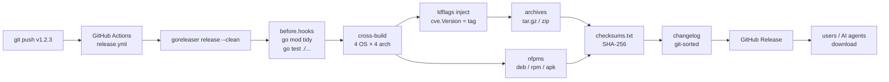

# Release & goreleaser

The `cve` CLI is published as cross-platform prebuilt binaries via [goreleaser](https://goreleaser.com), driven by [`.goreleaser.yaml`](https://github.com/scagogogo/cve-skills/blob/main/.goreleaser.yaml) and triggered by the [`release.yml`](/reference/ci-cd#release-yml-cross-platform-release) workflow on every `v*` tag. This page documents the build matrix, the ldflags version injection, the archive/package/checksum/changelog outputs, and how an AI agent or user obtains the resulting binaries.

:::tip 📂 View Source
[`.goreleaser.yaml`](https://github.com/scagogogo/cve-skills/blob/main/.goreleaser.yaml) — 127 lines, goreleaser v2.
:::

## Release Overview



## Build Matrix

The `builds` section cross-compiles `./cmd/cve` (the `main` package) with `CGO_ENABLED=0` (pure Go, statically linked, zero C dependencies) across:

| OS (`goos`) | Architectures (`goarch`) | Notes |
|---|---|---|
| `linux` | `amd64`, `arm64`, `arm`, `386` | Full matrix |
| `darwin` (macOS) | `amd64`, `arm64` | `arm`/`386` ignored (no such macOS) |
| `windows` | `amd64`, `arm64` | `arm`/`386` ignored |
| `freebsd` | `amd64`, `arm64` | `arm`/`386` ignored |

The `ignore` list excludes invalid combinations (e.g. `darwin/arm`, `windows/386`), yielding **12 valid OS×arch targets**. Each produces a standalone `cve` binary.

:::tip 📌 Why CGO_ENABLED=0
Pure-Go static binaries run anywhere with no C runtime dependency — the same binary works on Alpine, scratch containers, minimal embedded Linux, and old glibc systems. This is what makes the CLI safe for an AI agent to download and run on an unknown host.
:::

## Version Injection (ldflags)

The version string is baked into the binary at link time, overwriting the package-level [`cve.Version`](/api/functions/version) variable (declared `var Version = "dev"` in `cve.go:41`):

```text
ldflags:
  - -s -w # strip symbol table & DWARF, shrink binary
  - -X github.com/scagogogo/cve-skills.Version={{.Version}}
```

- `-s -w` strips the symbol table and DWARF debug info, shrinking each binary by roughly 30–40%.
- <code v-pre>-X github.com/scagogogo/cve-skills.Version=<span v-pre>{{.Version}}</span></code> overwrites the `Version` var with the goreleaser template value <code v-pre><span v-pre>{{.Version}}</span></code>, which resolves to the git tag (e.g. `v1.2.3`).
- <code v-pre><span v-pre>{{.Version}}</span></code> comes from the pushed tag. A source build with no ldflags leaves `cve.Version == "dev"`; a released binary reports the tag.

This is why `Version` is declared `var`, not `const` — the linker's `-X` flag can only overwrite a package-level `string` `var`. See [Version](/api/functions/version#why-var-not-const).

## Build Hooks

```yaml
before:
  hooks:
    - go mod tidy
    - go test ./...
```

Before any binary is built, goreleaser runs `go mod tidy` (ensures `go.mod`/`go.sum` are consistent) and `go test ./...` (runs the full test suite). If the tests fail, the release aborts — a tag on a red `main` cannot produce binaries. This is the release-time safety net that complements the `go-test.yml` CI gate.

## Archives

```text
archives:
  - id: default
    name_template: >-
      {{ .ProjectName }}_{{ .Version }}_
      {{- if eq .Os "darwin" }}macos
      {{- else }}{{ .Os }}{{ end }}_
      {{- if eq .Arch "amd64" }}x86_64
      {{- else if eq .Arch "386" }}i386
      {{- else }}{{ .Arch }}{{ end }}
    format: tar.gz
    format_overrides:
      - goos: windows
        format: zip
    files:
      - README.md
      - README.zh.md
      - LICENSE
```

- **Naming**: `cve_<version>_<os>_<arch>.tar.gz`, with `darwin`→`macos`, `amd64`→`x86_64`, `386`→`i386` for friendlier names. Example: `cve_v1.2.3_macos_arm64.tar.gz`.
- **Format**: `tar.gz` for Unix, `zip` for Windows (`format_overrides`).
- **Bundled files**: each archive includes `README.md`, `README.zh.md`, and `LICENSE` alongside the binary, so a user who downloads one archive has everything.

## Linux Packages (nfpms)

```text
nfpms:
  - file_name_template: "{{ .ProjectName }}_{{ .Version }}_{{ .Os }}_{{ .Arch }}"
    formats:
      - deb
      - rpm
      - apk
```

For Linux targets, goreleaser also produces native packages: `.deb` (Debian/Ubuntu), `.rpm` (Fedora/RHEL), and `.apk` (Alpine). This lets users install via `dpkg -i`, `rpm -i`, or `apk add` instead of unpacking a tarball. Each package carries the `MIT` license, homepage, and maintainer metadata.

## Checksums

```yaml
checksum:
  name_template: "checksums.txt"
  algorithm: sha256
```

A single `checksums.txt` file lists the SHA-256 hash of every archive and package. Users (and AI agents) can verify a download with:

```bash
sha256sum -c checksums.txt --ignore-missing
```

## Changelog

```yaml
changelog:
  use: git
  sort: asc
  filters:
    exclude:
      - "^docs:"
      - "^test:"
      - "^chore:"
      - "Merge pull request"
      - "Merge branch"
```

- **`use: git`** — uses git's native log between the previous tag and the new one.
- **`sort: asc`** — oldest commits first.
- **Excluded**: `docs:`, `test:`, `chore:` commits and merge commits, so the changelog shows only meaningful changes.

## Release

```text
release:
  github:
    owner: scagogogo
    name: cve-skills
  draft: false
  prerelease: auto
  name_template: "{{ .Tag }}"
```

- **`draft: false`** — the Release is published immediately, not saved as a draft.
- **`prerelease: auto`** — tags like `v1.2.3-rc1` are automatically marked as pre-release.
- **<code v-pre>name_template: "<span v-pre>{{ .Tag }}</span>"</code>** — the Release title is the tag name.
- The Release header includes a one-line `go install` command; the footer links the install script (see [Obtaining binaries](#obtaining-binaries)).

## Obtaining binaries

Three ways to get the `cve` CLI, in order of convenience:

```bash
# 1. Install script (downloads the right archive for your OS/arch from the latest Release)
curl -fsSL https://raw.githubusercontent.com/scagogogo/cve-skills/main/scripts/install.sh | bash

# 2. go install from source (compiles; cve.Version will be the tag)
go install github.com/scagogogo/cve-skills/cmd/cve@v1.2.3

# 3. Manual download from the GitHub Release page
#    https://github.com/scagogogo/cve-skills/releases
#    pick cve_<version>_<os>_<arch>.tar.gz, unpack, put `cve` on PATH
```

After install, verify the version was injected:

```bash
cve version
# a released binary prints: v1.2.3
# a source build prints:    dev
```

## Local Pre-release Checks

Before cutting a tag, reproduce the release locally without publishing:

```bash
# Validate the config syntax
goreleaser check

# Full local build (all targets, no publish) — produces dist/ but does not create a Release
goreleaser release --snapshot --clean

# Single-target quick build (what ci.yml runs on every PR)
goreleaser build --snapshot --clean --single-target
```

`--snapshot` uses a fake version (`<tag>-next`) and skips publishing, so it is safe to run locally. `--clean` wipes `dist/` first to avoid stale artifacts.

## Data Flow

```text
+----------------+     +----------------------+     +-----------------------------------+
| git tag v1.2.3 | --> | release.yml workflow | --> | goreleaser release --clean        |
+----------------+     +----------------------+     +----------------+------------------+
                                                                    |
                                                    before.hooks: go mod tidy, go test ./...
                                                                    |
                                                                    v
                                       +-------------------------------------------+
                                       | cross-build (CGO_ENABLED=0)               |
                                       |  linux/darwin/windows/freebsd             |
                                       |  × amd64/arm64/arm/386 (12 valid targets) |
                                       +----------------+--------------------------+
                                                        |
                                          ldflags: -s -w -X ...Version=v1.2.3
                                                        |
                          +-----------------------------+-----------------------------+
                          |                             |                             |
                          v                             v                             v
                +-------------------+         +-------------------+         +-------------------+
                | archives          |         | nfpms             |         | checksums.txt     |
                | tar.gz / zip      |         | deb / rpm / apk   |         | SHA-256 of all    |
                | +README +LICENSE  |         | (Linux only)      |         | artifacts         |
                +---------+---------+         +---------+---------+         +---------+---------+
                          |                             |                             |
                          +-----------------------------+-----------------------------+
                                                        |
                                          changelog (git log, filtered)
                                                        |
                                                        v
                                          +-------------------------------+
                                          | GitHub Release v1.2.3         |
                                          |  - 12 binaries in archives    |
                                          |  - Linux packages             |
                                          |  - checksums.txt              |
                                          |  - CHANGELOG                  |
                                          +---------------+---------------+
                                                          |
                                          users / AI agents download
                                                          |
                                          install.sh / go install / manual
```

## Deep Dive

- **`CGO_ENABLED=0` is the keystone.** It makes every binary a self-contained static executable with no C runtime dependency. This is why the same `cve` binary runs on Alpine (musl), Ubuntu (glibc), macOS, and Windows without recompilation, and why an AI agent can download one archive and run it on an unknown host without worrying about shared libraries.
- **`-s -w` trades debuggability for size.** Stripped binaries cannot be debugged with `delve` or symbolicated in stack traces, but they are ~30–40% smaller. For a CLI shipped to end users (not a long-running service), the size win is worth the debuggability loss. If you need symbols, build locally without the flags: `go build ./cmd/cve`.
- **The `ignore` list is explicit, not inferred.** goreleaser does not auto-skip invalid OS×arch combos; the config lists every combination to exclude (`darwin/arm`, `darwin/386`, `windows/arm`, `windows/386`, `freebsd/arm`, `freebsd/386`). Adding a new OS or arch means revisiting this list.
- **<code v-pre>mod_timestamp: "<span v-pre>{{ .CommitTimestamp }}</span>"</code>** sets the build timestamp to the commit time, not `time.Now()`. This makes builds reproducible: the same commit produces byte-identical binaries across runs, which matters for supply-chain verification.
- **`prerelease: auto`** detects pre-release tags by their suffix (`-rc1`, `-beta`, etc.) and marks the GitHub Release as a pre-release automatically. A stable `v1.2.3` tag becomes a stable Release; `v1.2.3-rc1` becomes a pre-release that users must opt into.
- **The changelog excludes `docs:`/`test:`/`chore:` commits.** This keeps the user-facing changelog focused on features and fixes. Internal refactors and doc updates are still in git history, just not surfaced in the Release notes.
- **`before.hooks` runs `go test ./...` at release time.** This is the last line of defense: even if a tag is pushed directly (bypassing the `main` CI gate), goreleaser re-runs the tests before building. A failing test aborts the release, so no broken binaries are ever published.
- **Three install paths exist deliberately.** `install.sh` (no toolchain needed), `go install` (needs Go, gets the exact tag), and manual archive download (full control). An AI agent without a Go toolchain uses `install.sh`; an agent with Go uses `go install` for version pinning.

## Related

- [CI/CD Pipeline](/reference/ci-cd) — the `release.yml` workflow that invokes goreleaser
- [Version](/api/functions/version) — the `var Version = "dev"` that ldflags overwrites
- [Download & Install](/download) — user-facing install instructions
- [Testing Strategy](/guide/testing) — the `go test ./...` that `before.hooks` runs
