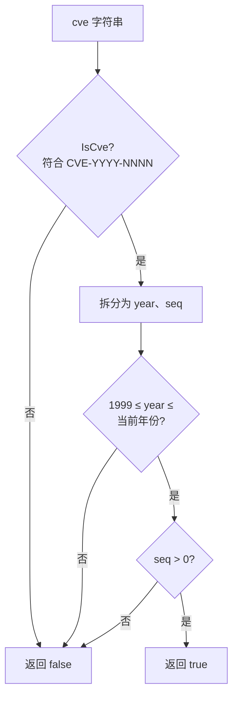

# 格式化与验证

这一类函数用于 CVE 格式的标准化和有效性验证，是 CVE 处理的基础功能。

## Format

将 CVE 编号转换为标准大写格式并移除前后空格。

### 函数签名

```go
func Format(cve string) string
```

### 参数

- `cve` (string): 要格式化的 CVE 编号

### 返回值

- `string`: 标准化格式的 CVE 编号

### 功能描述

`Format` 函数执行以下操作：
1. 移除字符串前后的空白字符
2. 将整个字符串转换为大写
3. 返回标准化的 CVE 格式

### 使用示例

```go
package main

import (
    "fmt"
    "github.com/scagogogo/cve-skills"
)

func main() {
    // 基本使用
    result := cve.Format(" cve-2022-12345 ")
    fmt.Println(result) // 输出: CVE-2022-12345

    // 各种输入格式
    testCases := []string{
        "cve-2022-12345",      // 小写
        "CVE-2022-12345",      // 已经是标准格式
        " CVE-2022-12345 ",    // 有空格
        "cVe-2022-12345",      // 混合大小写
        "\tcve-2022-12345\n",  // 包含制表符和换行符
    }

    for _, input := range testCases {
        formatted := cve.Format(input)
        fmt.Printf("'%s' -> '%s'\n", input, formatted)
    }
}
```

### 使用场景

- 在存储 CVE 之前进行标准化
- 在比较 CVE 之前统一格式
- 清理用户输入的 CVE 数据
- 数据导入时的格式标准化

### 注意事项

- 该函数不验证 CVE 格式的有效性，只进行格式标准化
- 对于完全无效的输入，仍会返回格式化后的字符串
- 建议与验证函数配合使用

---

## IsCve

判断字符串是否是有效的 CVE 格式。

### 函数签名

```go
func IsCve(text string) bool
```

### 参数

- `text` (string): 要检查的字符串

### 返回值

- `bool`: 如果字符串是有效的 CVE 格式则返回 `true`，否则返回 `false`

### 功能描述

`IsCve` 函数检查输入字符串是否完全符合 CVE 格式：
- 允许前后有空白字符
- 不区分大小写
- 格式必须为：`CVE-YYYY-NNNN`
- 不允许包含其他文本内容

### 使用示例

```go
func main() {
    testCases := []struct {
        input    string
        expected bool
    }{
        {"CVE-2022-12345", true},           // 标准格式
        {" CVE-2022-12345 ", true},         // 有空格
        {"cve-2022-12345", true},           // 小写
        {"包含CVE-2022-12345的文本", false}, // 包含其他文本
        {"2022-12345", false},              // 缺少前缀
        {"CVE-2022-ABC", false},            // 序列号不是数字
        {"CVE-22-12345", false},            // 年份格式错误
        {"", false},                        // 空字符串
    }

    for _, tc := range testCases {
        result := cve.IsCve(tc.input)
        status := "✅"
        if result != tc.expected {
            status = "❌"
        }
        fmt.Printf("%s '%s' -> %t (期望: %t)\n",
            status, tc.input, result, tc.expected)
    }
}
```

### 使用场景

- 验证用户输入的 CVE 格式
- 在处理前检查数据有效性
- 表单验证
- 数据清洗过程中的格式检查

### 正则表达式

内部使用的正则表达式：`(?i)^\\s*CVE-\\d+-\\d+\\s*$`

- `(?i)`: 不区分大小写
- `^\\s*`: 开头允许空白字符
- `CVE-\\d+-\\d+`: CVE 格式
- `\\s*$`: 结尾允许空白字符

---

## IsContainsCve

判断字符串是否包含 CVE。

### 函数签名

```go
func IsContainsCve(text string) bool
```

### 参数

- `text` (string): 要检查的字符串

### 返回值

- `bool`: 如果字符串包含 CVE 则返回 `true`，否则返回 `false`

### 功能描述

`IsContainsCve` 函数检查文本中是否包含任何 CVE 格式的内容：
- 不要求整个字符串都是 CVE 格式
- 可以包含在更大的文本中
- 不区分大小写
- 只要找到一个有效的 CVE 格式就返回 `true`

### 使用示例

```go
func main() {
    testCases := []struct {
        input    string
        expected bool
    }{
        {"这个漏洞的编号是CVE-2022-12345", true},
        {"系统受到CVE-2021-44228和CVE-2022-12345影响", true},
        {"cve-2022-12345在文本中", true},
        {"这个文本不包含任何CVE", false},
        {"CVE格式错误CVE-22-123", false},
        {"", false},
    }

    for _, tc := range testCases {
        result := cve.IsContainsCve(tc.input)
        status := "✅"
        if result != tc.expected {
            status = "❌"
        }
        fmt.Printf("%s '%s' -> %t\n", status, tc.input, result)
    }
}
```

### 使用场景

- 从文档中检测是否提及 CVE
- 安全报告的初步筛选
- 日志分析中查找 CVE 相关内容
- 邮件或消息的 CVE 检测

### 与 IsCve 的区别

| 函数 | 用途 | 要求 |
|------|------|------|
| `IsCve` | 验证整个字符串是否为 CVE 格式 | 整个字符串必须是 CVE（允许空格） |
| `IsContainsCve` | 检查文本中是否包含 CVE | 文本中包含任何有效 CVE 即可 |

---

## FormatSeq

将 CVE 的序列号补零到固定宽度。

### 函数签名

```go
func FormatSeq(cve string, width int) string
```

### 参数

- `cve` (string): 要处理的 CVE 编号
- `width` (int): 序列号的目标宽度（不足则左补零）

### 返回值

- `string`: 序列号补零对齐后的 CVE 编号；若输入不是有效 CVE，则原样返回

### 使用示例

```go
fmt.Println(cve.FormatSeq("CVE-2022-123", 6))   // 输出: CVE-2022-000123
fmt.Println(cve.FormatSeq("CVE-2022-12345", 6)) // 输出: CVE-2022-012345
fmt.Println(cve.FormatSeq("not-a-cve", 6))      // 输出: not-a-cve（原样返回）
```

### 使用场景

- 在存储或展示时保持序列号列宽一致，便于对齐与排序
- 生成固定格式的报表

---

## IsCveYearOk

判断 CVE 的年份是否在合理的时间范围内（1999 至当前年份）。

### 函数签名

```go
func IsCveYearOk(cve string) bool
```

### 参数

- `cve` (string): CVE 编号

### 返回值

- `bool`: 如果年份在 1999 至当前年份之间则返回 `true`，否则返回 `false`

### 功能描述

`IsCveYearOk` 是 `IsCveYearOkWithCutoff(cve, 0)` 的简写：年份必须 >= 1999（CVE 编号体系启用年份），且不得晚于当前年份。

### 使用示例

```go
fmt.Println(cve.IsCveYearOk("CVE-2022-12345")) // 输出: true
fmt.Println(cve.IsCveYearOk("CVE-1998-12345")) // 输出: false（早于 1999）
```

---

## IsCveYearOkWithCutoff

带偏移量的年份校验，可容忍一定数量的未来年份 —— 适用于预分配或预留的 CVE 编号。

### 函数签名

```go
func IsCveYearOkWithCutoff(cve string, cutoff int) bool
```

### 参数

- `cve` (string): CVE 编号
- `cutoff` (int): 允许的未来年份偏移量（单位：年）

### 返回值

- `bool`: 年份满足 `1999 <= year <= 当前年份 + cutoff` 时返回 `true`

### 使用示例

```go
// 当前年份 2023：允许未来 2 年
fmt.Println(cve.IsCveYearOkWithCutoff("CVE-2025-12345", 2)) // 输出: true
fmt.Println(cve.IsCveYearOkWithCutoff("CVE-2030-12345", 2)) // 输出: false
fmt.Println(cve.IsCveYearOkWithCutoff("CVE-1998-12345", 5)) // 输出: false（早于 1999）
```

### 计算逻辑

```go
year := extractYear(cve)
return year >= 1999 && year <= time.Now().Year()+cutoff
```

`IsCveYearOk(cve)` 等价于 `IsCveYearOkWithCutoff(cve, 0)`。

---

## ValidateCve

全面验证 CVE 编号的合法性。

### 函数签名

```go
func ValidateCve(cve string) bool
```

### 参数

- `cve` (string): 要验证的 CVE 编号

### 返回值

- `bool`: 如果 CVE 编号合法则返回 `true`，否则返回 `false`

### 功能描述

`ValidateCve` 函数进行最全面的 CVE 验证：
1. 检查基本格式（调用 `IsCve`）
2. 验证年份和序列号是否为有效数字
3. 检查年份范围（1999 至当前年份）
4. 验证序列号为正整数

### 使用示例

```go
func main() {
    testCases := []struct {
        cve      string
        expected bool
        reason   string
    }{
        {"CVE-2022-12345", true, "有效的 CVE"},
        {" CVE-2022-12345 ", true, "有效的 CVE（有空格）"},
        {"cve-2022-12345", true, "有效的 CVE（小写）"},
        {"CVE-1969-12345", false, "年份过早"},
        {"CVE-2099-12345", false, "年份过晚"},
        {"CVE-2022-0", false, "序列号为0"},
        {"CVE-2022-ABC", false, "序列号不是数字"},
        {"2022-12345", false, "缺少 CVE 前缀"},
        {"CVE-22-12345", false, "年份格式错误"},
        {"", false, "空字符串"},
    }

    for _, tc := range testCases {
        result := cve.ValidateCve(tc.cve)
        status := "✅"
        if result != tc.expected {
            status = "❌"
        }
        fmt.Printf("%s %-20s -> %t (%s)\n",
            status, tc.cve, result, tc.reason)
    }
}
```

### 验证规则

1. **格式检查**: 必须符合 `CVE-YYYY-NNNN` 格式
2. **年份验证**:
   - 必须是4位数字
   - 范围：1999 ≤ 年份 ≤ 当前年份
3. **序列号验证**:
   - 必须是数字
   - 必须 > 0

三项检查按顺序进行,任一失败即短路返回 `false`:



### 使用场景

- 用户输入验证
- 数据导入前的质量检查
- API 参数验证
- 数据库存储前的最终验证

### 与其他验证函数的关系

```go
func comprehensiveCheck(input string) {
    fmt.Printf("输入: %s\n", input)
    fmt.Printf("IsCve: %t\n", cve.IsCve(input))
    fmt.Printf("IsContainsCve: %t\n", cve.IsContainsCve(input))
    fmt.Printf("ValidateCve: %t\n", cve.ValidateCve(input))

    if cve.ValidateCve(input) {
        year, seq := cve.Split(input)
        fmt.Printf("年份: %s, 序列号: %s\n", year, seq)
    }
}
```

## 最佳实践

### 1. 组合使用验证函数

```go
func processUserInput(input string) error {
    // 第一步：基本格式检查
    if !cve.IsCve(input) {
        return fmt.Errorf("无效的 CVE 格式")
    }

    // 第二步：全面验证
    if !cve.ValidateCve(input) {
        return fmt.Errorf("CVE 验证失败")
    }

    // 第三步：格式化存储
    standardized := cve.Format(input)
    // 存储 standardized...

    return nil
}
```

### 2. 批量验证

```go
func validateCveList(cveList []string) (valid, invalid []string) {
    for _, cveId := range cveList {
        if cve.ValidateCve(cveId) {
            valid = append(valid, cve.Format(cveId))
        } else {
            invalid = append(invalid, cveId)
        }
    }
    return
}
```

### 3. 文本预处理

```go
func preprocessText(text string) []string {
    // 先检查是否包含 CVE
    if !cve.IsContainsCve(text) {
        return nil
    }

    // 提取所有可能的 CVE
    extracted := cve.ExtractCve(text)

    // 验证每个提取的 CVE
    var validated []string
    for _, cveId := range extracted {
        if cve.ValidateCve(cveId) {
            validated = append(validated, cveId)
        }
    }

    return validated
}
```

## 性能说明

- 所有验证函数都使用预编译的正则表达式，性能优异
- `ValidateCve` 是最全面但也是最耗时的验证函数
- 对于大量数据，建议先用 `IsCve` 进行快速筛选，再用 `ValidateCve` 进行详细验证
- 所有函数都是并发安全的
