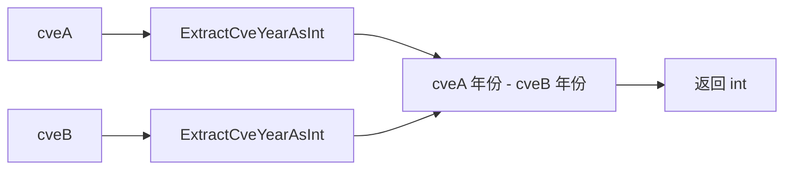

# CompareByYear 按年份比较

:::tip 📂 查看源码
[`compare.go:40`](https://github.com/scagogogo/cve-skills/blob/main/compare.go#L40-L43) — 在 GitHub 上查看实现代码（第 40–43 行）。
:::

`CompareByYear` 根据年份比较两个 CVE 编号的大小，返回年份的数值差值，适合用于按年份对 CVE 排序。

:::tip 📌 场景
- 按发布年份对一组 CVE 进行排序
- 比较两个 CVE 哪个发布更早（基于年份）
- 在更大的流水线中作为按年份排序的比较器
:::

## 函数签名

```go
func CompareByYear(cveA, cveB string) int
```

## 参数

- `cveA` (string): 第一个 CVE 编号
- `cveB` (string): 第二个 CVE 编号

## 返回值

- `int`: 比较结果，具体规则如下
- 负数: `cveA` 年份 &lt; `cveB` 年份（具体为 `cveA` 年份减 `cveB` 年份 的差值）
- 零: `cveA` 年份等于 `cveB` 年份
- 正数: `cveA` 年份 &gt; `cveB` 年份（具体为 `cveA` 年份减 `cveB` 年份 的差值）

## 行为说明

- 内部对两个输入分别调用 `ExtractCveYearAsInt`，返回 `ExtractCveYearAsInt(cveA) - ExtractCveYearAsInt(cveB)`
- 返回值是实际的年份差值，而不仅是符号 —— `CVE-2020-1111` 与 `CVE-2022-2222` 的结果为 `-2`
- 只比较年份，序列号被忽略 —— `CVE-2022-1111` 与 `CVE-2022-2222` 比较相等（返回 `0`）
- 无效的 CVE 输入不会被拒绝 —— `ExtractCveYearAsInt` 会将无法解析的 CVE 视为年份 `0`，因此格式非法的值按年份 `0` 参与比较

## 流程图



## 示例

```go
package main

import (
	"fmt"

	"github.com/scagogogo/cve-skills"
)

func main() {
	// 以下用例照搬源码文档注释
	pairs := []struct {
		a, b     string
		expected int
	}{
		{"CVE-2020-1111", "CVE-2022-2222", -2}, // cveA 年份 < cveB 年份
		{"CVE-2022-1111", "CVE-2022-2222", 0},  // 同年份，序列号被忽略
		{"CVE-2023-1111", "CVE-2021-2222", 2},  // cveA 年份 > cveB 年份
	}
	for _, p := range pairs {
		result := cve.CompareByYear(p.a, p.b)
		status := "✅"
		if result != p.expected {
			status = "❌"
		}
		fmt.Printf("%s CompareByYear(%s, %s) = %d (期望 %d)\n", status, p.a, p.b, result, p.expected)
	}

	// 典型用法：判断哪个 CVE 发布更早
	result := cve.CompareByYear("CVE-2020-1111", "CVE-2022-2222")
	if result < 0 {
		fmt.Println("第一个 CVE 发布更早")
	}
}
```

## 使用场景

- 按年份对 CVE 排序（作为排序过程中的比较器使用）
- 基于年份比较两个 CVE 的发布时间
- 构建按年份排序的基础原语，再交由 `CompareCves` 等更完整的比较器进一步处理

## 注意事项

- 返回值是**带符号的年份差值**，而非归一化的 `-1/0/1`。若只需要符号，可自行包装返回值，或直接使用归一化为 `-1/0/1` 的 `CompareCves`
- 仅比较年份；同一年份的两个 CVE 无论序列号如何都返回 `0` —— 若需按序列号打破平局，请使用 `CompareCves`
- 无效的 CVE 输入会静默退化为年份 `0`，而非报错 —— 当输入质量无法保证时，请先用 `IsCve` / `ValidateCve` 校验
- `SubByYear` 是一个薄封装别名，返回相同值，只是以“相减”而非“比较”的语义呈现

## 内部实现

函数体只有一行，位于 `compare.go:41` —— `return ExtractCveYearAsInt(cveA) - ExtractCveYearAsInt(cveB)`。其设计可拆解为以下步骤：

- **委托年份提取** —— 每个输入都交给 `ExtractCveYearAsInt` 处理：该函数先运行 `IsCve`（正则 `(?i)^\s*CVE-\d+-\d+\s*$`），若不通过则直接短路返回 `0`；否则依次调用 `ExtractCveYear` → `Split` 取出年份片段，再用 `strconv.Atoi` 解析为整数。`Atoi` 的第二个返回值被丢弃，因此年份片段非数字时同样回退为 `0`。
- **数值相减** —— 两个整数年份直接相减（`cveA` 年份减 `cveB` 年份）。由于是普通的 `int` 减法，结果保留了差值的**幅度**（例如 2020 与 2022 相减得 `-2`），而非仅保留符号。
- **不做归一化** —— 与 `CompareCves` 不同，本函数刻意跳过了 `-1/0/1` 的归一化，也跳过了序列号比较。年份比较即为全部结果，这正是同年份 CVE 无论序列号如何都返回 `0` 的原因。
- **不调用 `Format`** —— 输入不会被重新格式化。`Format`/大小写统一只发生在 `SortCves` 中，本函数不调用；`CompareByYear` 通过大小写不敏感的正则直接按年份片段运算。
- **无状态且纯函数** —— 没有构造 map、没有 `sort.Slice`、没有共享状态。它是一个叶子比较器，供更高层例程组合使用，例如 `CompareCves`（先调用 `CompareByYear`，仅当其返回 `0` 时才回退到序列号比较）。

## 复杂度

| 维度 | 开销 | 原因 |
|---|---|---|
| 时间 | 每次比较 `O(1)`（摊还） | 每次调用触发两次 `ExtractCveYearAsInt`，即一次正则匹配（`IsCve`）加一次 `strconv.Atoi` |
| 空间 | `O(1)` | 除 `Split` 返回的年份片段外无额外分配；不创建切片或 map |
| 作为比较器参与排序时 | `O(n log n)` | 当接入 `sort.Slice`（如 `SortCves`）时，`O(1)` 的比较器被调用 `O(n log n)` 次 |

说明：
- `IsCve` 内部的正则匹配与输入字符串长度呈线性关系，但 CVE 编号很短且有上界，故每次调用实际上是常数时间。
- 无效输入会退化为年份 `0` 而非报错，因此比较器永远不会走异常分支 —— 不存在 `panic`/error 路径需要额外考虑。

## 边界情形

| 输入 | 行为 | 返回 |
|---|---|---|
| 两个有效 CVE、年份不同（`CVE-2020-1111`、`CVE-2022-2222`） | 两个年份解析后相减 | `-2`（带符号差值） |
| 两个有效 CVE、年份相同（`CVE-2022-1111`、`CVE-2022-2222`） | 年份相等；序列号被忽略 | `0` |
| `cveA` 年份 &gt; `cveB` 年份（`CVE-2023-1111`、`CVE-2021-2222`） | 差值为正 | `2` |
| `cveA` 无效（`not-a-cve`、`CVE-2022-2222`） | `cveA` 未通过 `IsCve` → 年份 `0`；`0 - 2022` | `-2022` |
| `cveB` 无效（`CVE-2022-1111`、`""`） | `cveB` → 年份 `0`；`2022 - 0` | `2022` |
| 两者都无效（`hello`、`world`） | 两者均 → 年份 `0`；`0 - 0` | `0` |
| 小写 CVE（`cve-2022-1111`、`CVE-2022-2222`） | 正则为 `(?i)`，两者均有效、同年 | `0` |
| 前后带空白（`  CVE-2022-1111  `、`CVE-2022-2222`） | 正则允许两侧 `\s`；有效、同年 | `0` |
| 完全相同的输入（`CVE-2022-2222`、`CVE-2022-2222`） | 年份及一切均相同 | `0` |
| 年份片段非数字（`CVE-20xx-2222`） | `IsCve` 正则要求 `\d+`，故该输入无效 → 年份 `0` | 视为 `0` |

## 数据流

```text
+-----------------+        +----------------------+        +---------+
|  cveA (string)  |  --->  | ExtractCveYearAsInt  |  --->  |  yearA  |
+-----------------+        |  - IsCve? (正则)     |        | (int)   |
                           |  - ExtractCveYear    |        +---------+
                           |  - strconv.Atoi      |              |
                           +----------------------+              |  (yearA)
                                   ^                              |
                                   | 结构相同                       v
+-----------------+        +----------------------+        +---------+
|  cveB (string)  |  --->  | ExtractCveYearAsInt  |  --->  |  yearB  |
+-----------------+        |  - IsCve? (正则)     |        | (int)   |
                           |  - ExtractCveYear    |        +---------+
                           |  - strconv.Atoi      |              |
                           +----------------------+              |  (yearB)
                                                                 |
                                                                 v
                                              +-----------------------------------+
                                              |   result = yearA - yearB          |
                                              |   (普通 int 相减；不做             |
                                              |    归一化、不比较序列号)           |
                                              +-----------------------------------+
                                                                 |
                                                                 v
                                                      +---------------------+
                                                      |  返回 int           |
                                                      |  < 0  => A 更早     |
                                                      |  = 0  => 同年份     |
                                                      |  > 0  => A 更晚     |
                                                      +---------------------+

  注：无效输入 -> IsCve 为 false -> ExtractCveYearAsInt 返回 0
      （无错误分支；返回幅度为真实年份差值，而非仅符号）
```

## 相关函数

- [SubByYear](/zh/api/functions/sub-by-year) — 返回相同年份差值的别名
- [CompareCves](/zh/api/functions/compare-cves) — 先按年份、再按序列号比较，归一化为 `-1/0/1`
- [ExtractCveYearAsInt](/zh/api/functions/extract-cve-year-as-int) — 将年份提取为整数（底层原语）
- [SortCves](/zh/api/functions/sort-cves) — 按年份再按序列号对 CVE 切片排序
- [比较与排序分类](/zh/api/compare-sort)
