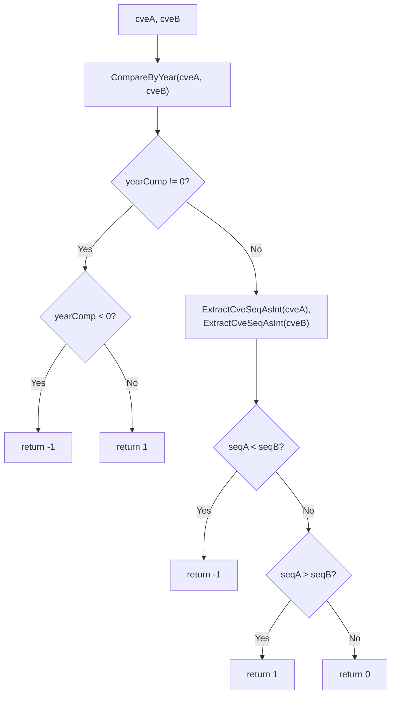

# CompareCves 完整比较

:::tip 📂 查看源码
[`compare.go:110`](https://github.com/scagogogo/cve-skills/blob/main/compare.go#L110-L129) — 在 GitHub 上查看实现代码（第 110–129 行）。
:::

`CompareCves` 对两个 CVE 编号进行完整比较 —— 先比年份，再比序列号 —— 返回稳定的 `-1 / 0 / 1` 结果，适合用于排序。

:::tip 📌 场景
- 将一组 CVE 按时间顺序（先年份、再序列号）排序
- 在去重或合并记录时判断两个 CVE 哪个更新
- 为 `sort.Slice` 提供 CVE 切片的比较器
:::

## 函数签名

```go
func CompareCves(cveA, cveB string) int
```

## 参数

- `cveA` (string): 第一个待比较的 CVE 编号
- `cveB` (string): 第二个待比较的 CVE 编号

## 返回值

- `int`: 比较结果
  - `-1`: `cveA` < `cveB`（cveA 年份较小，或年份相同但序列号较小）
  - `0`: `cveA` = `cveB`（年份与序列号完全相同）
  - `1`: `cveA` > `cveB`（cveA 年份较大，或年份相同但序列号较大）

## 行为说明

- 先通过 `CompareByYear` 比较年份；若年份不同，立即返回 `-1` 或 `1` —— 年份差值的绝对值被压缩为符号
- 当年份相同时，用 `ExtractCveSeqAsInt` 提取序列号再比较；序列号较小返回 `-1`，较大返回 `1`
- 仅当年份与序列号都完全一致时才返回 `0`
- 无效输入不会触发 panic —— 底层提取器将非法 CVE 视为年份 `0`、序列号 `0`，因此它们会排在最前面

## 流程图



## 示例

```go
package main

import (
	"fmt"
	"sort"

	"github.com/scagogogo/cve-skills"
)

func main() {
	testCases := []struct {
		a, b     string
		expected int
		reason   string
	}{
		{"CVE-2020-1111", "CVE-2022-2222", -1, "不同年份，cveA 更早"},
		{"CVE-2022-1111", "CVE-2022-2222", -1, "相同年份，cveA 序列号较小"},
		{"CVE-2022-3333", "CVE-2022-2222", 1, "相同年份，cveA 序列号较大"},
		{"CVE-2022-2222", "CVE-2022-2222", 0, "完全相同"},
		{"CVE-2023-1111", "CVE-2021-2222", 1, "cveA 年份更晚"},
		{"CVE-2021-9999", "CVE-2023-0001", -1, "年份优先于序列号"},
	}

	for _, tc := range testCases {
		result := cve.CompareCves(tc.a, tc.b)
		status := "✅"
		if result != tc.expected {
			status = "❌"
		}
		fmt.Printf("%s CompareCves(%s, %s) -> %d (期望 %d，%s)\n", status, tc.a, tc.b, result, tc.expected, tc.reason)
	}

	// 用作排序比较器
	list := []string{"CVE-2022-2222", "CVE-2020-1111", "CVE-2022-1111"}
	sort.Slice(list, func(i, j int) bool {
		return cve.CompareCves(list[i], list[j]) < 0
	})
	fmt.Printf("排序结果: %v\n", list)
}
```

## 使用场景

- 完整排序 CVE 编号，或比较两个 CVE 哪个更新
- 按发布顺序（先年份、再序列号）对 CVE 列表排序
- 为 `sort.Slice` / `sort.Search` 提供 CVE 切片的比较器

## 注意事项

- ⚠️ 与 `CompareByYear`（返回原始年份差值的带符号整数）不同，`CompareCves` 总是把结果压缩为 `-1 / 0 / 1` —— 不要依赖其绝对值来推断年份差距
- 📌 比较顺序是**先年份、后序列号**；年份更晚者必胜，与序列号大小无关（如 `CVE-2021-9999` < `CVE-2023-0001`）
- 🔍 非法 CVE 格式不会被拒绝 —— 提取器将其回退为年份 `0` / 序列号 `0`，从而排到最前；若需严格校验输入，请先用 `IsCve` / `ValidateCve` 校验
- ✅ 返回值正好符合 `sort.Slice` 期望的 `cmp` 约定，因此 `CompareCves(a, b) < 0` 就是惯用的“小于”判定

## 内部实现

该函数是一个两阶段比较器，把解析工作委托给既有提取器，并把所有结果压缩为稳定的符号：

- **阶段一 —— 通过 `CompareByYear` 比较年份（L111）：** 调用 `CompareByYear(cveA, cveB)`，其本身实现就是 `ExtractCveYearAsInt(cveA) - ExtractCveYearAsInt(cveB)`，因此以 O(1) 得到带符号的原始年份差值。若非零（L112），函数立即返回 `-1`（L114）或 `1`（L116）—— 故意丢弃绝对值，避免调用方误把它当年份数量用
- **阶段二 —— 序列号决胜（L119–L120）：** 仅当年份相等时才进入。`ExtractCveSeqAsInt` 解析第二个连字符之后的数字部分，得到两个 `int` 序列号
- **最终比较（L122–L126）：** 对两个序列号 int 做普通 `<` / `>` 级联判断，返回 `-1`、`1` 或 `0` —— 与 `sort.Slice` 期望的 `cmp` 约定一致，因此可直接用作排序比较器（参见 `SortCves` 在 L172 的调用）
- **设计意图 —— 委托而非重复：** `CompareCves` 从不自行重新解析年份，而是复用 `CompareByYear`（进而复用 `ExtractCveYearAsInt`），让年份解析的单一事实来源集中在一处
- **设计意图 —— 输出归一化：** 将结果压缩为 `-1 / 0 / 1`（而非返回原始差值），使其成为纯粹的顺序信号，不受年份或序列号差距大小的影响

## 复杂度

| 资源 | 开销 | 原因 |
| --- | --- | --- |
| 时间 | 单次调用 O(n)，n 为 CVE 字符串长度 | 主要耗时在 `ExtractCveYearAsInt` / `ExtractCveSeqAsInt` 解析；年份相减与序列号比较均为 O(1) |
| 时间（在 `sort.Slice` 中摊还） | O(n log n) 次比较 × 每次 O(字符串) | `SortCves` 会调用本比较器 O(n log n) 次 |
| 空间 | O(1) 辅助空间 | 仅有少量 `int` 局部变量（`yearComp`、`seqA`、`seqB`），无额外分配 |

> 单次调用成本受限于提取器的正则/解析工作；函数本身不增加额外分配，且仅占用常数额外空间。

## 边界情形

| 输入 | 行为 | 返回 |
| --- | --- | --- |
| 两个空字符串 `""`, `""` | 提取器对各自返回年份 `0`、序列号 `0`；年份相等、序列号相等 | `0` |
| 一空一合法 `""`, `CVE-2022-0001` | 空串解析为年份 `0` / 序列号 `0`；年份 `0` < `2022` | `-1` |
| 非法格式 `"CVE-XXXX-1111"`, `"CVE-2022-1111"` | 年份提取器回退为 `0`；`0` < `2022` | `-1` |
| 同年序列号非法 `"CVE-2022-ABCD"`, `"CVE-2022-1111"` | 年份相等；seqA 解析为 `0` < `1111` | `-1` |
| 小写 `"cve-2022-2222"`, `"CVE-2022-2222"` | 两者均提取为年份 `2022`、序列号 `2222`；相等 | `0`（比较层面大小写不敏感） |
| 重复 `"CVE-2022-2222"`, `"CVE-2022-2222"` | 年份与序列号都匹配 | `0` |
| 年份优先于序列号 `"CVE-2021-9999"`, `"CVE-2023-0001"` | 年份不同；`2021` < `2023` 短路返回 | `-1` |

## 数据流

```text
            +-------------------------+
 输入 ---> | cveA (string), cveB (string) |
            +-------------------------+
                        |
                        v
            +-----------------------------+
            | CompareByYear(cveA, cveB)  |   <-- 复用 ExtractCveYearAsInt
            +-----------------------------+
                        |
                        v
                 yearComp (int)
                        |
              +---------+---------+
              |                   |
        yearComp != 0        yearComp == 0
              |                   |
              v                   v
      +---------------+   +---------------------------+
      | sign(yearComp)|   | seqA = ExtractCveSeqAsInt |
      |  -1 或 1      |   | seqB = ExtractCveSeqAsInt |
      +---------------+   +---------------------------+
              |                   |
              |                   v
              |         +-----------------+
              |         | 比较 seqA, seqB |
              |         +-----------------+
              |                   |
              |       +-----+-----+-----+
              |       |     |     |
              |      <0    ==0    >0
              |       |     |     |
              v       v     v     v
         return -1  return -1 return 0 return 1
                   (seqA<seqB) (相等)   (seqA>seqB)

 输出 <--- 稳定的 cmp 值: -1 | 0 | 1
```

## 相关函数

- [CompareByYear](/zh/api/functions/compare-by-year) —— 仅按年份比较两个 CVE（返回原始差值）
- [SubByYear](/zh/api/functions/sub-by-year) —— `CompareByYear` 的年份差值别名
- [SortCves](/zh/api/functions/sort-cves) —— 用此比较器对 CVE 切片排序并标准化
- [ExtractCveYearAsInt](/zh/api/functions/extract-cve-year-as-int) —— 以 int 提取年份（内部使用）
- [ExtractCveSeqAsInt](/zh/api/functions/extract-cve-seq-as-int) —— 以 int 提取序列号（内部使用）
- [比较与排序分类](/zh/api/compare-sort)
