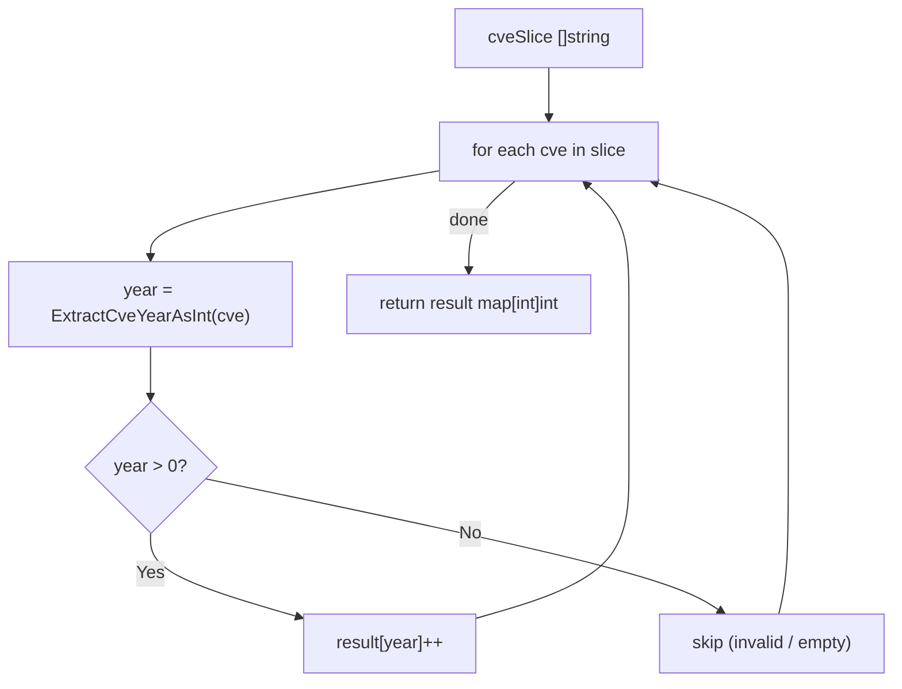

# CountByYear 按年计数

:::tip 📂 查看源码
[`filter.go:441`](https://github.com/scagogogo/cve-skills/blob/main/filter.go#L441-L451) — 在 GitHub 上查看实现代码（第 441–451 行）。
:::

`CountByYear` 对 CVE 列表按年份进行计数，返回年份到数量的映射。

:::tip 📌 场景
- CVE 趋势分析：了解各年份的漏洞分布
- 安全报告：生成年度 CVE 统计
- 仪表盘：用原始 CVE 列表驱动按年份展示的图表
:::

## 函数签名

```go
func CountByYear(cveSlice []string) map[int]int
```

## 参数

- `cveSlice` ([]string): 需要统计的 CVE 编号数组

## 返回值

- `map[int]int`: 年份到 CVE 数量的映射，key 为年份，value 为该年份的 CVE 数量

## 行为说明

- 遍历 `cveSlice` 中的每个元素，通过 `ExtractCveYearAsInt` 提取年份
- 只有提取出的年份大于 `0` 的条目才会被计数，因此格式错误（年份不可解析、空串或无效）的 CVE 会被静默跳过
- 当输入切片为空或不含任何有效 CVE 时，返回一个空（非 nil）的 map
- 返回 map 的 key 顺序不确定（Go 的 map 遍历顺序是随机的），如需有序输出请对 key 排序
- 年份提取大小写不敏感，可接受 `cve-`、`CVE-` 或大小写混合

## 流程图



## 示例

```go
package main

import (
	"fmt"
	"sort"

	"github.com/scagogogo/cve-skills"
)

func main() {
	// 源码示例输入输出：
	//   输入: ["CVE-2022-1111", "CVE-2022-2222", "CVE-2021-3333", "cve-2022-4444"]
	//   输出: {2021: 1, 2022: 3}
	cveList := []string{
		"CVE-2022-1111",
		"CVE-2022-2222",
		"CVE-2021-3333",
		"cve-2022-4444",
	}

	counts := cve.CountByYear(cveList)

	// Sort keys for deterministic output
	years := make([]int, 0, len(counts))
	for year := range counts {
		years = append(years, year)
	}
	sort.Ints(years)

	for _, year := range years {
		fmt.Printf("%d: %d CVEs\n", year, counts[year])
	}
	// Expected output:
	//   2021: 1 CVEs
	//   2022: 3 CVEs

	// Edge cases
	fmt.Println("---")

	// Empty slice -> empty map
	empty := cve.CountByYear([]string{})
	fmt.Printf("empty len=%d\n", len(empty)) // empty len=0

	// Invalid entries are skipped (year not > 0)
	mixed := cve.CountByYear([]string{
		"CVE-2023-1234",
		"not-a-cve",
		"",
		"CVE-2023-5678",
	})
	fmt.Printf("mixed 2023=%d, len=%d\n", mixed[2023], len(mixed))
	// Expected output:
	//   mixed 2023=2, len=1
}
```

## 使用场景

- CVE 趋势分析：了解各年份的漏洞分布
- 安全报告：生成年度 CVE 统计
- 仪表盘：用原始 CVE 列表驱动按年份展示的柱状/折线图
- 在调用 `YearRange` 之前先做聚合，刻画数据集的时间跨度

## 注意事项

- 无效的 CVE 会被**静默跳过**——只有年份可解析且为正数的条目才会被计数。若需要知道哪些条目被拒绝，请先用 `IsCve` / `ValidateCve` 校验
- 即使输入为空，返回的 map 也是非 nil 的，可以直接对其 range 遍历
- 年份提取使用 `ExtractCveYearAsInt`，并不强制校验合理的年份范围（1999..当前年份）。像 `CVE-0001-1` 这样的条目仍会把年份 `1` 计入结果
- Go 的 map 遍历顺序是随机的，输出有顺序要求时请对 key 排序
- 与 `YearRange` 对比：`CountByYear` 给出每年的计数，而 `YearRange` 只返回最早和最晚的年份

## 内部实现

函数体（filter.go L441-L451）是一个紧凑的单遍累加器：

- **map 初始化（L442）**：`result := make(map[int]int)` 预先分配一个非 nil 的 map。这正是空输入也返回可用（长度为 0）的 map 而非 `nil` 的原因，调用方可以直接 `range` 遍历而无需判空。
- **单次遍历（L443）**：`for _, cve := range cveSlice` 对输入切片只走一遍，没有嵌套循环，也没有预过滤遍历，因此工作量与输入条目数成线性关系。
- **年份提取委托（L444）**：`year := ExtractCveYearAsInt(cve)` 把所有解析逻辑（前缀匹配、大小写容忍、数字提取）委托给专门的提取器。`CountByYear` 本身不含正则或字符串解析，是一个纯粹的聚合原语。
- **正年份守卫（L445）**：`if year > 0` 是唯一的准入条件。`ExtractCveYearAsInt` 对任何无法解析的内容（空串、缺年份、非数字）都返回 `0`，所以这一条分支就静默丢弃了所有格式错误的条目，不报错——这是为在噪声数据上做容忍式聚合的刻意设计。
- **自增语义（L446）**：`result[year]++` 依赖 Go 对缺失 map key 的零值行为：尚不存在的年份 key 读取值为 `0`，因此首次出现会以值 `1` 创建 key，后续出现只是自增，无需单独做“是否存在”判断。

## 复杂度

| 维度 | 开销 | 原因 |
|---|---|---|
| 时间 | O(n) | 对 `n` 个输入条目单遍扫描；`ExtractCveYearAsInt` 对每条目为 O(len(cve))（对 CVE 长度的字符串为有界常数），map 插入/自增均摊 O(1)。 |
| 空间 | O(k) | `k` 为有效条目中出现的不同年份数（k <= n）；结果 map 每个不同年份一条记录。 |
| 辅助 | O(1) | 除结果 map 与循环变量外，无额外分配。 |

注意：示例中展示的排序步骤（`sort.Ints(years)`）由调用方执行，并不在 `CountByYear` 内部，因此不计入函数自身的 O(n) 开销。

## 边界情形

| 输入 | 行为 | 返回 |
|---|---|---|
| `[]string{}`（空切片） | 循环体不执行，map 保持初值 | 空、非 nil 的 `map[int]int`（len 0） |
| `nil` 切片 | 对 nil 切片 `range` 产生零次迭代 | 空、非 nil 的 `map[int]int`（len 0） |
| 条目 `""`（空串） | `ExtractCveYearAsInt("")` 返回 `0`；`0 > 0` 为假 | 跳过，不计入 |
| 条目 `"not-a-cve"`（不可解析） | `ExtractCveYearAsInt` 返回 `0` | 跳过 |
| 条目 `"CVE-2022-1"`（有效，大小写混合） | 年份提取为 `2022`，`2022 > 0` | `result[2022]` 自增 |
| 条目 `"cve-2022-1"`（小写） | 大小写不敏感提取得 `2022` | `result[2022]` 自增 |
| 同一年份的重复条目 | 每次有效命中执行 `result[year]++` | 计数累加（如三条 `2022` -> 值 `3`） |
| 条目 `"CVE-0001-1"`（年份 `1`） | `1 > 0` 为真 | `result[1]` 自增——不做合理范围校验 |
| 条目 `"CVE-99999-1"`（年份 `99999`） | `99999 > 0` 为真 | `result[99999]` 自增——不做上界校验 |

## 数据流

```text
+---------------------------+
| 输入: cveSlice []string   |
|  如 ["CVE-2022-1111",     |
|      "CVE-2022-2222",     |
|      "CVE-2021-3333",     |
|      "cve-2022-4444",     |
|      "not-a-cve",         |
|      ""]                  |
+-------------+-------------+
              |
              v
+---------------------------+
| result := make(map[int]int)|   <-- L442, 非 nil 空 map
+-------------+-------------+
              |
              v
+---------------------------+
| for _, cve := range cveSlice|  <-- L443, 单遍 O(n)
+-------------+-------------+
              |
              v  （逐条目）
+---------------------------+
| year := ExtractCveYearAsInt(cve)| <-- L444, 解析 + 转 int
+-------------+-------------+
              |
              v
+---------------------------+
|   if year > 0 ?           |   <-- L445, 守卫
+---+-------------------+---+
    | 是                | 否
    v                   v
+-----------+   +-----------------------+
| result[year]++ |   | 跳过（无效/空串）     | -> 下一条目
+-----+-----+   +-----------------------+
      |
      v  （全部条目处理完后）
+---------------------------+
| return result             |   <-- L449
|  {2021: 1, 2022: 3}       |
+---------------------------+
```

## 相关函数

- [ExtractCveYearAsInt](/zh/api/functions/extract-cve-year-as-int) — 将 CVE 的年份提取为整数
- [YearRange](/zh/api/functions/year-range) — 获取 CVE 列表中最早和最晚的年份
- [Filter](/zh/api/filter-group) — 在计数前按谓词过滤 CVE
- [统计分类](/zh/api/statistics)
