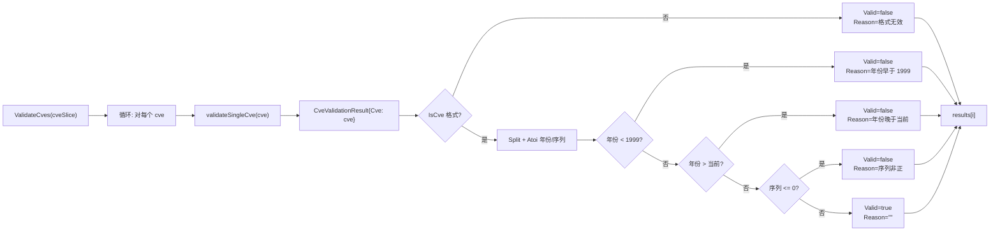

# CveValidationResult 验证结果

:::tip 📂 查看源码
[`base.go:277`](https://github.com/scagogogo/cve-skills/blob/main/base.go#L277-L281) — 在 GitHub 上查看结构体声明（第 277–281 行）。
:::

`CveValidationResult` 是 `cve` 包中唯一的导出结构体类型——一个小型值对象，承载验证单个 CVE 标识符的结果。它由 [`ValidateCves`](/zh/api/functions/validate-cves) 产生（每个输入一个元素），供需要知道某个 CVE *为何*失败（而不仅是*是否*失败）的调用方消费。

:::tip 📌 场景
- 从 `ValidateCves` 的结果中查看每个 CVE 的失败原因，用于构建人类可读的报告或日志
- 根据具体的拒绝原因做条件分支（格式错误 vs. 年份错误 vs. 序列号非正）
- 将 `Valid` 标志喂给 [`FilterValidCves`](/zh/api/functions/filter-valid-cves)，后者内部重新推导有效性，而非复用这些结构体
:::

## 声明

```go
// base.go:277-281
type CveValidationResult struct {
	Cve    string // 原始CVE编号
	Valid  bool   // 是否有效
	Reason string // 无效原因，有效时为空字符串
}
```

## 字段

| 字段 | 类型 | 含义 |
|---|---|---|
| `Cve` | `string` | 传入验证的原始 CVE 字符串——原样保留，包含前导/尾随空格或错误大小写，以便调用方精确回显被拒绝的内容 |
| `Valid` | `bool` | `true` 表示该 CVE 通过了所有校验；`false` 表示有任一校验失败（此时 `Reason` 已填充） |
| `Reason` | `string` | `Valid == true` 时为空字符串 `""`；否则为首个失败校验的人类可读英文说明（见 [Reason 取值](#reason-取值)） |

## 产生方式

`CveValidationResult` **没有导出的构造函数**——它只在包内部由未导出的 `validateSingleCve` 辅助函数（`base.go:328`）创建，`ValidateCves` 对每个输入元素调用一次：



- 结果是增量构建的：`validateSingleCve` 先以 `CveValidationResult{Cve: cve}` 起步，在首个失败校验处设置 `Valid`/`Reason` 并立即返回（短路）。
- `Cve` 字段始终设为原始输入——从不规范化，因此 `" cve-2022-1 "` 对应的结构体报告 `Cve: " cve-2022-1 "`。
- `Reason` 仅在失败时填充；对合法 CVE 它保持零值 `""`。

## Reason 取值

`Reason` 字符串是以下字面量之一（依据 `base.go:328-374` 核对）：

| Reason（精确字符串） | 触发条件 | 示例输入 |
|---|---|---|
| `"invalid CVE format"` | `IsCve(cve)` 返回 `false`——形状不符，非 `CVE-YYYY-NNNNN` | `"not-a-cve"`、`"CVE-22-1"` |
| `"year is not a valid number"` | `Split` 得到的年份 `strconv.Atoi` 失败 | （罕见——`IsCve` 通常先拦截非数字年份） |
| `"sequence number is not a valid number"` | `Split` 得到的序列号 `strconv.Atoi` 失败 | （罕见——`IsCve` 通常先拦截非数字序列） |
| `"year %d is before 1999"`（`fmt.Sprintf`） | `yearInt < 1999` | `"CVE-1998-12345"` → `"year 1998 is before 1999"` |
| `"year %d is after current year %d"`（`fmt.Sprintf`） | `yearInt > time.Now().Year()` | `"CVE-2099-1"` → `"year 2099 is after current year 2026"` |
| `"sequence number must be positive"` | `seqInt <= 0` | `"CVE-2022-0"`、`"CVE-2022--3"` |
| `""`（空） | 所有校验通过——该 CVE 有效 | `"CVE-2022-12345"` |

:::tip 📌 Reason 字符串并非稳定 API
`Reason` 文本是人类可读的英文，未来版本可能改写。程序化判断请用 `Valid` 布尔值；把 `Reason` 当作展示/日志字符串，而非可机器解析的枚举。若需要结构化的失败分类，请自行重跑 `IsCve`/`Split` 来推导是哪一类校验失败。
:::

## 示例

```go
package main

import (
	"fmt"

	"github.com/scagogogo/cve-skills"
)

func main() {
	inputs := []string{
		"CVE-2022-12345",   // 有效
		"not-a-cve",        // 格式错误
		"CVE-1998-12345",   // 年份早于 1999
		"CVE-2099-1",       // 未来年份
		"CVE-2022-0",       // 序列号非正
	}

	results := cve.ValidateCves(inputs)
	for _, r := range results {
		if r.Valid {
			fmt.Printf("OK     %s\n", r.Cve)
		} else {
			fmt.Printf("FAIL   %-18s  reason: %s\n", r.Cve, r.Reason)
		}
	}
	// 输出：
	// OK     CVE-2022-12345
	// FAIL   not-a-cve            reason: invalid CVE format
	// FAIL   CVE-1998-12345       reason: year 1998 is before 1999
	// FAIL   CVE-2099-1           reason: year 2099 is after current year 2026
	// FAIL   CVE-2022-0           reason: sequence number must be positive
}
```

从结果构造过滤后的合法列表（注意：`FilterValidCves` 内部做此事但不暴露结构体）：

```go
results := cve.ValidateCves(mixedInputs)
var valid []string
for _, r := range results {
	if r.Valid {
		valid = append(valid, r.Cve)
	}
}
// `valid` 等价于 cve.FilterValidCves(mixedInputs)
```

## 使用场景

- **逐 CVE 失败报告**——在 CI 日志、审计报告或 UI 表格中展示 `Reason`，便于人工修复每个错误标识符。
- **条件化补救**——按失败是格式错误（用 `ExtractCve` 重新提取）还是年份错误（用 `GenerateCve` 重新挂年份）来分支。
- **审计留痕**——记录 `{Cve, Valid, Reason}` 三元组用于合规，使拒绝理由与数据一并保留。
- **遥测**——按 `Reason` 前缀分桶，查看输入流主要是格式错误、年份过旧还是年份超前。

## 注意事项

- `CveValidationResult` 是普通值类型——无方法、无 `String()`、不对自身做校验。它就是按字段读取的。
- 该结构体仅是 `ValidateCves` 的**返回**类型；它从不是任何公开函数的输入。`FilterValidCves` 接受 `[]string` 而非 `[]CveValidationResult`，因此无法直接管道传递结果——需重新传入原始字符串。
- `Cve` 原样保留输入的空格与大小写；若需要规范形式，请先用 `Format` 处理输入（或事后对 `r.Cve` 应用 `Format`）。
- 合法 CVE 的 `Reason` 为空——切勿假定非空 `Reason` 就意味着无效；先检查 `Valid`。
- 该结构体可用 `==` 比较，因为三个字段都是可比较类型（`string`、`bool`、`string`），但包测试对这些结构体的切片使用 `reflect.DeepEqual`。

## 内部实现

结构体声明于 `base.go:277-281`，是带三个导出字段、无方法的普通结构体：

- **三字段，无方法**（L277–281）：`Cve string`、`Valid bool`、`Reason string`。每个字段后有中文行内注释说明含义。没有 `String()`、没有 `Error()`、没有构造函数——该类型是被动值载体。
- **仅由 `validateSingleCve` 构造**（L328–374）：未导出辅助函数增量构建结构体——先 `result := CveValidationResult{Cve: cve}`，再在首个失败校验处设置 `Valid`/`Reason` 并立即返回。这种短路意味着 `Reason` 始终反映遇到的*首个*问题，而非多个失败的复合。
- **由 `ValidateCves` 消费**（L319–325）：公开函数预分配 `make([]CveValidationResult, len(cveSlice))`，按位置填入 `validateSingleCve` 的输出，保持输入顺序。返回切片始终非 nil 且长度与输入相同。
- **不被 `FilterValidCves` 消费**（L400–409）：过滤器对每个元素重新运行 `ValidateCve`（布尔版本），而非复用 `CveValidationResult` 结构体。这是刻意分离：`ValidateCves` 用于*报告*（带原因），`FilterValidCves` 用于*过滤*（仅保留/丢弃）。
- **`Reason` 取值是字符串字面量**（L333、L343、L349、L355、L362、L368）：六种不同的原因字符串，其中两个用 `fmt.Sprintf` 嵌入违规的年份/序列。它们是人类可读英文，非枚举常量。

## 复杂度

| 资源 | 开销 | 驱动因素 |
|---|---|---|
| 构造 | 每个结构体 O(V) | `validateSingleCve` 运行完整校验管道（格式检查 + 拆分 + 解析 + 范围检查）；V 主要由 `IsCve` 中的正则决定 |
| 切片分配 | O(n) | `ValidateCves` 做一次 `make([]CveValidationResult, n)` |
| 字段读取 | O(1) | 读取 `Cve`/`Valid`/`Reason` 是直接字段访问 |
| 比较（`==`） | O(len(Cve) + len(Reason)) | 所有字段可比较；结构体 `==` 比较三者 |

- 结构体本身除三个字段外无额外开销；它是值类型而非指针，故切片元素连续无间接。
- `ValidateCves` 将结果切片预分配到恰好 `len(input)`，无增长重分配。

## 边界情形

| `ValidateCves` 输入 | 产生的 `CveValidationResult` | 说明 |
|---|---|---|
| `"CVE-2022-12345"`（有效） | `{Cve: "CVE-2022-12345", Valid: true, Reason: ""}` | 所有校验通过 |
| `" cve-2022-12345 "`（空格、小写） | `{Cve: " cve-2022-12345 ", Valid: false, Reason: "invalid CVE format"}` | `Cve` 保留原始输入；`IsCve` 因空格拒绝 |
| `"not-a-cve"` | `{Cve: "not-a-cve", Valid: false, Reason: "invalid CVE format"}` | 首个校验失败 |
| `"CVE-1998-12345"` | `{Cve: "CVE-1998-12345", Valid: false, Reason: "year 1998 is before 1999"}` | 格式通过，年份过旧 |
| `"CVE-2099-1"`（未来） | `{Cve: "CVE-2099-1", Valid: false, Reason: "year 2099 is after current year 2026"}` | `currentYear` 为 `time.Now().Year()` |
| `"CVE-2022-0"` | `{Cve: "CVE-2022-0", Valid: false, Reason: "sequence number must be positive"}` | `seqInt <= 0` |
| `"CVE-2022--3"` | `{Cve: "CVE-2022--3", Valid: false, Reason: "invalid CVE format"}` | `IsCve` 在 `Atoi` 见到负数前先拒绝 |
| 空输入切片 `[]string{}` | 返回 `[]`，`len == 0`，`!= nil` | `make([]..., 0)` |
| `nil` 切片 | 返回 `[]`，`len == 0`，`!= nil` | `len(nil) == 0` |

## 数据流

```text
+----------------------+     +---------------------------+     +-----------------------------------+
| 输入: []string       | --> | ValidateCves              | --> | []CveValidationResult             |
| ["CVE-2022-12345",   |     |  make([]..., len(input))  |     |  [ {Cve, Valid, Reason}, ... ]    |
|  "CVE-1998-5"]       |     |  for i, cve := range ...  |     |  按位置: results[i] <-> input[i]   |
+----------------------+     |    results[i] =           |     +----------------+------------------+
                             |      validateSingleCve()  |                      |
                             +---------------------------+                      |
                                                                                v
                                         +-------------------------------------------+
                                         | 消费者：                                  |
                                         |  for _, r := range results {              |
                                         |    if r.Valid { ... } else { log r.Reason}|
                                         |  }                                        |
                                         +-------------------------------------------+
```

## 相关

- [ValidateCves](/zh/api/functions/validate-cves) — 产生 `[]CveValidationResult` 的函数
- [ValidateCve](/zh/api/functions/validate-cve) — 仅返回布尔的校验器（无原因）
- [FilterValidCves](/zh/api/functions/filter-valid-cves) — 重新推导有效性而不暴露结构体的过滤器
- [批量验证分类](/zh/api/batch-validation) — 批量验证 API 面总览
- [错误处理与边界](/zh/guide/error-handling) — `Reason` 取值如何对应文档记录的失败模式
