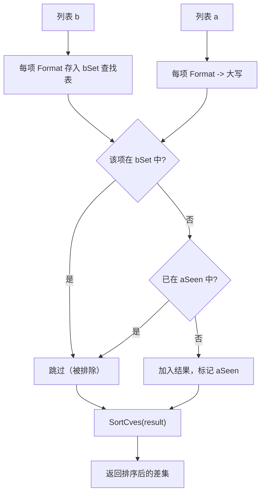

# DiffCves 差集

:::tip 📂 查看源码
[`filter.go:344`](https://github.com/scagogogo/cve-skills/blob/main/filter.go#L344-L364) — 在 GitHub 上查看实现代码（第 344–364 行）。
:::

`DiffCves` 返回两个 CVE 列表的差集——即在列表 `a` 中出现但不在列表 `b` 中出现的 CVE 编号，结果已去重、格式化为大写并排序。

:::tip 📌 场景
- 将当前列表与历史数据对比，找出新增的 CVE
- 在多个数据源之间比对，找出某个来源独有的 CVE
- 从待办清单中剔除已分诊或已修复的 CVE，计算剩余项
:::

## 函数签名

```go
func DiffCves(a, b []string) []string
```

## 参数

- `a` ([]string): 被减的 CVE 列表——被求差的集合
- `b` ([]string): 需要排除的 CVE 列表——从 `a` 中剔除的项

## 返回值

- []string: 只在列表 `a` 中出现的 CVE 编号，已去重、已格式化为大写、已按年份和序列号升序排列

## 行为说明

- 先遍历 `b`，通过 `Format` 将每项格式化为大写后建立查找集合 `bSet`，因此比较时不区分大小写
- 遍历 `a`，对每项进行格式化；只有当该项**不在** `bSet` 中时才会加入结果
- 对 `a` 内部去重：同一 CVE（格式化后）的第二次出现不会再次追加，由独立的 `aSeen` map 控制
- 最终结果经过 `SortCves` 处理，按年份升序、序列号升序输出
- `b` 为空时结果为 `a` 的去重、格式化、排序副本；`a` 为空时结果为空切片

## 流程图



## 示例

```go
package main

import (
	"fmt"

	"github.com/scagogogo/cve-skills"
)

func main() {
	// 基本差集
	current := []string{"CVE-2022-1111", "CVE-2022-2222"}
	historical := []string{"CVE-2022-2222", "CVE-2022-3333"}
	newCves := cve.DiffCves(current, historical)
	// newCves -> ["CVE-2022-1111"]（CVE-2022-2222 在 b 中，被排除）
	fmt.Printf("newCves: %v\n", newCves)

	// a 中的重复项会被合并
	dupA := []string{"CVE-2022-1111", "CVE-2022-1111"}
	b := []string{"CVE-2022-3333"}
	diff := cve.DiffCves(dupA, b)
	// diff -> ["CVE-2022-1111"]（a 中的重复已去除）
	fmt.Printf("diff (deduped a): %v\n", diff)

	// 大小写不敏感比较
	mixedA := []string{"cve-2022-1111"}
	mixedB := []string{"CVE-2022-1111"}
	fmt.Printf("case-insensitive diff: %v\n", cve.DiffCves(mixedA, mixedB))
	// -> []（格式化后是同一个 CVE）

	// b 为空 -> a 去重、格式化、排序
	fmt.Printf("empty b: %v\n", cve.DiffCves([]string{"cve-2022-2222", "CVE-2022-1111"}, nil))
	// -> ["CVE-2022-1111", "CVE-2022-2222"]

	// a 为空 -> 结果为空
	fmt.Printf("empty a: %v\n", cve.DiffCves(nil, []string{"CVE-2022-1111"}))
	// -> []

	// 与昨日快照对比，检测新增 CVE
	yesterday := []string{"CVE-2022-1111", "CVE-2022-2222"}
	today := []string{"CVE-2022-2222", "CVE-2022-3333", "cve-2022-4444"}
	added := cve.DiffCves(today, yesterday)
	// -> ["CVE-2022-3333", "CVE-2022-4444"]
	fmt.Printf("newly added today: %v\n", added)
}
```

## 使用场景

- 将今日抓取结果与昨日快照做差集，发现新发布的 CVE
- 比对多个来源的 CVE 列表，找出某个来源独有的漏洞
- 从待办列表中剔除已分诊或已修复的 CVE，得到剩余待处理项
- 用既有的例外清单过滤掉已豁免的 CVE，计算残差列表

## 注意事项

- 该运算**不对称**：`DiffCves(a, b)` 是 `a` 减 `b`；`DiffCves(b, a)` 结果不同。如需两边各自独有部分，应调用两次，或结合 `IntersectCves` 与 `DiffCves` 一起使用
- 比较大小写不敏感，因为每项在查找前都经过 `Format`；`"cve-2022-1111"` 与 `"CVE-2022-1111"` 被视为同一 CVE
- `a` 内部的重复会被合并——无论某 CVE 在 `a` 中出现多少次，结果中至多出现一次
- 结果始终由 `SortCves` 排序（年份升序、序列号升序），因此输出顺序是确定的，与输入顺序无关
- 时间复杂度 O(n+m)，其中 n = len(a)、m = len(b)；空间复杂度 O(n+m)，用于查找表、seen map 及结果切片

## 内部实现

`filter.go`（L344-L363）中的实现遵循经典的"建集合、再探集合"模式，并在末尾只做一次排序：

- **构建排除集合（L345-L348）。** 名为 `bSet` 的 `map[string]struct{}` 通过 `make(map[string]struct{}, len(b))` 预分配容量，避免扩容时 rehash。`b` 的每个元素先经 `Format` 再存入，因此集合中保存的是大写规范键——这正是后续成员判断不区分大小写的根本原因。
- **用第二个 seen 集合探测（L350-L360）。** 另一个 `aSeen` map（同样预分配 `len(a)`）记录已从 `a` 中输出过的 CVE。对 `a` 的每个元素：先 `Format`，查 `bSet`（命中则跳过），再查 `aSeen`（已输出则跳过）；只有首次唯一出现时才将格式化后的值追加到 `result`。注意存入和返回的都是*格式化后*的字符串，从而保证输出已规范化。
- **末尾一次性排序（L362）。** 函数并不在插入时维护有序性，而是按追加顺序累积结果，最后调用 `SortCves(result)` 排一次。对至多 `len(a)` 大小的去重切片只排一次，使整体开销仍由 O(n+m) 的扫描主导，而非逐次插入排序。
- **使用 `struct{}` 值类型。** 两个 map 的值类型都是 `struct{}`，占用零字节——这两个 map 充当集合，这是 Go 中对"仅判断成员归属"的数据结构最小化内存开销的惯用法。
- **为何用两个 map 而非一个。** `bSet` 回答"该 CVE 是否被排除？"，`aSeen` 回答"该 CVE 是否已从 `a` 输出过？"。这是两个独立的问题：某 CVE 可能不在 `b` 中却在 `a` 中出现多次，因此合并 `a` 内部重复需要单独跟踪，不能复用 `bSet`。

## 复杂度

| 指标 | 开销 | 推导 |
|---|---|---|
| 时间 — 构建 `bSet` | O(m) | 对 `b` 的每个元素一次 `Format` 加一次 map 写入，m = len(b) |
| 时间 — 扫描 `a` | O(n) | 对 `a` 的每个元素一次 `Format` 加两次摊销 O(1) 的 map 查找，n = len(a) |
| 时间 — 末尾 `SortCves` | O(k log k) | k = 去重后未被排除的 CVE 数（k <= n）；仅在 k 较大时成为主导项 |
| 时间 — 总体 | O(n + m + k log k) | 源码注释记为 O(n+m)，排序在去重结果上额外贡献一个对数项 |
| 空间 — `bSet` | O(m) | 至多 m 个格式化键 |
| 空间 — `aSeen` | O(k) | 至多 k 个来自 `a` 的唯一键 |
| 空间 — `result` 切片 | O(k) | 存放 k 个已输出 CVE |
| 空间 — 总体 | O(n + m) | 与源码注释一致；三个结构分别受 m 与 k <= n 约束 |

## 边界情形

| 输入 | 行为 | 返回 |
|---|---|---|
| `a` 为 `nil` 或空 | 遍历 `a` 的循环被跳过；`bSet` 仍会构建但永不被查询 | `[]string{}`（排序后为非 nil 空切片） |
| `b` 为 `nil` 或空 | `bSet` 为空；`a` 的任何元素都不会被排除，结果即 `a` 的去重、格式化、排序形式 | `a` 的去重排序副本 |
| `a` 与 `b` 均为空 | 两个循环均空转；result 切片保持 nil，随后调用 `SortCves(nil)` | `[]string{}` |
| `a` 内部有重复 | 第二次及之后的出现命中 `aSeen` 被跳过 | 每个唯一 CVE 至多出现一次 |
| `b` 内部有重复 | 对 `bSet` 的重复写入覆盖同一键（无副作用） | 等同于 `b` 已去重的情形 |
| 同一 CVE 同时出现在 `a` 和 `b`（任意大小写） | `Format` 后得到相同大写键，存在于 `bSet` 中，故 `a` 中该元素被排除 | 不出现在结果中 |
| 大小写变体（`"cve-..."` 与 `"CVE-..."`） | 两者 `Format` 后得到同一大写键，因此在 `bSet`/`aSeen` 中判等 | 视为相同；输出始终为大写 |
| `a` 中含畸形/非 CVE 字符串 | 仍会经 `Format` 处理；以其产生的规范形式参与查找与输出 | 是否包含取决于 `Format` 的行为；不会被专门拒绝 |
| `b` 中含畸形/非 CVE 字符串 | `Format` 后存入 `bSet`；若 `a` 中出现匹配的格式化键，则该 `a` 元素被排除 | 按格式化后的尽力匹配排除 |
| `a` 的所有元素都被 `b` 排除 | 每次探测都命中 `bSet`，无任何元素被追加 | `[]string{}` |

## 数据流

```text
                +-----------------+        +-----------------+
   列表 a ---> | 每项 Format     | -----> | 格式化后的键     |
                | （转大写）       |        | （已规范化）       |
                +-----------------+        +-----------------+
                                                  |
                                                  v
                +-----------------+        +-----------------+
   列表 b ---> | 每项 Format     | -----> | bSet map        |
                | （转大写）       |        | （成员查找表）     |
                +-----------------+        +-----------------+
                                                  |
                                                  v
        +-----------------------------------------------+
        | 对 a 的每个格式化键：                         |
        |   在 bSet 中？  -- 是 --> 跳过（被排除）        |
        |   在 aSeen 中？ -- 是 --> 跳过（a 内重复）      |
        |   否则 --> 追加到 result，并标记 aSeen        |
        +-----------------------------------------------+
                                                  |
                                                  v
                +-----------------+        +-----------------+
   result ---> | SortCves(result)| -----> | 排序后的差集     | ---> 返回
                +-----------------+        +-----------------+
```

## 相关函数

- [IntersectCves](/zh/api/functions/intersect-cves) — 两个列表共有的 CVE
- [UnionCves](/zh/api/functions/union-cves) — 两个列表的所有 CVE，去重并排序
- [SortCves](/zh/api/functions/sort-cves) — 按年份和序列号排序
- [RemoveDuplicateCves](/zh/api/functions/remove-duplicate-cves) — 对单个列表去重
- [集合运算分类](/zh/api/set-operations)
