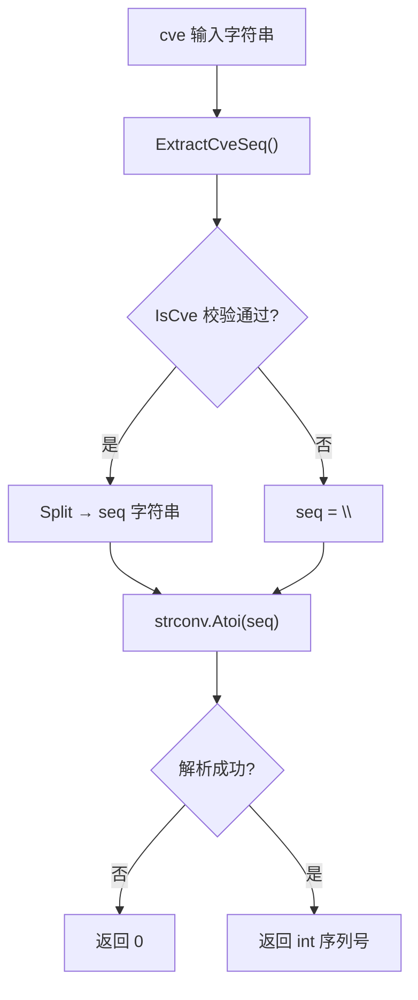

# ExtractCveSeqAsInt 提取序列号整数

:::tip 📂 查看源码
[`extract.go:262`](https://github.com/scagogogo/cve-skills/blob/main/extract.go#L262-L267) — 在 GitHub 上查看实现代码（第 262–267 行）。
:::

从 CVE 标识符中提取序列号并以整数类型返回，便于直接对 CVE 序列号进行数值比较、排序和范围过滤。

:::tip 📌 场景
- 过滤序列号落在特定数值区间内的 CVE（例如所有序列号大于 10000 的 CVE）。
- 按序列号的整数值对 CVE 列表排序，而不是按字符串字典序排序。
- 对 CVE 序列号进行统计或聚合计算。
:::

## 函数签名

```go
func ExtractCveSeqAsInt(cve string) int
```

## 参数

- `cve` (string)：CVE 标识符字符串，例如 `CVE-2022-12345`。大小写不敏感，前后空白会被内部标准化处理。

## 返回值

- `int`：CVE 序列号转换后的整数值，例如 `12345`。当输入不是有效的 CVE 格式或序列号部分无法解析为数字时返回 `0`。

## 行为说明

- 内部委托给 `ExtractCveSeq`，后者先用 `IsCve` 校验格式。格式无效时 `ExtractCveSeq` 返回空字符串，随后的转换结果为 `0`。
- 使用 `strconv.Atoi` 解析序列号子串；若解析失败（例如序列号不是数字），错误被忽略并返回 `0`。
- 由于序列号被转换为 `int`，原始序列号中的前导零会被去除：`CVE-2022-00001` 与 `CVE-2022-1` 都得到整数 `1`。
- 函数不会因非法输入而 panic；任何无效或不可解析的输入都被映射为哨兵值 `0`。

## 流程图



## 示例

```go
package main

import (
	"fmt"
	"sort"

	"github.com/scagogogo/cve-skills"
)

func main() {
	// 基本提取
	seq := cve.ExtractCveSeqAsInt("CVE-2022-12345")
	fmt.Println(seq) // 输出: 12345

	// 多组输入，包含边界用例
	testCases := []string{
		"CVE-2022-12345",    // 标准格式
		"cve-2022-00001",    // 前导零会被压缩为 1
		"CVE-2022-1",        // 短序列号
		"CVE-2022-99999",    // 大序列号
		"CVE-2022-ABC",      // 非数字序列号 -> 0
		"not-a-cve",         // 无效格式 -> 0
		"",                  // 空字符串 -> 0
	}

	for _, input := range testCases {
		seq := cve.ExtractCveSeqAsInt(input)
		fmt.Printf("%-20s -> %d\n", input, seq)
	}

	// 范围过滤：保留序列号大于 10000 的 CVE
	cveList := []string{
		"CVE-2022-123",
		"CVE-2022-12345",
		"CVE-2022-99999",
		"CVE-2022-5000",
	}
	var highSeq []string
	for _, id := range cveList {
		if cve.ExtractCveSeqAsInt(id) > 10000 {
			highSeq = append(highSeq, id)
		}
	}
	fmt.Printf("Sequence > 10000: %v\n", highSeq)
	// 输出: Sequence > 10000: [CVE-2022-12345 CVE-2022-99999]

	// 按序列号整数值排序
	sort.Slice(cveList, func(i, j int) bool {
		return cve.ExtractCveSeqAsInt(cveList[i]) < cve.ExtractCveSeqAsInt(cveList[j])
	})
	fmt.Println("Sorted by sequence:")
	for _, id := range cveList {
		fmt.Printf("  %-15s -> %d\n", id, cve.ExtractCveSeqAsInt(id))
	}
}
```

## 使用场景

- 按序列号数值区间过滤 CVE，例如"所有序列号大于 10000 的 CVE"。
- 按整数序列号值排序 CVE，而非按字符串字典序排序。
- 对 CVE 序列号构建数值统计或直方图。
- 识别预留或低位编号的 CVE（转换后序列号为 `0` 通常意味着输入无效或不可解析）。

## 注意事项

- 哨兵值 `0` 同时用于无效格式和不可解析的序列号；若需区分二者，请先调用 `IsCve` 再调用 `ExtractCveSeq`。
- 转换为整数后前导零会丢失。若需保留原始补零形式（例如用于展示对齐），请改用基于字符串的 `ExtractCveSeq` 或 `FormatSeq`。
- 本函数不校验年份，仅校验整体 CVE 格式并解析序列号。如需包含年份范围的完整校验，请使用 `ValidateCve`。
- 函数仅依赖纯字符串解析，无共享可变状态，可安全并发调用。

## 内部实现

函数体只有三行，但每一行都将职责交给一个定义明确的辅助函数，使校验、拆分与数值解析保持清晰分离：

- **L263 — `seq := ExtractCveSeq(cve)`**：整体格式校验委托给 `ExtractCveSeq`，后者内部先调用 `IsCve`（基于正则的格式守卫），再调用 `Split` 取得序列号子串。若输入不是有效 CVE，`ExtractCveSeq` 返回 `""`，调用方因此永远不会看到畸形子串。
- **L264 — `i, _ := strconv.Atoi(seq)`**：用 `strconv.Atoi` 解析序列号子串。错误值被有意丢弃（`_`）；设计意图是把所有失败模式（格式无效、序列号非数字、空字符串）统一坍缩到 `Atoi` 出错时返回的哨兵值 `0`，函数因此永远不会 panic。
- **L265 — `return i`**：直接返回解析得到的整数。当 `Atoi` 失败时，`i` 即零值 `0`，正好对应文档中"无序列号"的哨兵值。
- 由于函数只依赖 `ExtractCveSeq` 与 `strconv.Atoi` —— 二者都是无共享可变状态的纯字符串操作 —— 因此无需任何同步原语即可安全并发调用。
- 本函数内没有单独的标准化步骤；大小写不敏感与空白容忍都继承自 `ExtractCveSeq` / `IsCve`，它们在匹配前内部应用 `Format`。

## 复杂度

| 指标 | 量级 | 依据 |
|---|---|---|
| 时间 | O(n) | `ExtractCveSeq` 对长度为 n 的 CVE 字符串执行一次正则匹配，`Split` 在定宽 CVE 上扫描；`strconv.Atoi` 在序列号长度上为 O(n)。 |
| 空间 | O(n) | `seq` 持有序列号子串的短生命周期副本；除返回整数外无额外分配。 |
| 分配次数 | 2 | 一次来自 `Split` 的序列号子串，一次为返回时的整数装箱；不构造 map 或 slice。 |

上述量级对输入 CVE 字符串长度为线性。当本函数被用于长度为 m 的 CVE 列表循环中（例如在 `sort.Slice` 内）时，总时间开销为 O(m·n)。

## 边界情形

| 输入 | 行为 | 返回 |
|---|---|---|
| `CVE-2022-12345` | 格式有效；序列号 `12345` 正常解析。 | `12345` |
| `cve-2022-12345`（小写） | 内部标准化；大小写不敏感。 | `12345` |
| `CVE-2022-00001` | 序列号 `00001` 被 `Atoi` 解析后前导零丢失。 | `1` |
| `CVE-2022-0` | 序列号 `0` 解析为零，与哨兵值不可区分。 | `0` |
| `CVE-2022-ABC` | 格式通过 `IsCve` 但 `Atoi` 解析 `ABC` 失败；错误被忽略。 | `0` |
| `CVE-2022-`（缺少序列号） | 被 `IsCve` 拒绝；`ExtractCveSeq` 返回 `""`，`Atoi("")` 失败。 | `0` |
| `not-a-cve` | 非 CVE 格式；`ExtractCveSeq` 返回 `""`。 | `0` |
| `""`（空字符串） | `IsCve` 立即失败；`seq` 为 `""`，`Atoi` 失败。 | `0` |
| ` CVE-2022-12345 `（前后空白） | 空白由 `IsCve`/`Format` 内部标准化所容忍。 | `12345` |

## 数据流

```text
+----------------------+
|  cve string (输入)   |
|  如 CVE-2022-12345   |
+----------+-----------+
           |
           v
+----------------------+
|  ExtractCveSeq(cve)  |
+----------+-----------+
           |
           v
+----------------------+    格式无效
|   IsCve(cve) 守卫     |------------------------+
+----------+-----------+                        |
           | 有效                                |
           v                                     |
+----------------------+                        |
|  Split -> seq 字符串 |                        |
|  如 "12345"          |                        |
+----------+-----------+                        |
           |                                     |
           v                                     v
+----------------------+                +------------------+
|  strconv.Atoi(seq)   |                |  seq = ""（空）  |
|  12345, nil          |                |  Atoi -> 0, err  |
+----------+-----------+                +--------+---------+
           |                                     |
           v                                     v
+----------------------+                +------------------+
|  return i = 12345    |                |  return 0        |
+----------------------+                +------------------+
```

## 相关函数

- [ExtractCveSeq](/zh/api/functions/extract-cve-seq) — 以字符串形式返回序列号，保留前导零。
- [ExtractCveYearAsInt](/zh/api/functions/extract-cve-year-as-int) — 年份对应版本，返回年份整数。
- [Split](/zh/api/functions/split) — 将 CVE 拆分为年份和序列号字符串。
- [IsCve](/zh/api/functions/is-cve) — 判断字符串是否为有效的 CVE 格式。
- [提取分类入口](/zh/api/extract) — 所有提取相关函数的总览。
